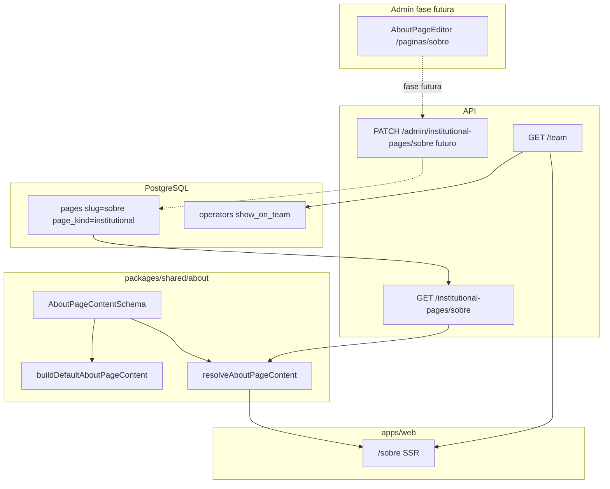

# Página Sobre + Contato (E-E-A-T e CRO)

## Contexto

- O header já expõe **Sobre** em [`apps/web/src/components/layout/SiteHeader.tsx`](apps/web/src/components/layout/SiteHeader.tsx), mas aponta para `#` (link morto).
- [`/legal`](apps/web/src/app/legal/page.tsx) permanece **estática em código** (texto legal raramente editado pelo operador).
- A **Sobre** deve ser **editável via CMS Admin** — UI do editor fica para fase futura, mas persistência, contrato, API e resolução de conteúdo são entregues **agora**.
- Operadores já têm **name, bio (250), avatar** ([`operators`](packages/infrastructure/src/persistence/drizzle/schema/index.ts)); falta exposição pública na seção equipe.
- Marketplaces: **Amazon BR + Shopee BR** (não Mercado Livre).

## Arquitetura



**Princípio:** o schema Zod em `shared/about` é a **fonte única de verdade** — seed, API, web e (futuro) Admin importam o mesmo contrato. Textos default vivem em `buildDefaultAboutPageContent(brand)`; o CMS sobrescreve campos parciais via `resolveAboutPageContent(stored, brand)`.

---

## Fase 1 — Perfil público do operador (schema + Admin + API)

### Migration `0017_operator_public_profile.sql`

Novas colunas em `operators`:

| Coluna | Tipo | Uso |
|--------|------|-----|
| `job_title` | `varchar(120)` nullable | Cargo público ("Editor de reviews") |
| `social_links` | `jsonb` nullable | `{ linkedin?, instagram?, x?, telegram? }` |
| `show_on_team` | `boolean NOT NULL DEFAULT false` | Aparece na seção "Quem somos" |
| `team_sort_order` | `smallint` nullable | Ordenação na grid (null → alfabética) |
| `team_public_role` | enum `founder` \| `member` nullable | JSON-LD: `Organization.founder` vs `Organization.employee` (default `member`) |

**Camadas:** Domain → Infra → Shared (`profile-schemas.ts`) → Application (`GetPublicTeamMembers`, estender `UpdateOperatorProfile`) → API `GET /team`.

Resposta pública:

```typescript
{ members: Array<{ name, jobTitle, bio, avatarUrl, socialLinks, publicTeamRole }> }
```

### Admin `/perfil`

Estender [`ProfileForm.tsx`](apps/admin/src/components/profile/ProfileForm.tsx) — bloco **"Perfil público"**: toggle `showOnTeam`, `jobTitle`, select `publicTeamRole` (founder/member — afeta JSON-LD), URLs sociais (LinkedIn, Instagram, X, Telegram). Cada operador edita apenas o próprio perfil.

---

## Fase 2 — CMS institucional (estrutura agora; editor Admin depois)

### Migration `0018_institutional_pages.sql`

Estender tabela `pages` (reutiliza draft/publish/SEO existentes — [`PageLayout`](packages/domain/src/entities/PageLayout.ts)):

| Coluna | Tipo | Uso |
|--------|------|-----|
| `page_kind` | enum `block_layout` \| `institutional` | Default `block_layout` (home); Sobre = `institutional` |
| `institutional_content` | `jsonb` nullable | Payload validado por `AboutPageContentSchema` |

**Regras:**
- `page_kind = block_layout` → comportamento atual (`page_blocks` + `GetPublishedPageLayout`)
- `page_kind = institutional` → ignora blocos; conteúdo vem de `institutional_content`
- Seed: página `slug = sobre`, `status = published`, `institutional_content` = defaults serializados

### Contrato Zod — [`packages/shared/src/about/about-content.schema.ts`](packages/shared/src/about/about-content.schema.ts)

Tipos e funções (export `"./about"`):

```typescript
// Seções fixas do brief — IDs estáveis para âncoras e CMS
export const aboutSectionSchema = z.object({
  id: z.enum(['proposta', 'metodo', 'afiliados', 'equipe']),
  title: z.string().min(1).max(120),
  paragraphs: z.array(z.string().min(1)).min(1),
  listItems: z.array(z.string()).optional(),
  callout: z.boolean().optional(), // true → render callout box (#afiliados)
});

export const aboutTrafficLinkSchema = z.object({
  label: z.string().min(1).max(80),
  href: z.string().min(1).max(256), // paths internos (/artigos) validados no parse
  description: z.string().max(120).optional(),
});

export const aboutTrafficDirectionSchema = z.object({
  title: z.string().min(1).max(120),
  intro: z.string().min(1).max(300),
  links: z.array(aboutTrafficLinkSchema).min(1).max(3),
});

export const aboutPageContentSchema = z.object({
  heroTitle: z.string().min(1).max(160),
  heroIntro: z.string().min(1).max(500),
  sections: z.array(aboutSectionSchema).length(4), // ordem fixa; CMS edita texto, não reordena
  teamSectionIntro: z.string().min(1).max(500),  // intro #equipe; cards vêm de GET /team
  trafficDirection: aboutTrafficDirectionSchema, // seção #proximos-passos — CRO suave pós-equipe
  lastUpdated: z.string().regex(/^\d{4}-\d{2}-\d{2}$/),
});

export type AboutPageContent = z.infer<typeof aboutPageContentSchema>;

export function buildDefaultAboutPageContent(brand: BrandConfig): AboutPageContent;
export function resolveAboutPageContent(stored: unknown | null, brand: BrandConfig): AboutPageContent;
export function parseAboutPageContent(raw: unknown): AboutPageContent; // strict — saves Admin
export function buildAboutPageMetadata(brand, content?, seo?): MetadataShape;

// Sanitização compartilhada (defesa em profundidade — ver Fase 3)
export function sanitizeInstitutionalHtml(raw: string): string;
```

**Por que seções fixas (não blocos livres):** garante hierarquia CRO/SEO do brief (proposta → método → afiliados → equipe), evita operador quebrar estrutura E-E-A-T, e simplifica o editor futuro (form por seção, não drag-and-drop).

**Validação de links em `trafficDirection`:** `href` deve ser path relativo interno (`/artigos`, `/cupons`) — rejeitar URLs externas e `javascript:` no `parseAboutPageContent` (Admin save). Defaults:

| Label (default) | href |
|---------------|------|
| Ver nossos guias de compra | `/artigos` |
| Explorar cupons na Amazon e Shopee | `/cupons` |

Nota: `/cupons` ainda não existe na vitrine (stub PRD); incluir link mesmo assim — rota será entregue em fase growth. Até lá, operador pode trocar o href no CMS futuro.

### Application layer

| Use case | Responsabilidade |
|----------|------------------|
| `GetPublishedInstitutionalPage` | Busca `pages` por slug + `page_kind=institutional` + `status=published`; `resolveAboutPageContent` |
| `GetAdminInstitutionalPage` | Mesmo para operador autenticado (inclui draft) |
| `UpdateInstitutionalPage` | Valida com `parseAboutPageContent`, persiste JSON, invalida cache, dispara revalidate web |

Estender [`PageRepository`](packages/domain/src/repositories/PageRepository.ts): `findInstitutionalBySlug`, `updateInstitutionalContent`.

Cache Redis: chave `institutional-page:{slug}` (TTL 5 min, alinhado ao CMS home).

### API

| Método | Rota | Fase |
|--------|------|------|
| GET | `/institutional-pages/:slug` | **Agora** — retorna `{ layout: { slug, seoTitle, seoDescription, updatedAt }, content: AboutPageContent }` |
| GET | `/admin/institutional-pages/:slug` | **Agora** — inclui draft |
| PATCH | `/admin/institutional-pages/:slug` | **Futuro** — body `{ content, status?, seoTitle?, seoDescription? }` |

Implementar GET + stubs/types para PATCH (rota comentada ou 501) para o Admin futuro plugar sem refactor.

### Web `/sobre` — fluxo de dados

```typescript
export const revalidate = 86400;

// 1. GET /institutional-pages/sobre → resolveAboutPageContent (fallback se API down)
// 2. GET /team → teamMembers
// 3. generateMetadata → seoTitle/seoDescription do CMS ou buildAboutPageMetadata defaults
// 4. AboutPageContent + AboutPageJsonLd
```

Fallback offline: se API indisponível, `buildDefaultAboutPageContent(getServerBrandConfig())` — página nunca quebra.

### `/contato` (fora do CMS nesta entrega)

Permanece estática via `BrandConfig` + `shared/contact` (e-mail, redes da marca). Mesma infra `page_kind=institutional` pode acolher `contato` numa fase posterior reutilizando o padrão.

---

## Fase 3 — UI Web (`apps/web`)

### `AboutPageContent.tsx`

Layout scan-friendly (distinto de [`LegalPageContent.tsx`](apps/web/src/components/legal/LegalPageContent.tsx)):

- **Hero** — `content.heroTitle` + `content.heroIntro`
- **TOC** — âncoras derivadas de `content.sections[].id`
- **`#proposta`, `#metodo`** — parágrafos + listas
- **`#afiliados`** — callout box quando `section.callout === true` + link `/legal#afiliados`
- **`#equipe`** — `content.teamSectionIntro` + grid de cards (`GET /team`):
  - Avatar via [`RemoteImage`](apps/web/src/components/ui/RemoteImage.tsx)
  - Fallback editorial se zero membros
  - Links `/contato` e `/legal` no rodapé da seção
- **`#proximos-passos`** — `content.trafficDirection` (direcionamento suave pós-equipe, **não** banner comercial):
  - Título + intro curtos (tom editorial, não urgência)
  - Até 3 botões outline/secondary — defaults: `/artigos` e `/cupons`
  - Sem preço, countdown ou copy de "compre agora"
  - Objetivo CRO: usuário qualificado que validou idoneidade segue para hub de conteúdo ou cupons

**Renderização de texto CMS:** parágrafos e listItems passam por `sanitizeInstitutionalHtml` antes de exibir. Preferir `<SafeInstitutionalHtml html={...} />` wrapper em [`apps/web/src/components/about/SafeInstitutionalHtml.tsx`](apps/web/src/components/about/SafeInstitutionalHtml.tsx) — **nunca** `dangerouslySetInnerHTML` cru.

Props do componente:

```typescript
type AboutPageContentProps = {
  content: AboutPageContent;       // resolvido (CMS ou default)
  teamMembers: PublicTeamMember[];
};
```

### Sanitização XSS (defesa em profundidade)

Conteúdo institucional vem de JSON no banco; operadores futuros podem inserir `<strong>`, `<a>`, etc.

| Camada | Onde | O quê |
|--------|------|-------|
| **Write** | `UpdateInstitutionalPage` + `parseAboutPageContent` | Sanitizar strings HTML em todo save Admin (fase futura) via `sanitizeInstitutionalHtml` |
| **Read** | `AboutPageContent.tsx` / `SafeInstitutionalHtml` | Re-sanitizar no render (defesa se DB legado ou bypass) |

Implementação em `packages/shared/src/about/sanitize-institutional-html.ts`:
- Dependência: **`isomorphic-dompurify`** (SSR-safe no Next.js App Router)
- Allowlist: `p`, `br`, `strong`, `em`, `a[href|title|target|rel]`, `ul`, `ol`, `li`
- Proibido: `script`, `style`, event handlers, `javascript:` URLs
- Links `<a>`: forçar `rel="noopener noreferrer"`; `target="_blank"` só se href externo (institucional deve ser majoritariamente texto plano)
- Testes Vitest: strip `<script>`, preserva `<strong>`, remove `onclick`

Alternativa descartada: Markdown — operador CMS futuro espera WYSIWYG/HTML leve; DOMPurify é mais previsível.

### JSON-LD — Knowledge Graph (Organization ↔ Person)

Em [`site-json-ld.ts`](packages/shared/src/seo/site-json-ld.ts): `buildAboutPageJsonLd(brand, teamMembers?)` retorna `@graph` com **referências cruzadas explícitas** (não Person soltos no graph):

```typescript
// IDs estáveis
const orgId = `${brand.url}/#organization`;
const pageId = `${brand.url}/sobre#webpage`;
const personId = (index: number) => `${brand.url}/sobre#person-${index}`;

// AboutPage → mainEntity aponta para Organization
// Organization.employee[] e Organization.founder[] → @id de Person
// Cada Person: worksFor → @id Organization, sameAs ← socialLinks filtrados, jobTitle, image
```

Regras de mapeamento equipe:
- `publicTeamRole === 'founder'` → incluir em `Organization.founder[]`
- demais → `Organization.employee[]`
- `sameAs` em Person: valores não-vazios de `socialLinks` (linkedin, instagram, x, telegram)
- Sem membros visíveis: graph só `AboutPage` + `Organization` (sem Person órfãos)

Testes em `site-json-ld.test.ts`: validar presença de `worksFor`, `employee`/`founder`, `sameAs` quando redes preenchidas.

---

## Fase 4 — Navegação, SEO e sitemap

| Artefato | Mudança |
|----------|---------|
| [`SiteHeader.tsx`](apps/web/src/components/layout/SiteHeader.tsx) | `{ href: '/sobre', label: 'Sobre' }` |
| [`Footer.tsx`](apps/web/src/components/layout/Footer.tsx) | Links `Sobre`, `Contato`, `/legal` |
| [`sitemap.ts`](apps/web/src/app/sitemap.ts) | `/sobre`, `/contato` |
| [`drizzle-sitemap.repository.ts`](packages/infrastructure/src/persistence/repositories/drizzle-sitemap.repository.ts) | Rotas estáticas incluindo `/legal` |

Metadata SEO da Sobre: prioriza `pages.seoTitle` / `pages.seoDescription` do CMS; fallback para defaults derivados de `heroTitle` / `heroIntro`.

---

## Fase 5 — Admin CMS editor (futura, já preparada)

**Rota:** [`/paginas/sobre`](apps/admin/src/app/(dashboard)/paginas/[slug]/page.tsx) — detectar `page_kind=institutional` e renderizar **`AboutPageEditor`** em vez de `CMSBlockOrderManager`.

**UI** (painéis flutuantes — [`11-admin-floating-panels.mdc`](.cursor/rules/11-admin-floating-panels.mdc)):

| Painel | Campos |
|--------|--------|
| SEO | `seoTitle`, `seoDescription` |
| Hero | `heroTitle`, `heroIntro` |
| Seções | Form repetível por `id` (título, parágrafos, listItems); `#afiliados` com preview do callout |
| Equipe | `teamSectionIntro` + aviso "membros vêm de Perfis com 'Exibir na Sobre'" |
| Próximos passos | `trafficDirection` (título, intro, links editáveis — labels/hrefs internos) |
| Publicação | Status draft/published (reutiliza `PageStatus`) |

**Não incluir no editor:** cards de equipe (dinâmicos via operadores) — evita duplicação.

**Lista `/paginas`:** páginas `institutional` exibem CTA **"Editar conteúdo"** vs **"Editar blocos"** para `block_layout`.

**Preview draft:** query `?preview=draft` na vitrine (padrão CMS home, fase futura).

---

## Copy editorial (defaults no seed)

Texto pt-BR parametrizado por `BrandConfig`. Seções default:

| ID | Foco |
|----|------|
| `#proposta` | Gancho orientado ao usuário (`brand.tagline`) |
| `#metodo` | Curadoria Amazon + Shopee, histórico local, revisão humana |
| `#afiliados` | Disclosure com `callout: true` |
| `#equipe` | Intro + equipe dinâmica |
| `#proximos-passos` | Direcionamento suave: artigos + cupons (sem banner de vendas) |

**CRO:** sem CTA comercial agressivo (preço, marketplace direto, urgência). A seção `#proximos-passos` é recirculação editorial — próximo passo natural após validar confiança, alinhada à regra de interlinking do growth PRD.

---

## Documentação

Criar [`docs/about-contact-pages.md`](docs/about-contact-pages.md):
- Contrato CMS (`AboutPageContentSchema` + `trafficDirection`)
- Sanitização HTML (`sanitizeInstitutionalHtml`, allowlist DOMPurify)
- JSON-LD Organization ↔ Person (`employee`/`founder`, `worksFor`, `sameAs`)
- Fluxo seed → API → web → (futuro) Admin
- Diferença Sobre (CMS) vs Legal (código) vs Contato (BrandConfig)
- Como testar GET `/institutional-pages/sobre`, fallback, equipe, seção próximos passos

Atualizar [`docs/database-schema.md`](docs/database-schema.md) (`page_kind`, `institutional_content`, colunas `operators`).

---

## Fora de escopo

- Editor Admin UI (fase 5 — estrutura API/repo pronta)
- `/contato` editável via CMS
- Página `/autores/[slug]`
- Admin editar perfil de **outros** operadores
- Formulário de contato com backend
- Banner de cookies

---

## Verificação

```bash
npm run build -w @ecommerce-amazon/shared
npm test -w @ecommerce-amazon/shared -- src/about src/contact src/seo/site-json-ld.test.ts
# sanitização + JSON-LD Person↔Organization cobertos nos testes acima
npm run test -w @ecommerce-amazon/application -- GetPublishedInstitutionalPage
# migrar + seed
curl -s http://localhost:3000/institutional-pages/sobre | jq
curl -s http://localhost:3000/team | jq
curl -sI http://localhost:3001/sobre | head
```

Checklist manual:
- `/sobre` renderiza conteúdo do seed CMS (alterar JSON no DB reflete após cache/revalidate)
- API down → fallback defaults em shared
- Operador `show_on_team=true` aparece na grid
- Box afiliados + link `/legal#afiliados`
- Seção `#proximos-passos` com links `/artigos` e `/cupons` (tom suave, sem urgência)
- HTML `<script>` inserido no CMS não renderiza (sanitização)
- JSON-LD: Person com `worksFor`, Organization com `employee`/`founder`, `sameAs` preenchido
- Header e sitemap corretos
