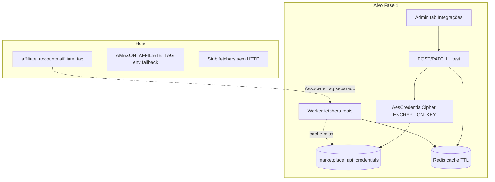
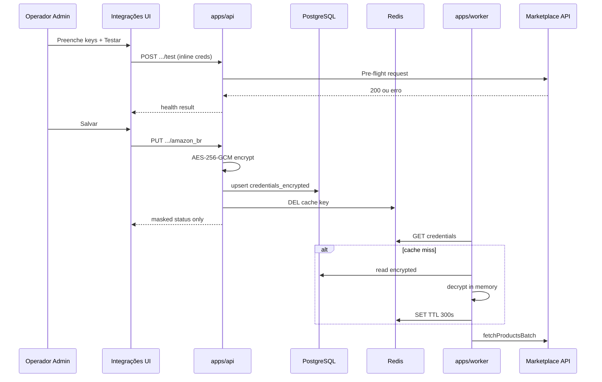

# Admin — Gestão de Credenciais de API (Marketplace Vault)

## Contexto: o que já existe vs. a visão

A fase operacional entregue em [`docs/admin-operational-settings.md`](docs/admin-operational-settings.md) cobre **tags de afiliado** (`affiliate_tag` em plaintext) e **feature flags** — não secrets de API. O worker usa **fetchers stub** sem credenciais ([`marketplace-fetcher.strategy.ts`](packages/infrastructure/src/marketplace/strategies/marketplace-fetcher.strategy.ts)). Secrets operacionais (GA4, Resend, S3) permanecem em `.env`; **fora do escopo desta fase** (decisão do usuário).



**Separação importante:** `affiliate_accounts` continua dono da **Associate Tag / SubID** (público, gate de escala). A nova tabela guarda apenas **chaves de API** (secretas). O card Amazon no Admin pode **exibir a tag em read-only** lendo `affiliate_accounts`, evitando duplicação.

---

## Arquitetura em 3 camadas (conforme visão)

### A. Criptografia at rest

Novo serviço de infraestrutura — **nunca expor plaintext no GET**:

| Item | Decisão |
|------|---------|
| Algoritmo | AES-256-GCM (`createCipheriv` / `createDecipheriv`) |
| Master key | `ENCRYPTION_KEY` — 32 bytes base64 ou hex, **somente no servidor** (`.env`, nunca no DB) |
| Formato blob | `base64(iv:12 + authTag:16 + ciphertext)` em coluna `credentials_encrypted` |
| Port domain | `CredentialCipher` em `packages/domain/src/ports/` |
| Impl | `AesGcmCredentialCipher` em `packages/infrastructure/src/security/` |

Validação no boot: se `ENCRYPTION_KEY` ausente/inválida, API e worker **falham fechado** ao tentar salvar/ler credenciais (env vars de tag continuam opcionais).

### B. Cache Redis (padrão existente)

Reutilizar o padrão de [`AffiliateScaleGateService`](packages/application/src/services/AffiliateScaleGateService.ts):

- Chave: `vitrine:marketplace-credentials:{marketplace}` (ex.: `amazon_br`)
- TTL: **300s** (5 min), alinhado a `site_settings`
- Valor: JSON com credenciais **já descriptografadas** (memória Redis — aceitável para worker interno)
- Invalidação: em todo `SaveMarketplaceCredentials` / `DeleteMarketplaceCredentials`
- Resolver: `MarketplaceCredentialResolver` (application service) — Redis → DB decrypt → repopula cache

**Regra de negócio:** API de request de visitante **nunca** chama o resolver; apenas `apps/worker`.

### C. Autenticação por marketplace (Fase 1)

| Marketplace | Tipo | Campos secretos |
|-------------|------|-----------------|
| `amazon_br` | Estático | `accessKeyId`, `secretAccessKey` (+ `region`/`host` opcional com default `webservices.amazon.com.br`) |
| `shopee_br` | Estático | `partnerId`, `partnerKey` |
| `mercadolivre_br` | OAuth | **Fase 3** — placeholder na UI ("Em breve") |

Contratos Zod discriminados em `packages/shared/src/admin/marketplace-credentials-schemas.ts`.

---

## Schema PostgreSQL

Nova migration `0021_marketplace_api_credentials.sql`:

```sql
CREATE TABLE marketplace_api_credentials (
  id UUID PRIMARY KEY DEFAULT gen_random_uuid(),
  marketplace marketplace NOT NULL UNIQUE,
  auth_type TEXT NOT NULL, -- 'static_keys' | 'oauth' (oauth reservado Fase 3)
  credentials_encrypted TEXT NOT NULL,
  public_metadata JSONB NOT NULL DEFAULT '{}',
  health_status TEXT NOT NULL DEFAULT 'not_configured',
  health_message TEXT,
  last_health_check_at TIMESTAMPTZ,
  last_used_at TIMESTAMPTZ,
  updated_at TIMESTAMPTZ NOT NULL DEFAULT now(),
  updated_by UUID REFERENCES operators(id) ON DELETE SET NULL
);
```

`public_metadata` (não secreto): `accessKeyIdPrefix`, `partnerId`, `configuredAt`, `lastTestHttpStatus`, etc. — **nunca** o secret completo.

Índice único por `marketplace` espelha [`0020_affiliate_accounts_marketplace_unique.sql`](packages/infrastructure/src/persistence/drizzle/migrations/0020_affiliate_accounts_marketplace_unique.sql).

---

## Domain + Application

### Ports novos (`packages/domain`)

- `MarketplaceApiCredentialRepository` — `findByMarketplace`, `upsert`, `delete`
- `CredentialCipher` — `encrypt(plaintext)`, `decrypt(blob)`

### Use cases (`packages/application/src/use-cases/admin-settings/`)

| Use case | Responsabilidade |
|----------|------------------|
| `GetMarketplaceCredentialsStatus` | Lista status mascarado por marketplace (sem secrets) |
| `SaveMarketplaceCredentials` | Valida Zod → encrypt → upsert → invalida Redis → audit `updated_by` |
| `DeleteMarketplaceCredentials` | Remove + invalida cache |
| `TestMarketplaceConnectivity` | Recebe credenciais inline **ou** lê do DB; chama gateway de teste; retorna `{ ok, httpStatus, message, rateLimitHint? }` **sem persistir** no teste inline |
| `ResolveMarketplaceCredentials` | Worker-only: Redis → DB → decrypt |

### Gateway de teste (`packages/infrastructure`)

- `AmazonPaApiConnectivityGateway` — request mínimo PA-API (ex.: `GetItems` com ASIN de fixture/seed) ou `SearchItems` com keyword curta
- `ShopeeOpenApiConnectivityGateway` — endpoint leve de auth/signature (ex.: `get_shopee_openapi_path` conforme doc Shopee Partner)

**Importante:** teste roda **no backend admin** (`apps/api`), não no browser — evita expor secrets e CORS.

Atualizar `GetOperationalStatus` para incluir `marketplaceCredentials: { amazon_br, shopee_br }` com `healthStatus` (substitui/complementa chips genéricos no painel Saúde).

---

## API REST (`apps/api`)

Rotas em [`admin-settings-routes.ts`](apps/api/src/adapters/http/routes/admin-settings-routes.ts) (admin JWT + `requireAdminOperator` para mutações):

| Método | Rota | Body / notas |
|--------|------|--------------|
| GET | `/admin/marketplace-credentials` | Array mascarado: `{ marketplace, authType, configured, publicMetadata, healthStatus, healthMessage, lastHealthCheckAt }` |
| PUT | `/admin/marketplace-credentials/:marketplace` | Credenciais completas (só no request); response mascarada |
| DELETE | `/admin/marketplace-credentials/:marketplace` | Admin only |
| POST | `/admin/marketplace-credentials/:marketplace/test` | Opcional: body com credenciais inline para pre-flight; se vazio, usa salvas |

**Segurança API:**
- Nunca ecoar `secretAccessKey` / `partnerKey` após save
- Rate limit no endpoint de teste (reutilizar padrão de rate limit admin existente)
- Log estruturado sem campos secretos

---

## Worker — injeção de credenciais

Em [`worker-container.ts`](packages/infrastructure/src/di/worker-container.ts):

1. Registrar `MarketplaceCredentialResolver` + `AesGcmCredentialCipher`
2. Alterar construtores de `AmazonFetcherStrategy` / `ShopeeFetcherStrategy` para receber `resolver` (port)
3. No início de `fetchProductsBatch`: `const creds = await resolver.resolve(marketplace)` — se ausente, log + job failure claro (não stub silencioso)

**Nota:** implementação HTTP real da PA-API/Shopee pode ser entregue no **mesmo PR** ou PR imediato seguinte; o vault e o resolver são pré-requisito. Enquanto fetchers forem stub, o teste de conectividade e o health check já entregam valor operacional.

---

## UI Admin

Nova aba **Integrações** em [`OperationalSettingsManager.tsx`](apps/admin/src/components/settings/OperationalSettingsManager.tsx) (entre Preferências e Operadores, ícone `Plug` ou `Key`).

Componente: `MarketplaceIntegrationsPanel.tsx` — um `cms-float-panel` por marketplace:

### Card Amazon PA-API
- Status pill: `connected` (verde) / `error` (vermelho) / `not_configured` (cinza)
- `Access Key ID` — input texto
- `Secret Key` — input `type=password` + botão olho (`Eye`/`EyeOff`)
- `Associate Tag` — **read-only** link para aba "Contas de afiliado" (dados de `affiliateAccounts` prop)
- Botões: **Testar conectividade** (habilita save só após teste OK — opcional strict mode via prop) + **Salvar Amazon**
- Exibir `healthMessage` do último teste (ex.: "403: Associate Tag inválida")

### Card Shopee Open API
- `Partner ID` + `Partner Key` (mascarado)
- Mesmo padrão de status + test + save

### Card Mercado Livre
- Banner "OAuth — disponível na Fase 3" (sem formulário)

### Melhorias no painel Saúde
- Renderizar `errors[]` de `recentSyncFailures` (hoje omitido na UI)
- Chips por marketplace com status do vault

BFF espelhando padrão existente: `apps/admin/src/app/api/admin/marketplace-credentials/`.

Componente reutilizável: `MaskedSecretInput.tsx` (password + toggle reveal).

---

## Fluxo operacional (diagrama)



---

## Env e bootstrap

Atualizar [`.env.example`](.env.example):

```bash
# 32-byte key, base64 — required for marketplace credential vault
ENCRYPTION_KEY=
```

Documentar em [`docs/dev-setup.md`](docs/dev-setup.md): gerar com `openssl rand -base64 32`. **Rotação de `ENCRYPTION_KEY`** (re-encrypt all) fica como próximo passo documentado, não na Fase 1.

Manter `AMAZON_AFFILIATE_TAG` / `SHOPEE_AFFILIATE_ID` como fallback de redirect até migração completa; credenciais de API são independentes.

---

## Testes

| Alvo | Tipo |
|------|------|
| `AesGcmCredentialCipher` round-trip | unit |
| `SaveMarketplaceCredentials` + cache invalidation mock | unit |
| `GetMarketplaceCredentialsStatus` nunca retorna secret | unit |
| `TestMarketplaceConnectivity` com gateway mock | unit |
| `ResolveMarketplaceCredentials` cache hit/miss | unit |
| `PUT /admin/marketplace-credentials` + `POST .../test` | integration (Fastify inject) |

---

## Documentação

Criar [`docs/admin-marketplace-credentials.md`](docs/admin-marketplace-credentials.md) com:
- O quê / por quê (ligação a PRD Core §4 + modo híbrido em [`docs/admin-products-phase1.md`](docs/admin-products-phase1.md))
- Diagrama de fluxo + separação tag vs API key
- Rotas, env `ENCRYPTION_KEY`, como testar localmente
- **Fase 3:** Mercado Livre OAuth (`/oauth/start`, callback, worker `RefreshOAuthToken`)

Atualizar: [`docs/README.md`](docs/README.md), [`AGENTS.md`](AGENTS.md), [`docs/database-schema.md`](docs/database-schema.md), [`docs/api-rest.md`](docs/api-rest.md), [`docs/worker-pipelines.md`](docs/worker-pipelines.md).

---

## Ordem de implementação

1. **Infra base** — `ENCRYPTION_KEY` no env schema, `AesGcmCredentialCipher`, migration + Drizzle schema + repository
2. **Application** — resolver com Redis, use cases save/get/test/delete + testes unitários
3. **API + BFF** — rotas admin, mascaramento, rate limit no test
4. **UI** — aba Integrações, `MaskedSecretInput`, cards Amazon/Shopee, ML placeholder
5. **Worker wiring** — injetar resolver nos fetchers; health no `GetOperationalStatus`
6. **Fetchers reais** (pode ser PR separado imediato) — PA-API + Shopee HTTP usando credenciais resolvidas
7. **Docs** + lint/format

---

## Fora de escopo (Fase 1)

- Migração GA4 / Resend / S3 do `.env` para DB
- Mercado Livre OAuth + cron de refresh token (**Fase 3**)
- Multi-conta / sub-tags por canal (subdomínio) — evolução futura sobre `public_metadata` ou tabela filha
- Rotação automática de `ENCRYPTION_KEY` com re-encrypt
- Expor credenciais na API pública ou no request path do visitante
