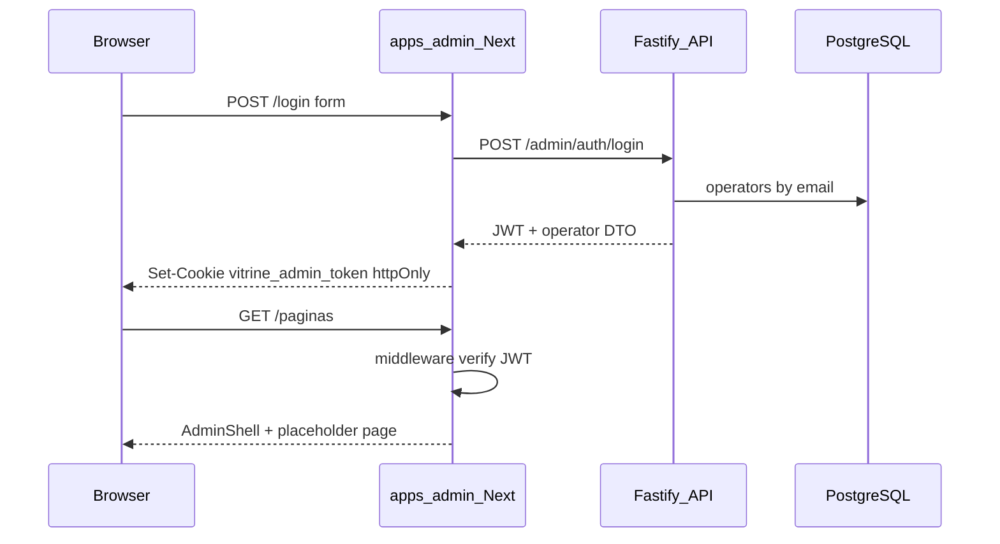

# Admin — estrutura inicial (UI + auth API)

## Objetivo

Entregar um painel operador separado da vitrine pública, com **login funcional** (JWT via API), **layout autenticado** espelhando o php-app ([`_layout.php`](file:///home/josevalerio/Documents/php-app/src/views/admin/_layout.php), [`admin-panel.css`](file:///home/josevalerio/Documents/php-app/public/css/admin-panel.css), [`UI_UX_ADMIN.md`](file:///home/josevalerio/Documents/php-app/docs/UI_UX_ADMIN.md)), e **rotas stub** para os módulos futuros do CMS.

**Fora de escopo nesta entrega:** CRUD real de páginas/blocos, drag-and-drop, rotas `GET/POST /admin/pages/*` de conteúdo (use cases já existem; HTTP CMS fica na fase seguinte).

---

## Arquitetura



| App                     | Porta default | Papel                     |
| ----------------------- | ------------- | ------------------------- |
| [`apps/web`](apps/web)  | 3001          | Vitrine pública           |
| **`apps/admin`** (novo) | **3002**      | Painel operador           |
| [`apps/api`](apps/api)  | 3000          | Auth + futuros `/admin/*` |

---

## 1. Backend — operadores e JWT

### Schema DB

Nova migration [`packages/infrastructure/src/persistence/drizzle/migrations/0004_operators.sql`](packages/infrastructure/src/persistence/drizzle/migrations/0004_operators.sql):

```sql
CREATE TYPE operator_status AS ENUM ('active', 'disabled');
CREATE TABLE operators (
  id UUID PRIMARY KEY DEFAULT gen_random_uuid(),
  email TEXT NOT NULL UNIQUE,
  password_hash TEXT NOT NULL,
  name TEXT NOT NULL,
  status operator_status NOT NULL DEFAULT 'active',
  created_at TIMESTAMPTZ NOT NULL DEFAULT now(),
  updated_at TIMESTAMPTZ NOT NULL DEFAULT now()
);
```

Drizzle table + enum em [`schema/index.ts`](packages/infrastructure/src/persistence/drizzle/schema/index.ts).

**Seed** ([`seed.ts`](packages/infrastructure/src/persistence/drizzle/seed.ts)): operador dev a partir de `ADMIN_SEED_EMAIL` / `ADMIN_SEED_PASSWORD` (defaults documentados).

### Domain

- Entidade `Operator` + enum `OperatorStatus` em [`packages/domain`](packages/domain)
- Port [`OperatorRepository`](packages/domain/src/repositories/OperatorRepository.ts): `findByEmail(email)`
- Ports de infra:
  - `PasswordHasher`: `hash(plain)`, `verify(plain, hash)`
  - `AuthTokenService`: `sign(payload)`, `verify(token)` — payload `{ sub, email, name }`

### Application

- [`AuthenticateOperator`](packages/application/src/use-cases/admin-auth/AuthenticateOperator.ts)
  - Input: `{ email, password }`
  - Fluxo: findByEmail → status `active` → verify password → sign JWT
  - Erros: `EntityNotFoundError` / credenciais inválidas → 401 genérico ("E-mail ou senha inválidos")

### Infrastructure

- `BcryptPasswordHasher` (`bcrypt` ou `bcryptjs`)
- `JwtAuthTokenService` (`jose`, HS256, exp 8h)
- `DrizzleOperatorRepository`
- Wire em [`api-container.ts`](packages/infrastructure/src/di/api-container.ts)

### Env ([`packages/shared/src/index.ts`](packages/shared/src/index.ts))

| Variável                                   | Uso                                  |
| ------------------------------------------ | ------------------------------------ |
| `JWT_SECRET`                               | Assinatura JWT (obrigatório em prod) |
| `JWT_EXPIRES_IN`                           | Default `8h`                         |
| `ADMIN_PORT`                               | Default `3002` — CORS                |
| `ADMIN_SEED_EMAIL` / `ADMIN_SEED_PASSWORD` | Seed local                           |

Atualizar [`.env.example`](.env.example): `JWT_SECRET`, `ADMIN_PORT=3002`, seed credentials, `CORS_ORIGINS` incluindo `http://localhost:3002`.

### API routes ([`apps/api/src/adapters/http/routes/index.ts`](apps/api/src/adapters/http/routes/index.ts))

| Método | Rota                 | Auth       | Resposta                                   |
| ------ | -------------------- | ---------- | ------------------------------------------ |
| POST   | `/admin/auth/login`  | —          | `{ token, operator: { id, email, name } }` |
| GET    | `/admin/auth/me`     | Bearer JWT | `{ id, email, name }`                      |
| POST   | `/admin/auth/logout` | —          | 204 (stateless; cookie limpo no admin)     |

- Zod: `AdminLoginSchema` (`email`, `password`)
- Hook Fastify `onRequest` em prefixo `/admin` (exceto `/admin/auth/login`): valida `Authorization: Bearer` ou preparação para cookies futuros
- CORS: adicionar `Authorization` em `allowedHeaders`; incluir origem admin em `CORS_ORIGINS`

Teste unitário: `AuthenticateOperator` com repo mock.

---

## 2. `apps/admin` — app Next.js

### Bootstrap

Novo workspace espelhando [`apps/web`](apps/web):

```
apps/admin/
  package.json          # @ecommerce-amazon/admin, port ADMIN_PORT
  next.config.ts        # standalone
  tsconfig.json
  postcss.config.mjs
  src/
    app/
      layout.tsx
      globals.css       # tokens admin + @import tailwindcss
      middleware.ts
      (auth)/
        layout.tsx      # fundo login (sem sidebar)
        login/page.tsx
      (dashboard)/
        layout.tsx      # AdminShell
        page.tsx        # Painel
        paginas/page.tsx
        produtos/page.tsx
        artigos/page.tsx
        colecoes/page.tsx
        cupons/page.tsx
        configuracoes/page.tsx
      api/auth/
        login/route.ts  # proxy → API, set cookie httpOnly
        logout/route.ts # clear cookie
    components/admin/
      AdminShell.tsx
      AdminSidebar.tsx
      AdminHeader.tsx
      AdminPageCard.tsx
      AdminEmptyState.tsx
      AdminBreadcrumbs.tsx
      AdminUserMenu.tsx
    components/auth/
      LoginForm.tsx
    lib/
      auth/session.ts   # read/verify JWT from cookie (jose + JWT_SECRET)
      navigation.ts     # nav config
```

Scripts raiz: `dev:admin`, incluir `@ecommerce-amazon/admin` no `build` do [`package.json`](package.json) raiz.

### UI/UX (inspirado php-app, stack Tailwind 4)

Replicar **padrões visuais**, não Bootstrap:

| Padrão php-app                                         | Implementação admin                                                                        |
| ------------------------------------------------------ | ------------------------------------------------------------------------------------------ |
| Login: gradiente azul + card ~384px                    | `(auth)/layout` + `LoginForm` — tokens CSS `--admin-navy`, `--admin-primary`, `--admin-bg` |
| Grid shell: sidebar 268px + header + content + footer  | `AdminShell` com CSS grid / Tailwind                                                       |
| Sidebar: Lucide icons, item ativo com barra azul inset | `AdminSidebar` + `navigation.ts`                                                           |
| Header: título, breadcrumbs, user pill dropdown        | `AdminHeader`, `AdminUserMenu`                                                             |
| Content: fundo cinza + `admin-page-card` branco        | `AdminPageCard` wrapper                                                                    |
| Empty states                                           | `AdminEmptyState` (ícone Lucide + título + hint)                                           |
| Flash erro login                                       | toast fixo canto inferior direito (estilo GCP simplificado)                                |
| Sidebar colapsável desktop + drawer mobile             | `localStorage` + overlay ≤850px                                                            |
| `noindex`                                              | metadata `robots: noindex, nofollow` no root layout                                        |

**Marca:** "Vitrine" / "Painel CMS" (alinhado ao [`layout.tsx`](apps/web/src/app/layout.tsx) da vitrine).

### Navegação inicial (stubs)

| Rota             | Label         | Ícone           | Conteúdo placeholder              |
| ---------------- | ------------- | --------------- | --------------------------------- |
| `/`              | Painel        | LayoutDashboard | KPI cards estáticos "Em breve"    |
| `/paginas`       | Páginas       | FileStack       | Empty state — editor CMS fase 2   |
| `/produtos`      | Produtos      | Package         | Empty state — catálogo via worker |
| `/artigos`       | Artigos       | Newspaper       | Empty state                       |
| `/colecoes`      | Coleções      | Layers          | Empty state                       |
| `/cupons`        | Cupons        | Ticket          | Empty state                       |
| `/configuracoes` | Configurações | Settings        | Empty state                       |

Cada página exporta `metadata` com título; dashboard passa `breadcrumbs` via context ou props para `AdminHeader`.

### Auth flow (admin app)

1. **`LoginForm`** → `POST /api/auth/login` (Route Handler server-side chama `POST ${API_URL}/admin/auth/login`)
2. Handler valida resposta, grava cookie **`vitrine_admin_token`** (`httpOnly`, `SameSite=Lax`, `secure` em prod, path `/`)
3. **`middleware.ts`**: rotas `(dashboard)/*` exigem cookie JWT válido; senão redirect `/login?next=...`
4. Rotas `(auth)/*`: se já autenticado → redirect `/`
5. **`AdminUserMenu`**: logout → `POST /api/auth/logout` → redirect `/login`

Cookie no domínio do admin evita CORS/credentials cross-origin entre 3002 e 3000.

---

## 3. Documentação

Criar [`docs/admin-app-phase1.md`](docs/admin-app-phase1.md):

- O quê / por quê (link ao plano UI fase 3)
- Fluxo auth (diagrama)
- Env vars, seed operator, URLs dev
- Mapa de rotas stub vs. entregas futuras
- Referência visual ao php-app

Atualizar:

- [`docs/dev-setup.md`](docs/dev-setup.md) — `npm run dev:admin`, porta 3002, credenciais seed
- [`docs/api-rest.md`](docs/api-rest.md) — `/admin/auth/*`
- [`docs/README.md`](docs/README.md) — índice
- [`docs/database-schema.md`](docs/database-schema.md) — tabela `operators`

---

## Verificação

```bash
npm run db:migrate && npm run db:seed
npm run build -w @ecommerce-amazon/shared -w @ecommerce-amazon/domain \
  -w @ecommerce-amazon/application -w @ecommerce-amazon/infrastructure \
  -w @ecommerce-amazon/api -w @ecommerce-amazon/admin
npx vitest run packages/application/src/use-cases/admin-auth

# Terminais
npm run dev:api    # :3000
npm run dev:admin  # :3002

curl -X POST http://localhost:3000/admin/auth/login \
  -H 'Content-Type: application/json' \
  -d '{"email":"admin@vitrine.local","password":"..."}'

# Browser: http://localhost:3002/login → login → shell com sidebar
```

Manual: sidebar colapsa/expande; mobile abre drawer; logout limpa sessão; páginas stub com empty state consistente.

---

## Dependências novas

| Pacote                         | Onde                           |
| ------------------------------ | ------------------------------ |
| `jose`                         | shared ou infrastructure (JWT) |
| `bcryptjs` + `@types/bcryptjs` | infrastructure (hash)          |

Admin reutiliza `lucide-react`, `clsx`, `tailwind-merge`, `zod` — mesmo stack de [`apps/web`](apps/web).
