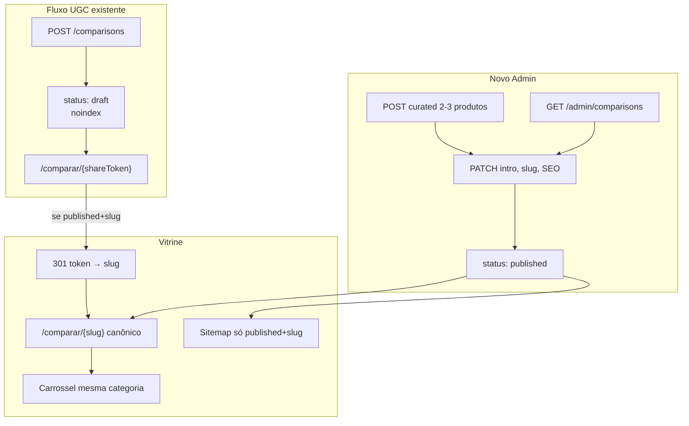

# Admin — Gestão de Comparações (fase editorial)

## Contexto

A [fase 1 do comparador](docs/comparator-web-phase1.md) entregou fluxo **UGC** (`POST /comparisons` → `/comparar/{shareToken}`). O schema atual em [`product_comparisons`](packages/infrastructure/src/persistence/drizzle/schema/index.ts) só tem `share_token`, `session_id`, `editorial_intro`, `created_at` — sem status, slug ou SEO.

A recomendação acordada é **CRUD dedicado no Admin** (modelo [coleções](<apps/admin/src/app/(dashboard)/colecoes/page.tsx>)), **não** bloco CMS genérico. O **slug legível** deixa de ser opcional: é **obrigatório na publicação** e vira URL canônica indexável.



## Decisões de produto

| Tópico                  | Decisão                                                                                                           |
| ----------------------- | ----------------------------------------------------------------------------------------------------------------- |
| URL canônica            | `/comparar/{slug}` quando `status=published` e `slug` definido                                                    |
| `shareToken`            | Mantido (UUID) para links UGC legados e dedupe; redireciona 301 para slug quando publicado                        |
| Indexação               | `draft` → `noindex`; `published` → `index, follow`                                                                |
| Sitemap                 | Apenas `status=published` **e** `slug IS NOT NULL`                                                                |
| Carrossel               | Automático por `categoryId` dos produtos comparados; flag `showCategoryCarousel` (default `true`)                 |
| Intro editorial         | Operador edita no admin; publicação exige **≥150 palavras** (Growth); UGC continua com template mínimo na criação |
| Origem                  | Campo `source`: `user_generated` \| `curated` (filtro na listagem admin)                                          |
| Tabela comparativa      | Continua runtime do catálogo — **não** editável no admin                                                          |
| Roteamento `[param]`    | Regex UUID v4 no use case → query única (sem fallback DB)                                                         |
| Carrossel mínimo        | Exibir só se ≥3 itens após filtro; fallback categoria pai; senão omitir                                           |
| Publicar (150 palavras) | Barra de progresso + focus/tooltip no admin; validação server-side                                                |
| Preços na tabela        | Layout SSR estático; preço/stale em subcomponente com gate de hidratação                                          |
| Subatribuição afiliado  | `comparisonSlug` em links `/go` quando `published` (ascsubtag / sub_id)                                           |

## 1. Migration e schema Drizzle

Nova migration `0023_comparison_editorial.sql` + atualizar [`schema/index.ts`](packages/infrastructure/src/persistence/drizzle/schema/index.ts):

```sql
-- enums
comparison_status: draft | published
comparison_source: user_generated | curated

-- colunas em product_comparisons
slug TEXT UNIQUE NULL
status comparison_status NOT NULL DEFAULT 'draft'
source comparison_source NOT NULL DEFAULT 'user_generated'
seo_title TEXT NULL
seo_description TEXT NULL
show_category_carousel BOOLEAN NOT NULL DEFAULT true
updated_at TIMESTAMPTZ NOT NULL DEFAULT now()
published_at TIMESTAMPTZ NULL
```

**Backfill:** linhas existentes → `status='draft'`, `source='user_generated'`, `slug=NULL`. Isso alinha com anti-spam UGC (páginas já criadas passam a `noindex` até revisão editorial).

Índices: `UNIQUE(slug)`, índice parcial ou composto em `(status)` para listagem admin.

## 2. Domínio

**Enums** em [`packages/domain/src/enums/`](packages/domain/src/enums/) (ex.: `ComparisonStatus`, `ComparisonSource`) + parsers.

**Entidade** [`ProductComparison`](packages/domain/src/entities/Coupon.ts) — estender com novos campos; `create()` valida 2–3 produtos (inalterado).

**Port** [`ProductComparisonRepository`](packages/domain/src/repositories/ProductComparisonRepository.ts):

- `findById(id)`
- `findBySlug(slug)`
- ~~`findByIdentifier`~~ — **não** no repositório; roteamento UUID vs slug fica no use case (ver §4)
- `listAdmin()` — resumo paginável ou lista simples (como coleções)
- `update(comparison)` — update parcial dos metadados + opcionalmente `comparison_products`
- `delete(id)`
- `slugExists(slug, excludeId?)`

**ProductRepository** — estender `SimilarProductsCriteria` com `excludeProductIds?: string[]` e usar `notInArray` em [`drizzle-product.repository.ts`](packages/infrastructure/src/persistence/repositories/drizzle-product.repository.ts) para o carrossel excluir os 2–3 comparados.

**CategoryRepository** — reutilizar `findById` + `parentId` para fallback de carrossel (§4).

**Mapper** [`mapComparison`](packages/infrastructure/src/persistence/mappers/product.mapper.ts) e [`DrizzleProductComparisonRepository`](packages/infrastructure/src/persistence/repositories/drizzle-content.repository.ts): `save` vira upsert/update; métodos admin novos.

## 3. Shared — schemas Zod

Novo [`packages/shared/src/admin/comparison-schemas.ts`](packages/shared/src/admin/comparison-schemas.ts) (export em [`admin/index.ts`](packages/shared/src/admin/index.ts)):

- `comparisonSlugSchema` — mesmo regex de coleções (`^[a-z0-9]+(?:-[a-z0-9]+)*$`)
- `adminComparisonSummarySchema` — id, shareToken, slug?, status, source, productCount, categoryLabel, updatedAt
- `adminComparisonDetailSchema` — intro, productIds, seoTitle?, seoDescription?, showCategoryCarousel, publishedAt?, preview de títulos
- `createAdminComparisonBodySchema` — productIds (2–3), editorialIntro, slug (opcional em draft), seo\*, showCategoryCarousel
- `updateAdminComparisonBodySchema` — partial + `status` opcional
- `publishComparisonBodySchema` — slug obrigatório + validação de palavras

Helper novo em [`packages/shared/src/comparison/`](packages/shared/src/comparison/):

- `buildSuggestedComparisonSlug(titles: string[])` — ex.: `slugifyTitle(a)-vs-slugifyTitle(b)` (truncar ~100 chars)
- `countEditorialWords(text)` — para validação ≥150 palavras na publicação
- `isComparisonShareToken(value: string)` — regex estrito UUID v4 (`^[0-9a-f]{8}-...`) para roteamento sem fallback no DB

Estender [`comparisonPublicDetailSchema`](packages/shared/src/comparison/comparison-schemas.ts):

```typescript
{
  shareToken, slug?, status, editorialIntro, createdAt, updatedAt?,
  seoTitle?, seoDescription?, showCategoryCarousel,
  canonicalPath: string,  // /comparar/{slug} ou /comparar/{shareToken}
  categorySlug?, categoryLabel?,
  relatedProducts?: ProductListItemDto[],  // quando carousel ativo + published
  products: ProductDetailDto[]
}
```

## 4. Application — use cases

Pasta `packages/application/src/use-cases/admin-comparison/`:

| Use case                  | Responsabilidade                                                                   |
| ------------------------- | ---------------------------------------------------------------------------------- |
| `ListAdminComparisons`    | Lista para admin com joins leves (títulos, categoria)                              |
| `GetAdminComparison`      | Detalhe por id                                                                     |
| `CreateCuratedComparison` | Operador escolhe 2–3 produtos; `source=curated`, `status=draft`; gera `shareToken` |
| `UpdateComparison`        | Edita intro, slug, SEO, produtos (revalida mesma categoria), carousel flag         |
| `PublishComparison`       | Valida slug único, intro ≥150 palavras, produtos ativos; set `published_at`        |
| `DeleteComparison`        | Hard delete (cascade)                                                              |

Atualizar existentes:

- [`CreateComparison`](packages/application/src/use-cases/comparison/CreateComparison.ts) — persistir `status=draft`, `source=user_generated`
- [`GetComparisonByToken`](packages/application/src/use-cases/comparison/GetComparisonByToken.ts) → **`GetComparisonByIdentifier`**:

### Roteamento UUID vs slug (refino §1)

No use case, **antes de qualquer query**:

```typescript
const comparison = isComparisonShareToken(identifier)
  ? await comparisonRepository.findByShareToken(identifier)
  : await comparisonRepository.findBySlug(identifier);
```

- UUID v4 → uma query direta em `share_token` (índice unique)
- Caso contrário → uma query em `slug` (índice unique)
- Sem tentativa dupla, sem fallback por erro — param inválido retorna `null` → 404

O Next.js em `[param]/page.tsx` apenas repassa `param`; a distinção fica **100% no use case** (SSR e API).

### Carrossel com fallback de categoria (refino §2)

Quando `showCategoryCarousel && status=published`:

1. Buscar similares na `categoryId` dos produtos comparados, `excludeProductIds` = IDs da comparação, `limit=12`
2. **Se `items.length < 3`:** resolver categoria via `CategoryRepository.findById`; se `parentId` existe, repetir busca na categoria pai (mesmos excludes + IDs já coletados)
3. **Se ainda `< 3`:** **omitir carrossel** (`relatedProducts: []`) — melhor que card único quebrando layout; registrar no presenter sem renderizar `ProductSimilarCarousel`

Constante `MIN_CAROUSEL_ITEMS = 3` em shared ou use case; testes cobrindo nicho com 4 produtos totais.

- retorna DTO enriquecido

Helpers `assertUniqueComparisonSlug`, `assertSameCategory` (reutilizar lógica de `CreateComparison`).

**Revalidação** (padrão coleções): `PublicWebRevalidator.revalidate({ paths: ['/comparar/{slug}', '/comparar/{shareToken}', '/sitemap.xml'] })` em publish/update/delete.

Registrar em [`api-container.ts`](packages/infrastructure/src/di/api-container.ts).

## 5. API

### Admin — novo [`admin-comparison-routes.ts`](apps/api/src/adapters/http/routes/admin-comparison-routes.ts)

| Método | Rota                             | Ação                        |
| ------ | -------------------------------- | --------------------------- |
| GET    | `/admin/comparisons`             | Listar                      |
| GET    | `/admin/comparisons/:id`         | Detalhe                     |
| POST   | `/admin/comparisons`             | Criar curada (draft)        |
| PATCH  | `/admin/comparisons/:id`         | Atualizar                   |
| POST   | `/admin/comparisons/:id/publish` | Publicar (slug obrigatório) |
| DELETE | `/admin/comparisons/:id`         | Excluir                     |

Registrar em [`admin-routes.ts`](apps/api/src/adapters/http/routes/admin-routes.ts).

### Pública — [`routes/index.ts`](apps/api/src/adapters/http/routes/index.ts)

- `GET /comparisons/:identifier` — usa `GetComparisonByIdentifier` (compatível com tokens existentes)
- Manter alias ou depreciar nome do param no OpenAPI; atualizar [`comparison.presenter.ts`](apps/api/src/adapters/presenters/comparison.presenter.ts)

Testes em [`apps/api/src/api.test.ts`](apps/api/src/api.test.ts): 404, publish validation, slug conflict 409, GET por slug.

## 6. Admin UI

Seguir [`.cursor/rules/11-admin-floating-panels.mdc`](.cursor/rules/11-admin-floating-panels.mdc) e padrão [`CollectionListManager`](apps/admin/src/components/collections/CollectionListManager.tsx).

**Navegação:** item `{ href: '/comparacoes', label: 'Comparações', icon: GitCompare }` em [`navigation.ts`](apps/admin/src/lib/navigation.ts).

**Página:** [`apps/admin/src/app/(dashboard)/comparacoes/page.tsx`](<apps/admin/src/app/(dashboard)/comparacoes/page.tsx>)

**Componentes** em `apps/admin/src/components/comparisons/`:

- `ComparisonListManager` — painéis flutuantes, lista `cms-block-card--plain`
- `ComparisonFormSheet` — Sheet lateral (criar/editar):
  - `ProductMultiSelect` reutilizado (min 2, max 3, validação mesma categoria no client)
  - Textarea intro + **barra de progresso visual** (refino §3): ex. `120 / 150 palavras` com cor de preenchimento
  - Ao clicar **Publicar** com `< 150` palavras: `focus()` no textarea + tooltip/inline: _"Adicione mais X palavras para liberar a indexação e publicação"_ (botão Publicar permanece desabilitado abaixo do mínimo)
  - Slug com auto-sugestão (`buildSuggestedComparisonSlug`) e botão “Gerar do título”
  - SEO title/description (opcionais; fallback para título auto `A vs B | marca`)
  - Toggle “Exibir carrossel da categoria”
  - Badge status (Rascunho / Publicado)
  - Botões: Salvar rascunho, **Publicar**, link “Abrir na vitrine”
  - Em edição de UGC: exibir `shareToken` copiável
- `ComparisonListView` — colunas: produtos (títulos truncados), categoria, status, origem, data, ações

**BFF** Next.js (proxy JWT):

- [`apps/admin/src/app/api/admin/comparisons/route.ts`](apps/admin/src/app/api/admin/comparisons/route.ts)
- [`apps/admin/src/app/api/admin/comparisons/[id]/route.ts`](apps/admin/src/app/api/admin/comparisons/[id]/route.ts)
- [`apps/admin/src/app/api/admin/comparisons/[id]/publish/route.ts`](apps/admin/src/app/api/admin/comparisons/[id]/publish/route.ts)

**Client API:** `apps/admin/src/lib/api/comparisons.ts` (server + client fetch, espelhando coleções).

## 7. Vitrine web

### Rota dinâmica

Renomear [`apps/web/src/app/comparar/[shareToken]/`](apps/web/src/app/comparar/[shareToken]/) → `[param]/`:

1. `getComparison(param)` — API resolve via regex no use case (§4)
2. Se acessado por `shareToken` e resposta tem `slug` + `published` → `redirect('/comparar/' + slug, 301)`
3. Metadata:
   - `draft` → `robots: { index: false, follow: true }`
   - `published` → canonical `/comparar/{slug}`, `seoTitle`/`seoDescription` quando definidos
4. JSON-LD [`comparison-json-ld.ts`](packages/shared/src/seo/comparison-json-ld.ts) — usar `canonicalPath` (slug) em vez de token

### Hidratação da tabela (refino §4)

Layout estrutural (colunas de specs, imagens, títulos) permanece **SSR estático** via props da API.

Valores voláteis (preço numérico, `stalePrice`, badges de urgência) extraídos para subcomponente client `ComparisonVolatilePrice` (ou equivalente) com gate `isHydrated` — mesmo padrão de [`ComparisonProvider`](apps/web/src/components/comparison/ComparisonProvider.tsx):

- SSR/hidratação inicial: skeleton ou placeholder neutro (`—`) nas células de preço
- Após `useEffect` mount: renderizar valores reais dos props (sem re-fetch client desnecessário)
- Proibido badges de urgência/queda quando `stalePrice === true` (regra de negócio existente)

Alterações em [`comparison-table-core.tsx`](apps/web/src/components/comparison/comparison-table-core.tsx) — escopo mínimo, sem refatoração ampla.

### Carrossel

Abaixo de `StandaloneComparisonTable`, quando `relatedProducts.length >= 3` (alinhado ao `MIN_CAROUSEL_ITEMS`):

```tsx
<ProductSimilarCarousel
  products={data.relatedProducts}
  categorySlug={data.categorySlug}
  categoryLabel={data.categoryLabel}
/>
```

Novo placement em [`placements.ts`](packages/shared/src/analytics/placements.ts): `COMPARISON_RELATED: 'comparison.related'` — passar nos `ProductCard` do carrossel.

### Share / copy link

[`ShareComparisonButton`](apps/web/src/components/comparison/) e [`CopyComparisonLinkButton`](apps/web/src/components/comparison/CopyComparisonLinkButton.tsx): preferir URL com slug quando `canonicalPath` apontar para slug.

Atualizar [`cached-fetchers.ts`](apps/web/src/lib/api/cached-fetchers.ts) e [`comparisons.ts`](apps/web/src/lib/api/comparisons.ts).

## 7b. Atribuição afiliada com slug (refino §5)

Para comparações **`published`** com `slug`, enriquecer subatribuição nos CTAs da tabela (não só `origin=comparador`):

**Camada domain/infrastructure:**

- Estender `AffiliateTrackingParams` com `comparisonSlug?: string`
- Em [`DefaultAffiliateLinkBuilder.composeSubTag`](packages/infrastructure/src/affiliate/default-affiliate-link.builder.ts): incluir slug no `ascsubtag` Amazon (ex.: `cmp_{slug}` como segmento dedicado, truncado ~50 chars)
- Shopee: quando `comparisonSlug` presente, preferir `sub_id={slug}` (campo já usado para `blockId` — priorizar slug de comparação em páginas `/comparar/{slug}`)
- ML: `utm_campaign={slug}` quando published (sem param nativo equivalente a subid2)

**Camada web/API:**

- Estender [`GoQuerySchema`](apps/api/src/adapters/dtos/request/schemas.ts) + [`buildGoUrl`](apps/web/src/lib/go-url.ts) com `comparisonSlug`
- [`ResolveAffiliateRedirect`](packages/application/src/use-cases/affiliate/ResolveAffiliateRedirect.ts) repassa ao builder
- [`StandaloneComparisonTable`](apps/web/src/components/comparison/StandaloneComparisonTable.tsx) → `comparisonSlug` prop quando `status=published`
- `recordClickEvent`: opcional `comparisonSlug` em metadata de clique (dashboard futuro)

Draft/UGC sem slug publicado: comportamento atual (`origin=comparador`) inalterado.

## 8. Sitemap

Em [`drizzle-sitemap.repository.ts`](packages/infrastructure/src/persistence/repositories/drizzle-sitemap.repository.ts), adicionar UNION:

```sql
SELECT '/comparar/' || slug, COALESCE(published_at, updated_at)
FROM product_comparisons
WHERE status = 'published' AND slug IS NOT NULL
```

Atualizar doc [seo-technical-phase1.md](docs/seo-technical-phase1.md) e [comparator-web-phase1.md](docs/comparator-web-phase1.md) (remover “fora do sitemap” para publicadas).

## 9. Documentação

Criar [`docs/admin-comparisons-phase1.md`](docs/admin-comparisons-phase1.md):

- Escopo / fora de escopo (carrossel curado manual = fase 2)
- Fluxo UGC → revisão → publish
- Rotas admin + API
- Regras SEO (slug, noindex draft, sitemap)
- Como testar (curl + passos admin)

Atualizar [`docs/README.md`](docs/README.md), [`docs/api-rest.md`](docs/api-rest.md), [`docs/comparator-web-phase1.md`](docs/comparator-web-phase1.md) (próximos passos → concluído).

## 10. Testes

**Unitários (passo 3 — antes da UI):**

- `CreateComparison.test.ts` — persiste `draft`
- `PublishComparison.test.ts` — slug obrigatório, 150 palavras, conflito slug
- `GetComparisonByIdentifier.test.ts` — regex UUID → token query única; slug → slug query única; carousel exclui comparados; fallback parent; omit quando `< 3`
- `ResolveAffiliateRedirect.test.ts` — `comparisonSlug` no ascsubtag quando presente

**Integração E2E (passo 6):**

- API admin CRUD + GET público por slug
- Publish validation 400/409
- Opcional: snapshot do presenter

## Ordem de implementação

1. Migration + domain + repository
2. Shared schemas + helpers (`isComparisonShareToken`, slug, palavras)
3. Use cases + DI + API (admin + público) + **testes unitários dos use cases**
4. Admin UI + BFF (espelhando padrão coleções — ver §11)
5. Web (`[param]`, redirect, carousel, metadata, hidratação preços)
6. Atribuição afiliada (`comparisonSlug` no `/go`)
7. Sitemap + docs + testes de integração ponta a ponta

## 11. Estratégia de execução (LLM / Cursor)

**Ordem:** core de domínio e use cases primeiro; UI admin por último entre as camadas de produto.

**Não** gerar boilerplate admin de forma cega. Para UI/BFF:

- Copiar estrutura de [`CollectionListManager`](apps/admin/src/components/collections/CollectionListManager.tsx) + [`CollectionFormSheet`](apps/admin/src/components/collections/CollectionFormSheet.tsx) e adaptar campos
- Reutilizar `ProductMultiSelect`, painéis flutuantes (`11-admin-floating-panels.mdc`), BFF proxy existente
- LLM/Cursor acelera arquivos repetitivos **a partir desses templates**, não inventando layout novo

Contratos Zod + testes unitários no passo 3 funcionam como gate: UI só consome DTOs já validados.

## Fora de escopo desta fase

- Carrossel com produtos escolhidos manualmente pelo operador
- TipTap rico na intro (textarea basta)
- Comparador cross-marketplace
- Badge queda 30d na tabela
