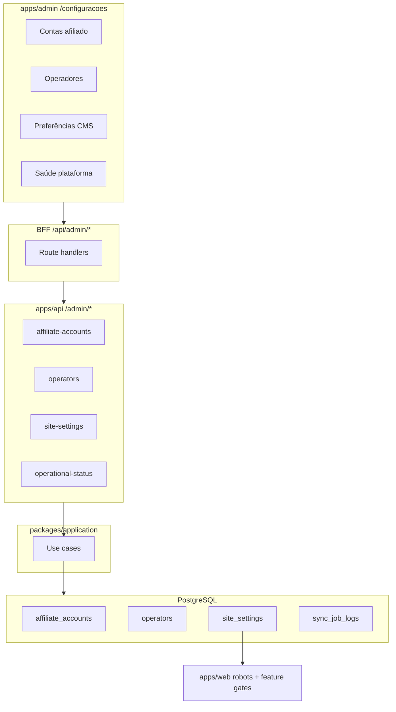

# Admin — Configurações Operacionais

## Contexto e baseline

Hoje [`apps/admin/src/app/(dashboard)/configuracoes/page.tsx`](<apps/admin/src/app/(dashboard)/configuracoes/page.tsx>) é empty state. O escopo está alinhado a:

- **PRD Core §4.2** — validação manual de contas afiliado antes de escala ([`.cursor/plans/prd_plataforma_afiliação_de44933f.plan.md`](.cursor/plans/prd_plataforma_afiliação_de44933f.plan.md))
- **Stub do admin** — "contas de afiliado, operadores e preferências do CMS"
- **Próximos passos** de [`docs/admin-profile-phase1.md`](docs/admin-profile-phase1.md) — gestão de operadores e troca de senha
- **Gap MVP** em [`docs/next-steps-mvp.md`](docs/next-steps-mvp.md) linha 114

### O que já existe (reutilizar)

| Área                         | Estado                                                                                                                                                                                                            |
| ---------------------------- | ----------------------------------------------------------------------------------------------------------------------------------------------------------------------------------------------------------------- |
| Tabela `affiliate_accounts`  | Seed Amazon `active`, Shopee `pending_manual_validation`                                                                                                                                                          |
| `AffiliateAccountRepository` | Só `findByMarketplace` — sem list/update                                                                                                                                                                          |
| Gate runtime                 | [`ResolveAffiliateRedirect`](packages/application/src/use-cases/affiliate/ResolveAffiliateRedirect.ts), [`BuildBatchCheckoutRedirect`](packages/application/src/use-cases/wishlist/BuildBatchCheckoutRedirect.ts) |
| Operadores                   | CRUD parcial — só perfil próprio em `/perfil`                                                                                                                                                                     |
| Auth admin                   | JWT sem `role`; hook `onRequest` não distingue admin/editor                                                                                                                                                       |
| `sync_job_logs`              | Write-only via worker                                                                                                                                                                                             |
| Brand                        | Env-only ([`docs/brand-config.md`](docs/brand-config.md)) — **não** migrar para DB                                                                                                                                |



---

## Escopo desta entrega

| Incluído                                                                       | Fora de escopo                             |
| ------------------------------------------------------------------------------ | ------------------------------------------ |
| Painel contas afiliado (listar, editar tag, transição de status com checklist) | CRUD cupons (`/cupons` — fase separada)    |
| Gestão de operadores (listar, convidar, role, ativar/desativar)                | Convite por e-mail / reset token           |
| Troca de senha do operador logado                                              | Editar brand via UI (permanece `.env`)     |
| Tabela `site_settings` + toggles CMS/feature flags                             | Draft/preview/publish workflow da home CMS |
| Painel saúde (env flags, gate global, últimos `sync_job_logs` falhos)          | BullMQ dashboard / profundidade de fila    |
| Guard `admin` role em rotas sensíveis                                          | Login social, multi-tenant                 |

---

## 1. Migration e contrato `site_settings`

**Arquivo:** `packages/infrastructure/src/persistence/drizzle/migrations/0019_operational_settings.sql`

### Tabela `site_settings` (single-row, id fixo `00000000-0000-4000-8000-000000000001`)

Colunas: `id`, `settings` (jsonb), `updated_at`, `updated_by` (FK `operators`, nullable).

### Extensão `affiliate_accounts`

- `validation_notes text` — evidências do checklist PRD §4.2 (opcional no promote)

### Schema Zod em `packages/shared/src/admin/site-settings-schemas.ts`

```typescript
// Contrato mínimo — validado no write
{
  features: {
    priceAlertsEnabled: boolean,      // default true
    batchCheckoutEnabled: boolean,    // default true
    publicIndexingEnabled: boolean,   // default true — master SEO switch
  },
  seo: {
    respectAffiliateGate: boolean,    // default true — noindex se conta pending
  },
  cms: {
    publishConfirmRequired: boolean,  // default true — UX no editor
    defaultBlockVisibility: 'all' | 'desktop' | 'mobile',
  },
}
```

Seed em [`seed.ts`](packages/infrastructure/src/persistence/drizzle/seed.ts) com defaults acima.

---

## 2. Domain e application layer

### Novos ports

| Port                                    | Métodos                                                                                             |
| --------------------------------------- | --------------------------------------------------------------------------------------------------- |
| `SiteSettingsRepository`                | `get()`, `save(settings, updatedBy)`                                                                |
| `AffiliateAccountRepository` (estender) | `findAll()`, `update(id, { affiliateTag?, status?, validationNotes?, validatedBy?, validatedAt? })` |
| `OperatorRepository` (estender)         | `findAll()`, `create(...)`, `updateAccess(id, { role?, status? })`, `updatePasswordHash(id, hash)`  |
| `SyncJobLogRepository` (estender)       | `findRecent({ limit, status? })`                                                                    |

### Use cases novos

| Use case                                 | Regras de negócio                                                                                                                                |
| ---------------------------------------- | ------------------------------------------------------------------------------------------------------------------------------------------------ |
| `ListAffiliateAccounts`                  | Admin only                                                                                                                                       |
| `UpdateAffiliateAccount`                 | Admin only; transição → `active` exige checklist confirmado + grava `validatedBy`/`validatedAt`/`validationNotes`; → `suspended` bloqueia escala |
| `ListOperators`                          | Admin only; nunca expor `passwordHash`                                                                                                           |
| `CreateOperator`                         | Admin only; email único; senha temporária via `PasswordHasher`; role `admin` \| `editor`                                                         |
| `UpdateOperatorAccess`                   | Admin only; não desativar a si mesmo; não rebaixar último admin ativo                                                                            |
| `ChangeOperatorPassword`                 | Operador logado; valida senha atual                                                                                                              |
| `GetSiteSettings` / `UpdateSiteSettings` | Read: qualquer operador autenticado; Write: admin only                                                                                           |
| `GetOperationalStatus`                   | Resumo read-only: flags env (`RESEND_API_KEY`, `GA4_*`, `STORAGE_DRIVER`), gate afiliado agregado, últimos 10 jobs `failed`                      |

### Serviço de gate composto

Extrair helper em `packages/application` (ex.: `AffiliateScaleGateService`) usado por:

- `ResolveAffiliateRedirect` / `BuildBatchCheckoutRedirect` — respeitar `site_settings.features.*` **e** status da conta
- `ProcessTriggeredAlerts` (worker) — respeitar `priceAlertsEnabled`
- `apps/web/src/app/robots.ts` — se `!publicIndexingEnabled` **ou** (`respectAffiliateGate` && alguma conta pending) → `disallow: /`

**Cache:** Redis `vitrine:site-settings` TTL 5 min; invalidar no `UpdateSiteSettings` e no `UpdateAffiliateAccount` (gate SEO).

---

## 3. API REST admin

Novo arquivo [`apps/api/src/adapters/http/routes/admin-settings-routes.ts`](apps/api/src/adapters/http/routes/admin-settings-routes.ts), registrado em [`admin-routes.ts`](apps/api/src/adapters/http/routes/admin-routes.ts).

### Helper `requireAdminOperator`

Após JWT válido, carregar operador por `request.adminOperator.id` e retornar **403** se `role !== admin`. Aplicar em mutações sensíveis (não em GET read-only de settings).

### Rotas

| Método | Rota                            | Acesso      | Body / Response                                                     |
| ------ | ------------------------------- | ----------- | ------------------------------------------------------------------- |
| GET    | `/admin/affiliate-accounts`     | autenticado | `{ items: AffiliateAccountDto[] }`                                  |
| PATCH  | `/admin/affiliate-accounts/:id` | admin       | `{ affiliateTag?, status?, validationNotes?, checklistConfirmed? }` |
| GET    | `/admin/operators`              | admin       | `{ items: OperatorSummaryDto[] }`                                   |
| POST   | `/admin/operators`              | admin       | `{ email, name, password, role }` → 201                             |
| PATCH  | `/admin/operators/:id`          | admin       | `{ role?, status? }`                                                |
| PATCH  | `/admin/profile/password`       | autenticado | `{ currentPassword, newPassword }`                                  |
| GET    | `/admin/site-settings`          | autenticado | `SiteSettingsDto`                                                   |
| PATCH  | `/admin/site-settings`          | admin       | partial body Zod                                                    |
| GET    | `/admin/operational-status`     | autenticado | env flags + gate + sync failures                                    |

### API pública (vitrine)

| Método | Rota                    | Uso                                                                                                            |
| ------ | ----------------------- | -------------------------------------------------------------------------------------------------------------- |
| GET    | `/site-settings/public` | Subconjunto seguro (`publicIndexingEnabled`, `respectAffiliateGate` + derived `indexingBlocked`) — cache Redis |

---

## 4. BFF admin (`apps/admin`)

Espelhar padrão de [`apps/admin/src/app/api/admin/collections/route.ts`](apps/admin/src/app/api/admin/collections/route.ts):

- `apps/admin/src/lib/api/affiliate-accounts.ts` + `-client.ts`
- `apps/admin/src/lib/api/operators.ts` + `-client.ts`
- `apps/admin/src/lib/api/site-settings.ts` + `-client.ts`
- `apps/admin/src/lib/api/operational-status.ts`
- Rotas em `apps/admin/src/app/api/admin/{affiliate-accounts,operators,site-settings,operational-status,profile/password}/`

---

## 5. UI `/configuracoes`

Substituir empty state por **4 painéis flutuantes** ([`11-admin-floating-panels.mdc`](.cursor/rules/11-admin-floating-panels.mdc)) dentro de `cms-editor-section`:

### Painel A — Contas de afiliado

Componente: `AffiliateAccountsPanel.tsx`

- Lista cards `cms-block-card--plain` por marketplace (Amazon BR, Shopee BR)
- Badge de status (`pending_manual_validation` amarelo, `active` verde, `suspended` vermelho)
- Editar tag afiliado (admin)
- Botão "Validar conta" → `AlertDialog` com checklist PRD (tag correta, URL produção, legal publicado, teste atribuição) + campo notas
- Callout explicando impacto: `/go`, batch checkout, alertas email, indexação

### Painel B — Operadores

Componente: `OperatorsPanel.tsx` (visível só para `role === admin`)

- Listagem com nome, e-mail, role, status
- Sheet "Convidar operador" (e-mail, nome, senha temporária, role)
- Ações: ativar/desativar, alterar role (com confirmação)
- Link "Alterar minha senha" → sub-seção ou dialog reutilizando `ChangePasswordForm`

### Painel C — Preferências CMS e plataforma

Componente: `SiteSettingsPanel.tsx`

- Switches para `priceAlertsEnabled`, `batchCheckoutEnabled`, `publicIndexingEnabled`
- Switch `respectAffiliateGate` com explicação SEO
- Select `defaultBlockVisibility`
- Switch `publishConfirmRequired` (prepara editor CMS; aplicar em `CMSBlockOrderManager` save/publish futuro)
- Botão Salvar no `cms-panel-actions`

### Painel D — Saúde da plataforma

Componente: `OperationalHealthPanel.tsx` (read-only)

- Chips: Resend configurado, GA4 Data API, Storage driver
- Status gate: "Pronto para escala" vs "Bloqueado — conta Shopee pendente"
- Tabela últimos jobs com falha (`sync_job_logs`)
- Links rápidos: `/paginas`, `/auto-links`, `/` (dashboard)

**Autorização UI:** carregar `GET /admin/profile` no server; esconder painéis B e mutações de A/C para `role === editor`.

---

## 6. Integrações na vitrine e workers

| Consumidor                                                                                                | Mudança                                                                                               |
| --------------------------------------------------------------------------------------------------------- | ----------------------------------------------------------------------------------------------------- |
| [`apps/web/src/app/robots.ts`](apps/web/src/app/robots.ts)                                                | Fetch `GET /site-settings/public` (ou helper server interno); `disallow: /` quando indexing bloqueado |
| [`BuildBatchCheckoutRedirect`](packages/application/src/use-cases/wishlist/BuildBatchCheckoutRedirect.ts) | Checar `batchCheckoutEnabled`                                                                         |
| [`ProcessTriggeredAlerts`](packages/application/src/use-cases/alert/ProcessTriggeredAlerts.ts)            | Checar `priceAlertsEnabled`                                                                           |
| [`CMSBlockOrderManager`](apps/admin/src/components/cms/CMSBlockOrderManager.tsx)                          | Se `publishConfirmRequired`, `AlertDialog` antes de salvar ordem/blocos (mínimo)                      |

---

## 7. Testes

| Alvo                                                       | Tipo                                                              |
| ---------------------------------------------------------- | ----------------------------------------------------------------- |
| `UpdateAffiliateAccount` — promote com/sem checklist       | unit                                                              |
| `UpdateOperatorAccess` — não desativar self / último admin | unit                                                              |
| `ChangeOperatorPassword` — senha atual inválida            | unit                                                              |
| `UpdateSiteSettings` — parse Zod + cache invalidation mock | unit                                                              |
| Gate composto (settings + affiliate pending)               | unit em `ResolveAffiliateRedirect` / `BuildBatchCheckoutRedirect` |

---

## 8. Documentação

Criar [`docs/admin-operational-settings.md`](docs/admin-operational-settings.md) com:

- O quê / por quê (PRD §4.2 + stub)
- Diagrama de fluxo gate
- Rotas API/BFF, schema `site_settings`
- Como testar (promover Shopee seed, toggles SEO, criar editor)
- Próximos passos: publish workflow home CMS, convite por e-mail

Atualizar: [`docs/README.md`](docs/README.md), [`AGENTS.md`](AGENTS.md), [`docs/api-rest.md`](docs/api-rest.md), [`docs/database-schema.md`](docs/database-schema.md), [`docs/next-steps-mvp.md`](docs/next-steps-mvp.md) (marcar item concluído).

---

## Ordem de implementação sugerida

1. Migration + Zod schemas + repositories
2. Use cases + testes unitários
3. API routes + guard admin + DI em [`api-container.ts`](packages/infrastructure/src/di/api-container.ts)
4. BFF routes + lib/api admin
5. UI painéis (affiliate → settings → operators → health)
6. Wire vitrine `robots.ts` + feature gates worker/checkout
7. Docs + lint/format nos pacotes alterados
