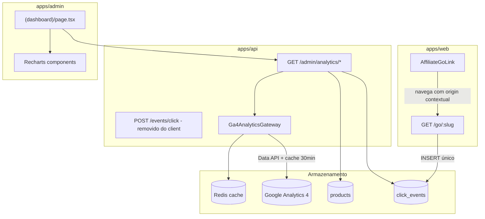
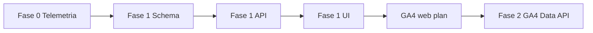

# Admin Dashboard Gold — Arquitetura e Plano de Implementação

## Estado atual (baseline)

| Área | Situação |
|------|----------|
| Telemetria write | [`click_events`](packages/infrastructure/src/persistence/drizzle/schema/index.ts) + `POST /events/click` + `GET /go/:slug` — **write-only** |
| Telemetria read | **Inexistente** — `ClickEventRepository` só tem `record()` |
| GA4 web | Plano em [`.cursor/plans/analytics_integration_ga4_bec34d62.plan.md`](.cursor/plans/analytics_integration_ga4_bec34d62.plan.md), **não implementado** |
| Admin dashboard | Placeholder em [`apps/admin/src/app/(dashboard)/page.tsx`](apps/admin/src/app/(dashboard)/page.tsx) com KPIs `—` |
| Charts | Sem `recharts` nem componentes de gráfico |

**Decisões confirmadas:**
- Faseado: Fase 1 = dados internos; Fase 2 = GA4 Data API
- Contagem: **1 evento por clique** — gravar origin contextual no `/go`; remover `recordClick` duplicado no client

**Ajuste de nomenclatura:** a spec menciona `click_logs`, mas o schema já usa `click_events`. **Não criar tabela nova** — estender `click_events` com colunas e índices adicionais.

**Marketplaces reais no MVP:** `amazon_br`, `shopee_br`, `mercadolivre_br` (sem Magalu no enum atual).

---

## Catálogo de métricas validado

### Pilar A — Conversão e catálogo (fonte: PostgreSQL)

| Métrica | Query base | Notas |
|---------|------------|-------|
| Total cliques de saída | `COUNT(*)` em `click_events` filtrado por período | Excluir `redirect_go` após fix |
| Top 10 produtos | `GROUP BY product_id` + JOIN `products` | Ordenar por `click_count DESC` |
| Distribuição por marketplace | `GROUP BY products.marketplace` via JOIN | Pie chart Recharts |

### Pilar B — Origem e atribuição (fonte: PostgreSQL + GA4 na Fase 2)

| Métrica | Fase 1 | Fase 2 |
|---------|--------|--------|
| Distribuição por ponto de inserção | % de cliques por `origin` (`listagem`, `detalhe`, `embed`, `coleção`, `similar`) | CTR real = cliques / impressões (GA4) |
| Top artigos conversores | `GROUP BY article_id` onde `origin = embed` | Cruzar com `article_view` GA4 |

**Gap crítico hoje:** `click_events` não tem `article_id`. Embeds em artigos disparam `origin=embed` sem saber qual artigo.

### Pilar C — Saúde operacional (fonte: PostgreSQL, tabela `products`)

| Métrica | SQL |
|---------|-----|
| Stale rate | `COUNT(stale_price = true OR price_updated_at < now() - 24h) / COUNT(*)` em produtos `visible = true` |
| Produtos esgotados | `COUNT(availability = 'out_of_stock')` em produtos visíveis |

Sem tabela nova — consulta direta com índice existente [`products_stale_price_idx`](packages/infrastructure/src/persistence/drizzle/schema/index.ts).

---

## Arquitetura híbrida de dados



**Princípio de performance:**
- Cliques: agregações SQL com índices (sem raw pageviews no PG)
- Pageviews/tráfego: GA4 Data API server-side, cache Redis 30 min
- Rollup diário (`click_daily_aggregates`) — **YAGNI até volume justificar**; adiar para fase pós-MVP se queries < 200ms

---

## Fase 0 — Higiene de telemetria (pré-requisito)

### 0.1 Fonte única de verdade no `/go`

Em [`apps/api/src/adapters/http/routes/index.ts`](apps/api/src/adapters/http/routes/index.ts) (linhas 88–94), hoje grava sempre `origin: 'redirect_go'`. Alterar para:

```typescript
origin: query.origin ?? 'redirect_go',
```

- Cliques via `AffiliateGoLink` → origin contextual (`listagem`, `detalhe`, `embed`, etc.)
- Wishlist/batch checkout direto em `/go` sem query → `redirect_go`

### 0.2 Remover `recordClick` duplicado no client

- [`AffiliateGoLink.tsx`](apps/web/src/components/product/AffiliateGoLink.tsx): remover chamada `recordClick()` no `handleClick`; manter apenas navegação para `/go`
- [`apps/web/src/lib/api/events.ts`](apps/web/src/lib/api/events.ts): manter função (usada por fluxos futuros) ou deprecar se sem call sites
- `POST /events/click` permanece para integrações server-side / testes

### 0.3 Propagar contexto de atribuição

| Mudança | Arquivos |
|---------|----------|
| `articleId` opcional no clique | schema + `RecordClickSchema` + `AffiliateGoLink` + `recordClick` chain |
| `articleId` nos embeds | [`ArticleBody.tsx`](apps/web/src/components/articles/ArticleBody.tsx) → `ArticleProductEmbed` → `ProductCard` → `AffiliateGoLink` |
| Origin `similar` para carrossel | Novo valor em `ClickOrigin` enum; [`ProductSimilarCarousel.tsx`](apps/web/src/components/product/ProductSimilarCarousel.tsx) usa `clickOrigin="similar"` em vez de `blockId="product-similar"` (string inválida para UUID no `GoQuerySchema`) |
| `blockId` no `/go` | Já funciona via query string; garantir UUIDs reais de `page_blocks` nos blocos CMS |

---

## Fase 1 — Schema, API e Dashboard interno

### 1.1 Migration Drizzle (`click_events` extendido)

Arquivo: nova migration em [`packages/infrastructure/src/persistence/drizzle/migrations/`](packages/infrastructure/src/persistence/drizzle/migrations/)

```sql
ALTER TABLE click_events
  ADD COLUMN article_id uuid REFERENCES content_articles(id) ON DELETE SET NULL;

CREATE INDEX click_events_occurred_at_idx ON click_events (occurred_at DESC);
CREATE INDEX click_events_product_occurred_idx ON click_events (product_id, occurred_at DESC);
CREATE INDEX click_events_origin_occurred_idx ON click_events (origin, occurred_at DESC);
CREATE INDEX click_events_article_id_idx ON click_events (article_id) WHERE article_id IS NOT NULL;
```

Atualizar [`schema/index.ts`](packages/infrastructure/src/persistence/drizzle/schema/index.ts) e [`docs/database-schema.md`](docs/database-schema.md).

Adicionar `ClickOrigin.SIMILAR = 'similar'` em [`packages/domain/src/enums/index.ts`](packages/domain/src/enums/index.ts).

### 1.2 Camada de leitura (Clean Architecture)

| Camada | Artefato |
|--------|----------|
| Port | `AnalyticsRepository` em `packages/domain` — métodos de agregação |
| Use cases | `GetClickAnalyticsOverview`, `GetTopClickedProducts`, `GetClicksByOrigin`, `GetClicksByMarketplace`, `GetConvertingArticles`, `GetCatalogHealthMetrics` |
| Infra | `DrizzleAnalyticsRepository` com queries Drizzle (`count`, `groupBy`, `sql`) |
| Shared | Zod response schemas em `packages/shared/src/admin/analytics-schemas.ts` |

**Regra de filtro universal nas queries de clique:**

```sql
WHERE occurred_at BETWEEN :from AND :to
  AND origin != 'redirect_go'  -- redundante após fix, mas defensivo
```

### 1.3 Endpoints admin (JWT obrigatório)

Novo arquivo [`apps/api/src/adapters/http/routes/admin-analytics-routes.ts`](apps/api/src/adapters/http/routes/admin-analytics-routes.ts), registrado em [`admin-routes.ts`](apps/api/src/adapters/http/routes/admin-routes.ts):

| Rota | Retorno |
|------|---------|
| `GET /admin/analytics/overview?from=&to=` | totalClicks, clicksTrend (por dia), catalogHealth (staleRate, outOfStockCount) |
| `GET /admin/analytics/clicks/by-origin?from=&to=` | `{ origin, count, sharePercent }[]` |
| `GET /admin/analytics/clicks/by-marketplace?from=&to=` | `{ marketplace, count, sharePercent }[]` |
| `GET /admin/analytics/clicks/top-products?from=&to=&limit=10` | `{ productId, slug, title, marketplace, clickCount }[]` |
| `GET /admin/analytics/articles/converting?from=&to=&limit=10` | `{ articleId, slug, title, clickCount }[]` |

Query params: `from`/`to` ISO date; default últimos 30 dias.

### 1.4 UI Admin — layout e componentes

**Dependência:** `recharts` em [`apps/admin/package.json`](apps/admin/package.json).

**Estrutura da página** [`apps/admin/src/app/(dashboard)/page.tsx`](apps/admin/src/app/(dashboard)/page.tsx):

```
┌─────────────────────────────────────────────────────┐
│ AdminPageHeader: "Painel" + seletor de período      │
├─────────────────────────────────────────────────────┤
│ Row 1: 4 KPI cards (cliques, stale %, OOS, artigos) │
├─────────────────────────────────────────────────────┤
│ Row 2: LineChart cliques/dia | PieChart marketplace│
├─────────────────────────────────────────────────────┤
│ Row 3: BarChart origem inserção | Tabela top 10 prod│
├─────────────────────────────────────────────────────┤
│ Row 4: Tabela top artigos conversores               │
└─────────────────────────────────────────────────────┘
```

**Novos componentes** em `apps/admin/src/components/analytics/`:

| Componente | Responsabilidade |
|------------|------------------|
| `DashboardKpiCard.tsx` | Extrair padrão de KPI do placeholder atual |
| `ClicksTrendChart.tsx` | `LineChart` Recharts |
| `MarketplacePieChart.tsx` | `PieChart` com labels pt-BR (Amazon, Shopee, Mercado Livre) |
| `OriginBarChart.tsx` | Barras horizontais por `origin` |
| `TopProductsTable.tsx` | Lista ranqueada com link para `/produtos/[slug]` |
| `ConvertingArticlesTable.tsx` | Lista com link para `/artigos/[id]` |
| `DateRangeSelect.tsx` | Presets 7d / 30d / 90d (client island mínimo) |

**Data fetching:** RSC server-side via `adminFetchParsed` + schemas Zod ([`admin-fetch.ts`](apps/admin/src/lib/api/admin-fetch.ts)). Gráficos client (`'use client'`) recebem props serializadas.

**Estilo:** reutilizar `AdminPageCard`, tokens CSS existentes em [`globals.css`](apps/admin/src/app/globals.css). Dashboard é exceção à regra de painéis flutuantes — layout de grid analítico, não CRUD.

**API client:** `apps/admin/src/lib/api/analytics.ts` com funções tipadas por endpoint.

---

## Fase 2 — GA4 Data API (após GA4 web)

**Dependência:** executar primeiro [`.cursor/plans/analytics_integration_ga4_bec34d62.plan.md`](.cursor/plans/analytics_integration_ga4_bec34d62.plan.md) para ter eventos `affiliate_click`, `view_item`, `article_view` no GA4.

### 2.1 Credenciais e env

Adicionar em [`.env.example`](.env.example):

```env
# GA4 Data API (apps/api — dashboard admin)
# GA4_PROPERTY_ID=123456789
# GA4_SERVICE_ACCOUNT_JSON={"type":"service_account",...}
```

Service account com role **Viewer** na propriedade GA4. Credencial **somente server-side** (nunca `NEXT_PUBLIC_`).

### 2.2 Gateway GA4

| Artefato | Detalhe |
|----------|---------|
| Port | `Ga4AnalyticsGateway` em `packages/domain` |
| Infra | `GoogleAnalyticsDataGateway` usando `@google-analytics/data` |
| Cache | Redis TTL 30 min por query key (`ga4:traffic:{from}:{to}`) |
| DI | Wire em [`api-container.ts`](packages/infrastructure/src/di/api-container.ts) |

**Métricas GA4 expostas no admin:**

| Métrica dashboard | GA4 query |
|-------------------|-----------|
| Pageviews por canal | `sessionDefaultChannelGroup` + `screenPageViews` |
| CTR por origem | `affiliate_click` count / `view_item` ou pageviews na página de detalhe |
| Artigos mais vistos | evento `article_view` agrupado por `article_slug` |

Novos endpoints (ou extensão de `/admin/analytics/overview`):

- `GET /admin/analytics/traffic/acquisition?from=&to=`
- `GET /admin/analytics/ctr/by-origin?from=&to=` (híbrido: cliques PG + views GA4)

UI: adicionar seção "Tráfego e Aquisição" no dashboard com `AreaChart` de pageviews e tabela de canais.

---

## Sequência de implementação



| Ordem | Entrega | Estimativa relativa |
|-------|---------|---------------------|
| 1 | Fix telemetria (Fase 0) | Pequena — 4–6 arquivos web + 1 rota API |
| 2 | Migration + enum `similar` + `article_id` | Pequena |
| 3 | Repository + use cases + rotas admin | Média |
| 4 | Dashboard UI + recharts | Média |
| 5 | GA4 web (plano existente) | Média |
| 6 | GA4 Data API + seção tráfego | Média |

---

## Testes e validação

| Cenário | Como validar |
|---------|--------------|
| Contagem única | 1 clique em CTA → exatamente 1 row em `click_events` com origin contextual |
| Atribuição artigo | Clique em embed de artigo → `article_id` preenchido |
| Stale rate | Seed com produto `stale_price=true` → KPI reflete % |
| API auth | `GET /admin/analytics/*` sem JWT → 401 |
| Dashboard vazio | Período sem cliques → gráficos com estado vazio (`AdminEmptyState`) |
| GA4 Fase 2 | Comparar totais admin vs painel GA4 Explorar (tolerância ~5%) |

---

## Documentação (ao concluir cada fase)

| Fase | Doc |
|------|-----|
| Fase 0–1 | Criar [`docs/admin-dashboard-phase1.md`](docs/admin-dashboard-phase1.md) — métricas, rotas, schema, como testar |
| Fase 2 | Estender doc + seção GA4 Data API; atualizar [`docs/ga4-analytics.md`](docs/ga4-analytics.md) (criado pelo plano GA4) |
| Índice | [`docs/README.md`](docs/README.md) + [`docs/dev-setup.md`](docs/dev-setup.md) (env vars GA4) |

---

## Fora de escopo deste plano

- Banner cookies / Consent Mode v2
- Tabela `click_logs` separada ou rollup worker
- Métricas de receita afiliada (Amazon Associates API — não disponível em tempo real)
- Dashboard em rota `/analytics` separada (permanece em `/`)
- Origens `comparador` e `cupons` (páginas ainda não existem no web)
