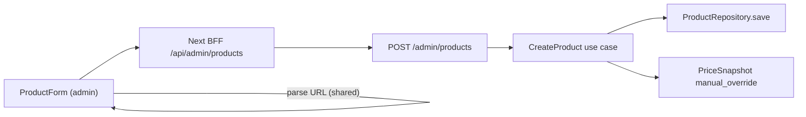

# Tela de Gestão de Produtos — Modo Híbrido Manual

## Contexto e decisões já alinhadas

| Decisão | Escolha |
|---------|---------|
| Marketplaces | Amazon + Shopee + **Mercado Livre** (migration + stub fetcher) |
| Escopo desta fase | **Listagem + criar** (sem edição) |
| `shouldShowPrice` | **Não criar coluna nova** — mapear ao modelo existente (`stale_price` invertido) |
| Editorial score | UI **0–10**; persistência **0–100** (seed usa `85`; badge em [`product-badges.ts`](apps/web/src/lib/product-badges.ts) exige `≥ 80` → UI `≥ 8,0`) |

O catálogo já tem entidade, tabela e `ProductRepository.save()` (upsert). O gap é operador-driven create + rotas admin; workers hoje só **atualizam** produtos existentes ([`SyncCatalogBatch`](packages/application/src/use-cases/sync/SyncCatalogBatch.ts) faz `continue` se não achar `externalId`).



---

## 1. Modelo e compliance de preço

**Switch "Exibir valor numérico na vitrine?"** traduz para o domínio existente:

- **Ligado** → `Price.create({ amount, currency: 'BRL', updatedAt: now, isStale: false })`
- **Desligado** → mesmo `amount` (opcional, para referência interna), mas `isStale: true` → `shouldShowPrice === false` → vitrine mostra ["Consultar preço atualizado"](apps/web/src/components/product/PriceDisplay.tsx) (já implementado)

Após salvar com preço visível, registrar snapshot inicial com `SnapshotSource.MANUAL_OVERRIDE` ([`UpdatePricesBatch`](packages/application/src/use-cases/sync/UpdatePricesBatch.ts) é referência).

O SLA 24h continua valendo em leitura pública via [`PriceComplianceService`](packages/domain/src/services/index.ts) — produto manual com preço visível expira sozinho após 24h (compliance afiliado preservado).

---

## 2. Mercado Livre (`mercadolivre_br`)

Adicionar marketplace em toda a cadeia (single migration `0006_mercadolivre_br.sql`):

| Camada | Arquivo |
|--------|---------|
| Enum | [`packages/domain/src/enums/index.ts`](packages/domain/src/enums/index.ts) |
| Parsers | [`packages/domain/src/enums/parsers.ts`](packages/domain/src/enums/parsers.ts) |
| Drizzle enum | [`packages/infrastructure/src/persistence/drizzle/schema/index.ts`](packages/infrastructure/src/persistence/drizzle/schema/index.ts) |
| Fetcher stub | novo `MercadoLivreFetcherStrategy` em [`marketplace-fetcher.strategy.ts`](packages/infrastructure/src/marketplace/strategies/marketplace-fetcher.strategy.ts) + registro no factory |
| Affiliate builder | [`default-affiliate-link.builder.ts`](packages/infrastructure/src/affiliate/default-affiliate-link.builder.ts) — URL base `https://produto.mercadolivre.com.br/MLB-{id}` (stub; tag ML via env futura `ML_AFFILIATE_TAG`) |
| Shared Zod | [`block-schemas.ts`](packages/shared/src/cms/block-schemas.ts) enums de marketplace |
| Web label | [`apps/web/src/lib/format.ts`](apps/web/src/lib/format.ts) → `'Mercado Livre'` |

---

## 3. Parser de URL (autocompreensão do link)

Novo módulo compartilhado **`packages/shared/src/marketplace/parse-product-url.ts`** (+ testes Vitest):

```typescript
export type ParsedProductUrl = {
  marketplace: 'amazon_br' | 'shopee_br' | 'mercadolivre_br';
  externalId: string;
};

export function parseMarketplaceProductUrl(rawUrl: string): ParsedProductUrl | null;
```

**Regex/padrões MVP:**

| Marketplace | Padrões |
|-------------|---------|
| Amazon BR | `/dp/([A-Z0-9]{10})`, `/gp/product/([A-Z0-9]{10})` |
| Shopee BR | `/product/\d+/(\d+)`, `-i\.(\d+)\.(\d+)` → externalId composto `{shopId}.{itemId}` |
| Mercado Livre | `(MLB-?\d+)` normalizado para `MLB123456789` |

- Usado no **frontend** em `handleAffiliateLinkChange` (UX imediata).
- Revalidado no **backend** em `CreateProduct` (não confiar só no client).
- Se URL não bater: marketplace manual (select editável) + `externalId` editável com validação obrigatória.

Utilitário auxiliar **`slugifyTitle(title: string): string`** em `packages/shared` (kebab-case, remove acentos) para gerar slug a partir de `titleClean`.

---

## 4. Backend — use case e API admin

### 4.1 Zod schemas (`packages/shared/src/admin/product-schemas.ts`)

Exportar via `@ecommerce-amazon/shared/admin`:

- `createProductBodySchema` — campos do formulário
- `adminProductListItemSchema` / `adminProductListResponseSchema`
- `createProductResponseSchema`

Campos do create (espelhando spec UX):

- `affiliateLink`, `marketplace`, `externalId`, `titleClean`, `slug?`, `images[]`, `editorialScore` (0–10 no body → converter ×10 no use case), `pros[]`, `cons[]`, `price`, `strikethroughPrice?`, `shouldShowPrice`, `availability`

### 4.2 Use case `CreateProduct`

Arquivo: `packages/application/src/use-cases/product/CreateProduct.ts`

Fluxo:

1. Parse/validar URL (shared) se `externalId` ausente
2. Verificar duplicata `findByExternalId` → `ValidationError` 409
3. Gerar slug (`slugifyTitle(titleClean)`) se omitido; checar `findBySlug` → sufixo `-2`, `-3`…
4. `titleRaw = titleClean` (manual mode; worker enriquece depois)
5. Montar `Product.create(...)` + `AffiliateLink.create(affiliateLink)`
6. `productRepository.save(product)`
7. Se `price` informado → `PriceSnapshot` com `MANUAL_OVERRIDE`
8. `cacheInvalidator.invalidateProducts([id])` (padrão worker)
9. Retornar DTO admin (slug, id)

**Sem enqueue worker nesta fase** — produto manual já nasce completo; quando PA-API liberar, estender `SyncCatalogBatch` para upsert (fase futura documentada).

### 4.3 Rotas Fastify

Novo arquivo [`apps/api/src/adapters/http/routes/admin-product-routes.ts`](apps/api/src/adapters/http/routes/admin-product-routes.ts), registrado em [`admin-routes.ts`](apps/api/src/adapters/http/routes/admin-routes.ts):

| Método | Rota | Use case |
|--------|------|----------|
| `GET` | `/admin/products` | `ListProducts` (existente) + presenter **admin** |
| `POST` | `/admin/products` | `CreateProduct` |

Presenter admin estendido em [`product.presenter.ts`](apps/api/src/adapters/presenters/product.presenter.ts):

- `AdminProductListItemDto`: inclui `externalId`, `affiliateLink`, `price.isStale`, `availability`, `editorialScore`, `createdAt`
- Diferente do DTO público (sem expor affiliate link na vitrine)

Wire DI em [`api-container.ts`](packages/infrastructure/src/di/api-container.ts).

---

## 5. Admin app — UI e integração

### 5.1 Infra de API (espelhar CMS)

```
apps/admin/src/lib/api/admin-products.ts          # server: adminFetchParsed
apps/admin/src/lib/api/admin-products-client.ts   # client: fetch /api/admin/products
apps/admin/src/app/api/admin/products/route.ts    # BFF GET + POST
```

### 5.2 Rotas de página

| Rota | Componente | Padrão |
|------|------------|--------|
| [`/produtos`](apps/admin/src/app/(dashboard)/produtos/page.tsx) | Substituir empty state | Copiar [`paginas/page.tsx`](apps/admin/src/app/(dashboard)/paginas/page.tsx): server fetch, toolbar, rows com marketplace badge, stale pill, score, botão "Novo produto" |
| `/produtos/novo` | `ProductForm` | Client form full-width em `AdminPageCard` |

Nav `/produtos` já existe em [`navigation.ts`](apps/admin/src/lib/navigation.ts).

### 5.3 Componentes

```
apps/admin/src/components/products/
├── ProductForm.tsx              # formulário principal (3 seções empilhadas)
├── ProductLinkSection.tsx       # URL + marketplace + externalId detectados
├── ProductEditorialSection.tsx  # title, images, score, pros/cons
├── ProductPriceSection.tsx      # strikethrough, price, availability, Switch
├── ProductImageList.tsx         # lista ordenável (up/down + remove)
└── parse-product-url.ts         # re-export de @ecommerce-amazon/shared (ou import direto)
```

**Form stack:** `react-hook-form` + **`zodResolver`** (desvio aceitável vs CMS — form CRUD standalone; `@hookform/resolvers` já instalado).

**Switch:** adicionar `apps/admin/src/components/ui/switch.tsx` (Radix `@radix-ui/react-switch`) — único primitive faltante pedido explicitamente na spec.

**Seções UX** (conforme prompt):

1. **Link & Origem** — input grande; ao colar, chama `parseMarketplaceProductUrl`; marketplace/externalId read-only por padrão, editáveis se detecção falhar
2. **Informações Editoriais** — `titleClean`, imagens múltiplas, slider/input 0–10 com hint "≥ 8,0 = Escolha editorial", listas dinâmicas pros/cons
3. **Preço & Disponibilidade** — strikethrough opcional, price BRL, Switch `shouldShowPrice`, select `in_stock` / `out_of_stock`

Submit → `POST /api/admin/products` → toast success → `router.push('/produtos')`.

### 5.4 CSS

Reutilizar tokens existentes (`cms-form-section-title`, `cms-shell`, `AdminPageCard`). Sem nova folha de estilo dedicada.

---

## 6. Testes

| Área | O quê |
|------|-------|
| `parse-product-url.test.ts` | Amazon dp/gp, Shopee product/i., ML MLB-* |
| `CreateProduct.test.ts` | duplicata externalId, slug collision, shouldShowPrice → stale, snapshot manual |
| Smoke manual | cadastrar produto ML + Amazon; listar; verificar vitrine pública |

---

## 7. Documentação

Criar [`docs/admin-products-phase1.md`](docs/admin-products-phase1.md):

- Modo híbrido manual vs worker futuro
- Mapeamento Switch ↔ `stale_price`
- Escala editorial 0–10 UI / 0–100 DB
- Endpoints admin novos
- Como testar (`dev:api` + `dev:admin`)

Atualizar [`docs/api-rest.md`](docs/api-rest.md) (seção admin products) e [`docs/domain-model.md`](docs/domain-model.md) (enum ML).

---

## 8. Fora de escopo (fase 2 explícita)

- `PATCH /admin/products/:slug` — edição
- Upload de imagem (só URLs por enquanto)
- `SyncCatalogBatch` upsert para produtos novos via API
- Campos SEO (`metaTitle`, `metaDescription`, `canonicalUrl`) no form
- Delete / soft-delete
- Busca full-text na listagem (filtro simples por marketplace ok se trivial)

---

## Ordem de implementação sugerida

1. Migration + enum ML + parser shared + testes
2. `CreateProduct` + schemas + admin routes + DI
3. BFF + `admin-products.ts` client/server
4. Switch UI + `ProductForm` + `/produtos/novo`
5. Listagem `/produtos` + labels web ML
6. Docs + lint/build nos pacotes alterados
