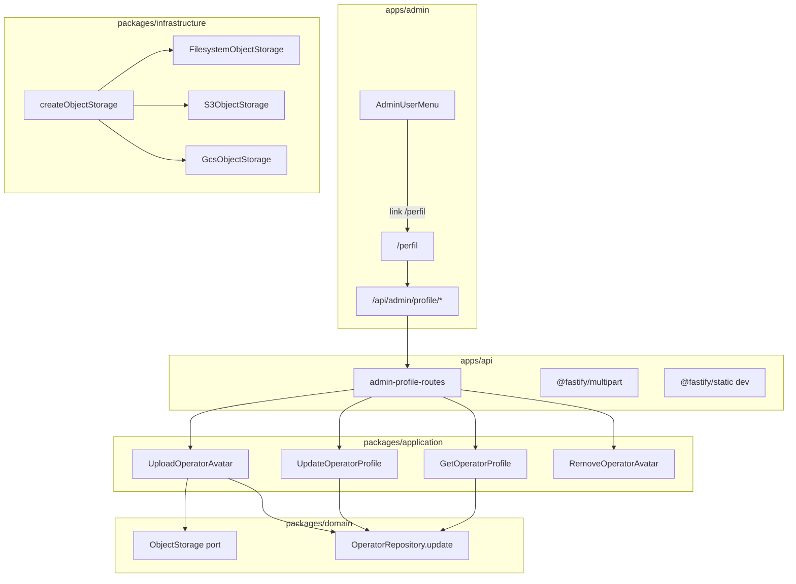

# Tela de edição de perfil do operador

## Contexto

- A entidade [`Operator`](packages/domain/src/entities/Operator.ts) já possui `name`, `avatarUrl`, `bio`, `role`, `status` — usados no author box público ([`ArticlePostFooter`](apps/web/src/components/articles/ArticlePostFooter.tsx)).
- O admin tem login/JWT e [`AdminUserMenu`](apps/admin/src/components/admin/AdminUserMenu.tsx) com **apenas logout**; `GET /admin/auth/me` existe mas retorna só `{ id, email, name }`.
- Não há upload nem storage no monorepo; imagens são URLs externas.
- Referência UX: [`profile_edit.php`](/home/josevalerio/Documents/php-app/src/views/admin/profile_edit.php) — layout 2 colunas (foto + formulário), upload de avatar **separado** do save de texto, recorte quadrado 512×512, link "Meu perfil" no dropdown.

**Campos desta entrega** (adaptados ao modelo `operators`, não ao php-app):

| Campo                          | Editável              |
| ------------------------------ | --------------------- |
| E-mail                         | Não (readonly)        |
| Nome                           | Sim                   |
| Bio (até 250 chars)            | Sim                   |
| Foto de perfil                 | Sim (upload separado) |
| Papel (`admin` / `editor`)     | Não (badge readonly)  |
| Status (`active` / `disabled`) | Não (badge readonly)  |

**Fora do escopo:** troca de senha, gestão de outros operadores, campos inexistentes no schema (telefone, cargo, setor).

---

## Arquitetura



---

## 1. Port de storage plugável (domain + infrastructure)

### Domain — [`packages/domain/src/ports/ObjectStorage.ts`](packages/domain/src/ports/ObjectStorage.ts)

Interface mínima (Strategy + Factory, conforme [02-clean-architecture](.cursor/rules/02-clean-architecture.mdc)):

```typescript
export type StoredObject = { key: string; publicUrl: string };

export interface ObjectStorage {
  put(params: { key: string; body: Buffer; contentType: string }): Promise<StoredObject>;
  delete(key: string): Promise<void>;
  isManagedUrl(url: string): boolean;
  extractKeyFromUrl(url: string): string | null;
}
```

Constante de prefixo: `admin-avatars/` com chave `admin-avatars/YYYY/MM/avatar-YYYYMMDD-HHMMSS-{hex32}.{ext}` (espelhando o padrão seguro do php-app).

### Infrastructure — [`packages/infrastructure/src/storage/`](packages/infrastructure/src/storage/)

| Arquivo                        | Driver                     | Comportamento                                                                                                                |
| ------------------------------ | -------------------------- | ---------------------------------------------------------------------------------------------------------------------------- |
| `object-storage.factory.ts`    | —                          | Lê `STORAGE_DRIVER` e instancia o adapter                                                                                    |
| `filesystem-object.storage.ts` | `filesystem` (default dev) | Grava em `STORAGE_LOCAL_ROOT`; URL pública via `STORAGE_PUBLIC_BASE_URL`                                                     |
| `s3-object.storage.ts`         | `s3`                       | `@aws-sdk/client-s3` — `PutObject` / `DeleteObject`; URL `https://{bucket}.s3.{region}.amazonaws.com/{key}` ou custom domain |
| `gcs-object.storage.ts`        | `gcs`                      | `@google-cloud/storage` — upload/delete; URL `https://storage.googleapis.com/{bucket}/{key}`                                 |

`isManagedUrl` valida domínio/base + regex do prefixo `admin-avatars/` — impede renderizar/deletar URLs externas (mesma ideia de [`AdminProfilePhotoUploadService::isManagedAvatarUrl`](file:///home/josevalerio/Documents/php-app/src/services/Admin/AdminProfilePhotoUploadService.php)).

### Env — [`packages/shared/src/index.ts`](packages/shared/src/index.ts) + [`.env.example`](.env.example)

```bash
STORAGE_DRIVER=filesystem          # filesystem | s3 | gcs
STORAGE_PUBLIC_BASE_URL=http://localhost:3000/uploads
STORAGE_LOCAL_ROOT=./uploads       # só filesystem

# S3
AWS_S3_BUCKET=
AWS_S3_REGION=us-east-1
AWS_ACCESS_KEY_ID=
AWS_SECRET_ACCESS_KEY=

# GCS
GCS_BUCKET=
GCS_PROJECT_ID=
# GOOGLE_APPLICATION_CREDENTIALS=/path/to/key.json
```

Trocar de driver = alterar env + reiniciar API; domain/application permanecem intactos.

### Servir arquivos em dev (filesystem)

Registrar `@fastify/static` em [`apps/api/src/main.ts`](apps/api/src/main.ts) apontando para `STORAGE_LOCAL_ROOT` com prefixo `/uploads` — apenas quando `STORAGE_DRIVER=filesystem`.

---

## 2. Backend — repositório, use cases e API

### Repository — estender [`OperatorRepository`](packages/domain/src/repositories/OperatorRepository.ts)

```typescript
updateProfile(id: string, data: { name: string; bio: string | null }): Promise<Operator>;
updateAvatarUrl(id: string, avatarUrl: string | null): Promise<Operator>;
```

Implementar em [`drizzle-operator.repository.ts`](packages/infrastructure/src/persistence/repositories/drizzle-operator.repository.ts).

### Use cases — `packages/application/src/use-cases/admin-profile/`

| Use case                | Responsabilidade                                                                                                                               |
| ----------------------- | ---------------------------------------------------------------------------------------------------------------------------------------------- |
| `GetOperatorProfile`    | Carrega operador por `request.adminOperator.id`; retorna DTO sem `passwordHash`                                                                |
| `UpdateOperatorProfile` | Valida `name` (1–120) e `bio` (≤250); persiste; **reemite JWT** com nome atualizado                                                            |
| `UploadOperatorAvatar`  | Valida MIME (jpeg/png/gif/webp) e tamanho (≤5 MiB); grava via `ObjectStorage`; remove avatar anterior se `isManagedUrl`; atualiza `avatar_url` |
| `RemoveOperatorAvatar`  | Deleta objeto gerenciado + zera `avatar_url`                                                                                                   |

Validação de imagem em helper puro `validateAvatarImage(buffer, mime)` (testável).

### Schemas — [`packages/shared/src/admin/profile-schemas.ts`](packages/shared/src/admin/profile-schemas.ts)

- `operatorProfileSchema` — resposta GET
- `updateOperatorProfileBodySchema` — PATCH body
- `uploadAvatarResponseSchema` — POST avatar response `{ avatarUrl }`
- `updateOperatorProfileResponseSchema` — PATCH response `{ operator, token }` (token para refresh do cookie)

### API routes — [`apps/api/src/adapters/http/routes/admin-profile-routes.ts`](apps/api/src/adapters/http/routes/admin-profile-routes.ts)

| Método | Rota                    | Body                                  |
| ------ | ----------------------- | ------------------------------------- |
| GET    | `/admin/profile`        | —                                     |
| PATCH  | `/admin/profile`        | JSON `{ name, bio }`                  |
| POST   | `/admin/profile/avatar` | `multipart/form-data`, campo `avatar` |
| DELETE | `/admin/profile/avatar` | —                                     |

- Registrar em [`admin-routes.ts`](apps/api/src/adapters/http/routes/admin-routes.ts).
- Adicionar `@fastify/multipart` com limite 5 MiB.
- DI em [`api-container.ts`](packages/infrastructure/src/di/api-container.ts): `objectStorage`, use cases de profile.

### Expandir `GET /admin/auth/me` (opcional, mínimo)

Incluir `avatarUrl` no payload para o header — ou buscar perfil no layout. **Recomendação:** layout do dashboard chama `GET /admin/profile` server-side e passa `avatarUrl` ao shell (evita inflar JWT).

---

## 3. Admin BFF (Next.js Route Handlers)

Criar em [`apps/admin/src/app/api/admin/profile/`](apps/admin/src/app/api/admin/profile/):

| Handler                       | Proxy para API          |
| ----------------------------- | ----------------------- |
| `route.ts` GET/PATCH          | `/admin/profile`        |
| `avatar/route.ts` POST/DELETE | `/admin/profile/avatar` |

- Novo helper [`admin-fetch-multipart.ts`](apps/admin/src/lib/api/admin-fetch-multipart.ts): repassa `FormData` sem `Content-Type` manual (boundary automático).
- Server module [`lib/api/profile.ts`](apps/admin/src/lib/api/profile.ts) + client [`profile-client.ts`](apps/admin/src/lib/api/profile-client.ts).
- **PATCH com nome alterado:** BFF atualiza cookie `vitrine_admin_token` com `token` retornado (mesmo padrão de [`login/route.ts`](apps/admin/src/app/api/auth/login/route.ts)).

---

## 4. UI — tela `/perfil`

### Rota — [`apps/admin/src/app/(dashboard)/perfil/page.tsx`](<apps/admin/src/app/(dashboard)/perfil/page.tsx>)

- Server Component: carrega perfil via `getOperatorProfile()`.
- `AdminPageHeader` com breadcrumbs: Painel → Meu perfil.

### Componentes — [`apps/admin/src/components/profile/`](apps/admin/src/components/profile/)

| Componente                    | Função                                                                                              |
| ----------------------------- | --------------------------------------------------------------------------------------------------- |
| `OperatorProfilePage.tsx`     | Layout 2 colunas inspirado no php-app                                                               |
| `ProfileAvatarPanel.tsx`      | Preview circular, file input, botões "Recortar e aplicar" / "Remover foto", status `aria-live`      |
| `ProfileAvatarCropDialog.tsx` | Modal com `react-easy-crop`; exporta canvas 512×512 JPEG 0.92                                       |
| `ProfileForm.tsx`             | `react-hook-form` + Zod: name, bio; blocos "Identificação", "Sobre", "Conta" (role/status readonly) |

### Layout visual (espelhando php-app, adaptado ao Tailwind do admin)

Adicionar classes em [`apps/admin/src/app/globals.css`](apps/admin/src/app/globals.css):

- `.admin-profile-layout` — shell único com borda/radius (como php-app `admin-profile-layout`)
- `.admin-profile-photo-column` — sticky em `lg+`
- `.admin-profile-form-column` — superfície branca com divisória
- `.admin-profile-block`, `.admin-profile-block-title` — seções com título uppercase muted
- `.admin-profile-avatar-ring` — anel 144px com preview/placeholder

A página usa `AdminPageCard` com override `cms-editor-section` desativado para este caso (padrão do php-app: card pai transparente, layout interno com borda).

### Fluxo de avatar (igual php-app)

1. Usuário escolhe arquivo → habilita "Recortar e aplicar"
2. Modal de crop quadrado → blob JPEG
3. `POST /api/admin/profile/avatar` via `FormData`
4. Sucesso → atualiza preview + `router.refresh()` (atualiza header)
5. Remover → `AlertDialog` de confirmação → `DELETE /api/admin/profile/avatar`

Dependência nova: `react-easy-crop` em [`apps/admin/package.json`](apps/admin/package.json).

---

## 5. Dropdown do usuário logado

Atualizar [`AdminUserMenu.tsx`](apps/admin/src/components/admin/AdminUserMenu.tsx):

```tsx
// Antes de "Sair":
<Link href="/perfil" role="menuitem" ...>
  <User /> Meu perfil
</Link>
<hr />
<button>Sair</button>
```

- Exibir foto real no pill quando `avatarUrl` for URL gerenciada (`isManagedUrl` replicado client-side via prefixo/base ou flag `isManagedAvatar` no DTO).
- Propagar `avatarUrl` pelo shell: [`layout.tsx`](<apps/admin/src/app/(dashboard)/layout.tsx>) → `AdminShell` → `AdminHeader` → `AdminUserMenu`.

---

## 6. Dependências npm

| Pacote                  | Onde                        |
| ----------------------- | --------------------------- |
| `@fastify/multipart`    | `apps/api`                  |
| `@fastify/static`       | `apps/api` (dev filesystem) |
| `@aws-sdk/client-s3`    | `packages/infrastructure`   |
| `@google-cloud/storage` | `packages/infrastructure`   |
| `react-easy-crop`       | `apps/admin`                |

---

## 7. Testes

| Alvo                                                         | Tipo                             |
| ------------------------------------------------------------ | -------------------------------- |
| `validateAvatarImage`                                        | unit (MIME, tamanho)             |
| `FilesystemObjectStorage.isManagedUrl` / `extractKeyFromUrl` | unit                             |
| `createObjectStorage` factory                                | unit (driver inválido, defaults) |
| `UpdateOperatorProfile`                                      | unit com repo mock               |

---

## 8. Documentação

Criar [`docs/admin-profile-phase1.md`](docs/admin-profile-phase1.md) com:

- Escopo (perfil próprio, storage plugável)
- Fluxo avatar + diagrama
- Rotas API/BFF
- Env vars de storage
- Como testar local (`STORAGE_DRIVER=filesystem`, upload, troca para s3/gcs)
- Próximos passos: troca de senha, gestão de operadores em `/configuracoes`

Atualizar [`docs/api-rest.md`](docs/api-rest.md), [`docs/README.md`](docs/README.md), [`AGENTS.md`](AGENTS.md).

---

## Ordem de implementação sugerida

1. Domain port + env + factory + adapters storage (filesystem funcional; S3/GCS wired)
2. Repository `update*` + use cases + schemas + API routes + static/multipart
3. BFF routes + refresh de cookie no PATCH
4. UI `/perfil` + CSS + crop dialog
5. Dropdown + avatar no header via layout
6. Testes + docs
