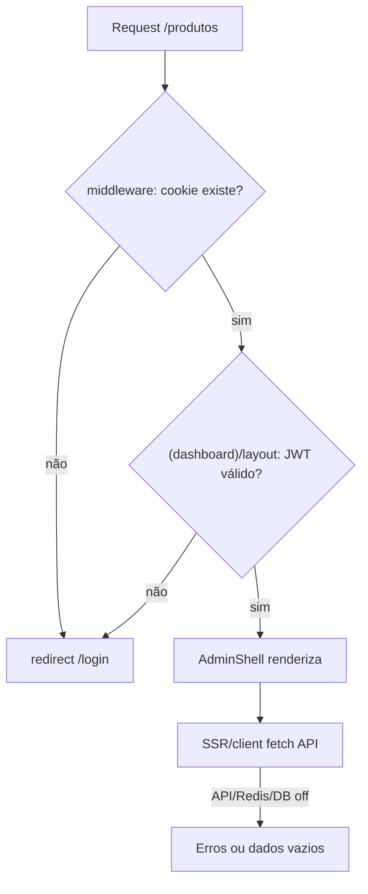
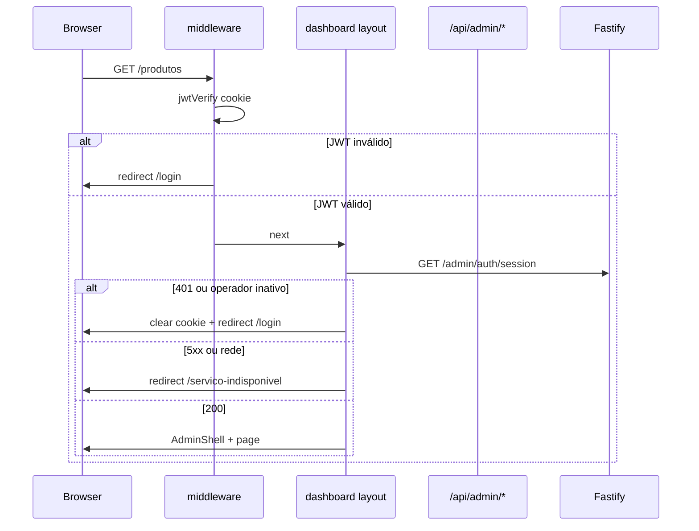

# Plano: Segurança do Admin + Pepper de Senha

## Diagnóstico (estado atual)

### O que você observou

Com Redis/Postgres off, a API emite `[ioredis] Unhandled error event: ECONNREFUSED` e o painel **permanece aberto** (shell com sidebar/header), porém sem dados.

### Interpretação correta do risco

Isso **não significa** que visitantes sem credenciais veem o CMS. O fluxo atual já bloqueia deslogados em duas camadas:



Arquivos-chave:

- [`apps/admin/src/middleware.ts`](apps/admin/src/middleware.ts) — só verifica **presença** do cookie, não assinatura JWT
- [`apps/admin/src/app/(dashboard)/layout.tsx`](apps/admin/src/app/(dashboard)/layout.tsx) — verifica JWT localmente com `jose` (`getSessionFromCookie`) e **sempre** renderiza o shell se o token for válido, mesmo com API off
- [`apps/admin/src/lib/auth/session.ts`](apps/admin/src/lib/auth/session.ts) — validação offline (sem DB)

**Cenário do bug percebido:** operador com JWT ainda válido (ex.: logou antes, containers caíram depois) → shell aparece sem dados. Não é bypass para anônimos, mas **expõe a estrutura do painel** e confunde auth com indisponibilidade (`/perfil` redireciona para login em qualquer erro de fetch).

### Lacunas de segurança identificadas

| Área | Severidade | Problema |
|------|------------|----------|
| Middleware | Média | Cookie arbitrário passa no edge; páginas são salvas pelo layout, mas `/api/admin/*` só exige cookie |
| Sessão stateless | Média | Logout só limpa cookie; JWT roubado vale até `exp`; operador **desativado** continua com acesso até expirar |
| Fail-open no layout | Média–Alta | JWT local válido → shell mesmo sem confirmação no backend (sua escolha: **fail-closed**) |
| `/perfil` | Baixa | `catch` genérico → `redirect('/login')` em falha de infra |
| Client fetch | Média | Dezenas de `fetch('/api/admin/...')` sem handler global de 401 → usuário fica no shell com toasts |
| Login | Média | Sem rate limit; `catch` no BFF retorna 400 genérico em falha de rede |
| API erros | Média | `handleAdminError` devolve `error.message` em 500 (pode vazar detalhes de Postgres) |
| Redis | Baixa (ops) | `createRedisClient` sem handler de `error` → spam de `Unhandled error event` |
| Senhas | Média | [`BcryptPasswordHasher`](packages/infrastructure/src/auth/bcrypt-password.hasher.ts) sem pepper; vazamento de DB facilita offline cracking |
| Health | Baixa | `/health` não verifica DB/Redis |

**Pontos positivos a preservar:** cookie `httpOnly` + `SameSite=Lax`, JWT verificado no layout, API valida Bearer em `/admin/*`, mensagem uniforme de login (sem enumeração de e-mail), bcrypt com salt por hash.

---

## Arquitetura alvo (fail-closed)



Decisão confirmada: **não renderizar `AdminShell`** quando a API não confirmar a sessão; página dedicada sem chrome do painel.

---

## Fase 1 — Confirmação de sessão no backend

### 1.1 Novo endpoint `GET /admin/auth/session`

Em [`apps/api/src/adapters/http/routes/admin-routes.ts`](apps/api/src/adapters/http/routes/admin-routes.ts):

- Após hook JWT, buscar operador por `request.adminOperator.id` via `OperatorRepository.findById`
- Retornar `200` com `{ id, email, name }` somente se `status === active`
- Retornar `401` se ausente ou desativado (mesmo código `UNAUTHORIZED`)
- Erros de DB → `503` com mensagem genérica (`Service temporarily unavailable`), **sem** `error.message` interno

Use case novo (Clean Architecture): `ValidateOperatorSession` em `packages/application/src/use-cases/admin-auth/`.

### 1.2 Fail-closed no layout do dashboard

Refatorar [`apps/admin/src/app/(dashboard)/layout.tsx`](apps/admin/src/app/(dashboard)/layout.tsx):

1. `getSessionFromCookie` (gate local rápido)
2. `confirmSessionWithApi()` — chama `GET /admin/auth/session` via `adminFetch` interno
3. Resultado:
   - **401** → `redirect('/login')` + limpar cookie (helper `clearSessionCookie()`)
   - **rede / 5xx / timeout** → `redirect('/servico-indisponivel')`
   - **200** → renderizar `AdminShell`

Extrair helper em [`apps/admin/src/lib/auth/session-guard.ts`](apps/admin/src/lib/auth/session-guard.ts) para reuso no middleware BFF.

### 1.3 Página `/servico-indisponivel`

- Rota pública em `(auth)` ou grupo novo **fora** de `(dashboard)`
- Adicionar `/servico-indisponivel` em `PUBLIC_PATHS` do middleware
- UI simples (card, sem sidebar): “Serviço temporariamente indisponível” + link para tentar novamente
- **Não** expor stack traces nem status HTTP

### 1.4 Corrigir `/perfil`

[`apps/admin/src/app/(dashboard)/perfil/page.tsx`](apps/admin/src/app/(dashboard)/perfil/page.tsx): remover `redirect('/login')` no `catch`; delegar confirmação de sessão ao layout; em erro de fetch usar banner/toast como outras páginas.

---

## Fase 2 — Endurecer gates no admin (Next.js)

### 2.1 Middleware com verificação JWT

Atualizar [`apps/admin/src/middleware.ts`](apps/admin/src/middleware.ts):

- Importar `verifySessionToken` de [`session.ts`](apps/admin/src/lib/auth/session.ts) (`jose` é compatível com Edge)
- Se cookie presente mas JWT inválido/expirado → limpar cookie + redirect `/login` (páginas) ou 401 (API)
- Manter lista pública: `/login`, `/api/auth/login`, `/api/auth/logout`, `/servico-indisponivel`

### 2.2 BFF: validar JWT antes de proxy

Em [`apps/admin/src/lib/api/admin-fetch.ts`](apps/admin/src/lib/api/admin-fetch.ts):

- Verificar token localmente antes de `fetch` à API
- Propagar status da API: **401** da API → lançar `UnauthorizedError` dedicado (não `Error` genérico)
- Rotas BFF mapeiam `UnauthorizedError` → 401 consistente

### 2.3 Cliente admin: redirect global em 401

Criar [`apps/admin/src/lib/api/admin-client.ts`](apps/admin/src/lib/api/admin-client.ts):

- Wrapper `adminClientFetch(path, init)` usado pelos `*-client.ts` e componentes client
- Em `401`: `POST /api/auth/logout` + `window.location.assign('/login?reason=session_expired')`
- Migrar gradualmente os ~15 call sites identificados (grep `fetch('/api/admin`)

### 2.4 Login BFF — erros de infra

[`apps/admin/src/app/api/auth/login/route.ts`](apps/admin/src/app/api/auth/login/route.ts):

- Distinguir: rede/timeout → **503** “Serviço indisponível”
- 401 da API → credenciais inválidas
- 400 → validação

### 2.5 SSR resiliente

Padronizar páginas que hoje **lançam** sem try/catch:

- [`colecoes/page.tsx`](apps/admin/src/app/(dashboard)/colecoes/page.tsx)
- [`artigos/page.tsx`](apps/admin/src/app/(dashboard)/artigos/page.tsx)
- Demais páginas SSR com `adminFetch` direto

Padrão: try/catch → estado vazio + mensagem (como [`page.tsx` dashboard](apps/admin/src/app/(dashboard)/page.tsx) com `apiUnavailable`).

Adicionar [`apps/admin/src/app/(dashboard)/error.tsx`](apps/admin/src/app/(dashboard)/error.tsx) com recovery UI (sem vazar detalhes).

### 2.6 Cookie maxAge alinhado ao JWT

Derivar `maxAge` do `JWT_EXPIRES_IN` (parser simples `8h` → segundos) em login route e profile re-issue — evitar drift entre cookie e `exp`.

---

## Fase 3 — API: infra, login e Redis

### 3.1 Handler de erro no Redis

Em [`packages/infrastructure/src/cache/redis-cache.store.ts`](packages/infrastructure/src/cache/redis-cache.store.ts) (`createRedisClient`):

```typescript
client.on('error', (err) => logger.warn({ err }, 'Redis connection error'));
```

Evita `Unhandled error event`; não altera auth path.

### 3.2 Rate limit no login

Novo middleware/hook em `POST /admin/auth/login`:

- Contador in-memory por IP (Map + TTL) no processo da API — suficiente para MVP, sem depender de Redis
- Ex.: 10 tentativas / 15 min → `429` com `Retry-After`
- Teste unitário do limiter

### 3.3 Erros sanitizados

Refinar `handleAdminError` em [`admin-routes.ts`](apps/api/src/adapters/http/routes/admin-routes.ts):

- Erros de conexão Postgres/Redis → `503` genérico
- Manter `401` para `AuthenticationError`
- Log estruturado server-side com detalhe; resposta HTTP sem stack/message interno

### 3.4 Health readiness (opcional, baixo custo)

Estender `/health` ou adicionar `/health/ready` com ping Postgres (`SELECT 1`). Admin pode usar para diagnóstico; **não** substitui confirmação de sessão.

---

## Fase 4 — Pepper no hash de senha

### 4.1 Implementação

Atualizar [`packages/infrastructure/src/auth/bcrypt-password.hasher.ts`](packages/infrastructure/src/auth/bcrypt-password.hasher.ts):

```typescript
constructor(private readonly pepper: string, private readonly rounds = 10) {
  if (!pepper || pepper.length < 16) throw new Error('PASSWORD_PEPPER must be at least 16 chars');
}
private applyPepper(plain: string): string {
  return `${this.pepper}${plain}`;
}
// hash/verify usam applyPepper(plain)
```

### 4.2 Env e wiring

| Arquivo | Mudança |
|---------|---------|
| [`packages/shared/src/index.ts`](packages/shared/src/index.ts) | `PASSWORD_PEPPER: z.string().min(16)` com default dev documentado |
| [`.env.example`](.env.example) | `PASSWORD_PEPPER=dev-pepper-change-in-production-min-16-chars` |
| [`packages/infrastructure/src/di/api-container.ts`](packages/infrastructure/src/di/api-container.ts) | `new BcryptPasswordHasher(env.PASSWORD_PEPPER)` |
| [`packages/infrastructure/src/persistence/drizzle/seed.ts`](packages/infrastructure/src/persistence/drizzle/seed.ts) | mesmo construtor com `loadEnv()` |

### 4.3 Migração de hashes existentes

- Pepper **invalida** hashes atuais no banco
- Dev: após deploy, rodar `npm run db:seed` (ou update manual do operador seed)
- Prod (quando houver operadores reais): script one-shot re-hash ou reset de senha
- Testes: [`AuthenticateOperator.test.ts`](packages/application/src/use-cases/admin-auth/AuthenticateOperator.test.ts) + novo teste do hasher com/sem pepper

**Nota:** pepper complementa bcrypt (salt embutido); não substitui `JWT_SECRET` nem rounds.

---

## Fase 5 — Documentação

Criar [`docs/admin-security.md`](docs/admin-security.md) com:

- Modelo de ameaças resumido (XSS, session hijack, brute force, DB leak)
- Fluxo fail-closed (diagrama)
- Env vars: `JWT_SECRET`, `PASSWORD_PEPPER`, `JWT_EXPIRES_IN`
- Como testar: containers off, cookie inválido, operador desativado
- Atualizar [`docs/admin-app-phase1.md`](docs/admin-app-phase1.md) (seção segurança + link)
- Atualizar [`docs/dev-setup.md`](docs/dev-setup.md) com `PASSWORD_PEPPER` e re-seed
- Indexar em [`docs/README.md`](docs/README.md) e [`AGENTS.md`](AGENTS.md)

---

## Matriz de testes manuais

| Cenário | Resultado esperado |
|---------|-------------------|
| Sem cookie → `/produtos` | Redirect `/login` |
| Cookie lixo | Middleware/layout → `/login` |
| JWT expirado | `/login` |
| JWT válido + API/DB off | `/servico-indisponivel` (sem shell) |
| JWT válido + operador `disabled` | Cookie limpo → `/login` |
| Login com API off | Toast 503, sem cookie |
| Client fetch após 401 | Logout automático → `/login` |
| Login >10x em 15min | HTTP 429 |
| Seed após pepper | Login com `ADMIN_SEED_PASSWORD` ok |

Comandos:

```bash
# Com pepper novo no .env
npm run db:seed
npm run dev:api & npm run dev:admin
# Parar docker compose db/redis e validar /servico-indisponivel
```

---

## Escopo fora desta entrega (registrar como próximos passos)

- Revogação de JWT (blacklist Redis) / refresh tokens
- Argon2id no lugar de bcryptjs
- RBAC por `OperatorRole` nas rotas
- CSRF token explícito (hoje mitigado por SameSite + same-origin BFF)
- Testes de integração E2E admin auth em `apps/api`
