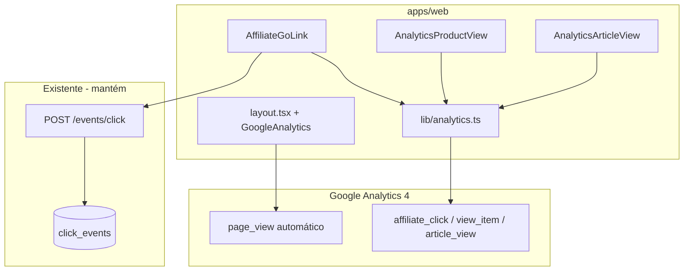

# Plano: Telemetria com Google Analytics 4 (GA4)

## Estado atual

- **Sem GA4/gtag** em [`apps/web`](apps/web) — nenhum script de terceiros, nenhuma dependência analytics.
- **Tracking first-party já existe** e **permanece** (GA4 é camada complementar, não substituto):
  - [`AffiliateGoLink.tsx`](apps/web/src/components/product/AffiliateGoLink.tsx) → `recordClick()` → `POST /events/click`
  - Redirect `/go/:slug` → `origin: redirect_go` no servidor
- **Ponto central de cliques:** `AffiliateGoLink` (usado por `ProductCardActions`, detalhe de produto, coleções, embeds).
- **Páginas de conversão alvo:** [`produtos/[slug]/page.tsx`](apps/web/src/app/produtos/[slug]/page.tsx) (RSC) e [`artigos/[slug]/page.tsx`](apps/web/src/app/artigos/[slug]/page.tsx) (RSC).
- **LGPD (decisão):** carregar GA4 sempre que `NEXT_PUBLIC_GA_MEASUREMENT_ID` estiver definido; banner/Consent Mode v2 fica fora desta entrega.



---

## 1. Variável de ambiente (`ga4-env-setup`)

Adicionar em [`.env.example`](.env.example) (raiz do monorepo — padrão atual do web):

```env
# Google Analytics 4 — vitrine (apps/web). Omitir em dev para desligar telemetria.
# NEXT_PUBLIC_GA_MEASUREMENT_ID=G-XXXXXXXXXX
```

- Documentar em [`docs/dev-setup.md`](docs/dev-setup.md) na tabela de variáveis.
- **Comportamento:** se a variável estiver ausente/vazia, todo o stack GA4 é no-op (dev local limpo).
- **Produção/Vercel:** definir `NEXT_PUBLIC_GA_MEASUREMENT_ID=G-...` no ambiente de deploy.

---

## 2. Injeção do script GA4 (`ga4-script-setup`)

**Abordagem recomendada:** pacote oficial [`@next/third-parties`](https://nextjs.org/docs/app/building-your-application/optimizing/third-party-libraries#google-analytics) (compatível com Next.js 15.3).

```bash
# em apps/web
npm install @next/third-parties
```

Criar componente fino [`apps/web/src/components/analytics/GoogleAnalyticsProvider.tsx`](apps/web/src/components/analytics/GoogleAnalyticsProvider.tsx):

```tsx
import { GoogleAnalytics } from '@next/third-parties/google';

const GA_ID = process.env.NEXT_PUBLIC_GA_MEASUREMENT_ID;

export function GoogleAnalyticsProvider() {
  if (!GA_ID) return null;
  return <GoogleAnalytics gaId={GA_ID} />;
}
```

Injetar em [`apps/web/src/app/layout.tsx`](apps/web/src/app/layout.tsx) **fora** de `<body>` (padrão Next.js):

```tsx
<html lang="pt-BR">
  <body>...</body>
  <GoogleAnalyticsProvider />
</html>
```

Isso habilita automaticamente `page_view` e atribuição de canal (SEO, direto, social) no painel GA4 — sem código extra.

---

## 3. Helper tipado de telemetria (`tracking-utility`)

Criar [`apps/web/src/lib/analytics.ts`](apps/web/src/lib/analytics.ts) com:

- Guard central: retorna cedo se `NEXT_PUBLIC_GA_MEASUREMENT_ID` ausente ou `window` indisponível (SSR).
- Uso de `sendGAEvent` de `@next/third-parties/google` (integra com o script injetado).
- Tipos explícitos para parâmetros (sem `any`).

**Eventos definidos:**

| Evento GA4 | Quando | Parâmetros principais |
|------------|--------|------------------------|
| `affiliate_click` (custom) | Clique em CTA de saída | `product_id`, `product_slug`, `marketplace`, `price_amount` (null se stale), `price_stale`, `click_origin`, `block_id?` |
| `view_item` (recomendado GA4) | Detalhe de produto montado | `currency: 'BRL'`, `value`, `items: [{ item_id, item_name, price, item_category? }]` |
| `article_view` (custom) | Artigo editorial montado | `article_slug`, `article_title`, `article_category?` |

**Mapeamento de `click_origin`** — reutilizar enum existente (`listagem | detalhe | embed | comparador | cupons | coleção`) para alinhar GA4 ao `click_events` interno.

**Regra de preço (compliance 24h):** quando `price_stale === true`, enviar `price_amount: null` e `price_stale: true` — espelha a UI que oculta valor numérico.

Funções exportadas (exemplo):

```typescript
export function trackAffiliateClick(params: AffiliateClickParams): void;
export function trackProductView(params: ProductViewParams): void;
export function trackArticleView(params: ArticleViewParams): void;
```

---

## 4. Cliques de afiliado — `AffiliateGoLink` (`event-binding-clicks`)

Estender [`AffiliateGoLink.tsx`](apps/web/src/components/product/AffiliateGoLink.tsx) com props opcionais de contexto para GA4:

```typescript
marketplace?: string;
priceAmount?: number | null;
priceStale?: boolean;
```

No `handleClick`, **após** `recordClick` (fire-and-forget, ordem não crítica):

```typescript
trackAffiliateClick({
  productId,
  productSlug: slug,
  marketplace,
  priceAmount: priceStale ? null : priceAmount ?? null,
  priceStale: priceStale ?? false,
  clickOrigin: origin,
  blockId,
});
```

**Propagar props nos call sites que já têm o produto:**

| Arquivo | Ação |
|---------|------|
| [`ProductCardActions.tsx`](apps/web/src/components/product/ProductCardActions.tsx) | Passar `product.marketplace`, `product.price.amount`, `product.price.isStale` |
| [`produtos/[slug]/page.tsx`](apps/web/src/app/produtos/[slug]/page.tsx) | Passar dados do `product` no CTA hero |
| [`CollectionProductCard.tsx`](apps/web/src/components/product/CollectionProductCard.tsx) | Passar dados do produto |

**Fora do escopo desta entrega (nota no doc):** [`WishlistDrawer.tsx`](apps/web/src/components/wishlist/WishlistDrawer.tsx) abre `/go` direto sem `AffiliateGoLink` — continua sem evento GA4 de origem contextual.

---

## 5. Visualizações de conversão (`event-binding-views`)

Como as páginas alvo são **Server Components**, criar trackers client-side mínimos (mount único via `useEffect` + ref de dedupe):

### [`apps/web/src/components/analytics/AnalyticsProductView.tsx`](apps/web/src/components/analytics/AnalyticsProductView.tsx)

Props: `productId`, `slug`, `title`, `marketplace`, `price`, `categoryLabel?`.

Dispara `trackProductView()` uma vez ao montar.

Inserir em [`produtos/[slug]/page.tsx`](apps/web/src/app/produtos/[slug]/page.tsx) dentro de `<main>`.

### [`apps/web/src/components/analytics/AnalyticsArticleView.tsx`](apps/web/src/components/analytics/AnalyticsArticleView.tsx)

Props: `slug`, `title`, `categoryName?`.

Dispara `trackArticleView()` uma vez ao montar.

Inserir em [`artigos/[slug]/page.tsx`](apps/web/src/app/artigos/[slug]/page.tsx) dentro de `<main>`.

**Não** rastrear listagens genéricas nesta fase — foco nas páginas de alta conversão descritas no PRD.

---

## 6. Como o admin usa os dados

Nenhuma alteração em `apps/admin` nesta entrega. O operador consulta:

- **Atribuição de tráfego:** GA4 → Relatórios → Aquisição (automático via `page_view`).
- **Produtos mais clicados:** GA4 → Explorar → evento `affiliate_click`, dimensões `product_slug`, `click_origin`, `block_id`.
- **Conteúdo que converte:** cruzar `article_view` com `affiliate_click` onde `click_origin = embed`.

O banco interno `click_events` continua disponível para dashboards futuros no admin.

---

## 7. Testes e validação

1. **Dev sem GA ID:** navegar vitrine — zero requests para `googletagmanager.com`.
2. **Dev/staging com GA ID:** abrir GA4 → Admin → DebugView; clicar CTAs e validar `affiliate_click` com parâmetros corretos.
3. **Produto stale:** confirmar `price_stale: true` e ausência de valor numérico no evento.
4. **Build:** `npm run build -w @ecommerce-amazon/web` e `npm run lint -w @ecommerce-amazon/web`.

---

## 8. Documentação (obrigatório ao concluir)

Criar [`docs/ga4-analytics.md`](docs/ga4-analytics.md) com:

- Escopo entregue vs. fora (Consent Mode, WishlistDrawer, dashboard admin)
- Eventos e parâmetros
- Env var e setup Vercel
- Como validar no DebugView
- Relação com `click_events` first-party

Atualizar [`docs/README.md`](docs/README.md) (índice) e [`docs/dev-setup.md`](docs/dev-setup.md).

---

## Arquivos principais

| Ação | Arquivo |
|------|---------|
| Criar | `apps/web/src/lib/analytics.ts` |
| Criar | `apps/web/src/components/analytics/GoogleAnalyticsProvider.tsx` |
| Criar | `apps/web/src/components/analytics/AnalyticsProductView.tsx` |
| Criar | `apps/web/src/components/analytics/AnalyticsArticleView.tsx` |
| Editar | `apps/web/src/app/layout.tsx` |
| Editar | `apps/web/src/components/product/AffiliateGoLink.tsx` |
| Editar | `apps/web/src/components/product/ProductCardActions.tsx` |
| Editar | `apps/web/src/components/product/CollectionProductCard.tsx` |
| Editar | `apps/web/src/app/produtos/[slug]/page.tsx` |
| Editar | `apps/web/src/app/artigos/[slug]/page.tsx` |
| Editar | `apps/web/package.json` (dep `@next/third-parties`) |
| Editar | `.env.example`, `docs/dev-setup.md`, `docs/README.md` |
| Criar | `docs/ga4-analytics.md` |

---

## Fora de escopo (próximas fases)

- Banner de cookies + Google Consent Mode v2 (LGPD)
- GA4 no `WishlistDrawer` (migrar para `AffiliateGoLink` ou helper compartilhado)
- Enviar `blockId` no `recordClick` client-side (gap pré-existente, independente do GA4)
- Dashboard de analytics dentro do admin
- Eventos em `/comparar/` e `/cupons/` (páginas ainda não existem no web)
