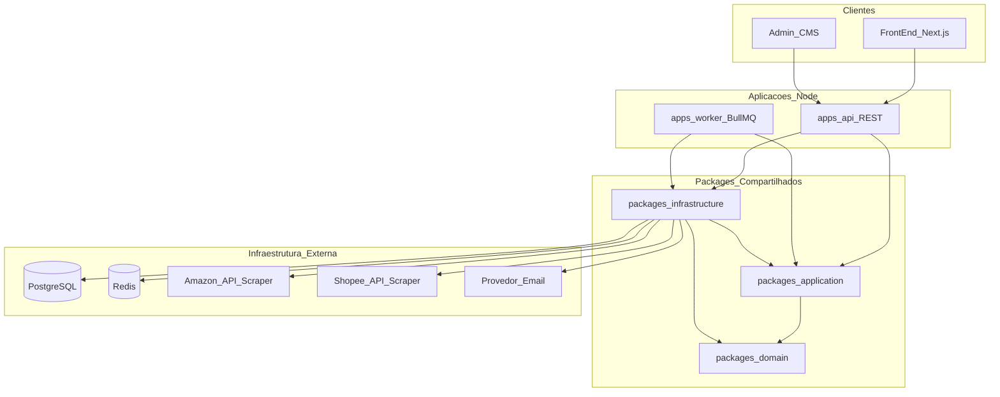
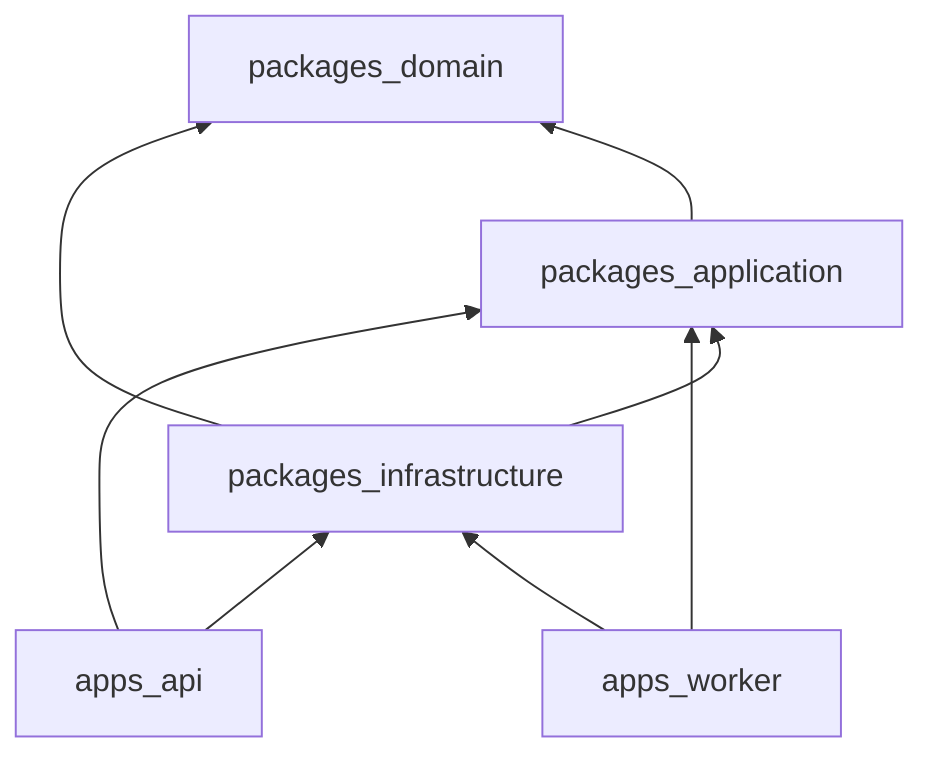
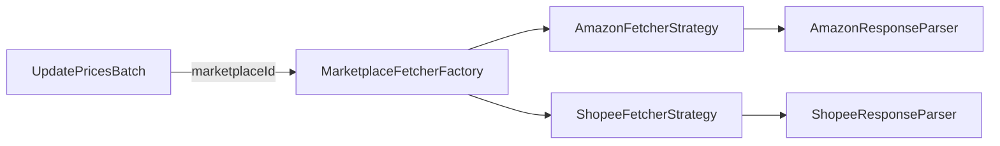
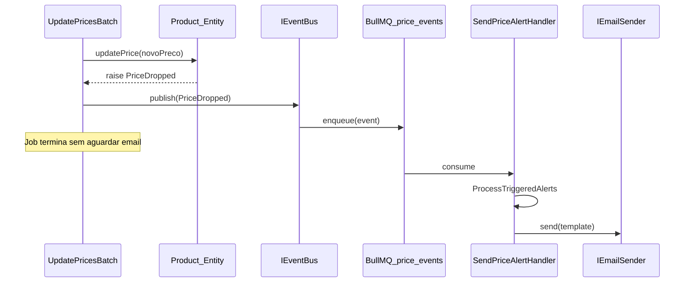
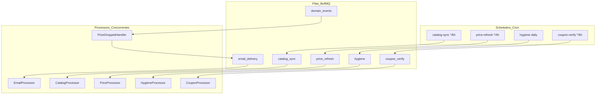
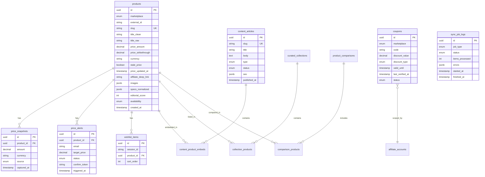
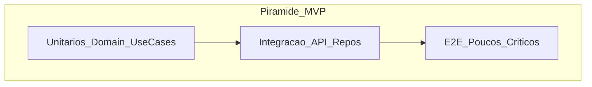

# Arquitetura Técnica — Vitrine Inteligente & Hub de Conteúdo (Node.js + TypeScript)

Documento de referência para implementação. Complementa:

- [PRD Core — Plataforma](prd_plataforma_afiliação_de44933f.plan.md)
- [PRD Growth — Aquisição de Tráfego](prd_growth_aquisicao_trafego.plan.md)

**Stack de referência (substituível via interfaces):** Node.js 20 LTS, TypeScript 5.x strict, Fastify (API REST), Drizzle ORM + PostgreSQL, Redis (cache + BullMQ), Zod, Vitest.

**Princípio rector:** dependências apontam sempre para dentro (Domain no centro). Nenhuma entidade de domínio importa Fastify, Drizzle, BullMQ ou nodemailer.

---

## Visão Macro do Sistema



**Dois processos Node independentes:**

- `apps/api` — serve REST ao front-end; **somente leitura** do catálogo local + escrita de alertas/wishlist/eventos.
- `apps/worker` — consome filas BullMQ; **único processo** autorizado a chamar APIs/scrapers externos.

---

## 1. Estrutura de Pastas e Camadas (Clean Architecture)

Monorepo com workspaces (pnpm/npm). Código compartilhado em `packages/`; deployáveis em `apps/`.

```
ecommerce-amazon/
├── apps/
│   ├── api/                          # Processo HTTP REST
│   │   ├── src/
│   │   │   ├── main.ts               # Bootstrap Fastify + DI container
│   │   │   ├── server.ts             # Registro de rotas e plugins
│   │   │   └── adapters/
│   │   │       ├── http/
│   │   │       │   ├── controllers/  # ProductController, AlertController...
│   │   │       │   ├── routes/       # Agrupamento de rotas por domínio
│   │   │       │   ├── middlewares/  # requestId, errorHandler, rateLimit
│   │   │       │   └── plugins/      # auth session, cors, swagger
│   │   │       ├── presenters/       # ProductPresenter, ArticlePresenter
│   │   │       ├── mappers/          # Entity → ResponseDTO
│   │   │       └── dtos/
│   │   │           ├── request/      # Schemas Zod de entrada
│   │   │           └── response/     # Tipos de saída da API
│   │   └── package.json
│   │
│   └── worker/                       # Processo background BullMQ
│       ├── src/
│       │   ├── main.ts               # Bootstrap workers + schedulers
│       │   ├── queues/               # Definição de filas e job names
│       │   ├── processors/           # Handlers por tipo de job
│       │   ├── schedulers/           # Cron repeatable jobs (BullMQ)
│       │   └── adapters/
│       │       └── event-handlers/   # PriceDropped → SendAlertEmail
│       └── package.json
│
├── packages/
│   ├── domain/                       # ★ Núcleo — zero dependências externas
│   │   └── src/
│   │       ├── entities/
│   │       │   ├── Product.ts
│   │       │   ├── PriceSnapshot.ts
│   │       │   ├── PriceAlert.ts
│   │       │   ├── WishlistItem.ts
│   │       │   ├── ContentArticle.ts
│   │       │   ├── Coupon.ts
│   │       │   └── ProductComparison.ts
│   │       ├── value-objects/
│   │       │   ├── Preco.ts          # amount + currency + stale flag
│   │       │   ├── MarketplaceId.ts  # amazon_br | shopee_br
│   │       │   ├── Slug.ts
│   │       │   ├── AffiliateLink.ts
│   │       │   └── Email.ts
│   │       ├── enums/
│   │       │   ├── Marketplace.ts
│   │       │   ├── ProductAvailability.ts
│   │       │   └── AlertStatus.ts
│   │       ├── events/               # Domain events (plain classes)
│   │       │   ├── PriceDropped.ts
│   │       │   ├── ProductPriceStale.ts
│   │       │   └── PriceAlertTriggered.ts
│   │       ├── services/             # Domain services (lógica pura multi-entidade)
│   │       │   ├── TitleHygieneService.ts
│   │       │   ├── PriceComplianceService.ts  # regra SLA 24h
│   │       │   └── ComparisonSpecMatcher.ts
│   │       ├── repositories/         # ★ Interfaces (ports) — sem implementação
│   │       │   ├── IProductRepository.ts
│   │       │   ├── IPriceSnapshotRepository.ts
│   │       │   ├── IPriceAlertRepository.ts
│   │       │   ├── IWishlistRepository.ts
│   │       │   ├── IContentRepository.ts
│   │       │   ├── ICouponRepository.ts
│   │       │   └── ISyncJobLogRepository.ts
│   │       ├── gateways/             # Interfaces para sistemas externos
│   │       │   ├── IMarketplaceFetcher.ts    # Strategy port
│   │       │   ├── IAffiliateLinkBuilder.ts
│   │       │   ├── IEmailSender.ts
│   │       │   ├── ICacheStore.ts
│   │       │   └── IEventBus.ts
│   │       └── errors/
│   │           ├── DomainError.ts
│   │           └── MarketplaceRateLimitError.ts
│   │
│   ├── application/                # Use Cases (orquestração)
│   │   └── src/
│   │       ├── use-cases/
│   │       │   ├── product/
│   │       │   │   ├── GetProductBySlug.ts
│   │       │   │   ├── ListProducts.ts
│   │       │   │   └── GetProductPriceHistory.ts
│   │       │   ├── sync/
│   │       │   │   ├── SyncCatalogBatch.ts
│   │       │   │   ├── UpdatePricesBatch.ts   # emite PriceDropped
│   │       │   │   ├── RunHygienePipeline.ts
│   │       │   │   └── VerifyCouponsBatch.ts
│   │       │   ├── alert/
│   │       │   │   ├── CreatePriceAlert.ts
│   │       │   │   ├── ConfirmPriceAlert.ts
│   │       │   │   └── ProcessTriggeredAlerts.ts
│   │       │   ├── wishlist/
│   │       │   │   ├── AddToWishlist.ts
│   │       │   │   └── BuildBatchCheckoutRedirect.ts
│   │       │   ├── content/
│   │       │   │   ├── GetArticleWithEmbeds.ts
│   │       │   │   └── GetCuratedCollection.ts
│   │       │   └── comparison/
│   │       │       ├── CreateComparison.ts
│   │       │       └── GetComparisonByToken.ts
│   │       ├── ports/                # Input/output boundaries
│   │       │   └── input/            # DTOs internos dos use cases
│   │       └── index.ts              # Barrel exports
│   │
│   ├── infrastructure/             # Implementações concretas (adapters)
│   │   └── src/
│   │       ├── persistence/
│   │       │   ├── drizzle/          # ou prisma/
│   │       │   │   ├── schema/       # Definição de tabelas
│   │       │   │   ├── migrations/
│   │       │   │   └── client.ts
│   │       │   ├── repositories/     # DrizzleProductRepository implements IProductRepository
│   │       │   └── mappers/          # DB row ↔ Entity
│   │       ├── cache/
│   │       │   └── RedisCacheStore.ts
│   │       ├── marketplace/
│   │       │   ├── MarketplaceFetcherFactory.ts
│   │       │   ├── strategies/
│   │       │   │   ├── AmazonFetcherStrategy.ts
│   │       │   │   └── ShopeeFetcherStrategy.ts
│   │       │   ├── parsers/
│   │       │   │   ├── AmazonResponseParser.ts
│   │       │   │   └── ShopeeResponseParser.ts
│   │       │   └── rate-limit/
│   │       │       └── MarketplaceRateLimiter.ts  # token bucket por origem
│   │       ├── affiliate/
│   │       │   ├── AmazonAffiliateLinkBuilder.ts
│   │       │   └── ShopeeAffiliateLinkBuilder.ts
│   │       ├── messaging/
│   │       │   ├── BullMQEventBus.ts
│   │       │   ├── queues.ts
│   │       │   └── jobs/             # Tipos de payload por job
│   │       ├── email/
│   │       │   └── ResendEmailSender.ts  # substituível
│   │       └── di/
│   │           ├── api-container.ts
│   │           └── worker-container.ts
│   │
│   └── shared/                     # Utilitários cross-cutting (sem regra de negócio)
│       └── src/
│           ├── logger/
│           ├── config/               # env validado com Zod
│           └── types/
│
├── package.json                      # workspaces root
├── tsconfig.base.json                # strict: true, paths aliases
├── turbo.json                        # opcional — build pipeline
└── docker-compose.yml                # postgres + redis local
```

### Regra de Dependência entre Camadas



| Camada                    | Pode importar               | Não pode importar                     |
| ------------------------- | --------------------------- | ------------------------------------- |
| **Domain**                | —                           | application, infrastructure, apps     |
| **Application**           | domain                      | infrastructure, fastify, drizzle      |
| **Infrastructure**        | domain, application (raro)  | apps                                  |
| **apps/api, apps/worker** | application, infrastructure | drizzle schema direto nos controllers |

### Fluxo de um Request REST (exemplo: `GET /products/:slug`)

1. **Controller** valida params com Zod → chama `GetProductBySlug.execute()`.
2. **Use Case** consulta `ICacheStore` → miss → `IProductRepository.findBySlug()`.
3. **Repository (infra)** query Drizzle → **Mapper** converte row → entidade `Product`.
4. **Use Case** aplica `PriceComplianceService` (domínio) → retorna entidade.
5. **Presenter/Mapper (api)** converte entidade → `ProductResponseDTO`.
6. **Controller** serializa JSON.

Nenhuma linha de SQL ou chave Redis aparece fora de `infrastructure/`.

---

## 2. Padrões de Projeto Aplicados

### 2.1 Repository Pattern

**Onde:** `packages/domain/repositories/*.ts` (interface) + `packages/infrastructure/persistence/repositories/*.ts` (implementação).

**Por quê:** Use cases como `UpdatePricesBatch` dependem de `IProductRepository` e `IPriceSnapshotRepository`, não de Drizzle. Trocar ORM = reimplementar adapters, zero mudança em domain/application.

```typescript
// domain — port
interface IProductRepository {
  findById(id: ProductId): Promise<Product | null>;
  findBySlug(slug: Slug): Promise<Product | null>;
  findDueForPriceRefresh(criteria: RefreshCriteria): Promise<Product[]>;
  save(product: Product): Promise<void>;
  saveBatch(products: Product[]): Promise<void>;
}

// infrastructure — adapter
class DrizzleProductRepository implements IProductRepository {
  constructor(
    private db: DrizzleClient,
    private mapper: ProductPersistenceMapper,
  ) {}
  // ...
}
```

**Granularidade MVP:** um repositório por agregado raiz (`Product`, `PriceAlert`, `ContentArticle`). `PriceSnapshot` pode ser sub-repositório ou métodos em `IProductRepository` — YAGNI: repositório separado apenas se queries de histórico ficarem complexas.

---

### 2.2 Factory + Strategy Pattern (Marketplaces)

**Desafio:** Amazon e Shopee têm endpoints, schemas de resposta, rate limits e parsers diferentes.

**Solução:** Strategy por marketplace + Factory que resolve em runtime.



```typescript
// domain/gateways — contrato unificado
interface MarketplaceFetchResult {
  externalId: string;
  rawTitle: string;
  price: Preco;
  availability: ProductAvailability;
  rating?: number;
  reviewCount?: number;
  imageUrls: string[];
}

interface IMarketplaceFetcher {
  readonly marketplace: Marketplace;
  fetchProduct(externalId: string): Promise<MarketplaceFetchResult>;
  fetchProductsBatch(externalIds: string[]): Promise<MarketplaceFetchResult[]>;
}

// infrastructure — factory
class MarketplaceFetcherFactory {
  constructor(private fetchers: Map<Marketplace, IMarketplaceFetcher>) {}
  get(marketplace: Marketplace): IMarketplaceFetcher {
    const fetcher = this.fetchers.get(marketplace);
    if (!fetcher) throw new UnsupportedMarketplaceError(marketplace);
    return fetcher;
  }
}
```

**Use Case `UpdatePricesBatch`:**

1. Agrupa produtos por `marketplace`.
2. Para cada grupo, obtém strategy via factory.
3. Chama `fetchProductsBatch` respeitando `MarketplaceRateLimiter`.
4. Parser normaliza resposta → value object `Preco`.
5. Persiste via repository; emite eventos de domínio.

**Extensão futura (YAGNI-safe):** adicionar `MercadoLivreFetcherStrategy` = registrar no Map da factory; domain/application intocados.

---

### 2.3 Observer / Event-Driven (Alertas de Preço)

**Desafio:** `UpdatePricesBatch` não deve chamar email inline — acoplaría notificação ao sync e bloquearia o job.

**Solução:** Domain Events + Event Bus assíncrono (BullMQ como transporte).



```typescript
// domain/events/PriceDropped.ts
class PriceDropped {
  constructor(
    readonly productId: string,
    readonly previousPrice: Preco,
    readonly newPrice: Preco,
    readonly occurredAt: Date,
  ) {}
}

// application/use-cases/sync/UpdatePricesBatch.ts
// após saveBatch:
for (const event of collectedEvents) {
  await this.eventBus.publish(event);
}

// infrastructure/messaging/BullMQEventBus.ts
class BullMQEventBus implements IEventBus {
  async publish(event: DomainEvent): Promise<void> {
    await this.priceEventsQueue.add(event.constructor.name, event);
  }
}

// apps/worker/adapters/event-handlers/SendPriceAlertHandler.ts
// escuta fila → chama ProcessTriggeredAlerts use case
```

**Regras de domínio no handler (via `ProcessTriggeredAlerts`):**

- Não disparar se `Preco.isStale === true`.
- Respeitar cooldown 24h por produto/email.
- Marcar alerta como `triggered` após envio.

**Substituibilidade:** trocar Resend por SendGrid = nova implementação de `IEmailSender`; event bus e use cases intactos.

---

### 2.4 Outros Padrões Complementares (aplicação cirúrgica)

| Padrão              | Onde                                                   | Justificativa                                                                   |
| ------------------- | ------------------------------------------------------ | ------------------------------------------------------------------------------- |
| **Mapper**          | infra/persistence/mappers, api/adapters/mappers        | Separa shape DB/HTTP do modelo de domínio (DRY nos converters)                  |
| **Presenter**       | api/adapters/presenters                                | Formata saída (ex: "Atualizado há 3h") sem poluir entidade                      |
| **Specification**   | domain/services/RefreshCriteria                        | Queries complexas ("produtos hot + stale") como objetos testáveis               |
| **Unit of Work**    | infra/persistence (transação Drizzle)                  | `saveBatch` produto + snapshot atômico                                          |
| **Template Method** | BaseSyncProcessor no worker                            | Fluxo comum fetch→parse→save→emit; subclasses por pipeline                      |
| **Decorator**       | CachedProductRepository wraps DrizzleProductRepository | Cache transparente opcional na composição DI (YAGNI: começar cache no use case) |

---

## 3. Arquitetura do Worker e Agendamento (Background Jobs)

### 3.1 Topologia de Filas BullMQ



### 3.2 Mapeamento PRD → Filas

| Pipeline PRD | Fila             | Scheduler                                 | Prioridade |
| ------------ | ---------------- | ----------------------------------------- | ---------- |
| A — Catálogo | `catalog_sync`   | `0 */6 * * *` + boost 2h wishlist/alerts  | normal     |
| B — Preços   | `price_refresh`  | `0 */4 * * *` hot / `0 */12 * * *` demais | **high**   |
| C — Higiene  | `hygiene`        | `0 2 * * *`                               | low        |
| D — Cupons   | `coupon_verify`  | `0 */6 * * *`                             | normal     |
| Eventos      | `domain_events`  | on-demand                                 | high       |
| Email        | `email_delivery` | on-demand                                 | normal     |

### 3.3 Batch Processing — Pipeline de Preços

**Orquestrador (`PriceRefreshScheduler`):**

1. Query `IProductRepository.findDueForPriceRefresh(criteria)` — retorna N produtos (ex: 500).
2. Particiona por `marketplace` → sub-batches de **10–20 ASINs** (limite API Amazon).
3. Enfileira job filho por batch: `{ marketplace, externalIds[], priority }`.
4. Job pai não faz I/O — evita bloquear scheduler.

**Processor (`PriceBatchProcessor`):**

```
1. Adquire token do MarketplaceRateLimiter (amazon: 1 req/s base)
2. fetchProductsBatch via Strategy
3. Para cada resultado:
   a. Product.updatePrice(Preco) — domain logic
   b. Coleta domain events
4. UnitOfWork: saveBatch(products) + insertSnapshots
5. publish events → domain_events queue
6. CacheInvalidator.invalidateProduct(ids)
7. Log SyncJobLog
```

**Proteção do Event Loop Node.js:**

- Jobs I/O-bound; **concurrency** por fila controlada (price: 3 workers; catalog: 2).
- Batch HTTP com `Promise.all` limitado por `p-limit` (max 5 concurrent requests **dentro** do batch).
- Operações CPU pesadas (similaridade de título, hygiene regex) → batches de 50, `setImmediate` entre batches ou worker thread só se profiling exigir (YAGNI no MVP).

### 3.4 Políticas de Retry e Rate Limit

```typescript
// Configuração conceitual por fila
const priceRefreshQueue = {
  defaultJobOptions: {
    attempts: 5,
    backoff: { type: 'exponential', delay: 30_000 }, // 30s, 60s, 120s...
    removeOnComplete: { count: 1000 },
    removeOnFail: { count: 5000 },
  },
};

// Erros tipados — decisão de retry
// MarketplaceRateLimitError → backoff longo (delay fixo 5min)
// NetworkTimeoutError → exponential backoff
// ProductNotFoundError → no retry, mark delisted
// ValidationError → no retry, log + dead letter
```

**Rate Limiter dedicado (`MarketplaceRateLimiter`):**

- Token bucket em Redis por marketplace (`rate:amazon`, `rate:shopee`).
- Worker consulta antes de cada batch; se vazio, job delayed +30s.
- Budget diário alinhado ao PRD Core §4.3 — contador `api_budget:amazon:2026-06-12` decrementado por request.

**Dead Letter / Stalled Jobs:**

- BullMQ `failed` event → persiste em `sync_job_logs` com payload.
- Alerta operacional se >10% jobs falharem em 1h.

### 3.5 Idempotência

- JobId determinístico: `price_refresh:{productId}:{dateHour}` evita duplicata no scheduler.
- Snapshots: unique constraint `(product_id, captured_at::date)` — upsert idempotente.
- Event handlers: `PriceAlertTriggered` verifica status `active` antes de enviar (idempotência de negócio).

---

## 4. Estratégia de Persistência e Cache (Data Layer)

### 4.1 Modelo Relacional (PostgreSQL)



**Índices críticos (performance MVP):**

- `products(slug)`, `products(marketplace, external_id)` UNIQUE
- `products(stale_price, price_updated_at)` — query compliance SLA
- `price_snapshots(product_id, captured_at DESC)`
- `price_alerts(product_id, status)` WHERE status = 'active'
- `content_articles(slug, status)` WHERE status = 'published'

### 4.2 Estratégia de Cache Redis (Read Path)

**Objetivo:** listagem vitrine <50ms p95; cache hit ratio >90% em produção estável.

| Chave                             | Conteúdo                            | TTL    | Invalidação                        |
| --------------------------------- | ----------------------------------- | ------ | ---------------------------------- |
| `vitrine:products:list:{hash}`    | JSON paginado de ProductListItemDTO | 5 min  | Produto qualquer do set atualizado |
| `vitrine:product:slug:{slug}`     | ProductDetailDTO completo           | 10 min | Update desse product_id            |
| `vitrine:product:id:{id}:history` | PriceHistoryDTO (30/90d)            | 1 h    | Novo snapshot                      |
| `vitrine:article:slug:{slug}`     | ArticleWithEmbedsDTO                | 15 min | Artigo ou embed product update     |
| `vitrine:coupons:active`          | Lista cupons verificados            | 30 min | Pipeline D                         |
| `vitrine:collection:slug:{slug}`  | CuratedCollectionDTO                | 10 min | Coleção ou produto membro          |

**Version stamp (invalidação eficiente):**

```
cache:version:product:{id}  →  incrementa a cada write
```

Chave de cache inclui versão: `vitrine:product:slug:chair-x:v42`. Worker após `saveBatch` executa `INCR cache:version:product:{id}` — leituras antigas expiram naturalmente (TTL) ou miss imediato se versão embedada no cache key lookup.

**Cache-aside no Use Case:**

```typescript
// ListProducts.ts — pseudocódigo
const cacheKey = buildListKey(filters);
const cached = await cache.get(cacheKey);
if (cached) return cached;

const products = await productRepo.findPublished(filters);
const dto = presenter.toListDTO(products);
await cache.set(cacheKey, dto, TTL_LIST);
return dto;
```

**Regra:** API **nunca** popula cache de write path exceto explicit warm-up pós-deploy. Invalidação primária via version increment no worker.

### 4.3 Redis — Dual Role

| Instância lógica | Uso                                 |
| ---------------- | ----------------------------------- |
| DB 0             | Cache de leitura (vitrine)          |
| DB 1             | BullMQ queues + rate limiter tokens |

Produção: preferir dois clusters Redis separados se carga crescer (substituição transparente via config).

---

## 5. Qualidade de Software e Tipagem Avançada

### 5.1 TypeScript — Configuração Strict

```json
// tsconfig.base.json — flags obrigatórias
{
  "compilerOptions": {
    "strict": true,
    "noUncheckedIndexedAccess": true,
    "exactOptionalPropertyTypes": true,
    "noImplicitOverride": true,
    "noPropertyAccessFromIndexSignature": true,
    "paths": {
      "@domain/*": ["packages/domain/src/*"],
      "@application/*": ["packages/application/src/*"],
      "@infrastructure/*": ["packages/infrastructure/src/*"]
    }
  }
}
```

### 5.2 Value Objects com Tipagem Forte (exemplo `Preco`)

```typescript
type Currency = 'BRL' | 'USD';

class Preco {
  private constructor(
    readonly amount: number,
    readonly currency: Currency,
    readonly updatedAt: Date,
    readonly isStale: boolean,
  ) {}

  static create(props: {
    amount: number;
    currency: Currency;
    updatedAt: Date;
    isStale?: boolean;
  }): Preco {
    if (props.amount < 0) throw new DomainError('Price cannot be negative');
    return new Preco(props.amount, props.currency, props.updatedAt, props.isStale ?? false);
  }

  droppedByPercent(other: Preco): number | null {
    if (this.currency !== other.currency) return null;
    return ((other.amount - this.amount) / other.amount) * 100;
  }

  meetsTarget(target: number): boolean {
    return !this.isStale && this.amount <= target;
  }
}
```

**Branded types para IDs:**

```typescript
type ProductId = string & { readonly __brand: 'ProductId' };
type Slug = string & { readonly __brand: 'Slug' };
```

### 5.3 Zod na Borda (Controllers)

Validação **somente** em adapters HTTP — domain recebe tipos já validados.

```typescript
// apps/api/adapters/dtos/request/create-price-alert.schema.ts
const CreatePriceAlertSchema = z.object({
  email: z.string().email(),
  productId: z.string().uuid(),
  targetPrice: z.number().positive(),
});
type CreatePriceAlertInput = z.infer<typeof CreatePriceAlertSchema>;

// Controller
const body = CreatePriceAlertSchema.parse(request.body);
await createPriceAlert.execute(body);
```

**Env config:** `packages/shared/config/env.ts` — `z.object({ DATABASE_URL, REDIS_URL, ... }).parse(process.env)` no bootstrap.

### 5.4 Utility Types e Generics — Uso Pragmático

```typescript
// Result type para use cases — evita throw em fluxo esperado
type Result<T, E = DomainError> = { ok: true; value: T } | { ok: false; error: E };

// Repository pagination
type Paginated<T> = {
  items: T[];
  total: number;
  page: number;
  pageSize: number;
};

// Generic mapper interface
interface Mapper<A, B> {
  toDomain(raw: A): B;
  toPersistence(entity: B): A;
}
```

Evitar generics excessivos (YAGNI); usar onde há padrão repetido (Mapper, Result, Paginated).

### 5.5 Estratégia de Testes (MVP)



| Camada           | Escopo                                          | Ferramenta                       | Exemplos                                                                           |
| ---------------- | ----------------------------------------------- | -------------------------------- | ---------------------------------------------------------------------------------- |
| **Unit**         | domain entities, value objects, domain services | Vitest                           | `Preco.meetsTarget`, `PriceComplianceService.isStale`, `TitleHygieneService.clean` |
| **Unit**         | use cases com repos mockados                    | Vitest + vi.fn                   | `UpdatePricesBatch` emite `PriceDropped`; `CreatePriceAlert` rejeita produto stale |
| **Integration**  | repositories reais                              | Vitest + Testcontainers PG/Redis | `DrizzleProductRepository.saveBatch` + snapshots                                   |
| **Integration**  | HTTP controllers                                | Vitest + Fastify inject          | `GET /products/:slug` 200; Zod 400 em payload inválido                             |
| **Integration**  | marketplace parsers                             | Vitest + fixtures JSON           | `AmazonResponseParser` normaliza fixture real                                      |
| **E2E (mínimo)** | fluxos críticos                                 | 1–2 testes                       | alerta criado → price drop simulado → email mock recebido                          |

**Coverage MVP target:** domain + application ≥85%; infrastructure repositories ≥70%; controllers happy path + validation errors.

**CI:** `turbo test` em PR — unit sem containers; integration com service containers.

### 5.6 Injeção de Dependências (Composition Root)

```typescript
// infrastructure/di/worker-container.ts — único lugar que conhece classes concretas
function buildWorkerContainer() {
  const db = createDrizzleClient(env.DATABASE_URL);
  const productRepo = new DrizzleProductRepository(db, productMapper);
  const fetcherFactory = new MarketplaceFetcherFactory(
    new Map([
      [Marketplace.AMAZON_BR, new AmazonFetcherStrategy(httpClient, parser, rateLimiter)],
      [Marketplace.SHOPEE_BR, new ShopeeFetcherStrategy(httpClient, parser, rateLimiter)],
    ]),
  );
  const eventBus = new BullMQEventBus(queues);
  const updatePricesBatch = new UpdatePricesBatch(
    productRepo,
    snapshotRepo,
    fetcherFactory,
    eventBus,
    cacheInvalidator,
  );
  return { updatePricesBatch /* ... */ };
}
```

Trocar Drizzle → Prisma: reescrever `persistence/` + container. Trocar BullMQ → SQS: reescrever `messaging/`. **Domain e Application permanecem.**

---

## 6. Contrato API REST (Referência Rápida)

Alinhado ao PRD Core §5 — implementação nos controllers:

| Método          | Rota                           | Use Case                                               |
| --------------- | ------------------------------ | ------------------------------------------------------ |
| GET             | `/products`                    | `ListProducts`                                         |
| GET             | `/products/:slug`              | `GetProductBySlug`                                     |
| GET             | `/products/:id/price-history`  | `GetProductPriceHistory`                               |
| POST            | `/price-alerts`                | `CreatePriceAlert`                                     |
| POST            | `/price-alerts/confirm/:token` | `ConfirmPriceAlert`                                    |
| GET/POST/DELETE | `/wishlist`                    | `GetWishlist` / `AddToWishlist` / `RemoveFromWishlist` |
| POST            | `/wishlist/checkout-batch`     | `BuildBatchCheckoutRedirect`                           |
| GET             | `/articles/:slug`              | `GetArticleWithEmbeds`                                 |
| GET             | `/collections/:slug`           | `GetCuratedCollection`                                 |
| GET             | `/coupons`                     | `ListActiveCoupons`                                    |
| GET/POST        | `/comparisons`                 | `GetComparisonByToken` / `CreateComparison`            |
| POST            | `/events/click`                | `RecordClickEvent`                                     |

Header de resposta cacheável: `Cache-Control: public, max-age=60` para listagens; `ETag` opcional fase 2.

---

## 7. Decisões de Substituição Futura (Portabilidade)

| Componente atual   | Interface                  | Alternativa                | Impacto                         |
| ------------------ | -------------------------- | -------------------------- | ------------------------------- |
| Drizzle ORM        | `I*Repository`             | Prisma, Kysely             | Só `infrastructure/persistence` |
| Fastify            | controllers adapters       | Hono, NestJS               | Só `apps/api/adapters`          |
| BullMQ             | `IEventBus` + queue config | SQS, RabbitMQ              | Só `infrastructure/messaging`   |
| Resend             | `IEmailSender`             | SendGrid, SES              | Só `infrastructure/email`       |
| Redis cache        | `ICacheStore`              | Memcached, in-memory (dev) | Só `infrastructure/cache`       |
| Amazon HTTP client | `IMarketplaceFetcher`      | Scraper headless           | Nova strategy, mesma interface  |

---

## 8. Critérios de Aceite Técnicos (MVP)

- [ ] Domain compila sem dependências de runtime externas.
- [ ] Request `GET /products` não executa HTTP externo (verificável por teste de integração com mock de fetch).
- [ ] Worker processa batch de 100 produtos sem exceder rate limit configurado.
- [ ] `UpdatePricesBatch` publica `PriceDropped` e handler envia email desacoplado.
- [ ] Produto com `price_updated_at` >24h recebe `stale_price=true` via `PriceComplianceService`.
- [ ] Cache invalidado após job de preço (version increment + miss confirmado).
- [ ] `strict: true` no CI sem erros; payloads inválidos retornam 400 com detalhe Zod.
- [ ] Coverage domain+application ≥85% no CI.

---

## 9. Ordem de Implementação Sugerida

1. `packages/domain` — entidades, VOs, interfaces.
2. `packages/infrastructure/persistence` — schema + migrations + repos.
3. `packages/application` — use cases de leitura (produtos, artigos).
4. `apps/api` — controllers + Zod + cache-aside.
5. `packages/infrastructure/marketplace` — strategies Amazon/Shopee.
6. `apps/worker` — fila price_refresh + UpdatePricesBatch.
7. Domain events + alertas + email.
8. Wishlist, comparador, cupons (filas adicionais).
9. Testes integração + hardening rate limit.
