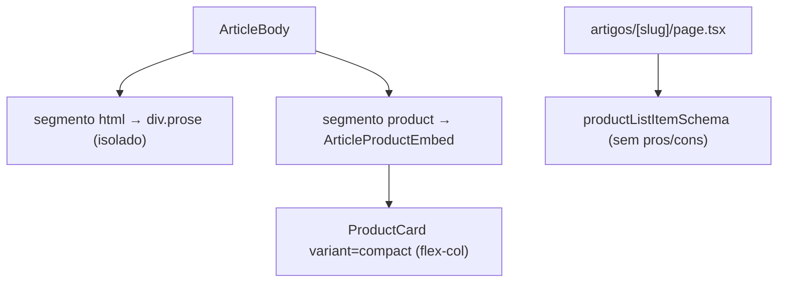
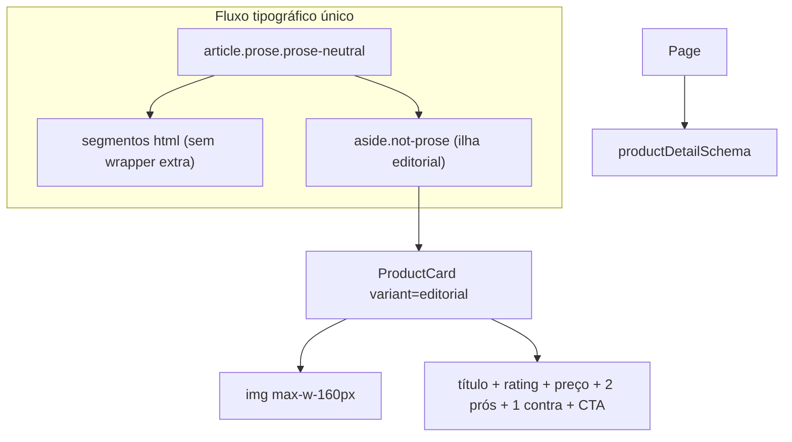

# Refatorar embed editorial de produto em artigos

## Diagnóstico atual



Problemas:
- [`ArticleBody.tsx`](apps/web/src/components/articles/ArticleBody.tsx) fragmenta o conteúdo em múltiplos `div.prose` + `space-y-6`, quebrando o fluxo tipográfico contínuo.
- [`ArticleProductEmbed.tsx`](apps/web/src/components/articles/ArticleProductEmbed.tsx) usa card vertical `compact`.
- [`artigos/[slug]/page.tsx`](apps/web/src/app/artigos/[slug]/page.tsx) busca produtos com `productListItemSchema`, mas a API `GET /products/:slug` já retorna `ProductDetailDto` com `pros`/`cons` ([`productDetailSchema`](apps/web/src/lib/api/schemas.ts)).

## Arquitetura alvo



---

## 1. Dados: buscar produto completo para embeds

**Arquivo:** [`apps/web/src/app/artigos/[slug]/page.tsx`](apps/web/src/app/artigos/[slug]/page.tsx)

- Trocar `productListItemSchema` por `productDetailSchema` em `getProductsBySlug`.
- Atualizar tipo `productsBySlug: Record<string, ProductDetailDto | null>`.
- Sem mudança de API — endpoint já entrega pros/cons.

---

## 2. `ArticleBody`: fluxo `prose` contínuo

**Arquivo:** [`apps/web/src/components/articles/ArticleBody.tsx`](apps/web/src/components/articles/ArticleBody.tsx)

- Remover wrapper `space-y-6` e múltiplos `div.prose`.
- Envolver segmentos em **um único** container:

```tsx
<article className="prose prose-neutral max-w-none">
  {segments.map(...)}
</article>
```

- Segmento `html`: renderizar com `dangerouslySetInnerHTML` em fragmento sem classe extra (o `prose` pai estiliza parágrafos, headings, listas).
- Segmento `product`: renderizar como ilha tipográfica:

```tsx
<aside className="not-prose my-8" aria-label="Produto recomendado">
  <ArticleProductEmbed ... />
</aside>
```

- `my-8` alinha ritmo vertical com espaçamento típico de blocos `prose`.

---

## 3. `ProductCard`: novo `variant="editorial"`

**Arquivo:** [`apps/web/src/components/product/ProductCard.tsx`](apps/web/src/components/product/ProductCard.tsx)

Estender union de variantes: `'default' | 'compact' | 'editorial'`.

Adicionar props opcionais (usadas só no editorial):

```typescript
pros?: string[];
cons?: string[];
```

**Layout editorial (horizontal):**
- Container: `flex flex-col gap-4 sm:flex-row sm:items-start` (mobile empilha; desktop inline).
- Imagem: `shrink-0 w-full max-w-[160px]`, `aspect-square`, `rounded-xl`.
- Coluna de conteúdo: título (link interno), `ProductRating`, `PriceDisplay`, listas, `ProductCardActions`.
- **Prós/contras:** novo subcomponente [`ProductEditorialProsCons.tsx`](apps/web/src/components/product/ProductEditorialProsCons.tsx):
  - Até **2 prós** + **1 contra** (decisão do usuário).
  - Listas semânticas `ul` com ícones Lucide (`Check` verde / `X` neutro).
  - Tipografia compacta (`text-sm`), sem herdar estilos conflitantes do `prose` pai.
  - Ocultar seção se arrays vazios.

Reutilizar componentes existentes: `MarketplaceBadge`, `ProductEditorialBadges`, `ProductCardActions`, wishlist — manter CTA conforme [`06-ux-conversion.mdc`](.cursor/rules/06-ux-conversion.mdc) (cenários A/B, preço stale).

Variantes `default` e `compact` permanecem inalteradas.

---

## 4. `ArticleProductEmbed`: delegar ao variant editorial

**Arquivo:** [`apps/web/src/components/articles/ArticleProductEmbed.tsx`](apps/web/src/components/articles/ArticleProductEmbed.tsx)

- Trocar `variant="compact"` por `variant="editorial"`.
- Passar `pros={product.pros}` e `cons={product.cons}`.
- Simplificar wrapper: card + disclaimer afiliado (`text-xs text-neutral-500 mt-2`) dentro do `aside.not-prose`.
- Estado fallback (produto ausente): manter bloco neutro, também com `not-prose`.

---

## 5. CSS / tipografia

- **Sem** alterar `@tailwindcss/typography` global.
- Padrão `not-prose` na ilha do embed evita que `prose` force `flex-col`, margens de `img` ou estilos de `ul` no card.
- Card editorial usa classes explícitas; listas de prós/contras ficam no subcomponente com controle total.

---

## 6. Documentação

Atualizar [`docs/articles-public-rendering.md`](docs/articles-public-rendering.md):
- Pipeline: `prose` único + `aside.not-prose` para embeds.
- `ProductCard variant="editorial"` com imagem `max-w-[160px]` e 2 prós + 1 contra.
- Fetch via `productDetailSchema`.

Mencionar em [`docs/README.md`](docs/README.md) se a seção de artigos referenciar o variant antigo.

---

## Checklist de validação manual

1. `/artigos/guia-cadeira-ergonomica` — texto flui como artigo contínuo (sem “blocos prose” separados).
2. Embed aparece horizontal no desktop, imagem ≤160px.
3. Prós/contras visíveis quando cadastrados no produto (máx. 2+1).
4. Preço stale → sem urgência; CTA transparente com nome do marketplace.
5. Mobile: layout empilha sem quebrar leitura.
6. `npm run build -w @ecommerce-amazon/web` limpo.

## Fora de escopo

- Novo endpoint ou alteração de presenter API.
- Syntax highlighting / rich embed além do card editorial.
- Mudança no admin editor ou contrato de shortcode.
