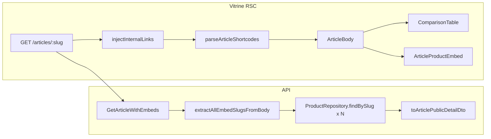

# Artigos: Tabelas Comparativas Dinâmicas

## Contexto atual

- Parser em [`packages/shared/src/content/article-shortcodes.ts`](packages/shared/src/content/article-shortcodes.ts) reconhece só `[[product:slug]]`.
- Vitrine em [`apps/web/src/app/artigos/[slug]/page.tsx`](apps/web/src/app/artigos/[slug]/page.tsx) extrai slugs e faz **N+1** `GET /products/:slug`.
- [`GetArticleWithEmbeds`](packages/application/src/use-cases/content/GetArticleWithEmbeds.ts) retorna artigo + metadados, **sem** produtos embutidos.
- Admin já tem picker de produto reutilizável: [`ProductSearchModal`](apps/admin/src/components/articles/ProductSearchModal.tsx) + [`listProductsClient`](apps/admin/src/lib/api/cms-pages-client.ts).
- `specs_normalized` já existe no domínio e chega ao front como `specs` em `ProductDetailDto` ([`toProductDetailDto`](apps/api/src/adapters/presenters/product.presenter.ts) mapeia `specsNormalized → specs`).
- Não há `Table` shadcn em `apps/web` — será criado manualmente (padrão leve como [`button.tsx`](apps/web/src/components/ui/button.tsx)).



---

## 1. Parser compartilhado (`packages/shared`)

Estender [`article-shortcodes.ts`](packages/shared/src/content/article-shortcodes.ts):

**Regex compare** (alinhada ao spec, slugs individuais validados em kebab-case após split):

```ts
/\[\[compare:([a-zA-Z0-9\-_,]+)\]\]/gi;
```

**Novo tipo de segmento:**

```ts
| { type: 'compare'; slugs: string[] }
```

**Funções:**

| Função                                   | Comportamento                                                   |
| ---------------------------------------- | --------------------------------------------------------------- |
| `parseCompareSlugs(raw: string)`         | Split por `,`, trim, filtra vazios, valida slug kebab-case      |
| `extractCompareSlugGroupsFromBody(html)` | Lista de grupos (para validação)                                |
| `extractAllEmbedSlugsFromBody(html)`     | União deduplicada de slugs de `product` + `compare`             |
| `parseArticleShortcodes(html)`           | **Single-pass** com regex combinada ordenada por índice no HTML |

**Regras de validação (render, não parse):**

- Comparativo válido: **2–3** slugs (regra MVP em [`07-growth-seo-content.mdc`](.cursor/rules/07-growth-seo-content.mdc)).
- Segmento inválido → placeholder amigável na vitrine (mesmo padrão de produto ausente em [`ArticleProductEmbed`](apps/web/src/components/articles/ArticleProductEmbed.tsx)).

**Testes:** estender [`article-shortcodes.test.ts`](packages/shared/src/content/article-shortcodes.test.ts) — ordem mista html/product/compare, slugs duplicados, compare com 2 e 3 produtos.

**Export:** atualizar [`packages/shared/src/content/index.ts`](packages/shared/src/content/index.ts).

---

## 2. API — resolver produtos em `GET /articles/:slug`

### 2.1 Schema público (`packages/shared`)

Adicionar em [`product-schemas.ts`](packages/shared/src/admin/product-schemas.ts) o contrato **`productPublicDetailSchema`** (espelho do [`productDetailSchema`](apps/web/src/lib/api/schemas.ts) da vitrine: preço, specs, pros/cons, images, rating, goUrl, etc.).

Estender [`articlePublicDetailSchema`](packages/shared/src/admin/article-schemas.ts):

```ts
embeddedProducts: z.record(z.string(), productPublicDetailSchema.nullable());
```

### 2.2 Use case

Alterar [`GetArticleWithEmbeds.ts`](packages/application/src/use-cases/content/GetArticleWithEmbeds.ts):

1. Injetar `ProductRepository` + `PriceComplianceService` (mesmo padrão de [`GetProductBySlug`](packages/application/src/use-cases/product/GetProductBySlug.ts)).
2. Após carregar artigo publicado: `extractAllEmbedSlugsFromBody(article.body)`.
3. `Promise.all(slugs.map(slug => productRepository.findBySlug(slug)))` — aplicar stale price por produto.
4. Montar `embeddedProducts: Record<string, Product | null>`.
5. **Bump cache key** para `vitrine:article:slug:v2:${slug}` (shape novo no Redis).

Wire DI em [`api-container.ts`](packages/infrastructure/src/di/api-container.ts).

### 2.3 Presenter

[`article.presenter.ts`](apps/api/src/adapters/presenters/article.presenter.ts): mapear `embeddedProducts` com `toProductDetailDto` (produto null permanece null).

### 2.4 Vitrine — consumir mapa único

[`page.tsx`](apps/web/src/app/artigos/[slug]/page.tsx):

- Remover `getProductsBySlug` e imports de fetch individual.
- Passar `article.embeddedProducts` para `ArticleBody`.
- Opcional: alinhar [`apps/web/src/lib/api/schemas.ts`](apps/web/src/lib/api/schemas.ts) para re-exportar `productPublicDetailSchema` do shared (DRY).

---

## 3. Componente `ComparisonTable` (`apps/web`)

### 3.1 UI base

Criar [`apps/web/src/components/ui/table.tsx`](apps/web/src/components/ui/table.tsx) — primitives shadcn (`Table`, `TableHeader`, `TableBody`, `TableRow`, `TableHead`, `TableCell`, `TableFooter`).

Criar [`apps/web/src/components/articles/ComparisonTable.tsx`](apps/web/src/components/articles/ComparisonTable.tsx):

**Props:** `products: (ProductDetailDto | null)[]` (ordem = ordem dos slugs no shortcode).

**Desktop (`md+`):** tabela shadcn com colunas = produtos.

| Linha          | Conteúdo                                                                                                                                                                                                                              |
| -------------- | ------------------------------------------------------------------------------------------------------------------------------------------------------------------------------------------------------------------------------------- |
| Cabeçalho      | Imagem quadrada pequena (`images[0]`), título (`line-clamp-2`), `PriceDisplay`                                                                                                                                                        |
| Badges         | Reutilizar [`resolveEditorialBadge`](apps/web/src/lib/product-badges.ts) + badges contextuais de comparação: **Melhor Geral** (maior `editorialScore`) e **Custo-Benefício** (menor preço não-stale); sem badges de urgência se stale |
| Specs          | União ordenada das chaves de `specs`; valor ou `-`; label humanizada (`peso_maximo` → "Peso maximo")                                                                                                                                  |
| Prós / Contras | Reutilizar [`ProductEditorialProsCons`](apps/web/src/components/product/ProductEditorialProsCons.tsx) por coluna (max 2 prós, 1 contra)                                                                                               |
| Avaliação      | [`ProductRating`](apps/web/src/components/product/ProductRating.tsx)                                                                                                                                                                  |
| Ações          | [`ProductCardActions`](apps/web/src/components/product/ProductCardActions.tsx) com `editorial` + `clickOrigin="embed"`; CTA "Ver preço na {marketplace}"                                                                              |

Wrapper: `aside.not-prose my-8` (mesmo padrão de embed editorial).

**Mobile (`< md`):** container `overflow-x-auto` + `flex flex-row gap-4`; cada produto = card coluna com `min-w-[240px]` replicando as mesmas seções empilhadas verticalmente.

**Estados de erro:**

- Menos de 2 ou mais de 3 slugs → mensagem explicativa.
- Produto null → coluna/card com aviso por slug (não quebrar tabela inteira).

### 3.2 Integração no corpo

[`ArticleBody.tsx`](apps/web/src/components/articles/ArticleBody.tsx):

```tsx
if (segment.type === 'compare') {
  const products = segment.slugs.map(slug => productsBySlug[slug] ?? null);
  return <aside ...><ComparisonTable products={products} slugs={segment.slugs} /></aside>;
}
```

Renomear prop `productsBySlug` → usar `embeddedProducts` do artigo.

---

## 4. Admin — helper de inserção

### 4.1 Modal multi-produto

Criar [`CompareInsertModal.tsx`](apps/admin/src/components/articles/CompareInsertModal.tsx):

- Reutiliza lista de [`listProductsClient`](apps/admin/src/lib/api/cms-pages-client.ts) (já carregada no editor).
- Seleção múltipla com checkbox/toggle; **mín. 2, máx. 3**.
- Botão **Gerar** → callback com array de slugs ordenados.

### 4.2 Editor TipTap (paridade com produto)

Criar [`CompareEmbedExtension.ts`](apps/admin/src/components/articles/extensions/CompareEmbedExtension.ts):

- Node `compareEmbed` atômico, preview visual ("Comparativo: slug-a, slug-b").
- `renderText` → `[[compare:slug-a,slug-b]]`.
- Atualizar [`preprocessBodyForEditor`](apps/admin/src/components/articles/extensions/ProductEmbedExtension.ts) / `serializeArticleBody` para round-trip do shortcode compare.

### 4.3 Toolbar

[`ArticleEditorToolbar.tsx`](apps/admin/src/components/articles/ArticleEditorToolbar.tsx): botão **Comparar** (ícone `Columns2` ou similar) ao lado de **Produto**.

[`ArticleEditor.tsx`](apps/admin/src/components/articles/ArticleEditor.tsx):

- Estado `compareModalOpen`.
- `insertCompare(slugs)`: inserir node TipTap ou, em modo HTML, inserir shortcode na posição do cursor (`textarea` selection).
- Hint em [`ArticleForm.tsx`](apps/admin/src/components/articles/ArticleForm.tsx): mencionar `[[compare:slug-1,slug-2]]`.

---

## 5. Documentação e verificação

| Arquivo                                                                  | Ação                                                            |
| ------------------------------------------------------------------------ | --------------------------------------------------------------- |
| [`docs/articles-public-rendering.md`](docs/articles-public-rendering.md) | Pipeline compare + `embeddedProducts`                           |
| [`docs/api-rest.md`](docs/api-rest.md)                                   | Campo `embeddedProducts` em `GET /articles/:slug`               |
| [`docs/README.md`](docs/README.md)                                       | Link se doc ficar separado (`articles-comparison-shortcode.md`) |

**Smoke manual:**

```bash
npm run dev -w @ecommerce-amazon/api
npm run dev -w @ecommerce-amazon/web
npm run dev -w @ecommerce-amazon/admin
```

1. Admin: inserir `[[compare:cadeira-ergonomica-home-office,headset-gamer-7-1]]` via modal.
2. Publicar artigo seed ou editar body do seed.
3. Vitrine: tabela desktop + scroll horizontal mobile; specs do seed (`material`, `conexao`); CTA afiliado; preço stale sem badge de urgência.
4. Confirmar que `[[product:]]` continua funcionando via `embeddedProducts` (sem N+1).

**Lint:** `npm run lint` nos pacotes alterados (`shared`, `application`, `api`, `web`, `admin`).

---

## Fora de escopo (MVP)

- Página standalone `/comparar/[slug]` (entidade `product_comparisons` já existe, mas é fluxo separado).
- TipTap slash command `/comparar` (só botão + modal).
- Badges customizados por operador ("Melhor Geral" manual) — derivação automática no render.
- Invalidação de cache de artigo no worker ao atualizar preço (TTL 15 min existente é aceitável).
