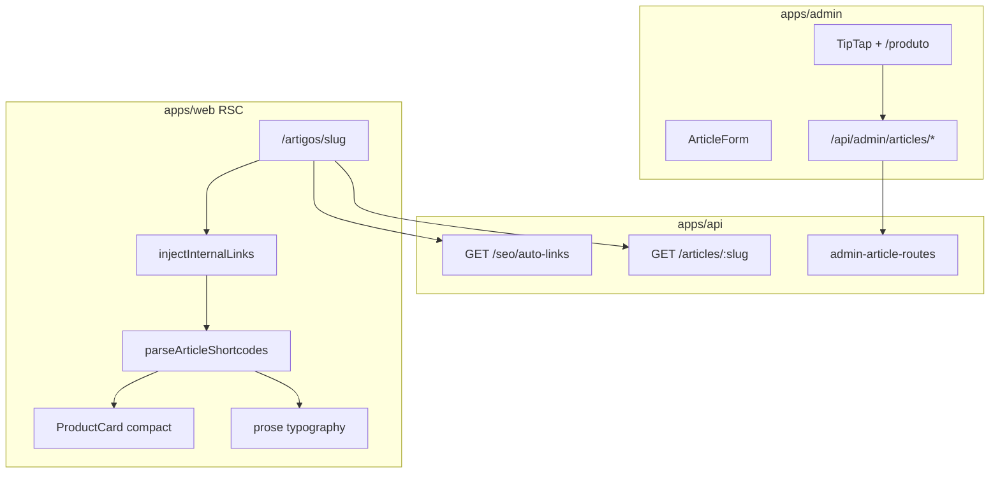

# Plano: Módulo de Artigos Editoriais

## Contexto e baseline

Grande parte da fundação **já existe** — não recriar do zero:

| Camada      | Já implementado                                                                                                                                 | Falta                                                          |
| ----------- | ----------------------------------------------------------------------------------------------------------------------------------------------- | -------------------------------------------------------------- |
| DB          | [`content_articles`](packages/infrastructure/src/persistence/drizzle/schema/index.ts), `content_product_embeds`, seed `guia-cadeira-ergonomica` | Colunas SEO/capa/autor/audit; tabela `auto_links`              |
| Domain      | [`ContentArticle`](packages/domain/src/entities/ContentArticle.ts), enums `ArticleType`/`ArticleStatus`                                         | Novos campos; métodos write no `ContentRepository`             |
| API pública | `GET /articles/:slug` → [`GetArticleWithEmbeds`](packages/application/src/use-cases/content/GetArticleWithEmbeds.ts)                            | Presenter/DTO; `GET /seo/auto-links`; remover auto-link da API |
| API admin   | `GET /admin/articles` (só published summaries)                                                                                                  | CRUD completo (`admin-article-routes.ts`)                      |
| Admin UI    | [`/artigos`](<apps/admin/src/app/(dashboard)/artigos/page.tsx>) placeholder; `ArticleIdPicker`                                                  | Listagem + formulário TipTap                                   |
| Web         | `ProductCard` compact; Bento links para `/artigos/{slug}`                                                                                       | Página `/artigos/[slug]`; typography plugin; parser shortcodes |

**Decisões confirmadas:**

- Shortcode: `[[product:slug]]` → `ProductCard` `variant="compact"`, `clickOrigin="embed"` (alinhado a [06-ux-conversion.mdc](.cursor/rules/06-ux-conversion.mdc))
- `auto_links`: infra + seed + `GET` público; **sem** CRUD admin nesta fase



---

## 1. Schema Drizzle + migration

**Arquivo:** [`packages/infrastructure/src/persistence/drizzle/schema/index.ts`](packages/infrastructure/src/persistence/drizzle/schema/index.ts)  
**Migration:** `0011_content_articles_enhanced.sql` + `0012_auto_links.sql`

### Evolução de `content_articles` (migration incremental, não drop)

Manter `body` como armazenamento do HTML TipTap (equivale ao `contentHtml` pedido). Adicionar:

| Coluna            | Tipo                       | Notas                                                    |
| ----------------- | -------------------------- | -------------------------------------------------------- |
| `excerpt`         | `text`                     | Resumo listagens/SEO                                     |
| `cover_image_url` | `varchar(255)`             | Banner; desbloqueia Bento slot1 sem override obrigatório |
| `author_id`       | `uuid` FK → `operators.id` | Preenchido server-side com `adminOperator.id`            |
| `seo_title`       | `text`                     | Migrar `seo.metaTitle` existente                         |
| `seo_description` | `text`                     | Migrar `seo.metaDescription` existente                   |
| `created_at`      | `timestamptz`              | `defaultNow()`                                           |
| `updated_at`      | `timestamptz`              | `defaultNow()` + trigger/app update                      |

**Manter:** `type` (`article_type`), `status`, `published_at`, `seo` jsonb (só `canonical` residual ou deprecar gradualmente).

**Seed:** atualizar artigo seed com `excerpt`, `cover_image_url`, shortcode `[[product:slug]]` no body, `author_id` do operator seed.

### Nova tabela `auto_links`

```typescript
autoLinks = pgTable('auto_links', {
  id: uuid PK,
  keyword: varchar(120).notNull(),
  targetUrl: varchar(255).notNull(),   // path interno ex: /categorias/home-office
  maxMatches: integer.notNull().default(1),
  priority: integer.notNull().default(0),  // ordem de aplicação
  isActive: boolean.notNull().default(true),
  createdAt, updatedAt,
});
```

Seed: migrar entradas de [`SEO_KEYWORD_MAP`](packages/shared/src/seo/keywords.ts) para `auto_links` (manter arquivo estático como fallback dev-only se tabela vazia).

---

## 2. Domain + Application + Infra

### Domain

- Estender [`ContentArticle`](packages/domain/src/entities/ContentArticle.ts): `excerpt`, `coverImageUrl`, `authorId`, `seoTitle`, `seoDescription`, `createdAt`, `updatedAt`
- Estender [`ContentRepository`](packages/domain/src/repositories/ContentRepository.ts):
  - `listAdminSummaries({ status? })` — todos os status para admin
  - `saveArticle(article)` — upsert artigo + sync embeds
  - `deleteArticle(id)`
- Novo port `AutoLinkRepository` + entidade `AutoLink` (keyword, targetUrl, maxMatches, priority, isActive)

### Infra

- [`drizzle-content.repository.ts`](packages/infrastructure/src/persistence/repositories/drizzle-content.repository.ts): implementar writes; ao salvar, **extrair shortcodes** `[[product:slug]]` do body, resolver slugs → IDs, regravar `content_product_embeds` (mantém compat com analytics/embeds legados)
- Novo `drizzle-auto-link.repository.ts`
- Atualizar `mapArticle()` em [`product.mapper.ts`](packages/infrastructure/src/persistence/mappers/product.mapper.ts)

### Use cases (novos em `packages/application/src/use-cases/`)

| Use case               | Responsabilidade                                                                        |
| ---------------------- | --------------------------------------------------------------------------------------- |
| `CreateArticle`        | draft; `authorId` do operador; slug único                                               |
| `UpdateArticle`        | body/SEO/status/capa; set `publishedAt` ao publicar                                     |
| `GetAdminArticle`      | artigo completo por `id`                                                                |
| `ListAdminArticles`    | substituir filtro published-only; suportar `?status=`                                   |
| `DeleteArticle`        | hard delete (cascade embeds)                                                            |
| `ListActiveAutoLinks`  | keywords ativas ordenadas por `priority`                                                |
| `GetArticleWithEmbeds` | **refatorar:** retornar body **sem** `injectInternalLinks`; incluir novos campos no DTO |

Invalidação cache: ao write admin, `DEL vitrine:article:slug:{slug}` + `DEL vitrine:seo:auto-links`.

---

## 3. Shared schemas + SEO engine

### Admin Zod — novo [`packages/shared/src/admin/article-schemas.ts`](packages/shared/src/admin/article-schemas.ts)

Espelhar padrão de [`collection-schemas.ts`](packages/shared/src/admin/collection-schemas.ts):

- `createArticleBodySchema` / `updateArticleBodySchema`
- `adminArticleDetailSchema` / `adminArticleSummarySchema`
- `articlePublicDetailSchema` (para vitrine)

### Shortcode parser — novo `packages/shared/src/content/article-shortcodes.ts`

```typescript
// Regex: /\[\[product:([a-z0-9]+(?:-[a-z0-9]+)*)\]\]/gi
export type ArticleContentSegment =
  | { type: 'html'; html: string }
  | { type: 'product'; slug: string };

export function parseArticleShortcodes(html: string): ArticleContentSegment[];
export function extractProductSlugsFromBody(html: string): string[];
```

### Auto-linking — evoluir [`link-parser.ts`](packages/shared/src/seo/link-parser.ts)

```typescript
export type SeoKeywordMap = {
  keyword: string;
  targetUrl: string;
  maxMatches?: number; // default 1
};

// Classes fixas conforme spec:
const LINK_CLASS = 'text-emerald-600 underline font-medium hover:text-emerald-700';
```

Algoritmo: split em segmentos `<a>`, para cada keyword aplicar até `maxMatches` ocorrências com word boundary (não só a primeira). Testes unitários em `link-parser.test.ts` e `article-shortcodes.test.ts`.

---

## 4. API REST

### Novo [`apps/api/src/adapters/http/routes/admin-article-routes.ts`](apps/api/src/adapters/http/routes/admin-article-routes.ts)

Espelhar [`admin-collection-routes.ts`](apps/api/src/adapters/http/routes/admin-collection-routes.ts):

```
GET    /admin/articles              → ListAdminArticles (todos status)
GET    /admin/articles/:id          → GetAdminArticle
POST   /admin/articles              → CreateArticle (201)
PATCH  /admin/articles/:id          → UpdateArticle (204)
DELETE /admin/articles/:id          → DeleteArticle (204)
```

- `authorId` **nunca** vem do body — setado em use case a partir de `request.adminOperator.id`
- Registrar em container DI + `admin-routes` hook JWT existente

### Rotas públicas

```
GET /seo/auto-links  → { items: [{ keyword, targetUrl, maxMatches }] }  // cache 1h
GET /articles/:slug  → presenter tipado (não mais domain raw)
```

Novo [`article.presenter.ts`](apps/api/src/adapters/presenters/article.presenter.ts): mapear `ContentArticle` → `ArticlePublicDetailDto` com `body` cru (sem links injetados).

### Bento Hub Mix

Relaxar `superRefine` em [`block-schemas.ts`](packages/shared/src/cms/block-schemas.ts): quando `contentType === 'article'`, `coverImageUrl` opcional se artigo tiver `cover_image_url` no DB (hidratação em `GetPublishedPageLayout` usa capa da entidade).

---

## 5. Admin — Editor TipTap + CRUD

### Dependências (`apps/admin/package.json`)

```
@tiptap/react @tiptap/pm @tiptap/starter-kit
@tiptap/extension-placeholder @tiptap/extension-link @tiptap/suggestion
```

**Escolha TipTap** (não Lexical): ecossistema maduro de Slash Commands via `Suggestion`, alinhado ao pedido `/produto`.

### Componentes novos

| Arquivo                                                   | Função                                                                                                                                      |
| --------------------------------------------------------- | ------------------------------------------------------------------------------------------------------------------------------------------- |
| `components/articles/ArticleListManager.tsx`              | Lista com status badge; painéis flutuantes ([11-admin-floating-panels.mdc](.cursor/rules/11-admin-floating-panels.mdc))                     |
| `components/articles/ArticleForm.tsx`                     | Campos metadados + editor                                                                                                                   |
| `components/articles/ArticleEditor.tsx`                   | TipTap wrapper                                                                                                                              |
| `components/articles/extensions/ProductEmbedExtension.ts` | Atom block; serializa `[[product:slug]]`; preview inline                                                                                    |
| `components/articles/ProductSearchModal.tsx`              | Dialog reutilizando padrão de busca de [`ProductIdPicker`](apps/admin/src/components/cms/props-forms/ProductIdPicker.tsx) (slug como valor) |

### Slash command `/produto`

1. Usuário digita `/produto` → abre `ProductSearchModal`
2. Seleciona produto → insere atom node com slug
3. `editor.getHTML()` persiste shortcodes no `body`

### Rotas admin

```
/artigos              → ArticleListManager (server fetch)
/artigos/novo         → ArticleForm create
/artigos/[id]         → ArticleForm edit (UUID, como coleções)
```

### BFF Next.js

Estender [`apps/admin/src/lib/api/articles.ts`](apps/admin/src/lib/api/articles.ts) + novo `articles-client.ts` + rotas:

- `app/api/admin/articles/route.ts` (GET + POST)
- `app/api/admin/articles/[id]/route.ts` (GET/PATCH/DELETE)

Form sections: Identidade (slug, title, type, status), Capa & resumo, SEO, Conteúdo (editor).

---

## 6. Vitrine — `/artigos/[slug]`

### Typography

Instalar `@tailwindcss/typography` em [`apps/web`](apps/web/package.json) e registrar em [`globals.css`](apps/web/src/app/globals.css) (`@plugin "@tailwindcss/typography"`).

### Nova rota [`apps/web/src/app/artigos/[slug]/page.tsx`](apps/web/src/app/artigos/[slug]/page.tsx)

Server Component (`revalidate = 300`):

1. `apiFetchParsed('/articles/{slug}', articlePublicDetailSchema)` — 404 se draft ou inexistente
2. `apiFetchParsed('/seo/auto-links', autoLinksSchema)` em paralelo
3. Passar para `<ArticleBody />`

### [`ArticleBody.tsx`](apps/web/src/components/articles/ArticleBody.tsx) (RSC)

Pipeline de renderização (ordem obrigatória):

```
rawBody
  → injectInternalLinks(body, autoLinks)   // antes da tipografia
  → parseArticleShortcodes(linkedHtml)
  → para cada segmento:
       html  → <div className="prose prose-neutral max-w-none" dangerouslySetInnerHTML />
       product → <ArticleProductEmbed slug={slug} />  // client wrapper
```

### [`ArticleProductEmbed.tsx`](apps/web/src/components/articles/ArticleProductEmbed.tsx) (`'use client'`)

- Fetch `GET /products/{slug}` (ou receber produto pré-buscado pelo RSC pai via `Promise.all` nos slugs extraídos — **preferir batch no RSC** para evitar waterfalls)
- Renderiza [`ProductCard`](apps/web/src/components/product/ProductCard.tsx) com `variant="compact"`, `clickOrigin="embed"`
- Disclaimer afiliado abaixo do card (regra compliance)

### Layout da página

- Hero: `coverImageUrl`, título, excerpt, data publicação
- `generateMetadata`: `seoTitle` / `seoDescription` / canonical
- JSON-LD `Article` (mínimo: headline, datePublished, author name via operador)
- Atualizar [`SiteHeader.tsx`](apps/web/src/components/layout/SiteHeader.tsx): link "Artigos" → `/artigos` (listagem pública fica **fora de escopo** desta fase; link pode apontar para hub futuro ou primeira página seed)

### Schemas web

Novo trecho em [`apps/web/src/lib/api/schemas.ts`](apps/web/src/lib/api/schemas.ts) para `articlePublicDetailSchema`.

---

## 7. Testes

| Arquivo                                                  | Cobertura                                        |
| -------------------------------------------------------- | ------------------------------------------------ |
| `packages/shared/src/seo/link-parser.test.ts`            | `maxMatches`, skip inside `<a>`, classes emerald |
| `packages/shared/src/content/article-shortcodes.test.ts` | parse múltiplos shortcodes, HTML entre eles      |
| `packages/application/.../CreateArticle.test.ts`         | slug conflict, authorId injection                |
| `packages/shared/src/admin/article-schemas.test.ts`      | validação Zod                                    |

---

## 8. Documentação

Criar [`docs/admin-articles-phase1.md`](docs/admin-articles-phase1.md) e [`docs/articles-public-rendering.md`](docs/articles-public-rendering.md); atualizar:

- [`docs/database-schema.md`](docs/database-schema.md) — novas colunas + `auto_links`
- [`docs/api-rest.md`](docs/api-rest.md) — rotas admin + `GET /seo/auto-links`
- [`docs/dev-setup.md`](docs/dev-setup.md) — deps TipTap se relevante
- [`docs/README.md`](docs/README.md) — índice

---

## Ordem de implementação sugerida

1. Migration + domain + repositories + shared schemas
2. Use cases + API (admin CRUD + auto-links + refactor article GET)
3. Admin UI (TipTap + forms + BFF)
4. Web page + parser + typography + ProductCard embeds
5. Testes + docs + ajuste Bento cover fallback

## Fora de escopo (próxima fase)

- `GET /articles` listagem pública hub
- CRUD admin de `auto_links`
- `contentJson` TipTap (JSON storage para round-trip avançado)
- Listagem `/artigos` index na vitrine
- Tags, FAQ blocks, schema avançado

## Riscos e mitigações

| Risco                                   | Mitigação                                                  |
| --------------------------------------- | ---------------------------------------------------------- |
| `prose` hoje sem plugin (inerte)        | Instalar typography antes da página                        |
| Double auto-linking (API + web)         | Remover de `GetArticleWithEmbeds`; só RSC                  |
| TipTap salva HTML inconsistente         | Atom node com serializer explícito para `[[product:slug]]` |
| Produto deletado referenciado no artigo | Render fallback: bloco "Produto indisponível" sem CTA      |
