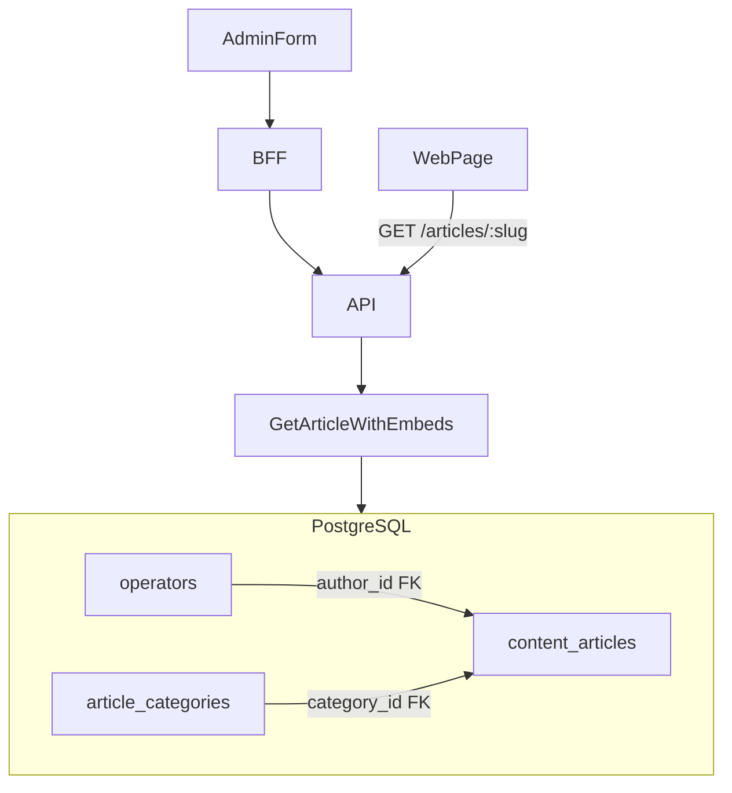

# Artigos: Categorias, Autores e Relacionados

## Contexto atual

| Área                  | Estado                                                                                                                                                                  |
| --------------------- | ----------------------------------------------------------------------------------------------------------------------------------------------------------------------- |
| `content_articles`    | `author_id` existe (FK SQL → `operators`); **sem** `category_id`                                                                                                        |
| `operators`           | Login CMS; colunas `email`, `name`, `status` — **sem** `avatar_url`, `bio`, `role`                                                                                      |
| Admin artigos         | Form completo; `authorId` já definido no `POST` via `request.adminOperator.id` ([`admin-article-routes.ts`](apps/api/src/adapters/http/routes/admin-article-routes.ts)) |
| Web `/artigos/[slug]` | `ArticleHero` com byline simples; **sem** author box nem relacionados                                                                                                   |
| API pública           | `articlePublicDetailSchema` expõe só `authorName` ([`article-schemas.ts`](packages/shared/src/admin/article-schemas.ts))                                                |

**Decisão confirmada:** estender `operators` (não renomear para `users`). **Tags** ficam fora desta entrega — apenas `article_categories`.



---

## 1. Schema Drizzle + Migration `0013`

**Novo arquivo:** [`packages/infrastructure/src/persistence/drizzle/schema/article-categories.ts`](packages/infrastructure/src/persistence/drizzle/schema/article-categories.ts)

```typescript
export const articleCategories = pgTable('article_categories', {
  id: uuid('id').primaryKey().defaultRandom(),
  name: varchar('name', { length: 120 }).notNull(),
  slug: varchar('slug', { length: 100 }).notNull().unique(),
  createdAt: timestamp('created_at', { withTimezone: true }).notNull().defaultNow(),
  updatedAt: timestamp('updated_at', { withTimezone: true }).notNull().defaultNow(),
});
```

**Migration:** `migrations/0013_article_taxonomy_authors.sql`

- `CREATE TABLE article_categories`
- `ALTER TABLE operators ADD COLUMN avatar_url text, bio varchar(250), role operator_role NOT NULL DEFAULT 'admin'`
- `CREATE TYPE operator_role AS ENUM ('admin', 'editor')`
- `ALTER TABLE content_articles ADD COLUMN category_id uuid REFERENCES article_categories(id) ON DELETE SET NULL`
- `ALTER TABLE content_articles ADD CONSTRAINT ... author_id → operators(id)` (alinhar Drizzle com SQL existente em 0011)

**Atualizar** [`schema/index.ts`](packages/infrastructure/src/persistence/drizzle/schema/index.ts):

- Importar `articleCategories`; adicionar `categoryId` em `contentArticles` com `.references()`
- Adicionar `operatorRoleEnum` + colunas `avatarUrl`, `bio`, `role` em `operators`
- Declarar `.references(() => operators.id)` em `authorId`

**Seed** ([`seed.ts`](packages/infrastructure/src/persistence/drizzle/seed.ts)):

- 2–3 `article_categories` (ex.: `guias`, `reviews`, `comparativos`)
- Seed operator com `avatarUrl`, `bio`, `role: 'admin'`
- Artigo seed com `categoryId` vinculado

---

## 2. Domain + Application

### Novas entidades e ports

| Artefato                         | Path                                                                            |
| -------------------------------- | ------------------------------------------------------------------------------- |
| `ArticleCategory` entity         | `packages/domain/src/entities/ArticleCategory.ts`                               |
| `OperatorRole` enum              | `packages/domain/src/enums/index.ts`                                            |
| `ArticleCategoryRepository` port | `packages/domain/src/repositories/ArticleCategoryRepository.ts`                 |
| Estender `Operator`              | `packages/domain/src/entities/Operator.ts` — `avatarUrl`, `bio`, `role`         |
| Estender `ContentArticle`        | `packages/domain/src/entities/ContentArticle.ts` — `categoryId: string \| null` |

### Repositórios (infra)

- [`drizzle-article-category.repository.ts`](packages/infrastructure/src/persistence/repositories/drizzle-article-category.repository.ts) — `listAll`, `findById`, `findBySlug`, `save`, `delete`, `slugExists`
- Atualizar [`drizzle-operator.repository.ts`](packages/infrastructure/src/persistence/repositories/drizzle-operator.repository.ts) — mapear novos campos
- Atualizar [`drizzle-content.repository.ts`](packages/infrastructure/src/persistence/repositories/drizzle-content.repository.ts) + [`product.mapper.ts`](packages/infrastructure/src/persistence/mappers/product.mapper.ts) — `categoryId` + novo método:

```typescript
findRelatedPublishedByCategory(
  categoryId: string,
  excludeArticleId: string,
  limit: number,
): Promise<ArticlePublicSummary[]>
```

Query: `status = published`, `category_id = ?`, `id != ?`, `ORDER BY published_at DESC`, `LIMIT 3`.

### Use cases novos

| Use case                                                                    | Responsabilidade                                                                     |
| --------------------------------------------------------------------------- | ------------------------------------------------------------------------------------ |
| `ListArticleCategories`                                                     | Lista para admin + select do form                                                    |
| `CreateArticleCategory` / `UpdateArticleCategory` / `DeleteArticleCategory` | CRUD com validação slug único; delete bloqueado se artigos vinculados (409)          |
| `GetArticleWithEmbeds` (estender)                                           | Resolver `author` (name, avatarUrl, bio), `category` (name, slug), `relatedArticles` |

**Cache:** invalidar chave `vitrine:article:slug:{slug}` quando artigo/categoria/autor mudar; TTL 900s mantido.

---

## 3. API + Schemas compartilhados

### Novos schemas — [`packages/shared/src/admin/article-category-schemas.ts`](packages/shared/src/admin/article-category-schemas.ts)

- `articleCategorySummarySchema` — `{ id, name, slug }`
- `createArticleCategoryBodySchema` / `updateArticleCategoryBodySchema`
- Exportar em `packages/shared/src/admin/index.ts`

### Estender [`article-schemas.ts`](packages/shared/src/admin/article-schemas.ts)

```typescript
// Admin
createArticleBodySchema + categoryId: z.string().uuid().nullable().optional()
adminArticleDetailSchema + categoryId

// Público
articleAuthorSchema = { name, avatarUrl, bio }
articleCategoryPublicSchema = { name, slug }
articleRelatedSummarySchema = { slug, title, coverImageUrl, publishedAt }
articlePublicDetailSchema += category, author, relatedArticles
```

### Rotas API

| Método           | Rota                            | Auth                      |
| ---------------- | ------------------------------- | ------------------------- |
| GET/POST         | `/admin/article-categories`     | JWT                       |
| GET/PATCH/DELETE | `/admin/article-categories/:id` | JWT                       |
| GET              | `/articles/:slug`               | público — DTO enriquecido |

**Arquivos:** [`admin-article-category-routes.ts`](apps/api/src/adapters/http/routes/admin-article-category-routes.ts) (novo), registrar em [`routes/index.ts`](apps/api/src/adapters/http/routes/index.ts); atualizar [`article.presenter.ts`](apps/api/src/adapters/presenters/article.presenter.ts).

**Create/Update artigo:** aceitar `categoryId` opcional no body; `authorId` continua **somente server-side no POST** (sem override no PATCH).

---

## 4. Admin UI (`apps/admin`)

### 4a. CRUD Categorias — `/artigos/categorias`

Copiar padrão **Coleções** ([`CollectionListManager.tsx`](apps/admin/src/components/collections/CollectionListManager.tsx)):

```
apps/admin/src/app/(dashboard)/artigos/categorias/page.tsx
apps/admin/src/components/article-categories/ArticleCategoryListManager.tsx
apps/admin/src/components/article-categories/ArticleCategoryFormSheet.tsx
apps/admin/src/lib/api/article-categories.ts + article-categories-client.ts
apps/admin/src/app/api/admin/article-categories/route.ts + [id]/route.ts
```

- Painéis flutuantes (`cms-editor-section`) conforme [`11-admin-floating-panels.mdc`](.cursor/rules/11-admin-floating-panels.mdc)
- Sheet: campos `name` + `slug` (auto via `slugifyTitle`)
- Breadcrumb: Artigos → Categorias
- Link de acesso: botão "Categorias" no painel de [`ArticleListManager`](apps/admin/src/components/articles/ArticleListManager.tsx) (nav principal permanece em `/artigos`)

### 4b. Formulário de artigos

Em [`ArticleForm.tsx`](apps/admin/src/components/articles/ArticleForm.tsx) + [`ArticleMetaBox.tsx`](apps/admin/src/components/articles/ArticleMetaBox.tsx):

- Fetch SSR das categorias na página `novo` e `[id]`
- **Select** shadcn para `categoryId` (opção "Sem categoria" com valor sentinel `__none__`)
- Incluir `categoryId` no payload create/update
- `authorId`: sem campo na UI — já resolvido no backend no create; exibir nome do autor readonly na sidebar (opcional, via `authorId` do detail)

---

## 5. Vitrine pública (`apps/web`)

### Componentes novos

| Componente                  | Responsabilidade                                                               |
| --------------------------- | ------------------------------------------------------------------------------ |
| `ArticleMetadataHeader.tsx` | Badge categoria + `hr` + avatar redondo (`rounded-full w-8 h-8`) + nome + data |
| `ArticleAuthorBox.tsx`      | `bg-gray-50 p-6 rounded-2xl` — foto esquerda, nome destaque, bio               |
| `ArticleCard.tsx`           | Card simples: capa, título, data                                               |
| `ArticleRelatedGrid.tsx`    | `grid grid-cols-1 md:grid-cols-3 gap-6` com até 3 cards                        |

### Refatorar [`ArticleBody.tsx`](apps/web/src/components/articles/ArticleBody.tsx)

- Extrair `ArticleHero` → manter capa + título + excerpt
- Remover byline antiga do hero (migrada para `ArticleMetadataHeader`)

### Atualizar [`artigos/[slug]/page.tsx`](apps/web/src/app/artigos/[slug]/page.tsx)

Ordem de render:

```
ArticleHero (capa, h1, excerpt)
ArticleMetadataHeader (categoria, autor, data)
ArticleBody
ArticleAuthorBox (se author.bio ou author.avatarUrl)
ArticleRelatedGrid (se relatedArticles.length > 0)
```

**JSON-LD:** enriquecer `author` com `image` quando `avatarUrl` presente; adicionar `articleSection` com nome da categoria.

Sem chamada direta ao DB no web — tudo via DTO estendido de `GET /articles/:slug`.

---

## 6. Documentação

Criar [`docs/articles-taxonomy-phase2.md`](docs/articles-taxonomy-phase2.md) cobrindo schema, rotas admin, DTO público e componentes web.

Atualizar:

- [`docs/database-schema.md`](docs/database-schema.md) — `article_categories`, colunas em `operators`, `category_id`
- [`docs/api-rest.md`](docs/api-rest.md) — rotas `/admin/article-categories`, DTO público estendido
- [`docs/README.md`](docs/README.md) — índice

---

## Fora de escopo (próxima fase)

- Tags de artigos (tabela `article_tags` / N:N)
- Tela de edição de perfil do operador (`avatar_url`, `bio`) em `/configuracoes` — seed cobre demo; UI de perfil pode vir depois
- Índice público `/artigos`
- Renomear `operators` → `users`

---

## Validação

```bash
npm run db:migrate && npm run db:seed
npm run build -w @ecommerce-amazon/infrastructure
npm run build -w @ecommerce-amazon/api
npm run build -w @ecommerce-amazon/admin
npm run build -w @ecommerce-amazon/web
```

**Checklist manual:**

1. `/artigos/categorias` — CRUD completo com slug único
2. Criar artigo com categoria selecionada; `author_id` = operador logado
3. `/artigos/guia-cadeira-ergonomica` — badge categoria, header com avatar, author box, 0–3 relacionados
4. Artigo sem categoria — sem badge/relacionados; author box ainda renderiza se bio existir
5. Lint limpo nos pacotes alterados
