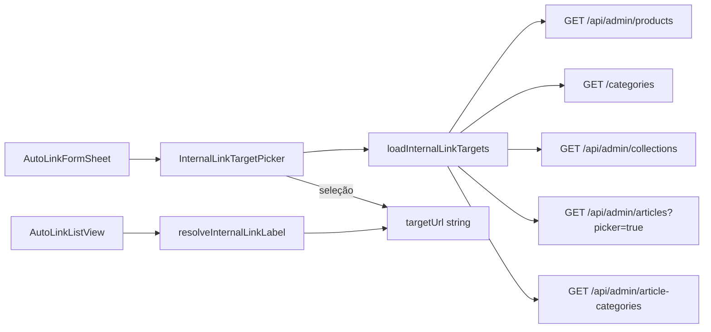

# Picker híbrido de URL — Auto-Links Admin

## Contexto

Hoje [`AutoLinkFormSheet.tsx`](apps/admin/src/components/auto-links/AutoLinkFormSheet.tsx) usa um `Input` livre para `targetUrl`. O modelo e a API **não mudam** — [`AutoLink.ts`](packages/domain/src/entities/AutoLink.ts) e [`auto-link-schemas.ts`](packages/shared/src/admin/auto-link-schemas.ts) continuam validando string (`/` ou `https://`).

O admin já carrega opções de picker no CMS via [`cms-pages-client.ts`](apps/admin/src/lib/api/cms-pages-client.ts) e [`article-categories-client.ts`](apps/admin/src/lib/api/article-categories-client.ts), sempre com **busca client-side** (sem endpoint federado). Não há `cmdk`/`Popover` no [`apps/admin/package.json`](apps/admin/package.json) — o combobox será um componente leve próprio (Input + painel scrollável), alinhado aos pickers existentes (`ProductIdPicker`, `ArticleIdPicker`).



---

## Escopo entregue

| Incluído          | Detalhe                                                            |
| ----------------- | ------------------------------------------------------------------ |
| Combobox agrupado | 5 tipos de destino interno                                         |
| Busca client-side | Título/nome/slug, debounce ~200ms                                  |
| Modo manual       | Switch + `Input` para `https://...` ou paths custom                |
| Edição            | Detectar URL conhecida → mostrar label; desconhecida → modo manual |
| Listagem          | Label amigável + URL truncada quando resolvível                    |
| Docs              | Atualizar [`docs/auto-links-admin.md`](docs/auto-links-admin.md)   |

## Fora de escopo (fase 2)

- Endpoint unificado `GET /admin/internal-link-targets?search=`
- Busca server-side em produtos (hoje `adminListProductsQuerySchema` não tem `search`)
- Preview do parser `injectInternalLinks`
- Persistir `entityType`/`entityId` no banco

---

## 1. Utilitários de mapeamento URL

Criar [`apps/admin/src/lib/internal-link-targets.ts`](apps/admin/src/lib/internal-link-targets.ts):

**Tipos:**

```ts
type InternalLinkTargetType =
  | 'product'
  | 'product_category'
  | 'collection'
  | 'article'
  | 'article_category';

type InternalLinkTarget = {
  type: InternalLinkTargetType;
  label: string;
  slug: string;
  targetUrl: string;
  meta?: string; // ex.: marketplace do produto
};
```

**Rotas (espelham a vitrine):**

| Tipo               | Padrão                      |
| ------------------ | --------------------------- |
| `product`          | `/produtos/{slug}`          |
| `product_category` | `/categorias/{slug}`        |
| `collection`       | `/colecoes/{slug}`          |
| `article`          | `/artigos/{slug}`           |
| `article_category` | `/artigos/categoria/{slug}` |

**Funções puras:**

- `buildInternalLinkTarget(type, slug, label, meta?)` → `InternalLinkTarget`
- `parseInternalLinkTargetUrl(url)` → `{ type, slug } | null` (regex por prefixo; ordem importa — `article_category` antes de `article`)
- `filterInternalLinkTargets(targets, query)` → filtrado por label/slug/meta
- `resolveInternalLinkLabel(targetUrl, targets)` → `{ label, typeLabel } | null`
- `isManualTargetUrl(url)` → `true` se `https://` ou não bater em nenhum prefixo interno

Labels pt-BR para badges: Produto, Categoria, Coleção, Artigo, Categoria editorial.

---

## 2. Loader client-side

Criar [`apps/admin/src/lib/api/internal-link-targets-client.ts`](apps/admin/src/lib/api/internal-link-targets-client.ts):

- `loadInternalLinkTargets(): Promise<InternalLinkTarget[]>`
- `Promise.all` paralelo reutilizando funções existentes:
  - `listProductsClient({ pageSize: 100 })` — [`cms-pages-client.ts`](apps/admin/src/lib/api/cms-pages-client.ts)
  - `listCategoriesClient()` — flatten já existe no mesmo arquivo
  - `listAdminCollectionsClient()`
  - `listAdminArticlesClient()` — só publicados (`picker=true`)
  - `listArticleCategoriesClient()` — [`article-categories-client.ts`](apps/admin/src/lib/api/article-categories-client.ts)
- Mapear cada item para `InternalLinkTarget` via `buildInternalLinkTarget`
- Falha parcial: log silencioso + retornar listas que carregaram (padrão `BlockPropsSheet` com `.catch(() => [])`)

Hook opcional [`useInternalLinkTargets(open)`](apps/admin/src/lib/hooks/useInternalLinkTargets.ts): carrega quando o Sheet abre; expõe `{ targets, loading, error, reload }`.

---

## 3. Componente `InternalLinkTargetPicker`

Criar [`apps/admin/src/components/auto-links/InternalLinkTargetPicker.tsx`](apps/admin/src/components/auto-links/InternalLinkTargetPicker.tsx):

**Props:**

```ts
{
  value: string;           // targetUrl
  onChange: (url: string) => void;
  targets: InternalLinkTarget[];
  loading?: boolean;
}
```

**UX (modo picker — default):**

- Campo de busca (`Input type="search"`) com placeholder "Buscar produto, categoria, coleção ou artigo…"
- Painel abaixo (`max-h-48 overflow-y-auto`, borda admin) com grupos:
  - Cabeçalho sticky por tipo (Produtos, Categorias, Coleções, Artigos, Categorias editoriais)
  - Item: label + slug muted + badge tipo
  - Clique → `onChange(item.targetUrl)` + preenche busca com label selecionado + fecha painel
- Empty state: "Nenhum destino encontrado"
- Loading: skeleton ou texto "Carregando destinos…"

**UX (modo manual):**

- `Switch` + label "URL manual (externa ou custom)"
- Quando ativo: esconde combobox; mostra `Input` atual com hint HTTPS
- Auto-ativa manual se `value` for `https://` ou `parseInternalLinkTargetUrl` retornar `null` ao abrir edição

**Acessibilidade:** `aria-expanded`, `role="listbox"`/`option` nos itens; teclado básico (Enter seleciona primeiro resultado) se viável sem lib extra.

**Sem novas dependências** — não adicionar `cmdk`/`@radix-ui/react-popover` nesta entrega.

---

## 4. Integrar no formulário

Alterar [`AutoLinkFormSheet.tsx`](apps/admin/src/components/auto-links/AutoLinkFormSheet.tsx):

- Substituir bloco `targetUrl` Input por `<InternalLinkTargetPicker />`
- Estado local `manualUrlMode` sincronizado no `useEffect` de abertura:
  - Criar → picker mode
  - Editar → `isManualTargetUrl(editing.targetUrl)` decide modo inicial
- Validação client-side existente permanece (`targetUrl.trim()` obrigatório)
- Carregar targets via hook quando `open === true`

Copy atualizada no hint:

- Modo picker: "Selecione um destino interno da vitrine."
- Modo manual: "Use caminho relativo (/) ou URL HTTPS absoluta."

---

## 5. Label amigável na listagem

Alterar [`AutoLinkListManager.tsx`](apps/admin/src/components/auto-links/AutoLinkListManager.tsx):

- Carregar `targets` uma vez no mount (ou compartilhar via contexto leve se preferir evitar double-fetch — aceitável duplicar fetch por simplicidade YAGNI)
- Passar `targets` para [`AutoLinkListView.tsx`](apps/admin/src/components/auto-links/AutoLinkListView.tsx)

Alterar list item (L62–64):

```
Antes:  {item.targetUrl}
Depois: {label ?? item.targetUrl}  + linha muted com URL se label resolvido
        badge tipo (Produto/Coleção/…) quando resolvível
        fallback: URL truncada + badge "Manual" se https:// ou não resolvível
```

---

## 6. Documentação

Atualizar [`docs/auto-links-admin.md`](docs/auto-links-admin.md):

- Mover "Picker visual de URLs internas" de **Próximos passos** → **Entregue (UI)**
- Descrever tipos suportados, modo manual, arquivos novos
- Checklist de teste manual ampliado:
  1. Criar auto-link escolhendo produto via combobox
  2. Criar apontando para coleção/categoria/artigo
  3. Toggle URL manual + `https://` externo
  4. Editar regra existente — label resolvido corretamente
  5. Listagem mostra label + tipo

Atualizar [`docs/llm-context-03-implemented-features.md`](docs/llm-context-03-implemented-features.md) (menção breve).

---

## 7. Verificação

```bash
npm run dev:api    # :3000
npm run dev:admin  # :3002
npm run build --workspace=@ecommerce-amazon/admin
npm run lint --workspace=@ecommerce-amazon/admin
```

Smoke manual em `http://localhost:3002/auto-links` conforme checklist acima.

---

## Ordem de implementação

1. `internal-link-targets.ts` (pure helpers)
2. `internal-link-targets-client.ts` + hook
3. `InternalLinkTargetPicker.tsx`
4. `AutoLinkFormSheet` integration
5. `AutoLinkListView` + `AutoLinkListManager` labels
6. Docs + build/lint

## Riscos conhecidos

- **Catálogo >100 produtos:** picker mostra só primeira página — documentar limite; fase 2 adiciona paginação ou `search` na API admin de produtos.
- **Slug renomeado:** auto-link fica com URL antiga (comportamento atual); label não resolve → exibe URL + badge Manual.
- **Double fetch** form + listagem: aceitável no MVP; otimizar depois se necessário.
