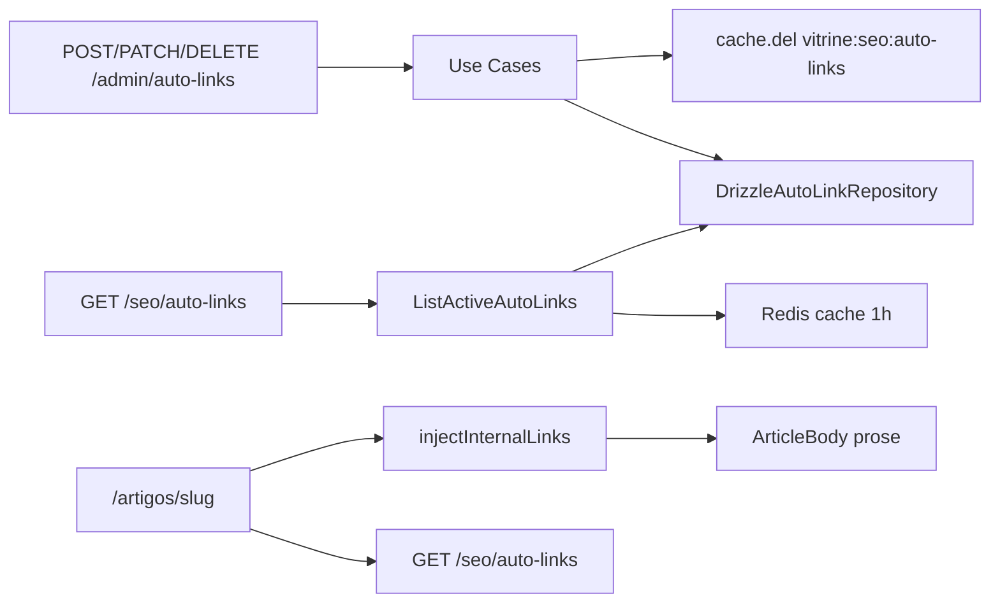

# Plano: Auto-Links — CRUD Admin + Parser SEO

## Estado atual (já implementado — evitar retrabalho)

Grande parte da fundação existe e será **estendida**, não recriada do zero:

| Componente                | Arquivo                                                                                                                   | Situação                                                                                     |
| ------------------------- | ------------------------------------------------------------------------------------------------------------------------- | -------------------------------------------------------------------------------------------- |
| Tabela `auto_links`       | [`0012_auto_links.sql`](packages/infrastructure/src/persistence/drizzle/migrations/0012_auto_links.sql)                   | OK — sem migration nova obrigatória                                                          |
| Schema Drizzle            | [`schema/index.ts`](packages/infrastructure/src/persistence/drizzle/schema/index.ts) L210–223                             | OK                                                                                           |
| Entidade `AutoLink`       | [`ContentArticle.ts`](packages/domain/src/entities/ContentArticle.ts) L77–111                                             | Existe, mas embutida — **mover** para arquivo próprio                                        |
| Port `AutoLinkRepository` | [`AutoLinkRepository.ts`](packages/domain/src/repositories/AutoLinkRepository.ts)                                         | Só `listActive()`                                                                            |
| Repositório Drizzle       | [`drizzle-auto-link.repository.ts`](packages/infrastructure/src/persistence/repositories/drizzle-auto-link.repository.ts) | Só leitura ativa; **ordem errada** (`priority ASC`)                                          |
| Use case público          | [`ListActiveAutoLinks.ts`](packages/application/src/use-cases/seo/ListActiveAutoLinks.ts)                                 | Cache Redis 1h em `vitrine:seo:auto-links` — **sem invalidação**                             |
| Rota pública              | [`routes/index.ts`](apps/api/src/adapters/http/routes/index.ts) `GET /seo/auto-links`                                     | OK                                                                                           |
| Parser                    | [`link-parser.ts`](packages/shared/src/seo/link-parser.ts)                                                                | Protege só `<a>`; **sem sort** priority/length                                               |
| Vitrine                   | [`ArticleBody.tsx`](apps/web/src/components/articles/ArticleBody.tsx)                                                     | Injeta em runtime via `injectInternalLinks` — **correto, não alterar fluxo de persistência** |
| Seed                      | [`seed.ts`](packages/infrastructure/src/persistence/drizzle/seed.ts) `seedAutoLinks`                                      | Migra `SEO_KEYWORD_MAP` → DB                                                                 |



---

## 1. Domain (`packages/domain`)

### 1.1 Extrair entidade

- Criar [`packages/domain/src/entities/AutoLink.ts`](packages/domain/src/entities/AutoLink.ts):
  - `AutoLinkId` branded uuid (`toAutoLinkId` em [`value-objects/index.ts`](packages/domain/src/value-objects/index.ts), padrão `ProductId`)
  - Validações em `AutoLink.create()`:
    - `keyword`: trim, 1–120 chars
    - `targetUrl`: URL absoluta HTTPS ou path relativo (`/...`)
    - `maxMatches`: int ≥ 1 (default 1)
    - `priority`: int (default 0)
    - `isActive`: boolean (default true)
  - Métodos imutáveis: `withUpdates({...})`, `activate()`, `deactivate()`
- Remover classe `AutoLink` de [`ContentArticle.ts`](packages/domain/src/entities/ContentArticle.ts)
- Exportar em [`domain/src/index.ts`](packages/domain/src/index.ts)

### 1.2 Expandir port

Atualizar [`AutoLinkRepository.ts`](packages/domain/src/repositories/AutoLinkRepository.ts):

```typescript
interface AutoLinkRepository {
  save(autoLink: AutoLink): Promise<void>;
  findById(id: string): Promise<AutoLink | null>;
  findByKeywordNormalized(keyword: string): Promise<AutoLink | null>; // duplicate check (trim + lowercase)
  findAllActiveSortedByPriority(): Promise<AutoLink[]>; // replaces listActive
  listPaginated(params: {
    page: number;
    limit: number;
    search?: string;
  }): Promise<{ items: AutoLink[]; total: number }>;
  delete(id: string): Promise<void>;
}
```

**Ordenação ativa:** `priority DESC`, `LENGTH(keyword) DESC` (SQL ou sort pós-fetch — preferir SQL no Drizzle).

### 1.3 Constante de cache (opcional no domain/gateways)

Extrair chave `AUTO_LINKS_CACHE_KEY = 'vitrine:seo:auto-links'` em shared ou constante usada por use cases — evita string mágica duplicada.

---

## 2. Infrastructure (`packages/infrastructure`)

### 2.1 Repositório Drizzle

Expandir [`drizzle-auto-link.repository.ts`](packages/infrastructure/src/persistence/repositories/drizzle-auto-link.repository.ts):

| Método                          | Implementação                                                                   |
| ------------------------------- | ------------------------------------------------------------------------------- |
| `save`                          | `insert ... onConflictDoUpdate` por `id`                                        |
| `findById`                      | `eq(id)`                                                                        |
| `findByKeywordNormalized`       | `lower(trim(keyword))` via `sql` ou filtro em memória pós-`ilike`               |
| `findAllActiveSortedByPriority` | `where isActive=true` + `orderBy(desc(priority), desc(sql\`length(keyword)\`))` |
| `listPaginated`                 | `ilike` em `keyword` e `target_url` quando `search`; `limit/offset`; `count(*)` |
| `delete`                        | `delete where id`                                                               |

Atualizar import de `AutoLink` para novo arquivo de entidade.

---

## 3. Application (`packages/application/src/use-cases/auto-links/`)

Seguir padrão **throw + domain errors** (igual [`CreateArticleCategory`](packages/application/src/use-cases/admin-article-category/CreateArticleCategory.ts) e [`CreateCuratedCollection`](packages/application/src/use-cases/admin-collection/CreateCuratedCollection.ts)) — mais consistente com CRUD admin existente que `Result<T,E>` do CMS.

| Use case             | Arquivo                 | Regras                                                                                                        |
| -------------------- | ----------------------- | ------------------------------------------------------------------------------------------------------------- |
| `CreateAutoLink`     | `CreateAutoLink.ts`     | `findByKeywordNormalized` → `ConflictError('Keyword já cadastrada')` pt-BR; `cache.del(AUTO_LINKS_CACHE_KEY)` |
| `UpdateAutoLink`     | `UpdateAutoLink.ts`     | `EntityNotFoundError`; se keyword mudou, revalidar unicidade; toggle `isActive`; invalida cache               |
| `DeleteAutoLink`     | `DeleteAutoLink.ts`     | `EntityNotFoundError`; invalida cache                                                                         |
| `ListAutoLinksAdmin` | `ListAutoLinksAdmin.ts` | Paginação + search; DTO admin com todos os campos + ISO dates                                                 |

Helper compartilhado: `auto-link.helpers.ts` com `assertUniqueKeyword(repo, keyword, excludeId?)`.

### 3.1 Ajustar use case público existente

[`ListActiveAutoLinks.ts`](packages/application/src/use-cases/seo/ListActiveAutoLinks.ts):

- Trocar `listActive()` → `findAllActiveSortedByPriority()`
- Manter cache 3600s; payload `{ keyword, targetUrl, maxMatches, priority }` (priority opcional no DTO público, útil para debug; parser pode ignorar se pré-ordenado)

Registrar novos use cases em [`application/src/index.ts`](packages/application/src/index.ts) e [`api-container.ts`](packages/infrastructure/src/di/api-container.ts).

---

## 4. Shared — schemas Zod admin

Criar [`packages/shared/src/admin/auto-link-schemas.ts`](packages/shared/src/admin/auto-link-schemas.ts):

```typescript
createAutoLinkBodySchema = { keyword, targetUrl, maxMatches?, priority?, isActive? }
updateAutoLinkBodySchema = partial do create
listAutoLinksQuerySchema = { page?, limit?, search? }
autoLinkIdParamsSchema = { id: uuid }
adminAutoLinkSummarySchema / adminAutoLinkListResponseSchema
```

Exportar em [`shared/src/admin/index.ts`](packages/shared/src/admin/index.ts).

Mensagens Zod em **pt-BR** via `.describe()` ou mensagens custom.

---

## 5. API (`apps/api`)

Criar [`admin-auto-link-routes.ts`](apps/api/src/adapters/http/routes/admin-auto-link-routes.ts) (convenção do projeto, não subpasta):

| Método   | Rota                    | Status                              |
| -------- | ----------------------- | ----------------------------------- |
| `POST`   | `/admin/auto-links`     | 201 `{ id }`                        |
| `GET`    | `/admin/auto-links`     | 200 `{ items, total, page, limit }` |
| `PATCH`  | `/admin/auto-links/:id` | 204                                 |
| `DELETE` | `/admin/auto-links/:id` | 204                                 |

- Handler de erros espelhando [`admin-article-category-routes.ts`](apps/api/src/adapters/http/routes/admin-article-category-routes.ts): 400/404/409/500
- Registrar em [`admin-routes.ts`](apps/api/src/adapters/http/routes/admin-routes.ts) (protegido pelo hook JWT existente)
- Atualizar [`docs/api-rest.md`](docs/api-rest.md) com nova seção Admin Auto-Links

---

## 6. Parser — regras críticas (`packages/shared/src/seo/link-parser.ts`)

### 6.1 Ordenação antes de aplicar

Em `injectInternalLinks`, sort interno defensivo:

```typescript
keywords.sort(
  (a, b) => (b.priority ?? 0) - (a.priority ?? 0) || b.keyword.length - a.keyword.length,
);
```

Estender `SeoKeywordMap` com `priority?: number`.

### 6.2 Zonas protegidas (não injetar links)

Expandir split de segmentos além de `<a>`:

- Tags de heading: `<h1>` … `<h6>` (conteúdo interno intocado)
- Tags `` (self-closing — segmento ignorado integralmente)
- Manter proteção de `<a>...</a>` existente

Abordagem: regex composto `/(<a\b...>|<h[1-6]\b...>|)/gi` com lógica de segmento protegido vs texto processável.

### 6.3 Testes

Expandir [`link-parser.test.ts`](packages/shared/src/seo/link-parser.test.ts):

- Keyword longa antes da curta ("cadeira ergonômica" vs "cadeira")
- `maxMatches` respeitado por regra
- Sem link dentro de `<h2>` ou `<a>` existente
- Sem link em atributo `alt` de ``

---

## 7. Testes unitários (application + domain)

| Arquivo                                                            | Casos                                                                                    |
| ------------------------------------------------------------------ | ---------------------------------------------------------------------------------------- |
| `packages/domain/src/entities/AutoLink.test.ts`                    | Validações keyword/url/maxMatches                                                        |
| `packages/application/src/use-cases/auto-links/auto-links.test.ts` | Create conflito keyword; Update not found; Delete invalida cache (mock `CacheStore.del`) |

Rodar: `npm test -- --run auto-link link-parser`

---

## 8. Documentação

Criar [`docs/auto-links-admin.md`](docs/auto-links-admin.md) com:

- Escopo (API admin + parser; UI fora)
- Fluxo runtime (não persiste HTML modificado)
- Regras priority/length/maxMatches/zonas protegidas
- Rotas, arquivos-chave, como testar com curl
- Atualizar [`docs/README.md`](docs/docs/README.md) índice + [`docs/llm-context-03`](docs/llm-context-03-implemented-features.md) (remover "CRUD admin auto_links pendente")

---

## Fora de escopo (confirmado)

- UI admin (`/auto-links` no `apps/admin`) — fase seguinte
- BFF Next.js proxy em `apps/admin/src/app/api/admin/auto-links/**`
- Migration UNIQUE em `keyword` — validação no use case é suficiente no MVP; migration opcional futura

---

## Ordem de implementação sugerida

1. Domain: entidade + port expandido
2. Infrastructure: repositório completo + fix ordenação
3. Shared: schemas admin + `SeoKeywordMap.priority`
4. Application: use cases + cache invalidation + ajuste `ListActiveAutoLinks`
5. API: rotas + DI
6. Parser: sort + zonas protegidas + testes
7. Docs + lint/build

## Verificação final

```bash
npm run build -w @ecommerce-amazon/domain -w @ecommerce-amazon/shared -w @ecommerce-amazon/application -w @ecommerce-amazon/infrastructure -w @ecommerce-amazon/api
npm test -- --run auto-link link-parser
npm run lint
# Smoke:
curl -H "Authorization: Bearer $TOKEN" http://localhost:3000/admin/auto-links
curl http://localhost:3000/seo/auto-links
```
