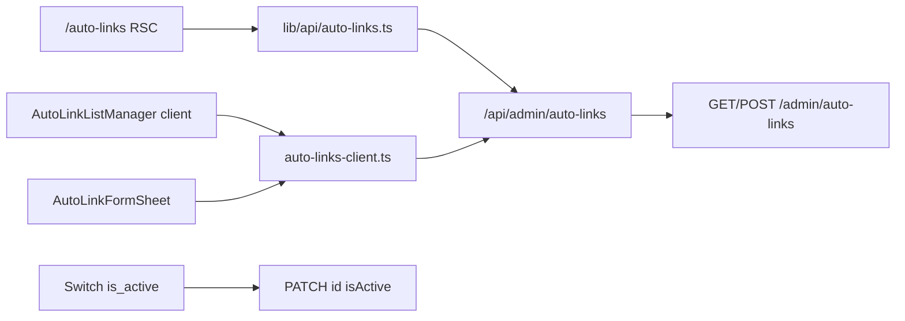

# Plano: UI Admin — Auto-Links

## Contexto

A API backend já está implementada ([`docs/auto-links-admin.md`](docs/auto-links-admin.md)):

| Método   | Rota                                  |
| -------- | ------------------------------------- |
| `GET`    | `/admin/auto-links?page&limit&search` |
| `POST`   | `/admin/auto-links`                   |
| `PATCH`  | `/admin/auto-links/:id`               |
| `DELETE` | `/admin/auto-links/:id`               |

Schemas Zod prontos em [`packages/shared/src/admin/auto-link-schemas.ts`](packages/shared/src/admin/auto-link-schemas.ts).

**Decisão de navegação (confirmada):** rota de primeiro nível **`/auto-links`** + item na sidebar.

## Referência visual e técnica

Espelhar o padrão de [`ArticleCategoryListManager`](apps/admin/src/components/article-categories/ArticleCategoryListManager.tsx) + [`CollectionListManager`](apps/admin/src/components/collections/CollectionListManager.tsx):

- Painéis flutuantes (`cms-editor-section`, `cms-float-panel`) — regra [`11-admin-floating-panels.mdc`](.cursor/rules/11-admin-floating-panels.mdc)
- Listagem com `cms-block-list` + `cms-block-card--plain`
- Formulário em `Sheet` lateral (create/edit)
- BFF em `apps/admin/src/app/api/admin/**` → `adminFetch` server-side
- Client fetch via `*-client.ts` para refresh/toggle após mount



---

## 1. Navegação e rota

### Sidebar

Atualizar [`apps/admin/src/lib/navigation.ts`](apps/admin/src/lib/navigation.ts):

- Novo item após **Artigos**: `{ href: '/auto-links', label: 'Auto-Links', icon: Link2 }` (lucide `Link2`)

### Página RSC

Criar [`apps/admin/src/app/(dashboard)/auto-links/page.tsx`](<apps/admin/src/app/(dashboard)/auto-links/page.tsx>):

- `metadata.title`: `Auto-Links — Vitrine CMS`
- SSR: `listAutoLinks({ page: 1, limit: 20 })` via server lib
- `AdminPageHeader` + breadcrumbs: `Painel > Auto-Links`
- `AdminPageCard transparent` + `<AutoLinkListManager initialData={...} />`

Também adicionar atalho opcional em [`ArticleListManager`](apps/admin/src/components/articles/ArticleListManager.tsx) — botão `outline` "Auto-Links" ao lado de "Categorias" (cross-link do hub editorial, sem substituir item da sidebar).

---

## 2. BFF Next.js (proxy autenticado)

Seguir [`apps/admin/src/app/api/admin/article-categories/route.ts`](apps/admin/src/app/api/admin/article-categories/route.ts).

| Arquivo                                                                                                          | Métodos                                                 |
| ---------------------------------------------------------------------------------------------------------------- | ------------------------------------------------------- |
| [`apps/admin/src/app/api/admin/auto-links/route.ts`](apps/admin/src/app/api/admin/auto-links/route.ts)           | `GET` (repassa query `page`, `limit`, `search`), `POST` |
| [`apps/admin/src/app/api/admin/auto-links/[id]/route.ts`](apps/admin/src/app/api/admin/auto-links/[id]/route.ts) | `PATCH`, `DELETE`                                       |

Validação Zod na borda com schemas de `@ecommerce-amazon/shared/admin`. Erros: 401 unauthorized, 400 validação, 409 conflito keyword (repassar `error` da API).

---

## 3. Camada de API client (admin)

### Server-side — [`apps/admin/src/lib/api/auto-links.ts`](apps/admin/src/lib/api/auto-links.ts)

Funções usando `adminFetchParsed`:

- `listAutoLinks(params: ListAutoLinksQuery)` → `AdminAutoLinkListResponse`
- `createAutoLink(body)` → `{ id }`
- `updateAutoLink(id, body)` → `void`
- `deleteAutoLink(id)` → `void`

Query string: `new URLSearchParams` com `page`, `limit`, `search` (padrão [`admin-products.ts`](apps/admin/src/lib/api/admin-products.ts)).

### Client-side — [`apps/admin/src/lib/api/auto-links-client.ts`](apps/admin/src/lib/api/auto-links-client.ts)

Espelho para componentes `'use client'`:

- `listAutoLinksClient(params)`
- `createAutoLinkClient(body)`
- `updateAutoLinkClient(id, body)`
- `deleteAutoLinkClient(id)`

Parse com `adminAutoLinkListResponseSchema` / `createAutoLinkResponseSchema`; mensagens de erro via `readErrorMessage` (padrão article-categories-client).

---

## 4. Componentes UI

Pasta: `apps/admin/src/components/auto-links/`

### `AutoLinkListManager.tsx` (client, orquestrador)

Estado:

- `items`, `total`, `page`, `limit` (default 20), `search` (string)
- `sheetOpen`, `editing`, `deleteTarget`, `loading`

Ações:

- **Busca:** `Input type="search"` no painel superior; debounce ~300ms → `refresh({ page: 1, search })`
- **Paginação:** botões Anterior/Próxima + texto `Página X de Y` (calcular `totalPages = ceil(total/limit)`)
- **Criar:** abre `AutoLinkFormSheet` com `editing=null`
- **Editar / Excluir:** igual categorias + `AlertDialog` de confirmação
- **Toggle ativo:** delegado ao `AutoLinkListView`

Painel superior (copy pt-BR):

- Título: **Links automáticos**
- Apoio: _Keywords linkadas automaticamente nos artigos editoriais. O HTML do artigo não é alterado — a injeção ocorre na vitrine._

### `AutoLinkListView.tsx` (client, apresentação)

Cada item em `cms-block-card--plain` exibe:

| Coluna    | Conteúdo                                               |
| --------- | ------------------------------------------------------ |
| Principal | `keyword` (bold) + `targetUrl` (muted, truncate)       |
| Meta      | `priority`, `maxMatches`, badge Ativo/Inativo          |
| Ações     | `Switch` `is_active` (PATCH imediato), Editar, Excluir |

Badge status: reutilizar classes `cms-status-pill is-published` / `is-draft` (padrão produtos).

Empty state: mensagem + CTA "Criar primeira keyword".

### `AutoLinkFormSheet.tsx` (client)

Campos (validação client-side com schemas shared antes do POST/PATCH):

| Campo        | UI                                                     | Default |
| ------------ | ------------------------------------------------------ | ------- |
| `keyword`    | `Input`                                                | —       |
| `targetUrl`  | `Input` + hint: caminho `/categorias/...` ou URL HTTPS | —       |
| `maxMatches` | `Input type="number"` min 1 max 50                     | 1       |
| `priority`   | `Input type="number"` min 0 max 1000                   | 0       |
| `isActive`   | `Switch` + label "Regra ativa"                         | true    |

Hints com componente leve (reutilizar [`ArticleFieldHint`](apps/admin/src/components/articles/ArticleFieldHint.tsx) ou texto muted):

- **Prioridade:** maior valor = processada antes; empate → keyword mais longa vence
- **Máx. ocorrências:** limite por artigo; não injeta dentro de links/headings/imagens existentes

Toast success/error via `useAdminToast`. Tratar 409 com mensagem "Keyword já cadastrada".

---

## 5. Comportamentos de negócio na UI

| Regra                      | Implementação UI                                                           |
| -------------------------- | -------------------------------------------------------------------------- |
| Não editar HTML de artigos | Copy explicativo no painel; sem preview/parser no admin                    |
| Toggle `is_active`         | `Switch` na listagem → `PATCH { isActive }` sem abrir sheet                |
| Keyword duplicada          | Toast erro 409 da API                                                      |
| Cache público              | Transparente — mutações já invalidam Redis no backend                      |
| Ordenação na listagem      | Exibir `priority` DESC (API já ordena admin list por priority + updatedAt) |

---

## 6. Fora de escopo desta entrega

- Preview ao vivo do `injectInternalLinks` no admin
- Importação em massa (CSV/JSON)
- Drag-and-drop para reordenar prioridade
- Picker visual de URLs internas (produto/categoria/artigo) — operador digita path manualmente
- Item duplicado na sidebar **e** só em Artigos (sidebar é suficiente; atalho em Artigos é opcional/baixo custo)

---

## 7. Documentação

Atualizar [`docs/auto-links-admin.md`](docs/auto-links-admin.md):

- Mover UI de "Fora de escopo" para "Entregue"
- Paths dos componentes admin + rota `/auto-links`
- Comandos de teste manual no browser

Atualizar índices: [`docs/README.md`](docs/README.md), [`docs/llm-context-03-implemented-features.md`](docs/llm-context-03-implemented-features.md).

---

## 8. Verificação

```bash
npm run dev:api    # :3000
npm run dev:admin  # :3002
npm run build --workspace=@ecommerce-amazon/admin
npm run lint --workspace=@ecommerce-amazon/admin  # se aplicável aos arquivos novos
```

Checklist manual:

1. Login → sidebar **Auto-Links** → listagem SSR
2. Criar keyword + URL interna → aparece na lista
3. Toggle inativo → badge muda; `GET /seo/auto-links` não inclui item
4. Busca por keyword filtra resultados
5. Paginação com >20 itens (seed + criação manual)
6. Editar e excluir com confirmação
7. Tentar keyword duplicada → toast 409

---

## Ordem de implementação

1. `lib/api/auto-links.ts` + BFF routes
2. `auto-links-client.ts`
3. Componentes `AutoLinkListView` → `AutoLinkFormSheet` → `AutoLinkListManager`
4. Página `/auto-links` + `navigation.ts` sidebar
5. Atalho opcional em `ArticleListManager`
6. Docs + build/lint admin
