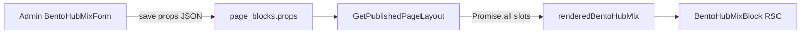
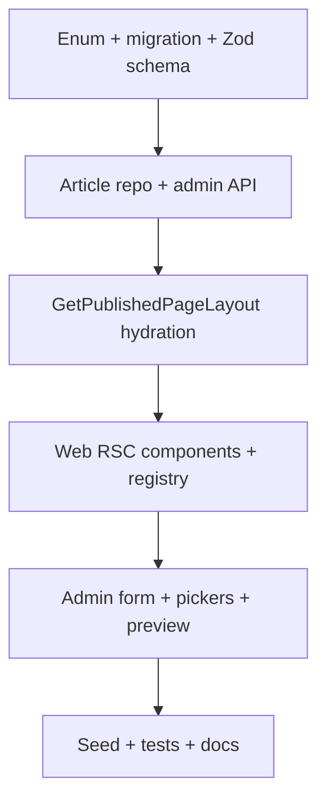

# Plano: Bloco CMS BENTO_HUB_MIX

## Contexto e decisões de arquitetura

O bloco segue o pipeline existente de 12 camadas (enum → Drizzle → Zod → BFF hydration → web registry → admin registry). Diferente dos blocos atuais que são quase todos `'use client'`, **`BentoHubMixBlock` será um Server Component** — viável porque [`PageRenderer`](apps/web/src/components/cms/PageRenderer.tsx) já é RSC e os dados chegam pré-hidratados via `GET /pages/:slug`.

**Estratégia de dados:** hidratação no BFF (como `dynamic_product_grid` / `curated_collection`), não fetch client-side. Garante compliance de preço stale (24h), badge de desconto correto e zero round-trips extras na home.

**Gap identificado:** artigos existem no banco (`content_articles`) mas não há listagem admin nem `findArticleById`. Será necessário um endpoint mínimo antes do picker do Slot 1 funcionar.



---

## 1. Contrato de props (`block_config`)

Arquivo principal: [`packages/shared/src/cms/block-schemas.ts`](packages/shared/src/cms/block-schemas.ts)

### Schema proposto

```typescript
// Slot 1 — hero grande (2×2 desktop)
slot1: {
  contentType: 'collection' | 'article',
  entityId: uuid,           // curated_collections.id ou content_articles.id
  title?: string,           // override; fallback = título da entidade
  subtitle?: string,
  coverImageUrl?: string,     // override; coleção usa cover da entidade se omitido
}

// Slot 2 — oferta única
slot2: {
  productId: uuid,
}

// Slot 3 — mini-lista Top 3
slot3: discriminatedUnion:
  | { contentType: 'category', categorySlug: string, listTitle?: string }
  | { contentType: 'products', productIds: uuid[] /* min 1, max 3 */ }
```

**Validações Zod extras:**

- `entityId` obrigatório em slot1
- `productIds` máximo 3 em slot3
- `coverImageUrl` obrigatório quando `contentType === 'article'` (artigos não têm cover no DB — ver [`content_articles`](packages/infrastructure/src/persistence/drizzle/schema/index.ts))
- `superRefine` garante que slot3 tenha exatamente um modo ativo

### DTO de hidratação (novo campo)

Estender `pageBlockDeliverySchema`:

```typescript
renderedBentoHubMix?: {
  slot1: { href, title, subtitle?, coverImageUrl, contentType } | null,
  slot2: ProductDeliveryItem | null,
  slot3: {
    mode: 'category' | 'products',
    categoryHref?: string,
    categoryTitle?: string,
    products: ProductDeliveryItem[],  // até 3
  } | null,
}
```

Atualizar `stripRenderedData` em [`GetPublishedPageLayout.ts`](packages/application/src/use-cases/page/GetPublishedPageLayout.ts) para remover `renderedBentoHubMix` do cache.

---

## 2. Domain + persistência

| Arquivo                                                                                                          | Mudança                                                                                                                                                                                                    |
| ---------------------------------------------------------------------------------------------------------------- | ---------------------------------------------------------------------------------------------------------------------------------------------------------------------------------------------------------- |
| [`packages/domain/src/enums/cms.ts`](packages/domain/src/enums/cms.ts)                                           | `BENTO_HUB_MIX = 'bento_hub_mix'`                                                                                                                                                                          |
| [`packages/infrastructure/.../schema/index.ts`](packages/infrastructure/src/persistence/drizzle/schema/index.ts) | Adicionar valor ao `blockTypeEnum`                                                                                                                                                                         |
| `migrations/0010_bento_hub_mix.sql`                                                                              | `ALTER TYPE "block_type" ADD VALUE IF NOT EXISTS 'bento_hub_mix';` (padrão de [`0003_dynamic_product_grid.sql`](packages/infrastructure/src/persistence/drizzle/migrations/0003_dynamic_product_grid.sql)) |

### Repositório de artigos (pré-requisito admin + hydration)

| Arquivo                                                                                                               | Mudança                                                                  |
| --------------------------------------------------------------------------------------------------------------------- | ------------------------------------------------------------------------ |
| [`packages/domain/src/repositories/ContentRepository.ts`](packages/domain/src/repositories/ContentRepository.ts)      | `findArticleById(id)`, `listPublishedSummaries(): { id, slug, title }[]` |
| [`drizzle-content.repository.ts`](packages/infrastructure/src/persistence/repositories/drizzle-content.repository.ts) | Implementar métodos (filtrar `status = 'published'`)                     |
| Novo use case `ListAdminArticles`                                                                                     | Lista resumida para picker                                               |
| [`apps/api/.../routes`](apps/api/src/adapters/http/routes/index.ts)                                                   | `GET /admin/articles` → `{ items: [{ id, slug, title }] }`               |
| DI container                                                                                                          | Registrar use case                                                       |

Coleções e produtos já têm `findById` / `findByIds` — reutilizar.

---

## 3. Hidratação BFF

Arquivo: [`packages/application/src/use-cases/page/GetPublishedPageLayout.ts`](packages/application/src/use-cases/page/GetPublishedPageLayout.ts)

Adicionar branch `BlockType.BENTO_HUB_MIX` em `hydrateBlock()` com **fetch paralelo interno**:

```typescript
const [slot1, slot2, slot3] = await Promise.all([
  resolveSlot1(props.slot1), // collection.findById | article.findById
  resolveSlot2(props.slot2), // product.findById → toProductDeliveryItem
  resolveSlot3(props.slot3), // ListProducts(limit:3) | findByIds
]);
```

**Regras de resolução:**

| Slot         | Fonte                                                                               | Link gerado                    | Fallback                 |
| ------------ | ----------------------------------------------------------------------------------- | ------------------------------ | ------------------------ |
| 1 collection | `CuratedCollectionRepository.findById`                                              | `/colecoes/{slug}`             | `null` → skeleton na web |
| 1 article    | `ContentRepository.findArticleById`                                                 | `/artigos/{slug}`              | idem                     |
| 2 product    | `ProductRepository.findById`                                                        | `/produtos/{slug}`             | idem                     |
| 3 category   | `ListProducts({ category, pageSize: 3, sort: editorial_score, visibleOnly: true })` | header → `/categorias/{slug}`  | lista vazia → skeleton   |
| 3 products   | `findByIds` preservando ordem do array                                              | cada item → `/produtos/{slug}` | omitir IDs inválidos     |

Filtrar produtos com `shouldShowPrice` antes de mapear (mesma regra do flash deals). Slot 2 mantém produto mesmo stale (exibe CTA "Consultar preço", sem badge de desconto).

Injetar `GetCuratedCollection` não é necessário — `findById` na coleção basta para slot1.

**Testes:** estender [`GetPublishedPageLayout.test.ts`](packages/application/src/use-cases/page/GetPublishedPageLayout.test.ts) com mock de bloco `BENTO_HUB_MIX` validando `renderedBentoHubMix`.

---

## 4. Frontend vitrine (Server Components)

### Arquivos novos

| Arquivo                                                                                                      | Responsabilidade                                            |
| ------------------------------------------------------------------------------------------------------------ | ----------------------------------------------------------- |
| [`apps/web/src/components/blocks/BentoHubMixBlock.tsx`](apps/web/src/components/blocks/BentoHubMixBlock.tsx) | RSC — parse props, lê `renderedBentoHubMix`, delega ao grid |
| `apps/web/src/components/blocks/BentoHubMixGrid.tsx`                                                         | Layout + tiles (sem `'use client'`)                         |
| `apps/web/src/components/blocks/BentoHubMixSkeleton.tsx`                                                     | Placeholder animado por slot ausente                        |

### Layout (conforme spec)

```
grid grid-cols-1 md:grid-cols-3 gap-4
Slot1: md:col-span-2 md:row-span-2
Slots 2/3: 1×1 cada
```

**Estética** (evoluir [`CategoryBentoGrid.tsx`](apps/web/src/components/blocks/CategoryBentoGrid.tsx)):

- `rounded-3xl`, `border border-gray-100`, `shadow-sm`
- Imagem `object-cover` + gradiente overlay (`from-black/50`)
- Hover: `scale-[1.02]` no card + `scale-105` na imagem

### Slots UI

- **Slot 1 (hero):** tile grande com título/subtítulo, `Link` para coleção ou artigo
- **Slot 2 (oferta):** card compacto server-safe com `PriceDisplay`, badge `-{N}%` via [`computeDiscountPercent`](apps/web/src/lib/discount.ts) — **sem** `ProductCard` (client/wishlist); reutilizar estilo visual do card existente
- **Slot 3 (lista):** coluna vertical com até 3 linhas (thumb 48px + título + preço); header opcional com link para categoria

### Registry

Registrar em [`BlockRegistry.tsx`](apps/web/src/components/cms/BlockRegistry.tsx) — única mudança necessária no pipeline de render.

---

## 5. Admin CMS

### Registries (todos explícitos — nunca `Object.values(BlockType)`)

- [`block-type-labels.ts`](apps/admin/src/components/cms/block-type-labels.ts) — label "Hub Bento Mix", `ADDABLE` + `EDITABLE`, defaults dos 3 slots
- [`block-type-meta.ts`](apps/admin/src/components/cms/block-type-meta.ts) — ícone `LayoutGrid` ou `PanelsTopLeft`
- [`block-form-registry.ts`](apps/admin/src/components/cms/props-forms/block-form-registry.ts) — schema + `normalizeFormValues` / `sanitizeFormValues`
- [`BlockPropsSheet.tsx`](apps/admin/src/components/cms/BlockPropsSheet.tsx) — case + prefetch de products, categories, collections, articles

### Formulário: `BentoHubMixForm.tsx`

Três `CmsFormSection` fixas (não array de tiles como `CategoryBentoGridForm`):

| Seção             | Campos                                                                                                                                             |
| ----------------- | -------------------------------------------------------------------------------------------------------------------------------------------------- |
| Slot 1 — Destaque | `Select` tipo (coleção/artigo) → picker por ID; inputs título, subtítulo, URL cover                                                                |
| Slot 2 — Oferta   | `ProductIdPicker` (busca local + select por **id**, baseado em [`ProductPicker.tsx`](apps/admin/src/components/cms/props-forms/ProductPicker.tsx)) |
| Slot 3 — Lista    | `Select` tipo (categoria/produtos) → `Select` categoria **ou** `ProductMultiPicker` (max 3)                                                        |

### Pickers novos (reutilizáveis)

| Componente           | API                                                     |
| -------------------- | ------------------------------------------------------- |
| `CollectionIdPicker` | `GET /api/admin/collections` (já existe — retorna `id`) |
| `ArticleIdPicker`    | `GET /api/admin/articles` (novo)                        |
| `ProductIdPicker`    | `listProductsClient` — `onChange(id)` em vez de slug    |
| `ProductMultiPicker` | Checkbox/lista com cap 3                                |

### Preview ao vivo (primeiro no admin)

`BentoHubMixPreview.tsx` — client subcomponent dentro do form:

- `useWatch({ control })` para reagir a mudanças
- Mini grid CSS espelhando o layout web (`md:grid-cols-3`)
- Tiles com título/cover dos pickers carregados (ou placeholders cinza)
- Seção final `Pré-visualização` no Sheet; considerar `sm:max-w-xl` no Sheet quando bloco = `BENTO_HUB_MIX`

### Meta auxiliar

`bento-hub-mix-form-meta.ts` — labels dos slots, opções de `contentType`, mensagens de erro traduzidas (padrão [`dynamic-grid-form-meta.ts`](apps/admin/src/components/cms/props-forms/dynamic-grid-form-meta.ts)).

---

## 6. Seed, testes e documentação

### Seed

Em [`seed.ts`](packages/infrastructure/src/persistence/drizzle/seed.ts), função idempotente `ensureBentoHubMixHomeBlock()`:

- Inserir bloco após `category_bento_grid` (sort ~2.5 ou reordenar)
- Slot1: coleção `setup-gamer-iniciante` (id do seed)
- Slot2: produto headset (maior desconto do seed)
- Slot3: categoria `games`

### Testes

- [`block-schemas.test.ts`](packages/shared/src/cms/block-schemas.test.ts) — defaults, discriminated unions, rejeição de `productIds > 3`, article sem cover
- `GetPublishedPageLayout.test.ts` — hidratação dos 3 slots

### Documentação

Criar [`docs/cms-bento-hub-mix.md`](docs/cms-bento-hub-mix.md) com:

- Escopo dos 3 slots e o que ficou fora (ex.: countdown, cupons)
- Fluxo BFF → RSC
- Arquivos-chave
- Como testar: `db:setup`, adicionar bloco no admin `/paginas/home`, validar home

Atualizar índice em [`docs/README.md`](docs/README.md).

---

## Ordem de implementação sugerida



---

## Fora de escopo (MVP deste bloco)

- Rota web `/artigos/[slug]` (API existe; link do slot1 aponta para `/artigos/{slug}` mesmo sem página — alinhado ao PRD Growth)
- Autocomplete server-side com `?q=` nos pickers (manter filtro client como hoje)
- Countdown / urgência no slot2 (proibido por compliance se preço stale)
- Bloco editável via JSON raw — apenas form estruturado no admin
