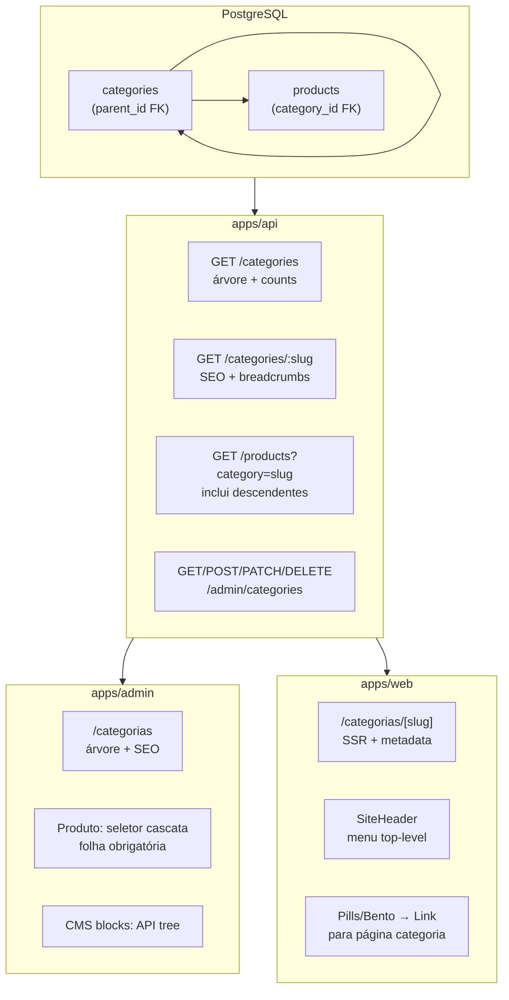
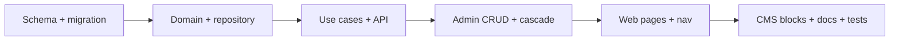

# Reestruturação do Módulo de Categorias (Hierarquia + SEO)

## Estado atual (gap)

Hoje não existe tabela `categories`. O catálogo usa `products.category_vertical` (texto livre) com 3 slugs hardcoded em [`packages/shared/src/product/category-vertical.ts`](packages/shared/src/product/category-vertical.ts). `GET /categories` agrega slugs via `GROUP BY` em [`ListProductCategories`](packages/application/src/use-cases/product/ListProductCategories.ts). Não há CRUD admin, páginas `/categorias/*` (links em [`packages/shared/src/seo/keywords.ts`](packages/shared/src/seo/keywords.ts) apontam para 404) nem menu hierárquico.

## Arquitetura alvo



**Decisões confirmadas:**

- Escopo completo (schema → vitrine)
- URL pública com **slug global único**: `/categorias/teclados-mecanicos`
- Produto amarrado à **folha** da árvore (`category_id`); nós intermediários servem navegação/SEO
- Filtro `GET /products?category=` inclui produtos de **todos os descendentes** do slug

---

## 1. Schema e migração de dados

### Nova tabela `categories`

Arquivo dedicado: [`packages/infrastructure/src/persistence/drizzle/schema/categories.ts`](packages/infrastructure/src/persistence/drizzle/schema/categories.ts) (exportar em `schema/index.ts`).

| Campo                       | Tipo                        | Notas                                              |
| --------------------------- | --------------------------- | -------------------------------------------------- |
| `id`                        | `uuid` PK                   | Alinhado ao padrão do monorepo (não `varchar(36)`) |
| `slug`                      | `text` UNIQUE               | kebab-case globalmente único                       |
| `label`                     | `text`                      | Nome amigável                                      |
| `icon`                      | `varchar(50)`               | Emoji ou nome Lucide                               |
| `parent_id`                 | `uuid` FK → `categories.id` | Nullable = raiz                                    |
| `sort_order`                | `integer` default 0         | Ordenação no menu                                  |
| `seo_title`                 | `varchar(150)`              |                                                    |
| `seo_description`           | `text`                      |                                                    |
| `description_html`          | `text`                      | Conteúdo editorial no rodapé da listagem           |
| `amazon_browse_node`        | `varchar(50)`               | Mapeamento futuro worker                           |
| `mercadolivre_category_id`  | `varchar(50)`               |                                                    |
| `shopee_category_id`        | `varchar(50)`               | Simetria com 3 marketplaces já no enum             |
| `visible`                   | `boolean` default true      | Ocultar nós em rascunho                            |
| `created_at` / `updated_at` | `timestamptz`               |                                                    |

Índices: `parent_id`, `slug`, `(parent_id, sort_order)`.

### Alteração em `products`

- Adicionar `category_id uuid REFERENCES categories(id) ON DELETE SET NULL`
- Migration `0008_categories_hierarchy.sql`:
  1. Criar tabela `categories`
  2. Seed das 3 raízes atuais (`home-office`, `games`, `eletronicos`) com labels do enum
  3. Backfill `products.category_id` via join em `category_vertical`
  4. **Remover** coluna `category_vertical` (breaking controlado — escopo full)
- Atualizar [`seed.ts`](packages/infrastructure/src/persistence/drizzle/seed.ts) para popular árvore exemplo (ex.: `games → perifericos → teclados-mecanicos`) e produtos com `category_id`

---

## 2. Domain e Application

### Domain ([`packages/domain`](packages/domain))

- Entidade `Category` com validações: slug kebab-case, sem ciclos em `parentId`, profundidade máxima configurável (ex.: 4 níveis)
- Port `CategoryRepository`:
  - `findBySlug`, `findById`, `listAll`, `listChildren(parentId)`
  - `getDescendantIds(categoryId)` — para filtro de produtos
  - `getAncestors(categoryId)` — breadcrumbs
  - `countProductsInSubtree(categoryId, visibleOnly?)`
  - CRUD + `reorder`
- Atualizar `Product` / `ProductProps`: `categoryId?: string` (substitui `categoryVertical`)
- Atualizar `ProductListFilters.category` para resolver slug → IDs descendentes via `CategoryRepository`

### Application ([`packages/application`](packages/application))

**Públicos** (substituem `ListProductCategories` baseado em produtos):

| Use case                 | Responsabilidade                                           |
| ------------------------ | ---------------------------------------------------------- |
| `ListCategoryTree`       | Árvore aninhada com `productCount` (visible products only) |
| `GetCategoryBySlug`      | Detalhe SEO + breadcrumbs + filhos diretos                 |
| Refatorar `ListProducts` | Filtro `category` via descendentes                         |

**Admin** (novo namespace `use-cases/admin-category/`):

| Use case              | Regras                                              |
| --------------------- | --------------------------------------------------- |
| `ListAdminCategories` | Árvore flat indentada ou nested com todos os campos |
| `CreateCategory`      | Valida slug único, parent existe                    |
| `UpdateCategory`      | Impede mover nó para próprio descendente            |
| `DeleteCategory`      | Bloqueia se tem filhos ou produtos vinculados       |
| `ReorderCategories`   | Batch update `sort_order` por `parentId`            |

**Produtos** — ajustar [`CreateProduct`](packages/application/src/use-cases/product/CreateProduct.ts) / [`UpdateProduct`](packages/application/src/use-cases/product/UpdateProduct.ts):

- Aceitar `categoryId` (UUID)
- Validar que categoria existe, está `visible`, e é **folha** (sem filhos)

### Utilitário compartilhado

[`packages/shared/src/category/build-category-tree.ts`](packages/shared/src/category/build-category-tree.ts) — função pura que transforma lista flat em árvore (reutilizada em API presenter e admin).

---

## 3. Contratos API

### Público — atualizar [`docs/api-rest.md`](docs/api-rest.md)

**`GET /categories`** — resposta em árvore:

```typescript
{
  items: Array<{
    slug: string;
    label: string;
    icon?: string;
    productCount: number;
    subcategories?: /* recursivo */;
  }>;
}
```

**`GET /categories/:slug`** (novo):

```typescript
{
  slug: string;
  label: string;
  seoTitle?: string;
  seoDescription?: string;
  descriptionHtml?: string;
  productCount: number;
  breadcrumbs: Array<{ slug: string; label: string }>;
  children: Array<{ slug: string; label: string; productCount: number }>;
}
```

**`GET /products?category={slug}`** — passa a filtrar subárvore (documentar breaking behavior: antes era match exato em `category_vertical`).

Cache Redis: `vitrine:categories:tree` TTL 10min; `vitrine:category:slug:{slug}` TTL 10min; bump de versão nos writes admin (padrão existente em produtos).

### Admin — novo arquivo [`apps/api/src/adapters/http/routes/admin-category-routes.ts`](apps/api/src/adapters/http/routes/admin-category-routes.ts)

Registrar em [`admin-routes.ts`](apps/api/src/adapters/http/routes/admin-routes.ts) com JWT guard existente:

| Rota                              | Body / params                               |
| --------------------------------- | ------------------------------------------- |
| `GET /admin/categories`           | Árvore completa (admin fields)              |
| `POST /admin/categories`          | `createCategoryBodySchema`                  |
| `PATCH /admin/categories/:id`     | `updateCategoryBodySchema`                  |
| `DELETE /admin/categories/:id`    | 409 se filhos/produtos                      |
| `PATCH /admin/categories/reorder` | `{ parentId?, items: [{ id, sortOrder }] }` |

Schemas Zod em [`packages/shared/src/admin/category-schemas.ts`](packages/shared/src/admin/category-schemas.ts).

Atualizar [`product-schemas.ts`](packages/shared/src/admin/product-schemas.ts): `categoryVertical` → `categoryId: z.string().uuid().optional()`.

Presenter público: [`apps/api/src/adapters/presenters/category.presenter.ts`](apps/api/src/adapters/presenters/category.presenter.ts).

DI: registrar `DrizzleCategoryRepository` + use cases em [`api-container.ts`](packages/infrastructure/src/di/api-container.ts).

---

## 4. Admin UI

### Nova seção `/categorias`

- Rota: [`apps/admin/src/app/(dashboard)/categorias/page.tsx`](<apps/admin/src/app/(dashboard)/categorias/page.tsx>)
- Nav: adicionar item **Categorias** em [`navigation.ts`](apps/admin/src/lib/navigation.ts) (ícone `FolderTree`, entre Produtos e Artigos)
- Padrão visual: painéis flutuantes conforme [`11-admin-floating-panels.mdc`](.cursor/rules/11-admin-floating-panels.mdc)

**Componentes:**

- `CategoryTreeManager` — lista indentada (`padding-left` por nível), drag ou botões ↑↓ para `sort_order`
- `CategoryFormSheet` — criar/editar: label, slug (auto-gerado do label), parent (select de nós não-folha), icon, campos SEO, `descriptionHtml` (textarea), IDs marketplace
- Ações: criar subcategoria, editar, excluir (com confirmação)

**API client:** [`apps/admin/src/lib/api/categories.ts`](apps/admin/src/lib/api/categories.ts) + proxy routes em `apps/admin/src/app/api/admin/categories/`.

### Produto — seletor cascata

Substituir select estático em [`ProductEssentialsSection.tsx`](apps/admin/src/components/products/ProductEssentialsSection.tsx):

- Componente `CategoryCascadeSelect`: 1–3 selects encadeados (nível 1 → 2 → 3) alimentados por `GET /admin/categories`
- Valor final = `categoryId` da folha selecionada
- Atualizar [`product-form-values.ts`](apps/admin/src/lib/product-form-values.ts) e presenter admin

### CMS blocks

Atualizar pickers que hoje usam `GET /categories` flat:

- [`CategoryMultiSelect.tsx`](apps/admin/src/components/cms/props-forms/CategoryMultiSelect.tsx) — labels indentados (`Games → Periféricos`)
- [`CategoryBentoGridForm.tsx`](apps/admin/src/components/cms/props-forms/CategoryBentoGridForm.tsx) — opção "link" aponta para `/categorias/{slug}`
- Remover duplicação em `dynamic-grid-form-meta.ts` — labels vêm da API

**Deprecar e remover** [`category-vertical.ts`](packages/shared/src/product/category-vertical.ts) após migração.

---

## 5. Vitrine (`apps/web`)

### Página de categoria

Nova rota: [`apps/web/src/app/categorias/[slug]/page.tsx`](apps/web/src/app/categorias/[slug]/page.tsx)

- `generateMetadata` via `seoTitle` / `seoDescription` (fallback: `{label} | Vitrine`)
- SSR: `GET /categories/:slug` + `GET /products?category={slug}&visibleOnly=true`
- Layout: breadcrumb (`Home → … → {label}`), grid de produtos (reutilizar card existente), seção `descriptionHtml` no rodapé
- JSON-LD: `BreadcrumbList` + `CollectionPage` (em [`packages/shared/src/seo/`](packages/shared/src/seo/))

### Navegação

[`SiteHeader.tsx`](apps/web/src/components/layout/SiteHeader.tsx):

- Buscar `GET /categories` no server (layout ou componente server wrapper)
- Renderizar links de **raiz** no menu; opcional dropdown simples para 1º nível de filhos

### Blocos CMS — links indexáveis

- [`CategoryPillsRow.tsx`](apps/web/src/components/blocks/CategoryPillsRow.tsx) / [`CategoryBentoGrid.tsx`](apps/web/src/components/blocks/CategoryBentoGrid.tsx):
  - Modo `link` → `<Link href="/categorias/{slug}">` (SEO)
  - Modo `filter` → manter `CategoryFilterContext` na home (comportamento atual)
- Atualizar schemas web em [`apps/web/src/lib/api/schemas.ts`](apps/web/src/lib/api/schemas.ts)

### Produto — breadcrumb

[`apps/web/src/app/produtos/[slug]/page.tsx`](apps/web/src/app/produtos/[slug]/page.tsx): expor `category` no DTO público (`slug`, `label`, `breadcrumbs`) e linkar para `/categorias/{slug}`.

---

## 6. Infraestrutura

- [`DrizzleCategoryRepository`](packages/infrastructure/src/persistence/repositories/drizzle-category.repository.ts) — queries com recursive CTE para descendentes
- Atualizar [`drizzle-product.repository.ts`](packages/infrastructure/src/persistence/repositories/drizzle-product.repository.ts): join `categories`, filtro por subárvore, remover `listCategories()`
- Mapper produto: `categoryId` ↔ `category_id`

---

## 7. Testes

| Área                  | Arquivo sugerido                                                                                            |
| --------------------- | ----------------------------------------------------------------------------------------------------------- |
| `buildCategoryTree`   | `packages/shared/src/category/build-category-tree.test.ts`                                                  |
| Use cases admin       | `packages/application/src/use-cases/admin-category/admin-category.test.ts`                                  |
| Filtro descendentes   | `packages/infrastructure/src/persistence/repositories/drizzle-category.repository.test.ts` (ou integration) |
| Schemas               | `packages/shared/src/admin/category-schemas.test.ts`                                                        |
| SEO JSON-LD categoria | `packages/shared/src/seo/category-json-ld.test.ts`                                                          |

---

## 8. Documentação

Criar [`docs/categories-hierarchy.md`](docs/categories-hierarchy.md) com escopo, migração, contratos API, fluxo admin/vitrine e preparação worker (browse nodes).

Atualizar:

- [`docs/database-schema.md`](docs/database-schema.md) — tabela `categories`, FK em `products`
- [`docs/domain-model.md`](docs/domain-model.md) — entidade `Category`, ports, use cases
- [`docs/api-rest.md`](docs/api-rest.md) — endpoints novos/alterados
- [`docs/README.md`](docs/README.md) — índice

---

## Ordem de implementação recomendada



1. Schema/migration/seed — base de dados pronta
2. Domain + repository + refatorar produto
3. API pública + admin + DI
4. Admin UI (árvore + produto + CMS pickers)
5. Vitrine (página SEO, header, breadcrumbs produto)
6. Testes, lint, documentação

## Riscos e mitigações

| Risco                             | Mitigação                                                                  |
| --------------------------------- | -------------------------------------------------------------------------- |
| CMS blocks com slugs antigos      | Seed preserva slugs raiz; validação Zod em blocos continua por slug string |
| Breaking `GET /products?category` | Documentar; comportamento novo (subárvore) é o desejado para silo SEO      |
| Slug duplicado em subárvores      | Constraint UNIQUE global + validação no create                             |
| Delete categoria com produtos     | `ON DELETE SET NULL` no FK + bloqueio explícito no use case admin          |

## Fora de escopo desta entrega

- Worker auto-mapeamento browse node → categoria (apenas colunas preparadas)
- Mega-menu complexo com imagens
- Múltiplas categorias por produto (M:N)
- Página de coleções curadas `/c/[slug]` (entidade separada no PRD)
