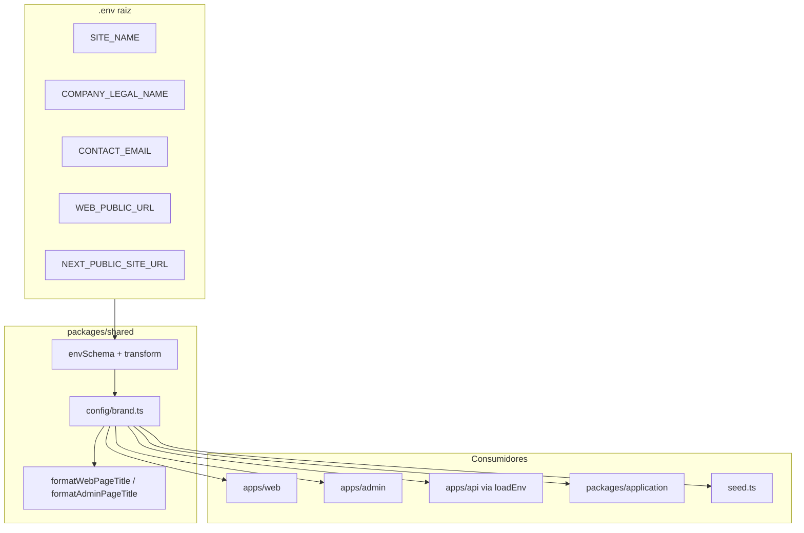

# Centralização de marca em `packages/shared`

## Contexto

Hoje a marca está espalhada em ~30 arquivos (`"Vitrine"`, `"Vitrine CMS"`, `"Redação Vitrine"`, copyright fixo, etc.). Já existem peças parciais:

- [`packages/shared/src/index.ts`](packages/shared/src/index.ts) — `loadEnv()` + `WEB_PUBLIC_URL`
- [`apps/web/src/lib/site-url.ts`](apps/web/src/lib/site-url.ts) — `NEXT_PUBLIC_SITE_URL` isolado
- [`packages/application/src/use-cases/alert/ProcessTriggeredAlerts.ts`](packages/application/src/use-cases/alert/ProcessTriggeredAlerts.ts) — e-mail stub em inglês, sem nome da marca

**Decisão de naming (confirmada):** manter default `"Vitrine"` — só centralizar, sem mudar copy existente.

## Arquitetura proposta



### 1. Novo módulo `config/brand.ts`

Criar [`packages/shared/src/config/brand.ts`](packages/shared/src/config/brand.ts) com:

```typescript
export const BRAND_DEFAULTS = {
  name: 'Vitrine',
  legalName: 'Vitrine Ltda',
  contactEmail: 'contato@vitrine.com.br',
  tagline: 'Curadoria inteligente',
  socials: {
    instagram: 'https://instagram.com/vitrine',
    telegram: 'https://t.me/vitrine_ofertas',
  },
} as const;

export type BrandConfig = {
  name: string;
  legalName: string;
  contactEmail: string;
  tagline: string;
  url: string;
  socials: typeof BRAND_DEFAULTS.socials;
};

export function createBrandConfig(source: BrandEnvSource): BrandConfig;
export function getBrandConfig(): BrandConfig; // usa loadEnv()
```

**Helpers de título** (evitam repetir padrões `| Vitrine`, `— Vitrine CMS`):

| Função | Exemplo |
|--------|---------|
| `formatWebPageTitle(page)` | `"Artigos \| Vitrine"` |
| `formatWebHomeTitle()` | `"Vitrine — Curadoria inteligente"` |
| `formatAdminPageTitle(page)` | `"Produtos — Vitrine CMS"` |
| `formatEditorialTeamName()` | `"Redação Vitrine"` |
| `formatCopyrightNotice(year?)` | `"© 2026 Vitrine. Todos os direitos reservados."` |

### 2. Estender `envSchema` (não ler `process.env` solto)

Em [`packages/shared/src/index.ts`](packages/shared/src/index.ts), adicionar ao `envSchemaBase`:

| Variável | Default | Notas |
|----------|---------|-------|
| `SITE_NAME` | `'Vitrine'` | Canônica server-side |
| `COMPANY_LEGAL_NAME` | `'Vitrine Ltda'` | Footer/legal futuro |
| `CONTACT_EMAIL` | `'contato@vitrine.com.br'` | E-mails transacionais |
| `NEXT_PUBLIC_SITE_NAME` | optional | Fallback para Next client |
| `NEXT_PUBLIC_SITE_URL` | optional | Já usada no web |
| `SITE_SOCIAL_INSTAGRAM` | default do `BRAND_DEFAULTS` | Opcional |
| `SITE_SOCIAL_TELEGRAM` | default do `BRAND_DEFAULTS` | Opcional |

No `.transform()`, unificar URL pública:

```typescript
WEB_PUBLIC_URL:
  data.WEB_PUBLIC_URL
  ?? data.NEXT_PUBLIC_SITE_URL
  ?? `http://localhost:${data.WEB_PORT}`,
```

Exportar do root: `createBrandConfig`, `getBrandConfig`, `BRAND_DEFAULTS`, helpers e `BrandConfig`.

Adicionar subpath em [`packages/shared/package.json`](packages/shared/package.json): `"./config/brand"` (mesmo padrão de `./seo`, `./cms`).

### 3. Suporte a Client Components (Next.js)

[`SiteHeader.tsx`](apps/web/src/components/layout/SiteHeader.tsx) é `'use client'` — variáveis sem prefixo `NEXT_PUBLIC_` não entram no bundle.

Em [`apps/web/next.config.ts`](apps/web/next.config.ts) e [`apps/admin/next.config.ts`](apps/admin/next.config.ts), bloco `env` (como já existe para storage):

```typescript
env: {
  NEXT_PUBLIC_SITE_NAME: process.env.SITE_NAME ?? process.env.NEXT_PUBLIC_SITE_NAME ?? 'Vitrine',
  NEXT_PUBLIC_SITE_URL: process.env.WEB_PUBLIC_URL ?? process.env.NEXT_PUBLIC_SITE_URL ?? 'http://localhost:3001',
  // contact/legal se necessário no client futuramente
},
```

`createBrandConfig` resolve: `SITE_NAME ?? NEXT_PUBLIC_SITE_NAME ?? BRAND_DEFAULTS.name`.

### 4. Migrar consumidores

#### Web (~12 arquivos)

| Arquivo | Mudança |
|---------|---------|
| [`site-url.ts`](apps/web/src/lib/site-url.ts) | Delegar para `getBrandConfig().url` (ou `createBrandConfig` no edge) |
| [`layout.tsx`](apps/web/src/app/layout.tsx) | `formatWebHomeTitle()` |
| [`page.tsx`](apps/web/src/app/page.tsx) | metadata + `<h1>` |
| [`not-found.tsx`](apps/web/src/app/not-found.tsx), [`artigos/page.tsx`](apps/web/src/app/artigos/page.tsx), [`categorias/[slug]/page.tsx`](apps/web/src/app/categorias/[slug]/page.tsx) | `formatWebPageTitle(...)` |
| [`artigos/[slug]/page.tsx`](apps/web/src/app/artigos/[slug]/page.tsx) | JSON-LD org fallback → `brand.name` |
| [`SiteHeader.tsx`](apps/web/src/components/layout/SiteHeader.tsx) | `brand.name.toUpperCase()` |
| [`Footer.tsx`](apps/web/src/components/layout/Footer.tsx) | `formatCopyrightNotice()` com `new Date().getFullYear()` |
| [`ArticlePostFooter.tsx`](apps/web/src/components/articles/ArticlePostFooter.tsx) | `formatEditorialTeamName()` |

**Fora de escopo desta entrega:** LLM prompts admin, cookie keys (`vitrine_session`), cache prefixes Redis — são identificadores técnicos, não copy de marca.

#### Admin (~18 arquivos)

Substituir `'… — Vitrine CMS'` por `formatAdminPageTitle('…')` em todas as páginas com `metadata` export.

Componentes: [`AdminSidebar.tsx`](apps/admin/src/components/admin/AdminSidebar.tsx), [`LoginForm.tsx`](apps/admin/src/components/auth/LoginForm.tsx), [`AdminShellLayout.tsx`](apps/admin/src/components/admin/AdminShellLayout.tsx), [`CMSBlockOrderManager.tsx`](apps/admin/src/components/cms/CMSBlockOrderManager.tsx).

#### Application / Worker

[`ProcessTriggeredAlerts.ts`](packages/application/src/use-cases/alert/ProcessTriggeredAlerts.ts):

- Importar `getBrandConfig()` de `@ecommerce-amazon/shared/config/brand`
- Subject/body em **pt-BR** com nome da marca (ex.: `"Alerta de preço — {name}"`)
- Manter HTML mínimo (MVP); sem template engine ainda

Worker continua só enfileirando — mudança no use case é suficiente.

#### Seed

[`packages/infrastructure/src/persistence/drizzle/seed.ts`](packages/infrastructure/src/persistence/drizzle/seed.ts): importar `BRAND_DEFAULTS` / helpers para `title`, `seoTitle`, sufixos `| Vitrine`, nome do operador seed.

### 5. Env e documentação

Atualizar [`.env.example`](.env.example):

```env
SITE_NAME=Vitrine
COMPANY_LEGAL_NAME=Vitrine Ltda
CONTACT_EMAIL=contato@vitrine.com.br
# WEB_PUBLIC_URL e NEXT_PUBLIC_SITE_URL — manter ambos documentados; transform unifica
```

Criar [`docs/brand-config.md`](docs/brand-config.md) e indexar em [`docs/README.md`](docs/README.md).

Atualizar tabela de env em [`docs/dev-setup.md`](docs/dev-setup.md).

### 6. Testes

[`packages/shared/src/config/brand.test.ts`](packages/shared/src/config/brand.test.ts):

- Defaults quando env vazio
- Override via `SITE_NAME` / `NEXT_PUBLIC_SITE_NAME`
- Unificação de URL (`WEB_PUBLIC_URL` vs `NEXT_PUBLIC_SITE_URL`)
- Helpers de título

## Fluxo de uso após entrega

```typescript
// Server Component / API / Worker / use case
import { getBrandConfig, formatWebPageTitle } from '@ecommerce-amazon/shared/config/brand';

const brand = getBrandConfig();
// brand.name, brand.url, brand.contactEmail, brand.socials

// Client Component (após next.config env forwarding)
import { createBrandConfig } from '@ecommerce-amazon/shared/config/brand';
const brand = createBrandConfig(process.env);
```

Para trocar a marca em produção: alterar `.env` (`SITE_NAME`, `CONTACT_EMAIL`, etc.) e rebuild dos apps Next.js (client bundle). API/Worker/worker pick up on restart via `loadEnv()`.

## Riscos / limitações

- **Rebuild Next.js** necessário para refletir mudanças em Client Components — comportamento esperado com env estática.
- **`/legal`** continua inexistente (link no Footer); fora do escopo desta tarefa.
- **E-mail `EMAIL_FROM`** permanece separado (`noreply@…`); `CONTACT_EMAIL` é para reply-to/conteúdo, não remetente Resend.
