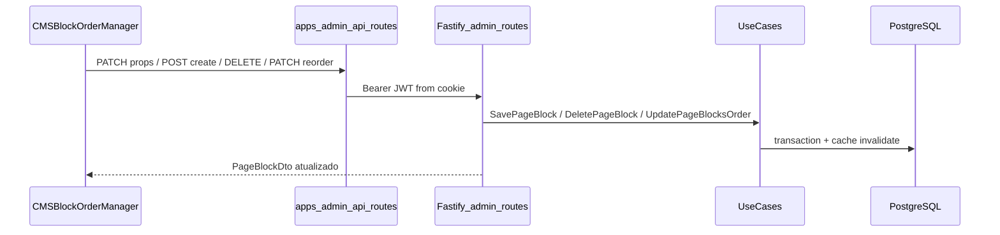
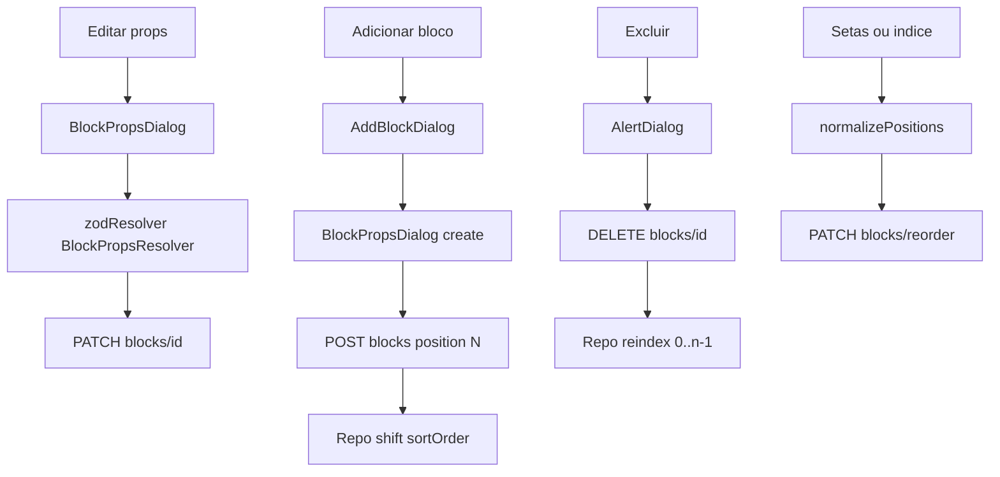

# Expansão CMS Admin — Blocos (Editar / Adicionar / Excluir)

## Estado atual

| Camada                                                                | Status                                                                                                                                      |
| --------------------------------------------------------------------- | ------------------------------------------------------------------------------------------------------------------------------------------- |
| Use cases `SavePageBlock`, `DeletePageBlock`, `UpdatePageBlocksOrder` | Prontos em [`packages/application/src/use-cases/admin-cms/`](packages/application/src/use-cases/admin-cms/)                                 |
| Schemas Zod por tipo                                                  | Prontos em [`packages/shared/src/cms/block-schemas.ts`](packages/shared/src/cms/block-schemas.ts) (`BlockPropsResolver`, `parseBlockProps`) |
| Rotas REST `/admin/pages/*`                                           | **Inexistentes** — só auth em [`apps/api/src/adapters/http/routes/admin-routes.ts`](apps/api/src/adapters/http/routes/admin-routes.ts)      |
| UI admin CMS                                                          | **Inexistente** — [`apps/admin/src/app/(dashboard)/paginas/page.tsx`](<apps/admin/src/app/(dashboard)/paginas/page.tsx>) é empty state      |
| shadcn/ui no admin                                                    | **Inexistente** — sem Radix, sem `components/ui/`                                                                                           |

**Lacuna crítica no backend:** `saveBlock` faz upsert sem deslocar `sortOrder` existentes. Inserir na posição 2 com blocos `[0,1,2,3]` gera colisão (índice não-único). `deleteBlock` **já reindexa** `[0..n-1]` em transação ([`drizzle-page.repository.ts:140-182`](packages/infrastructure/src/persistence/repositories/drizzle-page.repository.ts)).

**Decisão de escopo (confirmada):** formulários completos v1 para `DYNAMIC_PRODUCT_GRID`, `SPACER`, `BANNER`, `RICH_TEXT`; arquitetura extensível para os outros 7 tipos (cartão + mensagem “configuração em breve” ou modal read-only).

---

## Arquitetura alvo



**Identificador de página:** usar `:slug` (ex.: `home`), alinhado ao plano existente — resolver `pageId` no handler HTTP via novo `findPageBySlug`. O esboço do usuário com `:pageId` mapeia para slug na URL admin (`/paginas/home`).

---

## Fase 1 — Backend REST (pré-requisito)

### 1.1 Repositório + use cases de leitura

- Adicionar `findPageBySlug(slug: string)` em [`PageRepository`](packages/domain/src/repositories/PageRepository.ts) e [`DrizzlePageRepository`](packages/infrastructure/src/persistence/repositories/drizzle-page.repository.ts) — **sem filtro** `status = published` (admin edita layout publicado no MVP; draft/publish fica fora).
- Criar `GetAdminPageLayout` em `packages/application/src/use-cases/admin-cms/` — retorna `PageLayoutDto` (blocks ordenados por `sortOrder`, props crus).
- Criar `ListAdminPages` mínimo — `SELECT id, slug, title, status FROM pages` para listagem em `/paginas`.

### 1.2 Insert com deslocamento de posição

Estender `saveBlock` ou adicionar `insertBlockAtPosition` no repositório:

```typescript
// Em transação, ao criar (blockId inexistente):
// 1. UPDATE page_blocks SET sort_order = sort_order + 1
//    WHERE page_id = ? AND sort_order >= targetPosition
// 2. INSERT novo bloco com sort_order = targetPosition
```

Chamar essa lógica em `SavePageBlock` quando `blockId` é omitido (create). Updates (com `blockId`) continuam upsert direto sem shift.

### 1.3 Rotas Fastify + Zod

Registrar em [`admin-routes.ts`](apps/api/src/adapters/http/routes/admin-routes.ts) (ou `admin-cms-routes.ts` importado):

| Método   | Rota                                | Use case                        | Body                                        |
| -------- | ----------------------------------- | ------------------------------- | ------------------------------------------- |
| `GET`    | `/admin/pages`                      | `ListAdminPages`                | —                                           |
| `GET`    | `/admin/pages/:slug`                | `GetAdminPageLayout`            | —                                           |
| `POST`   | `/admin/pages/:slug/blocks`         | `SavePageBlock` (sem `blockId`) | `{ type, position, props, visibility? }`    |
| `PATCH`  | `/admin/pages/:slug/blocks/:id`     | `SavePageBlock` (com `blockId`) | `{ type?, position?, props?, visibility? }` |
| `DELETE` | `/admin/pages/:slug/blocks/:id`     | `DeletePageBlock`               | —                                           |
| `PATCH`  | `/admin/pages/:slug/blocks/reorder` | `UpdatePageBlocksOrder`         | `{ blocksOrder: [{ blockId, position }] }`  |

Schemas Zod em [`apps/api/src/adapters/dtos/request/schemas.ts`](apps/api/src/adapters/dtos/request/schemas.ts):

- Params: `AdminPageSlugParamsSchema`, `AdminPageBlockParamsSchema`
- Bodies: `CreatePageBlockSchema`, `UpdatePageBlockSchema`, `ReorderPageBlocksSchema` (validar posições contíguas `0..n-1`, todos os blocos incluídos — espelha regras de `UpdatePageBlocksOrder`)

Wire no [`api-container.ts`](packages/infrastructure/src/di/api-container.ts).

### 1.4 Testes

- Unit tests para `GetAdminPageLayout`, insert-with-shift no repositório (ou `SavePageBlock` integrado)
- Manter cobertura existente em [`admin-cms.test.ts`](packages/application/src/use-cases/admin-cms/admin-cms.test.ts)

---

## Fase 2 — Proxy API no Next.js admin

Padrão igual ao login ([`apps/admin/src/app/api/auth/login/route.ts`](apps/admin/src/app/api/auth/login/route.ts)):

```
apps/admin/src/app/api/admin/pages/
  route.ts                          → GET list
  [slug]/route.ts                   → GET layout
  [slug]/blocks/route.ts            → POST create
  [slug]/blocks/reorder/route.ts    → PATCH reorder
  [slug]/blocks/[blockId]/route.ts  → PATCH update, DELETE
```

Helper [`apps/admin/src/lib/api/admin-fetch.ts`](apps/admin/src/lib/api/admin-fetch.ts): lê cookie `vitrine_admin_token`, injeta `Authorization: Bearer`, chama `API_INTERNAL_URL`.

Cliente tipado [`apps/admin/src/lib/api/cms-pages.ts`](apps/admin/src/lib/api/cms-pages.ts) com DTOs de `@ecommerce-amazon/shared/cms`.

---

## Fase 3 — shadcn/ui no apps/admin

Instalar dependências no [`apps/admin/package.json`](apps/admin/package.json):

- `@radix-ui/react-dialog`, `@radix-ui/react-dropdown-menu`, `@radix-ui/react-label`, `@radix-ui/react-select`, `@radix-ui/react-alert-dialog`
- `react-hook-form`, `@hookform/resolvers`
- `class-variance-authority`, `lucide-react` (já presente)

Adicionar primitivos em `apps/admin/src/components/ui/`:

- `dialog.tsx`, `input.tsx`, `label.tsx`, `button.tsx`, `select.tsx`, `dropdown-menu.tsx`, `alert-dialog.tsx`, `form.tsx`

Estilizar com tokens existentes de [`globals.css`](apps/admin/src/app/globals.css) (`--admin-navy`, `--admin-primary`) — não copiar tema da vitrine.

---

## Fase 4 — UI do editor de blocos

### 4.1 Rotas de página

| Rota              | Arquivo                                                                           | Comportamento                                           |
| ----------------- | --------------------------------------------------------------------------------- | ------------------------------------------------------- |
| `/paginas`        | Atualizar [`paginas/page.tsx`](<apps/admin/src/app/(dashboard)/paginas/page.tsx>) | Lista páginas via `GET /admin/pages`, link para editor  |
| `/paginas/[slug]` | Novo `paginas/[slug]/page.tsx`                                                    | Server fetch layout inicial → passa para client manager |

### 4.2 Componentes CMS

```
apps/admin/src/components/cms/
  CMSBlockOrderManager.tsx      # Orquestrador principal (esboço do usuário)
  BlockListItem.tsx             # Cartão: índice, tipo, título derivado, ações
  BlockPropsDialog.tsx          # Dialog shadcn — abre para edit/create
  AddBlockDialog.tsx            # Seleção de tipo + posição de inserção
  forms/
    BlockPropsForm.tsx          # Switch por BlockType → sub-form
    DynamicProductGridForm.tsx
    SpacerForm.tsx
    BannerForm.tsx
    RichTextForm.tsx
  block-type-labels.ts          # Labels pt-BR + defaults de props por tipo
  normalize-positions.ts        # Util compartilhada
```

### 4.3 `CMSBlockOrderManager` — comportamentos

**Estado local:**

```typescript
type AdminBlock = PageBlockDto & { position: number }; // alias sortOrder → position na UI
const [blocks, setBlocks] = useState(normalizePositions(initialBlocks));
const [editingBlock, setEditingBlock] = useState<AdminBlock | null>(null);
const [insertAt, setInsertAt] = useState<number | null>(null); // posição para add no meio
```

**`normalizePositions`** — sort por position, remap `[0..n-1]` (util pura, testável).

**Editar configurações (⚙️):**

- Abre `BlockPropsDialog` com `react-hook-form` + `zodResolver(BlockPropsResolver[type])`
- `DYNAMIC_PRODUCT_GRID`: título, subtitle, categoryVertical (Select alimentado por `GET /categories` público), minDiscountPercentage, sortBy, limit
- Tipos simples: campos conforme schemas
- Salvar → `PATCH /api/admin/pages/:slug/blocks/:id` → atualiza estado local com resposta

**Adicionar bloco (+):**

- Botão no topo (final) + botão “+ Inserir aqui” entre cartões (define `insertAt = index`)
- `AddBlockDialog`: grid de tipos com ícone/label; ao selecionar, abre `BlockPropsDialog` em modo create com defaults (`block-type-labels.ts` usa `.parse({})` do Zod quando possível)
- Salvar → `POST` com `position: insertAt ?? blocks.length` → backend faz shift → merge resposta no estado

**Excluir (🗑️):**

- `AlertDialog` de confirmação (substituir `window.confirm`)
- `DELETE /api/admin/pages/:slug/blocks/:id`
- Backend já reindexa — frontend remove do array e aplica `normalizePositions` localmente (sem PATCH reorder redundante)
- Toast/feedback de erro

**Reordenar (↑ ↓ / input numérico):**

- Mutação local + `normalizePositions`
- Botão **“Salvar ordem”** (renomear “Publicar Layout” para evitar confusão com draft/publish) → `PATCH .../blocks/reorder` com `{ blocksOrder: blocks.map(b => ({ blockId: b.id, position: b.position })) }`
- Desabilitar enquanto `blocksOrder.length !== blocks.length` (guard)

**Título no cartão:** derivar de `props.title` quando string; fallback para label do tipo (`block-type-labels.ts`).

### 4.4 Tipos não cobertos na v1

Cartão renderiza normalmente; botão Configurar abre dialog com aviso “Formulário deste tipo em desenvolvimento” + JSON read-only das props — arquitetura `BlockPropsForm` já preparada para plug-in.

---

## Fluxos resumidos



---

## Documentação

Ao concluir, criar [`docs/admin-cms-blocks-phase2.md`](docs/admin-cms-blocks-phase2.md) e atualizar [`docs/admin-app-phase1.md`](docs/admin-app-phase1.md) + [`docs/api-rest.md`](docs/api-rest.md) com rotas novas.

---

## Fora de escopo desta entrega

- Draft/preview/publish workflow (`POST /admin/pages/:slug/publish`)
- Drag-and-drop (`@dnd-kit`) — reordenação por setas/índice conforme spec
- Formulários completos para HERO_CAROUSEL, HERO_SPLIT, PRODUCT_GRID, etc.
- Edição direta de páginas além da listagem + editor por slug

---

## Ordem de implementação recomendada

1. Repo `findPageBySlug` + insert shift + use cases leitura
2. Rotas Fastify + schemas + testes API/use case
3. Proxy routes Next.js + `cms-pages.ts` client
4. shadcn setup no admin
5. `/paginas` list + `/paginas/[slug]` + `CMSBlockOrderManager`
6. Modais e forms (prioridade: DYNAMIC_PRODUCT_GRID + simples)
7. Docs + lint/build nos pacotes alterados
