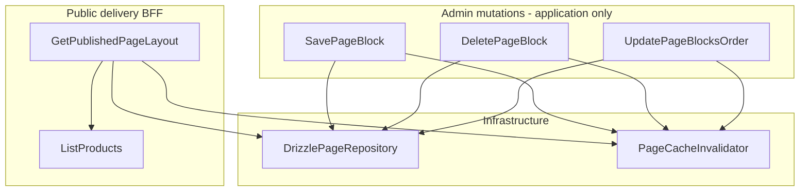

# Plano: CMS Parte 2 — Blocos dinâmicos e Admin use cases

## Contexto atual

| Área                     | Estado                                                                                                                                                                 |
| ------------------------ | ---------------------------------------------------------------------------------------------------------------------------------------------------------------------- |
| Schemas Zod              | [`block-schemas.ts`](packages/shared/src/cms/block-schemas.ts) — 10 blocos estáticos, `parseBlockProps`, `pageBlockDtoSchema`                                          |
| `BlockType`              | [`cms.ts`](packages/domain/src/enums/cms.ts) — **sem** `DYNAMIC_PRODUCT_GRID`                                                                                          |
| DB enum `block_type`     | [`schema/index.ts`](packages/infrastructure/src/persistence/drizzle/schema/index.ts) — mesmo gap                                                                       |
| `PageRepository`         | [`PageRepository.ts`](packages/domain/src/repositories/PageRepository.ts) — **somente leitura** (`findPublishedBySlug`)                                                |
| `GetPublishedPageLayout` | [`GetPublishedPageLayout.ts`](packages/application/src/use-cases/page/GetPublishedPageLayout.ts) — repassa props parseadas, cache Redis 5 min                          |
| `ListProducts`           | [`ListProducts.ts`](packages/application/src/use-cases/product/ListProducts.ts) — filtros: `category`, `marketplace`, `sort` (`editorial_score` \| `price_updated_at`) |
| Cache invalidação        | [`CacheInvalidator`](packages/domain/src/gateways/index.ts) — só `invalidateProducts`; chave de página: `vitrine:page:slug:${slug}`                                    |
| Admin HTTP               | **Fora de escopo** (confirmado) — use cases + DI apenas                                                                                                                |



---

## 1. Domain + migration — `DYNAMIC_PRODUCT_GRID`

### Enum e parser

- Adicionar `DYNAMIC_PRODUCT_GRID = 'dynamic_product_grid'` em [`BlockType`](packages/domain/src/enums/cms.ts)
- `parseBlockType` já cobre via `Object.values(BlockType)` — sem alteração extra

### Drizzle

- Incluir `'dynamic_product_grid'` no `blockTypeEnum` em [`schema/index.ts`](packages/infrastructure/src/persistence/drizzle/schema/index.ts)
- Migration manual `0003_dynamic_product_grid.sql`:

```sql
ALTER TYPE "block_type" ADD VALUE IF NOT EXISTS 'dynamic_product_grid';
```

- Registrar em [`meta/_journal.json`](packages/infrastructure/src/persistence/drizzle/migrations/meta/_journal.json)

### Sort estendido (catálogo)

`DynamicProductGridPropsSchema.sortBy` usa valores além dos atuais de [`ProductSortField`](packages/domain/src/enums/cms.ts). Estender enum:

| Prop `sortBy`     | Comportamento em `findPublished`            |
| ----------------- | ------------------------------------------- |
| `editorial_score` | `ORDER BY editorial_score DESC` (existente) |
| `created_at`      | `ORDER BY created_at DESC`                  |
| `price_asc`       | `ORDER BY price_amount ASC`                 |
| `price_desc`      | `ORDER BY price_amount DESC`                |

Atualizar [`ProductRepository.ts`](packages/domain/src/repositories/ProductRepository.ts) / [`drizzle-product.repository.ts`](packages/infrastructure/src/persistence/repositories/drizzle-product.repository.ts) com `switch` no `orderBy`.

Adicionar filtro opcional `minDiscountPercentage?: number` em `ProductListFilters`. Implementação SQL:

```sql
price_strikethrough IS NOT NULL
AND ((price_strikethrough - price_amount) / price_strikethrough * 100) >= :min
```

Post-filter em memória como fallback apenas se a expressão SQL complicar tipos Drizzle — preferir SQL.

Estender [`ListProducts.execute`](packages/application/src/use-cases/product/ListProducts.ts) para repassar `minDiscountPercentage`.

---

## 2. Schemas Zod — [`block-schemas.ts`](packages/shared/src/cms/block-schemas.ts)

### `DynamicProductGridPropsSchema`

Conforme spec:

```typescript
export const dynamicProductGridPropsSchema = z.object({
  title: z.string().min(3).max(60),
  subtitle: z.string().optional(),
  categoryVertical: z.string().optional(),
  minDiscountPercentage: z.number().min(0).max(100).optional(),
  sortBy: z
    .enum(['editorial_score', 'created_at', 'price_asc', 'price_desc'])
    .default('editorial_score'),
  limit: z.number().int().min(1).max(24).default(8),
});
```

### Discriminador extensível

- Renomear/exportar `blockPropsSchemas` também como **`BlockPropsResolver`** (alias)
- Registrar `[BlockType.DYNAMIC_PRODUCT_GRID]: dynamicProductGridPropsSchema`
- Atualizar `BlockPropsMap` type

### DTO de entrega (BFF output)

Criar schemas separados do DTO admin (mantém compatibilidade web):

```typescript
export const productDeliveryItemSchema = z.object({
  id: z.string().uuid(),
  slug: z.string(),
  title: z.string(),
  marketplace: z.string(),
  affiliateUrl: z.string().url(),
  imageUrl: z.string().url().optional(),
  price: z.object({
    amount: z.number().nullable(),
    currency: z.string(),
    isStale: z.boolean(),
    shouldShowPrice: z.boolean(),
  }),
});

export const pageBlockDeliverySchema = pageBlockDtoSchema.extend({
  renderedData: z.array(productDeliveryItemSchema).optional(),
});

export const pageLayoutDeliverySchema = pageLayoutDtoSchema.extend({
  blocks: z.array(pageBlockDeliverySchema),
});
```

- Manter `sortOrder` (não renomear para `position`) — web já consome [`PageBlockDto`](apps/web/src/components/cms/BlockRegistry.tsx)
- Input Admin usa `position` → mapear para `sortOrder` nos use cases

Exportar tipos inferidos (`DynamicProductGridProps`, `PageBlockDeliveryDto`, etc.).

---

## 3. Portas de infraestrutura

### `PageRepository` — mutações Admin

Estender [`PageRepository.ts`](packages/domain/src/repositories/PageRepository.ts):

```typescript
findPageById(pageId: string): Promise<{ layout: PageLayout; blocks: PageBlock[] } | null>;
findBlockById(blockId: string): Promise<PageBlock | null>;

updateBlocksOrder(
  pageId: string,
  orders: Array<{ blockId: string; sortOrder: number }>,
): Promise<void>;

saveBlock(block: PageBlock): Promise<void>; // upsert por id

deleteBlock(blockId: string): Promise<{ pageId: string; pageSlug: string }>;
```

Implementar em [`drizzle-page.repository.ts`](packages/infrastructure/src/persistence/repositories/drizzle-page.repository.ts):

- **`updateBlocksOrder`**: `db.transaction` — validar que todos `blockId` pertencem ao `pageId`, UPDATE `sort_order` em batch
- **`saveBlock`**: INSERT ou ON CONFLICT UPDATE (`id` PK)
- **`deleteBlock`**: DELETE + reindexar blocos restantes (`sortOrder` 0..n-1) na mesma transação; retornar slug via JOIN `pages`

### `PageCacheInvalidator` — novo port

[`gateways/index.ts`](packages/domain/src/gateways/index.ts):

```typescript
export interface PageCacheInvalidator {
  invalidateBySlug(slug: string): Promise<void>;
}
```

Implementar em [`redis-cache.store.ts`](packages/infrastructure/src/cache/redis-cache.store.ts):

```typescript
async invalidateBySlug(slug: string): Promise<void> {
  await this.del(`vitrine:page:slug:${slug}`);
}
```

`RedisCacheStore` implementa `PageCacheInvalidator` além de `CacheStore`.

---

## 4. Use cases Admin — `packages/application/src/use-cases/admin-cms/`

Padrão `Result<T, ValidationError | EntityNotFoundError>` via [`ok`/`err`](packages/shared/src/index.ts) (mesmo estilo de [`CreatePriceAlert`](packages/application/src/use-cases/alert/CreatePriceAlert.ts)).

### `UpdatePageBlocksOrder.ts`

- **Input**: `{ pageId, blocksOrder: Array<{ blockId, position }> }`
- Validar página existe; positions únicos e contíguos (0..n-1)
- Mapear `position` → `sortOrder`
- `pageRepository.updateBlocksOrder(...)`
- `pageCacheInvalidator.invalidateBySlug(layout.slug)`
- **Output**: `Result<{ updated: number }, ...>`

### `SavePageBlock.ts`

- **Input**: `{ pageId, blockId?, type, position, props, visibility? }`
- Validar página existe
- `parseBlockProps(type, props)` — Zod discrimina por tipo
- Criação: `blockId = randomUUID()` se ausente
- `PageBlock.create({ id, pageId, type, sortOrder: position, props: parsed, visibility })`
- `pageRepository.saveBlock(...)` + invalidar cache
- **Output**: `Result<{ blockId: string }, ...>`

### `DeletePageBlock.ts`

- **Input**: `{ blockId }`
- Bloco inexistente → `EntityNotFoundError`
- `pageRepository.deleteBlock(blockId)` → retorna slug
- Invalidar cache
- **Output**: `Result<{ deleted: true }, ...>`

Exportar em [`application/src/index.ts`](packages/application/src/index.ts).

---

## 5. BFF — `GetPublishedPageLayout` (refatoração)

### Injeção de dependências

```typescript
constructor(
  pageRepository: PageRepository,
  cache: CacheStore,
  listProducts: ListProducts,
) {}
```

Atualizar [`api-container.ts`](packages/infrastructure/src/di/api-container.ts): passar `listProducts` para `GetPublishedPageLayout`.

### Fluxo de cache + hidratação

**Problema**: `renderedData` é volátil (preços stale). **Solução**:

1. Cache armazena layout **sem** `renderedData` (strip antes de `cache.set`)
2. Em **todo** request (cache hit ou miss), executar `hydrateDynamicBlocks(blocks)`
3. Miss: carregar DB → parse props → cachear base → hidratar → retornar

### Hidratação `DYNAMIC_PRODUCT_GRID`

Mapper em [`packages/application/src/mappers/product-delivery.mapper.ts`](packages/application/src/mappers/product-delivery.mapper.ts) (evita dependência de `apps/api`):

```typescript
function toProductDeliveryItem(product: Product): ProductDeliveryItem {
  return {
    id: product.id,
    slug: product.slug,
    title: product.titleClean,
    marketplace: product.marketplace,
    affiliateUrl: product.affiliateLink.url,
    ...(product.images[0] ? { imageUrl: product.images[0] } : {}),
    price: {
      amount: product.shouldShowPrice ? product.price.amount : null,
      currency: product.price.currency,
      isStale: !product.shouldShowPrice,
      shouldShowPrice: product.shouldShowPrice,
    },
  };
}
```

Para cada bloco `DYNAMIC_PRODUCT_GRID`:

1. Props já validadas via `dynamicProductGridPropsSchema.parse(block.props)`
2. Chamar `listProducts.execute({ category: categoryVertical, pageSize: limit, sort: mapSortBy(sortBy), minDiscountPercentage })`
3. Anexar `renderedData: items.map(toProductDeliveryItem)`

Helper `mapSortBy` converte prop enum → `ProductSortField`.

Retorno tipado como `PageLayoutDeliveryDto` (`pageLayoutDeliverySchema`).

---

## 6. DI (sem rotas HTTP)

Em [`api-container.ts`](packages/infrastructure/src/di/api-container.ts):

```typescript
const pageCacheInvalidator = cache; // RedisCacheStore implements PageCacheInvalidator

savePageBlock: new SavePageBlock(pageRepository, pageCacheInvalidator),
deletePageBlock: new DeletePageBlock(pageRepository, pageCacheInvalidator),
updatePageBlocksOrder: new UpdatePageBlocksOrder(pageRepository, pageCacheInvalidator),
getPublishedPageLayout: new GetPublishedPageLayout(pageRepository, cache, listProducts),
```

Use cases Admin ficam disponíveis no container para `apps/admin` futuro — **sem** endpoints REST nesta entrega.

---

## 7. Testes

| Arquivo                                                  | Casos                                                                                                                        |
| -------------------------------------------------------- | ---------------------------------------------------------------------------------------------------------------------------- |
| `packages/shared` (novo `block-schemas.test.ts`)         | Validação `dynamicProductGridPropsSchema`; defaults `sortBy`/`limit`                                                         |
| `packages/application/src/use-cases/admin-cms/*.test.ts` | Save valida props; Delete reindex mock; Reorder transação                                                                    |
| `GetPublishedPageLayout` test                            | Bloco dynamic → `renderedData` preenchido; produto stale → `amount: null`, `shouldShowPrice: false`; cache hit ainda hidrata |

Mocks: estender [`mock-factories.ts`](packages/application/src/test/mock-factories.ts) com `createMockPageRepository`, `createMockPageCacheInvalidator`.

---

## 8. Documentação

Criar [`docs/cms-dynamic-blocks-phase2.md`](docs/cms-dynamic-blocks-phase2.md):

- Escopo: schemas, admin use cases, BFF hydration
- Fora de escopo: rotas HTTP admin, componente web `DynamicProductGridBlock`
- Como testar: seed bloco dynamic + `GET /pages/home` com `renderedData`

Atualizar [`docs/domain-model.md`](docs/domain-model.md) (`BlockType`, `ProductSortField`) e [`docs/database-schema.md`](docs/database-schema.md) (enum `block_type`).

Indexar em [`docs/README.md`](docs/README.md).

---

## Fora de escopo (deliberado)

- Rotas REST Admin (`POST/PATCH /admin/pages/*`)
- Componente Next.js `DynamicProductGridBlock` + registro em `BlockRegistry`
- `apps/admin` UI
- Autenticação/autorização Admin

---

## Verificação

```bash
npm run db:migrate
npm run build -w @ecommerce-amazon/shared -w @ecommerce-amazon/domain -w @ecommerce-amazon/application -w @ecommerce-amazon/infrastructure -w @ecommerce-amazon/api
npx vitest run packages/shared packages/application
```

Manual: inserir bloco `dynamic_product_grid` no seed → `GET /pages/home` retorna bloco com `renderedData[]` e preços stale com `shouldShowPrice: false`.
