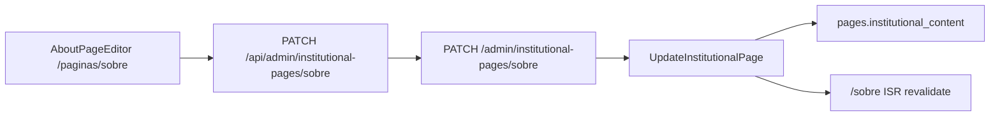

# CMS Editor da página Sobre (Fase 5)

## Contexto

A infraestrutura da Sobre **já está pronta** (migrations, seed, Zod, GET público/admin, vitrine `/sobre`, equipe via `/perfil`). O gap é exclusivamente o **editor Admin** e o **PATCH** que o plano deixou como pendente ([`admin-about-editor`](.cursor/plans/about_contact_pages_d59258c4.plan.md)).

Hoje, `/paginas/sobre` abre erroneamente o [`CMSBlockOrderManager`](<apps/admin/src/app/(dashboard)/paginas/[slug]/page.tsx>) (editor de blocos da home), porque não há ramificação por `pageKind`.



## Escopo desta entrega

| Incluído                                        | Fora de escopo                               |
| ----------------------------------------------- | -------------------------------------------- |
| `AboutPageEditor` com painéis flutuantes        | Preview `?preview=draft` na vitrine          |
| `PATCH /admin/institutional-pages/:slug`        | `/contato` editável via CMS                  |
| Toggle rascunho/publicado no save               | Drag-and-drop / WYSIWYG completo             |
| Revalidação ISR de `/sobre` após save           | Cards de equipe no editor (vêm de `/perfil`) |
| Lista `/paginas` com CTA correto por `pageKind` | Publish workflow da home CMS                 |

---

## 1. Backend — PATCH e use case robusto

### Rota API

Estender [`institutional-routes.ts`](apps/api/src/adapters/http/routes/institutional-routes.ts) em `registerAdminInstitutionalRoutes`:

```typescript
PATCH /admin/institutional-pages/:slug
Body: { content, seoTitle?, seoDescription?, status? }
Response: { layout, content, status, pageKind }
```

- Validar body com schema Zod novo em `packages/shared/src/about/` (ex.: `updateInstitutionalPageBodySchema`)
- Chamar `parseAboutPageContent(body.content)` no adapter (sanitização XSS no write)
- `status` opcional: `draft` | `published`; ao publicar, setar `published_at` se ausente

### Use case `UpdateInstitutionalPage`

Refatorar [`GetInstitutionalPage.ts`](packages/application/src/use-cases/institutional/GetInstitutionalPage.ts):

- Injetar `PublicWebRevalidator` (padrão de [`UpdatePageBlocksOrder`](packages/application/src/use-cases/admin-cms/UpdatePageBlocksOrder.ts))
- Aceitar `status?: PageStatus`
- Auto-atualizar `content.lastUpdated` para data ISO do save (`YYYY-MM-DD`)
- Após persistir: `webRevalidator.revalidate({ paths: ['/sobre'] })`
- Adicionar helper `buildInstitutionalPagePublicPath(slug)` em [`public-cache.helpers.ts`](packages/application/src/cache/public-cache.helpers.ts) — mapear `sobre` → `/sobre`

### Repository

Estender `updateInstitutionalContent` em [`drizzle-page.repository.ts`](packages/infrastructure/src/persistence/repositories/drizzle-page.repository.ts) e port [`PageRepository`](packages/domain/src/repositories/PageRepository.ts):

- Aceitar `status?: PageStatus` e `publishedAt?: Date`
- Atualizar `updated_at` sempre; `published_at` ao transicionar para `published`

### DI

Atualizar wiring em [`api-container.ts`](packages/infrastructure/src/di/api-container.ts) para passar `webRevalidator` ao `UpdateInstitutionalPage`.

### Testes

Novo arquivo `packages/application/src/use-cases/institutional/UpdateInstitutionalPage.test.ts`:

- Salva conteúdo válido e chama revalidate com `/sobre`
- Rejeita `href` externo em `trafficDirection` (via parse)
- Atualiza status draft → published

---

## 2. Admin BFF + client API

### Route Handler Next.js

Criar [`apps/admin/src/app/api/admin/institutional-pages/[slug]/route.ts`](apps/admin/src/app/api/admin/institutional-pages/[slug]/route.ts):

- `GET` → proxy `GET /admin/institutional-pages/:slug`
- `PATCH` → proxy com body JSON

### Clients

| Arquivo                                                | Uso                                   |
| ------------------------------------------------------ | ------------------------------------- |
| `apps/admin/src/lib/api/institutional-pages.ts`        | Server component (`adminFetchParsed`) |
| `apps/admin/src/lib/api/institutional-pages-client.ts` | Client component (save)               |

Schemas de resposta: estender `institutionalPageResponseSchema` com `status` + `pageKind` (`adminInstitutionalPageResponseSchema`).

---

## 3. UI — `AboutPageEditor`

### Roteamento

[`apps/admin/src/app/(dashboard)/paginas/[slug]/page.tsx`](<apps/admin/src/app/(dashboard)/paginas/[slug]/page.tsx>):

1. Buscar página na lista (`listAdminPages`) ou GET institucional
2. Se `pageKind === institutional` → renderizar `AboutPageEditor`
3. Senão → manter `CMSBlockOrderManager`

[`apps/admin/src/app/(dashboard)/paginas/page.tsx`](<apps/admin/src/app/(dashboard)/paginas/page.tsx>):

- CTA condicional: **"Editar conteúdo"** (`institutional`) vs **"Editar blocos"** (`block_layout`)
- Badge opcional de tipo (`Institucional` / `Blocos`)

### Componente principal

Novo diretório `apps/admin/src/components/about/`:

**`AboutPageEditor.tsx`** — client component, `react-hook-form` + `zodResolver` (padrão [`ProfileForm.tsx`](apps/admin/src/components/profile/ProfileForm.tsx)), layout [`11-admin-floating-panels.mdc`](.cursor/rules/11-admin-floating-panels.mdc):

| Painel           | Campos                                                                                                                                                                                                        |
| ---------------- | ------------------------------------------------------------------------------------------------------------------------------------------------------------------------------------------------------------- |
| Contexto + ações | Título da página, status pill, botões **Salvar rascunho** / **Publicar**, link "Ver na vitrine" (`/sobre`)                                                                                                    |
| SEO              | `seoTitle`, `seoDescription` + contadores de caracteres (reutilizar padrão de [`ArticleForm`](apps/admin/src/components/articles/ArticleForm.tsx))                                                            |
| Hero             | `heroTitle`, `heroIntro`                                                                                                                                                                                      |
| Seções fixas (4) | Accordion/tabs por `id` (`proposta`, `metodo`, `afiliados`, `equipe`): `title`, lista editável de `paragraphs`, `listItems` opcional; hint de HTML permitido; `#afiliados` mostra aviso de callout automático |
| Equipe           | `teamSectionIntro` + callout informativo linkando `/perfil`                                                                                                                                                   |
| Próximos passos  | `trafficDirection.title`, `intro`, links (1–3) com `label`, `href` (path `/...`), `description` opcional                                                                                                      |
| Meta             | `lastUpdated` (read-only, atualizado no save)                                                                                                                                                                 |

**Subcomponentes sugeridos** (manter arquivos pequenos):

- `AboutSectionFields.tsx` — field array de parágrafos/listItems
- `AboutTrafficLinksFields.tsx` — field array de links
- `AboutSeoPanel.tsx`

**Validação client-side:** importar `aboutPageContentSchema` de `@ecommerce-amazon/shared/about` — mesma fonte de verdade do backend.

**UX de save:**

- "Salvar rascunho" → `status: draft`
- "Publicar" → `status: published`
- Toast success/error via `useAdminToast`
- `router.refresh()` após save

Não incluir picker de URL interna nesta fase — inputs de path com validação Zod (`href` deve começar com `/`) são suficientes; reutilização do hook `useInternalLinkTargets` fica como melhoria futura.

---

## 4. Documentação

Atualizar [`docs/about-contact-pages.md`](docs/about-contact-pages.md):

- Mover editor de "Fora de escopo" para "Entregue"
- Documentar `PATCH /admin/institutional-pages/:slug`, fluxo Admin, campos editáveis
- Comandos de teste com curl autenticado

Criar [`docs/admin-about-page.md`](docs/admin-about-page.md) (focado, &lt; 150 linhas):

- Rota `/paginas/sobre`, painéis, limitações (equipe via perfil, sem preview draft)
- Como testar manualmente

Indexar em [`docs/README.md`](docs/README.md) e [`AGENTS.md`](AGENTS.md).

---

## Verificação

```bash
npm run build -w @ecommerce-amazon/shared
npm test -w @ecommerce-amazon/application -- UpdateInstitutionalPage
npm test -w @ecommerce-amazon/shared -- src/about

# Fluxo manual:
# 1. Admin :3002 → /paginas → "Editar conteúdo" na Sobre
# 2. Alterar heroTitle → Publicar
# 3. curl GET /institutional-pages/sobre → conteúdo atualizado
# 4. Web :3001/sobre → reflete após revalidate
# 5. Salvar como rascunho → GET público retorna 404 → web usa fallback defaults
```

Checklist de conformidade:

- Painéis flutuantes (regra admin)
- `parseAboutPageContent` no save (XSS)
- Sem dark patterns na seção próximos passos (só links editoriais)
- Código em inglês; labels UI em pt-BR
