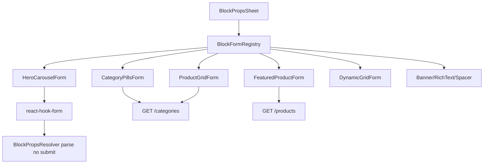

# CMS — Formulários amigáveis (Fase 1)

## Problema

Em [`BlockPropsSheet.tsx`](apps/admin/src/components/cms/BlockPropsSheet.tsx), apenas 4 tipos estão em `EDITABLE_BLOCK_TYPES` ([`block-type-labels.ts`](apps/admin/src/components/cms/block-type-labels.ts)). Os demais caem em [`UnsupportedBlockForm`](apps/admin/src/components/cms/forms/BlockPropsForm.tsx) (dump JSON) — incluindo blocos presentes na home seed:

| Bloco seed home                   | Status hoje                |
| --------------------------------- | -------------------------- |
| `HERO_CAROUSEL`                   | Read-only                  |
| `CATEGORY_PILLS`                  | Read-only                  |
| `PRODUCT_GRID`                    | Read-only                  |
| `FEATURED_PRODUCT`                | Read-only                  |
| `DYNAMIC_PRODUCT_GRID`            | UX amigável (feito)        |
| `BANNER` / `RICH_TEXT` / `SPACER` | Editável, mas copy técnica |

Contratos Zod em [`block-schemas.ts`](packages/shared/src/cms/block-schemas.ts) **já existem** — fase 1 é 100% admin UI + clientes de leitura já expostos (`GET /categories`, `GET /products`).

**Fora desta fase (Fase 2):** `HERO_SPLIT`, `CURATED_COLLECTION`, `COUPON_STRIP` (exigem pickers de blocos da página, listagem de coleções, etc.).

---

## Arquitetura



**Padrão a replicar** (já validado em [`DynamicGridForm.tsx`](apps/admin/src/components/cms/props-forms/DynamicGridForm.tsx)):

- Seções via [`CmsFormSection`](apps/admin/src/components/cms/props-forms/CmsFormSection.tsx)
- Labels + `FormDescription` em pt-BR leigo
- Tema admin navy/azul (`--admin-primary`)
- Mesmo fluxo de submit/validação em `BlockPropsSheet` (Zod manual + `translateZodError`)

**Refator leve:** extrair mapa `BlockType → { schema, FormComponent }` em [`block-form-registry.ts`](apps/admin/src/components/cms/props-forms/block-form-registry.ts) para substituir `switch` + `EDITABLE_BLOCK_TYPES` espalhados.

---

## Formulários — especificação por bloco

### 1. Hero Carousel (`HERO_CAROUSEL`)

Arquivo: [`HeroCarouselForm.tsx`](apps/admin/src/components/cms/props-forms/HeroCarouselForm.tsx)

**Seção "Slides do carrossel"**

- Lista repetível (`useFieldArray`) — botões **Adicionar slide** / **Remover**
- Por slide (campos humanos, mapeados para `heroSlideSchema`):
  - Imagem: URL da imagem + hint "Cole o link da foto (1200×800 recomendado)"
  - Título principal (obrigatório)
  - Subtítulo (opcional)
  - **Destino do botão** (Select):
    - "Sem botão" → omitir `ctaLabel`/`ctaHref`/`linkedProductSlug`
    - "Link para página ou coleção" → `ctaLabel` + `ctaHref` (input URL/caminho)
    - "Destacar um produto" → `ProductPicker` → grava `linkedProductSlug` + `ctaLabel` default "Ver produto"

**Seção "Comportamento"**

- Troca automática: Select Sim/Não → `autoplay`
- Velocidade: Select "Rápido (4s)" / "Normal (6s)" / "Lento (8s)" → `intervalMs` (4000/6000/8000)

Default ao criar bloco: 1 slide vazio válido via `heroCarouselPropsSchema.parse({ slides: [{ imageUrl, title }] })` em `getDefaultBlockProps`.

---

### 2. Pills de Categorias (`CATEGORY_PILLS`)

Arquivo: [`CategoryPillsForm.tsx`](apps/admin/src/components/cms/props-forms/CategoryPillsForm.tsx)

**Seção "Texto"**

- Título opcional da faixa (ex.: "Navegue por categoria")

**Seção "Categorias exibidas"**

- Multi-select amigável: checkboxes com labels de [`getCategoryDisplayLabel`](apps/admin/src/components/cms/props-forms/dynamic-grid-form-meta.ts) alimentadas por `listCategoriesClient()`
- Ordem = ordem de clique/seleção (array `categorySlugs`, min 1)
- Hint: "Escolha quais atalhos aparecem na faixa horizontal"

**Seção "Integração (opcional)"**

- `linkedBlockId`: omitir na fase 1 OU select "Filtrar grade abaixo" passando `pageBlocks` do editor (somente blocos `PRODUCT_GRID` na mesma página) — melhora UX da home seed sem expor UUID cru
- Prop `linkedBlockId` continua UUID no save; UI mostra título do bloco alvo

---

### 3. Grade de Produtos (`PRODUCT_GRID`)

Arquivo: [`ProductGridForm.tsx`](apps/admin/src/components/cms/props-forms/ProductGridForm.tsx) — espelha padrão DynamicGridForm

| Seção     | Campos                        | UI leigo                                                                             |
| --------- | ----------------------------- | ------------------------------------------------------------------------------------ |
| Texto     | `title`                       | Input + hint editorial                                                               |
| Filtros   | `categorySlug`, `marketplace` | Select categoria (incl. "Todas") + Select marketplace (Todas / Amazon / Shopee)      |
| Ordenação | `sort`                        | Select: "Melhor curadoria" / "Preço atualizado recentemente"                         |
| Layout    | `pageSize`, `columns`         | Reutilizar `ProductLimitPicker` adaptado (presets 8/12/16/24) + chips 2 ou 4 colunas |

---

### 4. Produto em Destaque (`FEATURED_PRODUCT`)

Arquivo: [`FeaturedProductForm.tsx`](apps/admin/src/components/cms/props-forms/FeaturedProductForm.tsx)

**Seção "Produto"**

- [`ProductPicker`](apps/admin/src/components/cms/props-forms/ProductPicker.tsx): Select searchable (client-side filter) carregando `GET /products?pageSize=50` via novo `listProductsClient()`
- Exibe título + marketplace; salva `productSlug`

**Seção "Aparência"**

- Switch ou Select "Mostrar badge do marketplace" → `showMarketplaceBadge`
- Texto do botão (opcional) → `ctaLabel` com placeholder "Ver na Amazon"

---

### 5. Melhorar formulários existentes

Migrar para `CmsFormSection` + copy leigo (sem mudar schema):

- [`BannerFormFields`](apps/admin/src/components/cms/forms/BlockPropsForm.tsx) → seções "Imagem" / "Link"
- [`RichTextFormFields`](apps/admin/src/components/cms/forms/BlockPropsForm.tsx) → renomear "HTML" para "Conteúdo" + hint; manter textarea (editor WYSIWYG fora de escopo)
- [`SpacerFormFields`](apps/admin/src/components/cms/forms/BlockPropsForm.tsx) → labels "Espaço pequeno/médio/grande" com preview textual

---

## Componentes compartilhados (novos)

| Componente                                                                                     | Função                                                |
| ---------------------------------------------------------------------------------------------- | ----------------------------------------------------- |
| [`ProductPicker.tsx`](apps/admin/src/components/cms/props-forms/ProductPicker.tsx)             | Select + filtro local; props `value` slug, `onChange` |
| [`CategoryMultiSelect.tsx`](apps/admin/src/components/cms/props-forms/CategoryMultiSelect.tsx) | Checkboxes ordenáveis para `categorySlugs[]`          |
| [`SlideRepeater.tsx`](apps/admin/src/components/cms/props-forms/SlideRepeater.tsx)             | UI add/remove slides para carousel                    |
| [`block-form-registry.ts`](apps/admin/src/components/cms/props-forms/block-form-registry.ts)   | Mapa tipo → schema + componente + defaults            |

**Cliente API:** [`listProductsClient`](apps/admin/src/lib/api/cms-pages-client.ts) parseando `{ items, total, page, pageSize }` (mesmo contrato de [`GET /products`](docs/api-rest.md)).

**UI shadcn a adicionar se necessário:** `Switch` (autoplay/badge) — ou Select Sim/Não para evitar nova dep.

---

## Alterações em arquivos existentes

1. [`block-type-labels.ts`](apps/admin/src/components/cms/block-type-labels.ts) — expandir `EDITABLE_BLOCK_TYPES` + `getDefaultBlockProps` para os 4 novos tipos
2. [`BlockPropsSheet.tsx`](apps/admin/src/components/cms/BlockPropsSheet.tsx):
   - Importar forms via registry
   - Passar `categories`, `products`, `pageBlocks` (lista de blocos da página) como contexto para pickers
   - Registrar schemas Zod adicionais no `getSchemaForType`
3. [`CMSBlockOrderManager.tsx`](apps/admin/src/components/cms/CMSBlockOrderManager.tsx) — passar `blocks` atual para `BlockPropsSheet` (picker linkedBlockId / hero split futuro)
4. [`globals.css`](apps/admin/src/app/globals.css) — classes para slide cards, category checkbox list (se necessário)
5. [`docs/admin-cms-blocks-phase2.md`](docs/admin-cms-blocks-phase2.md) — documentar fase 1 forms + listar fase 2 pendente

---

## Validação

```bash
npm run lint --workspace=@ecommerce-amazon/admin
npm run build --workspace=@ecommerce-amazon/admin
```

Manual em `/paginas/home`:

1. **Configurar** Hero Carousel → adicionar/remover slides, salvar, verificar home
2. **Configurar** Pills → marcar/desmarcar categorias, salvar
3. **Configurar** Grade de Produtos e Produto em Destaque → pickers populados
4. Tipos fase 2 (`HERO_SPLIT`, etc.) continuam com mensagem amigável "Em breve" (substituir JSON dump por copy clara + link para docs)

---

## Fase 2 (referência, não implementar agora)

- `HERO_SPLIT`: picker de blocos irmãos na mesma página
- `CURATED_COLLECTION`: `GET /collections` list + select coleção
- `COUPON_STRIP`: marketplace + quantidade máxima
- Rich text WYSIWYG (TipTap/Quill) — opcional
