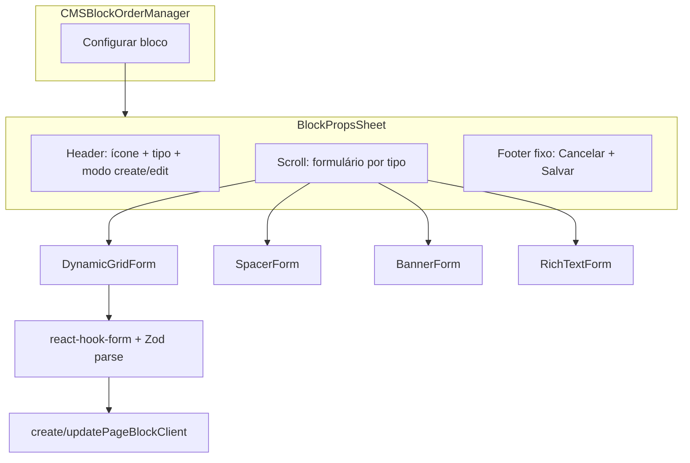

# Plano UX — Edição de Props CMS (Grade Dinâmica + Sheet)

## Diagnóstico

**Estado atual**

- Formulário técnico em [`apps/admin/src/components/cms/forms/BlockPropsForm.tsx`](apps/admin/src/components/cms/forms/BlockPropsForm.tsx): labels como "Score editorial", input numérico para desconto/limit, sem textos de apoio.
- Shell central em [`BlockPropsDialog.tsx`](apps/admin/src/components/cms/BlockPropsDialog.tsx) via `Dialog` (modal no centro).
- Contrato Zod já correto em [`packages/shared/src/cms/block-schemas.ts`](packages/shared/src/cms/block-schemas.ts) — **sem mudança de backend necessária**:

```73:82:packages/shared/src/cms/block-schemas.ts
export const dynamicProductGridPropsSchema = z.object({
  title: z.string().min(3).max(60),
  subtitle: z.string().optional(),
  categoryVertical: z.string().optional(),
  minDiscountPercentage: z.number().min(0).max(100).optional(),
  sortBy: z.enum(['editorial_score', 'created_at', 'price_asc', 'price_desc']).default('editorial_score'),
  limit: z.number().int().min(1).max(24).default(8),
});
```

**Bug a corrigir no mesmo PR**

- `GET /categories` retorna `{ items: [...] }` ([`docs/api-rest.md`](docs/api-rest.md)), mas [`listCategoriesClient`](apps/admin/src/lib/api/cms-pages-client.ts) e [`listCategories`](apps/admin/src/lib/api/cms-pages.ts) fazem `z.array(...).safeParse(payload)` — dropdown de categorias provavelmente vazio hoje.

**Componentes shadcn ausentes**

- `Sheet` (drawer lateral) e `Slider` — instalar Radix deps e adicionar primitivos em `apps/admin/src/components/ui/`.

---

## Arquitetura alvo



**Decisão confirmada:** todos os tipos editáveis migram para **Sheet lateral**; `BlockPropsDialog.tsx` vira `BlockPropsSheet.tsx` (ou renomeia export mantendo import único).

---

## Especificação UI — `DYNAMIC_PRODUCT_GRID`

Novo componente dedicado: [`apps/admin/src/components/cms/props-forms/DynamicGridForm.tsx`](apps/admin/src/components/cms/props-forms/DynamicGridForm.tsx)

Reutiliza `react-hook-form` via `control` (mesmo padrão atual), com seções visuais:

| Seção                     | Campos                                                | Componente                             | Copy leigo                                                                 |
| ------------------------- | ----------------------------------------------------- | -------------------------------------- | -------------------------------------------------------------------------- |
| **1 — Texto da vitrine**  | `title`, `subtitle`                                   | `Input` + `FormDescription`            | Placeholders e hints do prompt ("Ex: Cadeiras Gamer…", subtítulo opcional) |
| **2 — Regras de seleção** | `categoryVertical`, `minDiscountPercentage`, `sortBy` | `Select`, `Slider`, `Select`           | Ver abaixo                                                                 |
| **3 — Layout e limites**  | `limit`                                               | `ProductLimitPicker` (chips 4/8/12/16) | "Recomendado: 4 ou 8 para manter o site rápido."                           |

### Seção 2 — detalhes

**Categoria (`categoryVertical`)**

- Select alimentado por `listCategoriesClient()` (após fix do parse).
- Opção default: `"✨ Todos os produtos do site"` → salva `undefined` (mesmo comportamento `__all__` atual).
- Labels amigáveis via mapa admin [`dynamic-grid-form-meta.ts`](apps/admin/src/components/cms/props-forms/dynamic-grid-form-meta.ts):

```typescript
// slug → { label, emoji } — admin-only, sem alterar API
{ 'home-office': { emoji: '🏠', label: 'Home Office & Escritório' }, ... }
```

Fallback: `label` da API + emoji genérico se slug desconhecido.

**Desconto mínimo (`minDiscountPercentage`)**

- `Slider` Radix: min 0, max 70, step 5.
- Badge dinâmico ao lado: `"Qualquer preço"` (0) ou `"Apenas acima de X% OFF"`.
- Ao salvar: omitir campo se 0 (Zod optional) ou enviar `0` — ambos válidos; preferir omitir para props limpas.

**Ordenação (`sortBy`)**

- Select com copy do prompt (3 opções principais):
  - `editorial_score` → "Recomendações dos Especialistas (Melhor Nota)"
  - `created_at` → "Produtos Adicionados Recentemente"
  - `price_asc` → "Menores Preços Primeiro"
- Se bloco já tiver `price_desc` salvo: exibir opção extra "Maiores preços primeiro" para não quebrar edição de dados existentes.

### Seção 3 — limit

- Chips selecionáveis: **4, 8, 12, 16** (presets do prompt).
- Se valor atual ∉ presets (ex.: seed com 12 ok; valor 10 legado): destacar chip mais próximo visualmente + manter valor real até operador escolher preset.
- Schema continua 1–24; UI restringe escolha a presets (YAGNI: sem input livre na v1).

### Componentes auxiliares

- [`CmsFormSection.tsx`](apps/admin/src/components/cms/props-forms/CmsFormSection.tsx) — título uppercase muted + children (substitui `<h4 className="text-gray-400">` do exemplo, usando tokens `--admin-text-muted`).
- [`ProductLimitPicker.tsx`](apps/admin/src/components/cms/props-forms/ProductLimitPicker.tsx) — chips + integração RHF.
- [`FormDescription`](apps/admin/src/components/ui/form.tsx) — usar para hints (já existe no shadcn form).

**Tema:** navy/azul admin (`--admin-primary`, `--admin-navy`) — **não** usar emerald do exemplo de referência.

---

## Migração Sheet — todos os tipos editáveis

Substituir [`BlockPropsDialog.tsx`](apps/admin/src/components/cms/BlockPropsDialog.tsx):

| Aspecto      | Implementação                                                                                                                                                     |
| ------------ | ----------------------------------------------------------------------------------------------------------------------------------------------------------------- |
| Shell        | `Sheet` + `SheetContent side="right"` largura `sm:max-w-md` ou `max-w-lg`                                                                                         |
| Layout       | `flex flex-col h-full`: header fixo, body `flex-1 overflow-y-auto`, footer `border-t` sticky                                                                      |
| Footer       | "Cancelar" (outline) + "Salvar propriedades" / "Aplicar configurações" (primary)                                                                                  |
| Outros tipos | Manter `SpacerFormFields`, `BannerFormFields`, `RichTextFormFields` no body; aplicar `CmsFormSection` onde fizer sentido (agrupamento leve, sem over-engineering) |
| Import       | Atualizar [`CMSBlockOrderManager.tsx`](apps/admin/src/components/cms/CMSBlockOrderManager.tsx) para importar `BlockPropsSheet`                                    |

CSS opcional em [`globals.css`](apps/admin/src/app/globals.css): `.cms-props-sheet` com borda superior primary (mesmo padrão `.cms-dialog-accent`).

---

## Correção categorias

Em [`cms-pages-client.ts`](apps/admin/src/lib/api/cms-pages-client.ts) e [`cms-pages.ts`](apps/admin/src/lib/api/cms-pages.ts):

```typescript
const categoriesResponseSchema = z.object({
  items: z.array(z.object({ slug: z.string(), label: z.string(), count: z.number().optional() })),
});
// return parsed.data.items.map(({ slug, label }) => ({ slug, label }))
```

---

## Validação e erros

- Manter `schema.parse(values)` no submit (Zod manual, padrão atual — sem `@hookform/resolvers` por incompatibilidade já documentada).
- Mensagens de erro Zod traduzidas no client para campos críticos (`title` min 3 chars → "O título precisa ter pelo menos 3 caracteres").
- Banner de erro no footer do Sheet (`.cms-status-banner.is-error`).

---

## Arquivos principais

| Ação      | Arquivo                                                                                                |
| --------- | ------------------------------------------------------------------------------------------------------ |
| Criar     | `props-forms/DynamicGridForm.tsx`                                                                      |
| Criar     | `props-forms/dynamic-grid-form-meta.ts`                                                                |
| Criar     | `props-forms/CmsFormSection.tsx`                                                                       |
| Criar     | `props-forms/ProductLimitPicker.tsx`                                                                   |
| Criar     | `components/ui/sheet.tsx`, `components/ui/slider.tsx`                                                  |
| Refatorar | `BlockPropsDialog.tsx` → `BlockPropsSheet.tsx`                                                         |
| Reduzir   | `BlockPropsForm.tsx` — extrair DynamicGrid para arquivo novo; demais forms permanecem                  |
| Corrigir  | `cms-pages-client.ts`, `cms-pages.ts`                                                                  |
| CSS       | `globals.css` — classes sheet/section                                                                  |
| Docs      | [`docs/admin-cms-blocks-phase2.md`](docs/admin-cms-blocks-phase2.md) — seção UX Grade Dinâmica + Sheet |

---

## Testes e verificação

1. `npm run lint --workspace=@ecommerce-amazon/admin && npm run build --workspace=@ecommerce-amazon/admin`
2. Manual em `/paginas/home`:
   - Abrir Sheet → 3 seções visíveis, slider desconto reativo, categorias populadas
   - Salvar bloco existente e criar novo → props persistem e vitrine reflete (cache `no-store` web)
   - Limit presets 4/8/12/16
   - SPACER/BANNER/RICH_TEXT abrem no mesmo Sheet
3. Opcional: teste unitário leve em `dynamic-grid-form-meta.ts` (mapa sort labels) — só se agregar valor real

---

## Fora de escopo

- Alterar schema Zod ou use cases backend
- Preview ao vivo da vitrine no admin
- Formulários dos 7 tipos não editáveis (continuam read-only)
- Emojis dinâmicos vindos da API (mapa admin estático é suficiente na v1)
