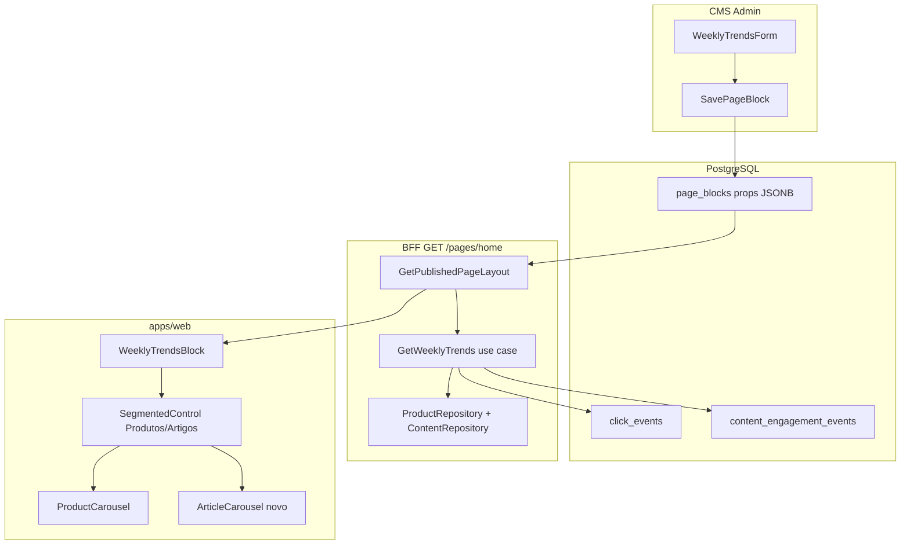
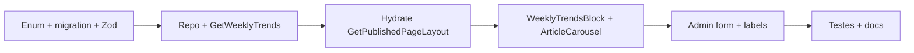

# Bloco CMS "Tendências da Semana"

## Veredito

**Sim, é possível** com as tabelas atuais. Não é necessária nova tabela nem integração GA4 na vitrine.

| Aba          | Fonte de dados                                                                                 | Janela                   | Métrica (decisão)                           |
| ------------ | ---------------------------------------------------------------------------------------------- | ------------------------ | ------------------------------------------- |
| **Produtos** | [`click_events`](packages/infrastructure/src/persistence/drizzle/schema/index.ts)              | últimos 7 dias (rolling) | cliques afiliados (`origin != redirect_go`) |
| **Artigos**  | [`content_engagement_events`](packages/infrastructure/src/persistence/drizzle/schema/index.ts) | últimos 7 dias (rolling) | **page views** (`article_page_view`)        |

**Limitações honestas (não bloqueiam o MVP):**

- Produtos = interesse de **clique**, não page views (GA4 `view_item` ainda não está na vitrine — ver [`.cursor/plans/analytics_integration_ga4_bec34d62.plan.md`](.cursor/plans/analytics_integration_ga4_bec34d62.plan.md))
- Sem "velocidade" semana-a-semana (rising/fast-growing) — apenas ranking absoluto
- Cold start: site novo sem telemetria → bloco **some** da home (padrão `dynamic_product_grid`)

---

## Arquitetura



**Padrão a seguir:** hidratação BFF como [`GetPublishedPageLayout.hydrateDynamicProductGridBlock`](packages/application/src/use-cases/page/GetPublishedPageLayout.ts) — `renderedData` **não** entra no cache Redis do layout base (só props estáticos, TTL 300s).

---

## 1. Domain + Shared (contratos)

### Novo `BlockType`

Em [`packages/domain/src/enums/cms.ts`](packages/domain/src/enums/cms.ts):

```typescript
WEEKLY_TRENDS = 'weekly_trends',
```

Migration: `packages/infrastructure/src/persistence/drizzle/migrations/0011_weekly_trends.sql`

```sql
ALTER TYPE "block_type" ADD VALUE IF NOT EXISTS 'weekly_trends';
```

Atualizar pgEnum em [`packages/infrastructure/src/persistence/drizzle/schema/index.ts`](packages/infrastructure/src/persistence/drizzle/schema/index.ts).

### Props schema

Em [`packages/shared/src/cms/block-schemas.ts`](packages/shared/src/cms/block-schemas.ts):

```typescript
weeklyTrendsPropsSchema = z.object({
  title: z.string().min(3).max(60).default('Tendências da semana'),
  subtitle: z.string().max(120).optional(),
  defaultTab: z.enum(['products', 'articles']).default('products'),
  showTabToggle: z.boolean().default(true),
  limit: z.number().int().min(4).max(12).default(8),
  minItems: z.number().int().min(1).max(8).default(3),
  productsCtaHref: z.string().optional(), // default /categorias
  productsCtaLabel: z.string().max(40).optional(),
  articlesCtaHref: z.string().optional(), // default /artigos
  articlesCtaLabel: z.string().max(40).optional(),
});
```

### Delivery DTO (hidratação)

Estender `pageBlockDeliverySchema`:

```typescript
articleTrendDeliveryItemSchema = z.object({
  id, slug, title, excerpt, coverImageUrl, publishedAt, categoryLabel?
});

weeklyTrendsRenderedSchema = z.object({
  products: z.array(productDeliveryItemSchema),
  articles: z.array(articleTrendDeliveryItemSchema),
  periodLabel: z.string(), // ex.: "últimos 7 dias"
});

// pageBlockDeliverySchema
renderedWeeklyTrends: weeklyTrendsRenderedSchema.optional()
```

Registrar em `BlockPropsMap`, `BlockPropsResolver`, `stripRenderedData()`.

---

## 2. Application layer

### Novo use case `GetWeeklyTrends`

Arquivo: `packages/application/src/use-cases/trends/GetWeeklyTrends.ts`

**Dependências:** `AnalyticsRepository`, `EngagementAnalyticsRepository`, `ProductRepository`, `ContentRepository` (via DI em [`api-container.ts`](packages/infrastructure/src/di/api-container.ts)).

**Lógica:**

1. `from = now - 7d`, `to = now` (helper reutilizando `resolveAnalyticsDateRange` com override)
2. **Produtos:** `analyticsRepository.getTopClickedProducts(from, to, limit * 2)` — buffer para filtrar invisíveis/stale compliance
3. Enriquecer com `productRepository.findByIds` preservando ordem de ranking
4. Aplicar [`applyPriceComplianceToProducts`](packages/application/src/services/apply-price-compliance.js)
5. Filtrar `visible === true`; slice até `limit`
6. **Artigos:** extrair método público `getTopArticlesByEngagementEvent` do [`drizzle-analytics.repository.ts`](packages/infrastructure/src/persistence/repositories/drizzle-analytics.repository.ts) (hoje `private`, `limit=5` fixo) → interface `EngagementAnalyticsRepository.getTopArticlesByEvent(from, to, eventType, limit)` com filtro `status = 'published'`
7. Enriquecer com capa, excerpt, categoria via `contentRepository`
8. Retornar `{ products, articles, periodLabel: 'últimos 7 dias' }`

**Regras de negócio:**

- Usar `CompositeAnalyticsRepository` (já mergeia buffer Redis de telemetria pendente)
- Excluir `ClickOrigin.REDIRECT_GO` (já feito no repo)
- Não inventar badges de urgência; ranking é interno, não exibido ao visitante no MVP

### Hidratação em `GetPublishedPageLayout`

Adicionar branch `BlockType.WEEKLY_TRENDS` em `hydrateBlock()`:

- Parse props → chama `GetWeeklyTrends.execute(props)`
- Se **ambas** as abas tiverem `< minItems` itens → retorna bloco **sem** `renderedWeeklyTrends` (web oculta)
- Se só uma aba tem dados → toggle mostra só aba com dados (UX adaptativa)

Injetar `GetWeeklyTrends` no construtor de `GetPublishedPageLayout`.

---

## 3. Analytics repository (ajuste mínimo)

Em [`packages/domain/src/repositories/AnalyticsRepository.ts`](packages/domain/src/repositories/AnalyticsRepository.ts):

```typescript
// EngagementAnalyticsRepository
getTopArticlesByEvent(
  from: Date, to: Date,
  eventType: EngagementEventTypeValue,
  limit: number,
): Promise<EditorialFunnelArticleStage[]>;
```

Implementação em `drizzle-analytics.repository.ts`:

- Promover `getTopArticlesByEngagementEvent` para método público
- Adicionar `eq(contentArticles.status, 'published')` no JOIN/WHERE
- Propagar em `composite-analytics.repository.ts` (merge buffer engagement se existir)

Em `getTopClickedProducts`: adicionar `eq(products.visible, true)` no WHERE para consistência.

---

## 4. Web — UI/UX Gold Standard

### Novo componente `WeeklyTrendsBlock`

Arquivo: [`apps/web/src/components/blocks/WeeklyTrendsBlock.tsx`](apps/web/src/components/blocks/WeeklyTrendsBlock.tsx)

**Layout:**

```
┌─────────────────────────────────────────────────────┐
│ Tendências da semana                    [Produtos|Artigos] │
│ Baseado na atividade dos últimos 7 dias           │
├─────────────────────────────────────────────────────┤
│  ← [card] [card] [card] [card] [card] →  (carousel) │
│                              Ver catálogo completo ➔ │
└─────────────────────────────────────────────────────┘
```

**Toggle (segmented control):**

- `role="tablist"` / `role="tab"` / `role="tabpanel"` — acessível por teclado
- Estado client-side (`useState`), inicial = `props.defaultTab`
- Se `showTabToggle: false` → renderiza só a aba default
- Se aba ativa vazia mas outra tem dados → auto-switch silencioso para aba com dados
- Labels honestos nas abas: **"Produtos"** / **"Artigos"** (não "Populares" genérico)

**Copy (pt-BR, conforme regras de afiliado):**

- Subtítulo fixo sugerido: _"Baseado na atividade dos últimos 7 dias"_
- **Sem** badge "Em alta", countdown ou contagem de pessoas (dark patterns proibidos em [`.cursor/rules/01-business-compliance.mdc`](.cursor/rules/01-business-compliance.mdc))
- CTA rodapé contextual: produtos → `/categorias`; artigos → `/artigos`

**Produtos:** reutilizar [`ProductCarousel`](apps/web/src/components/product/ProductCarousel.tsx) com:

- `placement={ClickPlacement.CMS_WEEKLY_TRENDS}` (novo em [`placements.ts`](packages/shared/src/analytics/placements.ts))
- `cardVariant="compact"`, `slideSize="sm"` (alinhado a flash deals)
- Respeitar stale price via `PriceDisplay` existente

**Artigos:** novo [`ArticleCarousel`](apps/web/src/components/articles/ArticleCarousel.tsx) espelhando `ProductCarousel`:

- Reutiliza [`ArticleCard`](apps/web/src/components/articles/ArticleCard.tsx)
- `engagementPlacement={ClickPlacement.CMS_WEEKLY_TRENDS}` + adicionar em `ENGAGEMENT_PLACEMENT_VALUES`
- Skeleton: reutilizar `ArticleCardSkeleton`

**Empty state:** `return null` se `renderedWeeklyTrends` ausente ou aba ativa < `minItems` (mesmo padrão de `DynamicProductGridBlock`).

### Registro

- [`BlockRegistry.tsx`](apps/web/src/components/cms/BlockRegistry.tsx) → `weekly_trends: WeeklyTrendsBlock`
- Atualizar `stripRenderedData` types no web se necessário

---

## 5. Admin CMS

Seguindo [`.cursor/rules/11-admin-floating-panels.mdc`](.cursor/rules/11-admin-floating-panels.mdc):

### `WeeklyTrendsForm`

Arquivo: `apps/admin/src/components/cms/props-forms/WeeklyTrendsForm.tsx`

Campos:

- Título, subtítulo (opcional)
- Aba padrão (select)
- Mostrar toggle (switch)
- Quantidade de itens (4–12)
- Mínimo para exibir (1–8, default 3)
- CTAs opcionais (href + label) por aba

Registrar em:

- [`block-form-registry.ts`](apps/admin/src/components/cms/props-forms/block-form-registry.ts)
- [`block-type-labels.ts`](apps/admin/src/components/cms/block-type-labels.ts) → `"Tendências da semana"`
- [`block-type-meta.ts`](apps/admin/src/components/cms/block-type-meta.ts) → descrição: _"Ranking automático dos últimos 7 dias. Produtos por cliques; artigos por leituras."_
- [`BlockPropsSheet.tsx`](apps/admin/src/components/cms/BlockPropsSheet.tsx) dispatch

**Preview admin:** bloco pode aparecer vazio com meta _"Exibido na vitrine apenas quando houver dados suficientes"_ — sem mock de produtos fake.

---

## 6. Telemetria e atribuição

Novos placements em [`packages/shared/src/analytics/placements.ts`](packages/shared/src/analytics/placements.ts):

```typescript
CMS_WEEKLY_TRENDS: 'cms.weekly_trends',
```

- Cliques afiliados de produtos: `placement=cms.weekly_trends`, `blockId` do bloco
- Engagement artigos: `article_card_click` com mesmo placement
- Permite medir eficácia do bloco no dashboard admin existente (`getClicksByBlock`, funnel editorial)

---

## 7. Testes

| Camada         | Arquivo                                | Cenários                                                                              |
| -------------- | -------------------------------------- | ------------------------------------------------------------------------------------- |
| Application    | `GetWeeklyTrends.test.ts`              | ranking preservado; filtra invisíveis; cold start retorna vazio; artigos só published |
| Infrastructure | `drizzle-analytics.repository.test.ts` | `getTopArticlesByEvent` com status filter                                             |
| Web            | `WeeklyTrendsBlock.test.tsx`           | toggle a11y; auto-switch aba; null quando vazio; tracking placement                   |
| Shared         | `block-schemas.test.ts`                | parse defaults de `weeklyTrendsPropsSchema`                                           |

Rodar lint nos pacotes alterados antes de concluir.

---

## 8. Documentação

Criar [`docs/cms-weekly-trends-block.md`](docs/cms-weekly-trends-block.md):

- O quê / por quê (liga ao PRD vitrine + hub de conteúdo)
- Métricas e limitações honestas
- Props do bloco + delivery DTO
- Fluxo BFF + diagrama
- Como testar localmente (seed telemetria ou aguardar tráfego real)
- Próximos passos: GA4 `view_item`, WoW velocity, rollup `click_daily_aggregates`

Atualizar [`docs/README.md`](docs/README.md) e [`AGENTS.md`](AGENTS.md) com link.

---

## 9. Ordem de implementação



**Fora de escopo desta entrega:**

- Seed automático na home (operador adiciona bloco manualmente via `/paginas/home`)
- Endpoint público `GET /trends` separado (dados vêm só via BFF do layout)
- Métrica configurável de artigos (fixo em page views por decisão do usuário; extensível depois via prop `articleMetric` se necessário)
- Badges "subiu X posições" / velocity semana-a-semana

---

## Riscos e mitigações

| Risco                        | Mitigação                                                                                                 |
| ---------------------------- | --------------------------------------------------------------------------------------------------------- |
| Poucos dados no lançamento   | `minItems` + bloco oculto; operador informado no admin                                                    |
| Query extra por request home | Hidratação fora do cache base; opcional cache `vitrine:trends:7d` TTL 15min (fase 1.1 se perf necessário) |
| Copy enganosa "mais popular" | Subtítulo "atividade dos últimos 7 dias"; sem badges de urgência                                          |
| Produtos stale no ranking    | Manter no carrossel com pill stale + CTA transparente (regra 24h)                                         |
