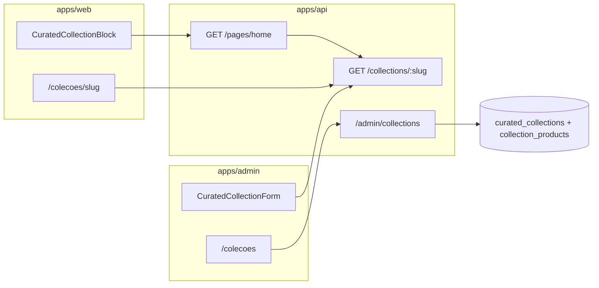
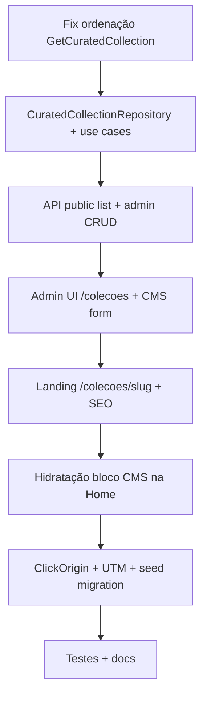

# Coleções Curadas — Plano de Implementação Gold

## Contexto: o que já existe (~25%)

A fundação backend **não precisa ser recriada**. O monorepo já tem:

| Camada          | Status  | Arquivo-chave                                                                                                                                                                                         |
| --------------- | ------- | ----------------------------------------------------------------------------------------------------------------------------------------------------------------------------------------------------- |
| Schema M:N      | Pronto  | [`packages/infrastructure/src/persistence/drizzle/schema/index.ts`](packages/infrastructure/src/persistence/drizzle/schema/index.ts) — `curated_collections` + `collection_products` com `sort_order` |
| Entidade        | Pronto  | [`packages/domain/src/entities/ContentArticle.ts`](packages/domain/src/entities/ContentArticle.ts) — campos extras vs sua spec: `campaignOrigin`, `utmDefaults`, `ctaText`                            |
| Leitura pública | Pronto  | [`GetCuratedCollection`](packages/application/src/use-cases/content/GetCuratedCollection.ts) + `GET /collections/:slug`                                                                               |
| Seed demo       | Pronto  | `setup-gamer-iniciante` com 2 produtos em [`seed.ts`](packages/infrastructure/src/persistence/drizzle/seed.ts)                                                                                        |
| Admin           | Stub    | [`apps/admin/src/app/(dashboard)/colecoes/page.tsx`](<apps/admin/src/app/(dashboard)/colecoes/page.tsx>)                                                                                              |
| Web bloco CMS   | Stub    | [`CuratedCollectionBlock.tsx`](apps/web/src/components/blocks/CuratedCollectionBlock.tsx)                                                                                                             |
| Landing pública | Ausente | —                                                                                                                                                                                                     |

**Decisão confirmada:** rota canônica **`/colecoes/[slug]`** (migrar seed e placeholders que hoje usam `/c/...`).



---

## Gap crítico a corrigir primeiro: ordenação editorial

O repositório já ordena `productIds` por `sort_order`, mas [`GetCuratedCollection`](packages/application/src/use-cases/content/GetCuratedCollection.ts) chama `findByIds()` sem reordenar o resultado — os produtos chegam em ordem arbitrária do SQL.

**Correção** em `GetCuratedCollection.execute()`:

```typescript
const byId = new Map(products.map((p) => [p.id, p]));
const ordered = collection.productIds
  .map((id) => byId.get(id))
  .filter((p): p is Product => p !== undefined);
```

Mesma lógica deve valer na hidratação do bloco CMS (abaixo).

---

## Fase 1 — Domain + Application + API

### 1.1 Novo port `CuratedCollectionRepository`

Seguir o padrão de [`CategoryRepository`](packages/domain/src/repositories/CategoryRepository.ts) (CRUD completo), separado do read-only [`ContentRepository`](packages/domain/src/repositories/ContentRepository.ts):

```typescript
interface CuratedCollectionRepository {
  listAll(): Promise<CuratedCollectionSummary[]>;
  findById(id: string): Promise<CuratedCollection | null>;
  findBySlug(slug: string): Promise<CuratedCollection | null>;
  save(collection: CuratedCollection): Promise<void>;
  delete(id: string): Promise<void>;
}
```

- `CuratedCollectionSummary`: `{ id, slug, title, productCount }` para listagens leves (CMS picker + admin).
- Implementação: `DrizzleCuratedCollectionRepository` — transação atômica em `save`: upsert coleção + delete/insert pivot `collection_products` com `sort_order`.
- Refatorar `DrizzleContentRepository.findCollectionBySlug` para delegar ao novo repo (evitar duplicação).

### 1.2 Use cases (application)

| Use case                  | Função                                                             |
| ------------------------- | ------------------------------------------------------------------ |
| `GetCuratedCollection`    | Corrigir ordenação + manter cache `vitrine:collection:slug:{slug}` |
| `ListCuratedCollections`  | Lista resumida (público leve + admin)                              |
| `CreateCuratedCollection` | UUID, validação slug único, ≥1 produto                             |
| `UpdateCuratedCollection` | Atualiza metadados + reescreve pivot                               |
| `DeleteCuratedCollection` | Cascade já existe no schema                                        |

**Cache invalidation:** em create/update/delete, `cache.del('vitrine:collection:slug:{slug}')` e `INCR cache:version:product:{id}` para cada produto membro (padrão worker/API).

### 1.3 Schemas Zod compartilhados

Novo [`packages/shared/src/admin/collection-schemas.ts`](packages/shared/src/admin/collection-schemas.ts):

- `createCollectionBodySchema` / `updateCollectionBodySchema`
- Campos: `slug`, `title`, `description`, `coverImageUrl`, `campaignOrigin` (`pinterest \| tiktok \| instagram \| organico`), `utmDefaults` (record), `ctaText`, `productIds: string[]` (ordem = índice do array)
- `adminCollectionSchema`, `adminCollectionsResponseSchema`
- Export em [`packages/shared/src/admin/index.ts`](packages/shared/src/admin/index.ts)

### 1.4 Rotas API

**Públicas** ([`apps/api/src/adapters/http/routes/index.ts`](apps/api/src/adapters/http/routes/index.ts)):

- `GET /collections` — `{ items: [{ slug, title, coverImageUrl }] }` (CMS picker)
- `GET /collections/:slug` — já existe; adicionar presenter/DTO tipado em [`apps/web/src/lib/api/schemas.ts`](apps/web/src/lib/api/schemas.ts) para o frontend

**Admin** — novo [`admin-collection-routes.ts`](apps/api/src/adapters/http/routes/admin-collection-routes.ts), espelhando [`admin-category-routes.ts`](apps/api/src/adapters/http/routes/admin-category-routes.ts):

```
GET    /admin/collections
POST   /admin/collections
PATCH  /admin/collections/:id
DELETE /admin/collections/:id
```

Registrar em [`admin-routes.ts`](apps/api/src/adapters/http/routes/admin-routes.ts) + wiring no [`api-container.ts`](packages/infrastructure/src/di/api-container.ts).

### 1.5 Migração opcional (recomendada)

[`0006_curated_collections_constraints.sql`](packages/infrastructure/src/persistence/drizzle/migrations/):

- `UNIQUE (collection_id, product_id)` na pivot — evita duplicata editorial
- `created_at` / `updated_at` em `curated_collections` — suporta copy "Atualizado em …" na landing (sua spec editorial)

Sem alterar campos já seedados (`campaignOrigin`, `utmDefaults`, `ctaText`).

---

## Fase 2 — Admin (`apps/admin`)

### 2.1 Listagem + CRUD em Sheet

Substituir empty state por padrão [`CategoryTreeManager`](apps/admin/src/components/categories/CategoryTreeManager.tsx) adaptado para lista plana:

```
colecoes/page.tsx (RSC fetch)
  └─ CollectionListManager (client)
       ├─ cms-editor-section + cms-float-panel (regra 11-admin-floating-panels)
       ├─ CollectionListView — cards cms-block-card--plain
       ├─ CollectionFormSheet — create/edit
       └─ AlertDialog — delete
```

**Novos arquivos:**

- `apps/admin/src/components/collections/CollectionListManager.tsx`
- `apps/admin/src/components/collections/CollectionFormSheet.tsx`
- `apps/admin/src/components/collections/CollectionListView.tsx`
- `apps/admin/src/components/collections/ProductMultiSelect.tsx` — adaptar [`CategoryMultiSelect`](apps/admin/src/components/cms/props-forms/CategoryMultiSelect.tsx): checklist + lista ordenada com botões ↑↓ (sem drag-drop; projeto não usa `@dnd-kit`)
- Busca de produtos via `listProductsClient()` existente

**Campos do formulário:**

- Título, slug (auto `slugifyTitle`), descrição editorial
- URL da capa (`coverImageUrl`)
- Origem campanha + UTM defaults (chips ou pares chave/valor simples)
- Texto CTA padrão (`ctaText`)
- Seletor de produtos ordenados

### 2.2 BFF Next.js

Espelhar categorias:

- `apps/admin/src/lib/api/collections.ts` (server `adminFetch`)
- `apps/admin/src/app/api/admin/collections/route.ts`
- `apps/admin/src/app/api/admin/collections/[id]/route.ts`

### 2.3 Form CMS do bloco `curated_collection`

Registrar em [`block-form-registry.ts`](apps/admin/src/components/cms/props-forms/block-form-registry.ts):

- `CuratedCollectionForm.tsx` — `Select` de coleções via `GET /collections` + toggle `layout: carousel | grid`
- Remover de `PHASE2_BLOCK_TYPES`

---

## Fase 3 — Web pública (`apps/web`)

### 3.1 Landing `/colecoes/[slug]`

Novo [`apps/web/src/app/colecoes/[slug]/page.tsx`](apps/web/src/app/colecoes/[slug]/page.tsx) — espelhar padrão SEO de [`categorias/[slug]/page.tsx`](apps/web/src/app/categorias/[slug]/page.tsx):

- `generateMetadata`: `title`, `description` da coleção, `canonical: /colecoes/{slug}`
- JSON-LD `CollectionPage` — novo helper em [`packages/shared/src/seo/`](packages/shared/src/seo/) (reutilizar padrão de `buildCategoryCollectionJsonLd`)
- Header editorial: badge "Coleção especializada", `h1`, `description`, linha "Atualizado em {updatedAt}" quando migration aplicada
- Grid numerado (badge `order + 1`) com [`ProductCard`](apps/web/src/components/product/ProductCard.tsx)
- Disclaimer afiliado visível (regra `01-business-compliance`)
- CTA transparente com `collection.ctaText` onde aplicável

**API client:** `apps/web/src/lib/api/collections.ts` + schemas Zod em `schemas.ts`.

### 3.2 Bloco CMS na Home

Reescrever [`CuratedCollectionBlock.tsx`](apps/web/src/components/blocks/CuratedCollectionBlock.tsx):

- Layout **grid** (default): capa + título + descrição resumida + preview 3–4 produtos + botão **"Ver coleção"** → `/colecoes/{slug}`
- Layout **carousel**: scroll horizontal de `ProductCard` + mesmo CTA
- Consumir `block.renderedData` (produtos já hidratados) — mesmo padrão de [`DynamicProductGridBlock`](apps/web/src/components/blocks/DynamicProductGridBlock.tsx)

**Hidratação server-side** em [`GetPublishedPageLayout`](packages/application/src/use-cases/page/GetPublishedPageLayout.ts):

- Estender `hydrateBlock()` para `BlockType.CURATED_COLLECTION`
- Injetar `GetCuratedCollection` no construtor
- Anexar `renderedData: orderedProducts.map(toProductDeliveryItem)` + metadados da coleção em campo opcional `renderedCollection` no DTO (ou embutir título/capa nos props enriquecidos)

Atualizar [`PageBlockDeliveryDto`](packages/shared/src/cms/block-schemas.ts) com `renderedCollection?: { title, description, coverImageUrl, slug, ctaText }`.

### 3.3 Migração de links

Atualizar referências `/c/` → `/colecoes/`:

- [`seed.ts`](packages/infrastructure/src/persistence/drizzle/seed.ts) — `ctaHref` do hero carousel e `href` do bento tile
- Placeholders admin: [`HeroCarouselForm`](apps/admin/src/components/cms/props-forms/HeroCarouselForm.tsx), [`CategoryBentoGridForm`](apps/admin/src/components/cms/props-forms/CategoryBentoGridForm.tsx), [`colecoes/page.tsx`](<apps/admin/src/app/(dashboard)/colecoes/page.tsx>)

---

## Fase 4 — Telemetria e conformidade

### Click tracking

Adicionar `ClickOrigin.COLLECTION = 'coleção'` em [`packages/domain/src/enums/index.ts`](packages/domain/src/enums/index.ts) e schema de [`POST /events/click`](apps/api/src/adapters/dtos/request/schemas.ts).

Passar `origin: 'coleção'` nos CTAs de `ProductCard` renderizados na landing e no bloco CMS (`blockId` + contexto coleção).

### UTM em links afiliados

Na landing, propagar `collection.utmDefaults` ao construir URLs `/go/:slug` (via query params ou contexto no redirect handler existente) — alinhado à regra Growth "1 coleção = 1 campanha social".

### Fora de escopo desta entrega (documentar como próximo passo)

- **Batch wishlist** "Adicionar todos à lista" (mencionado no PRD; depende de fluxo wishlist já existente)
- Redirect 301 `/c/*` → `/colecoes/*` (não solicitado; links internos serão migrados)
- Drag-and-drop no admin (botões ↑↓ suficientes para MVP Gold)

---

## Fase 5 — Testes e documentação

### Testes Vitest

- `GetCuratedCollection` — preserva `sort_order` com IDs fora de ordem no DB
- `CreateCuratedCollection` / `UpdateCuratedCollection` — slug duplicado, pivot rewrite
- `GetPublishedPageLayout` — bloco `curated_collection` recebe `renderedData` ordenado
- `buildCuratedCollectionJsonLd` — smoke test SEO

### Documentação ([`docs/curated-collections.md`](docs/curated-collections.md))

- O quê / por quê (link PRD)
- Fluxo admin → API → web
- Rotas, DTOs, env vars (nenhuma nova)
- Como testar: seed → `/colecoes/setup-gamer-iniciante` + bloco na home
- Próximos passos: batch wishlist, redirect legado

Atualizar índices: [`docs/README.md`](docs/README.md), [`docs/api-rest.md`](docs/api-rest.md), [`docs/admin-app-phase1.md`](docs/admin-app-phase1.md).

---

## Ordem de execução recomendada



## Arquivos com maior impacto

| Área           | Criar                                                    | Modificar                                     |
| -------------- | -------------------------------------------------------- | --------------------------------------------- |
| Domain         | `CuratedCollectionRepository.ts`                         | `enums/index.ts`                              |
| Application    | `admin-collection/*.ts`, fix `GetCuratedCollection`      | `GetPublishedPageLayout.ts`, `index.ts`       |
| Infrastructure | `drizzle-curated-collection.repository.ts`, migration    | `api-container.ts`, `seed.ts`                 |
| Shared         | `admin/collection-schemas.ts`, SEO helper                | `cms/block-schemas.ts`, `admin/index.ts`      |
| API            | `admin-collection-routes.ts`                             | `index.ts`, `admin-routes.ts`                 |
| Admin          | `components/collections/*`, BFF routes                   | `colecoes/page.tsx`, `block-form-registry.ts` |
| Web            | `app/colecoes/[slug]/page.tsx`, `lib/api/collections.ts` | `CuratedCollectionBlock.tsx`, `schemas.ts`    |
