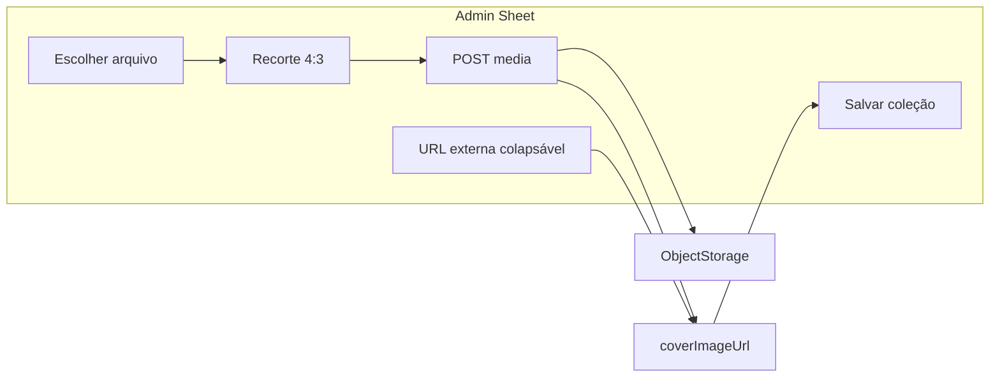

# Evolução do Drawer/Sheet de Coleções (Admin)

## Contexto

O CRUD de coleções usa [`CollectionFormSheet.tsx`](apps/admin/src/components/collections/CollectionFormSheet.tsx) — um **Sheet lateral** (não Drawer) com formulário plano, sem hints, sem preview de capa e sem upload. Referências de qualidade já existentes no monorepo:

| Referência | O que reutilizar |
|------------|------------------|
| [`CategoryFormSheet.tsx`](apps/admin/src/components/categories/CategoryFormSheet.tsx) | `cms-props-sheet`, `<form>`, `fieldset`/`legend`, footer fixo, slug colapsável, validação pré-submit |
| [`ArticleFieldHint.tsx`](apps/admin/src/components/articles/ArticleFieldHint.tsx) | Tooltips via ícone `CircleHelp` + `title`/`aria-label` (padrão atual do admin — não há componente Radix Tooltip) |
| [`ProfileAvatarPanel.tsx`](apps/admin/src/components/profile/ProfileAvatarPanel.tsx) | File picker estilizado, micro-hints, fluxo escolher → recortar → enviar |
| [`ArticleForm.tsx`](apps/admin/src/components/articles/ArticleForm.tsx) | Preview de capa + hint de onde a imagem aparece |

A capa é exibida no carrossel home ([`CuratedCollectionSlide.tsx`](apps/web/src/components/blocks/CuratedCollectionSlide.tsx)) — metade esquerda do slide, `object-cover`, ~340px altura desktop. **Não** aparece na landing `/colecoes/[slug]` (só título + descrição + grid).



---

## 1. Reestruturar UX do Sheet

Refatorar [`CollectionFormSheet.tsx`](apps/admin/src/components/collections/CollectionFormSheet.tsx) para alinhar com [`CategoryFormSheet.tsx`](apps/admin/src/components/categories/CategoryFormSheet.tsx):

**Layout**
- `SheetContent` com `cms-props-sheet flex flex-col p-0 sm:max-w-lg`
- Header com borda inferior + descrição revisada (explicar home vs landing)
- Corpo scrollável (`flex-1 overflow-y-auto px-6 py-5`)
- Footer fixo (`shrink-0 border-t px-6 py-4`) com Cancelar / Salvar
- Envolver em `<form onSubmit>` com `type="submit"` no botão Salvar

**Seções (`fieldset` + `legend`)**

| Seção | Campos |
|-------|--------|
| **Identificação** | Título*, Descrição editorial*, Slug (oculto por padrão — link "Personalizar slug" como categorias) |
| **Capa** | Novo `CollectionCoverField` (upload + preview + URL colapsável) |
| **Campanha e rastreio** | Origem da campanha, UTMs (labels em pt-BR), texto do CTA |
| **Produtos** | `ProductMultiSelect` |

**Tooltips (hints)** — criar [`CollectionFieldHint.tsx`](apps/admin/src/components/collections/CollectionFieldHint.tsx) reexportando o mesmo markup de `ArticleFieldHint` (evita acoplamento cross-módulo). Textos sugeridos:

- **Título**: "Nome da coleção no carrossel da home e no cabeçalho da página `/colecoes/...`."
- **Descrição**: "Texto editorial exibido no slide da home e na landing. Explique o tema da seleção."
- **Slug**: "URL em kebab-case. Evite alterar após divulgar em redes sociais."
- **Capa**: "Imagem do slide na home (bloco Coleções curadas). Não aparece na landing de produtos."
- **Origem da campanha**: "Canal principal da campanha social. Preenche UTMs sugeridas quando vazias."
- **UTM source/medium/campaign**: "Parâmetros anexados aos links `/go/...` para medir cliques por canal."
- **CTA**: "Texto do botão branco no slide da home (ex.: 'Ver coleção')."
- **Produtos**: "Ordem = narrativa do passo a passo na landing. Mínimo 1 produto."

**Melhorias de fluxo**
- Marcar campos obrigatórios com `*` (title, description, cover, ≥1 produto, ctaText — conforme [`collection-schemas.ts`](packages/shared/src/admin/collection-schemas.ts))
- **Validação client-side** antes do fetch (mensagens em pt-BR, como [`AutoLinkFormSheet`](apps/admin/src/components/auto-links/AutoLinkFormSheet.tsx))
- **Auto-preenchimento de UTMs** ao mudar `campaignOrigin` (somente se campos vazios):

```ts
const CAMPAIGN_UTM_SUGGESTIONS = {
  pinterest: { utm_source: 'pinterest', utm_medium: 'social' },
  tiktok: { utm_source: 'tiktok', utm_medium: 'social' },
  instagram: { utm_source: 'instagram', utm_medium: 'social' },
  organico: {},
};
// utm_campaign sugerido a partir do slug quando vazio
```

- Caixa informativa na seção Campanha: "Links de afiliado usam `ClickOrigin.COLLECTION` + UTMs na query."

**Pequeno ajuste em** [`ProductMultiSelect.tsx`](apps/admin/src/components/collections/ProductMultiSelect.tsx): mensagem "Nenhum produto encontrado" quando filtro não retorna itens.

---

## 2. Componentes reutilizáveis de imagem (extrair do perfil)

Generalizar o que hoje está acoplado ao avatar:

| Novo arquivo | Origem | Responsabilidade |
|--------------|--------|------------------|
| [`apps/admin/src/lib/admin-image-crop.ts`](apps/admin/src/lib/admin-image-crop.ts) | `profile-avatar-crop.ts` | `loadImage`, `getCroppedImageBlob(src, crop, { width, height, quality })` |
| [`apps/admin/src/components/admin/AdminImageCropDialog.tsx`](apps/admin/src/components/admin/AdminImageCropDialog.tsx) | `ProfileAvatarCropDialog` | Props: `aspect`, `cropShape`, `title`, `description`, `outputSize` |
| [`apps/admin/src/components/admin/AdminImageFilePicker.tsx`](apps/admin/src/components/admin/AdminImageFilePicker.tsx) | markup de `ProfileAvatarPanel` | Input oculto + botão "Escolher arquivo" + nome do arquivo + micro-hint |

**CSS** em [`globals.css`](apps/admin/src/app/globals.css):
- Renomear/generalizar classes `.admin-profile-file-picker*` → `.admin-image-file-picker*` (manter aliases temporários no perfil ou atualizar `ProfileAvatarPanel` para usar as novas classes — diff pequeno).

**Refatorar perfil** (mínimo): `ProfileAvatarCropDialog` passa a delegar para `AdminImageCropDialog` com `aspect={1}`, `cropShape="round"`, `outputSize={512}`; `ProfileAvatarPanel` usa `AdminImageFilePicker`.

---

## 3. Campo de capa da coleção

Novo [`CollectionCoverField.tsx`](apps/admin/src/components/collections/CollectionCoverField.tsx):

**Estado principal (upload)**
- Preview retangular (`aspect-[4/3]`, max ~280px) quando `coverImageUrl` preenchido
- `AdminImageFilePicker` → abre `AdminImageCropDialog` (aspect **4:3**, retangular, saída **1200×900** JPEG)
- Ao confirmar recorte: upload imediato via API → atualiza `coverImageUrl` no form
- Status inline ("Enviando capa…" / erro) + `useAdminToast`

**Opção secundária (colapsável)**
- Botão/link "Usar URL externa" expande campo `Input` (padrão [`ArticleForm`](apps/admin/src/components/articles/ArticleForm.tsx))
- Hint: "Priorize imagens horizontais com licença adequada."

**Props**: `value`, `onChange`, `disabled?`

---

## 4. Backend — upload gerenciado de imagens admin

Endpoint genérico (reutilizável por artigos no futuro), espelhando avatar:

| Camada | Arquivo |
|--------|---------|
| Validação | `packages/application/src/use-cases/admin-media/validate-admin-image.ts` — extrair de `validate-avatar-image.ts` (mesmas regras: JPG/PNG/GIF/WebP, ≤5 MiB) |
| Use case | `packages/application/src/use-cases/admin-media/UploadAdminImage.ts` — `objectStorage.put({ key: 'admin/images/{uuid}.jpg', ... })` → `{ url }` |
| API | `apps/api/src/adapters/http/routes/admin-media-routes.ts` — `POST /admin/media/images` (multipart, auth admin) |
| DI | registrar em [`api-container.ts`](packages/infrastructure/src/di/api-container.ts) |
| BFF admin | `apps/admin/src/app/api/admin/media/images/route.ts` — proxy `adminFetchMultipart` |
| Client | `apps/admin/src/lib/api/admin-media-client.ts` — `uploadAdminImageClient(blob): Promise<string>` |

`UploadOperatorAvatar` passa a importar `validateAdminImage` do módulo compartilhado (sem mudança de comportamento).

**Sem** cleanup de imagens órfãs nesta fase (igual doc do perfil prevê para capas futuras). A URL gerenciada é salva em `coverImageUrl` no PATCH/POST da coleção.

---

## 5. Documentação

Atualizar [`docs/curated-collections.md`](docs/curated-collections.md):
- Seção "Admin — formulário" com seções, hints, upload de capa
- Endpoint `POST /admin/media/images`
- Nota: capa = home/carrossel; URL externa opcional

Índice em [`docs/README.md`](docs/README.md) se necessário.

---

## Arquivos principais a alterar

- [`apps/admin/src/components/collections/CollectionFormSheet.tsx`](apps/admin/src/components/collections/CollectionFormSheet.tsx) — refactor UX
- **Novos**: `CollectionCoverField.tsx`, `CollectionFieldHint.tsx`, `AdminImageFilePicker.tsx`, `AdminImageCropDialog.tsx`, `admin-image-crop.ts`, `admin-media-client.ts`, BFF route, use case + API route
- [`apps/admin/src/components/profile/ProfileAvatarPanel.tsx`](apps/admin/src/components/profile/ProfileAvatarPanel.tsx) — adotar componentes generalizados
- [`apps/admin/src/app/globals.css`](apps/admin/src/app/globals.css) — classes do file picker
- [`docs/curated-collections.md`](docs/curated-collections.md)

## Fora de escopo (mantido)

- Thumbnail na listagem de coleções
- Drag-and-drop de produtos
- Componente Radix Tooltip (usar `FieldHint` existente)
- Cleanup automático de capas antigas no storage
- Upload de capa para artigos (só infra genérica preparada)

## Como testar

1. `pnpm --filter admin dev` + API + storage local (`STORAGE_PROVIDER=filesystem`)
2. `/colecoes` → Nova coleção: verificar seções, hints ao hover, slug colapsável
3. Upload de capa: escolher JPG → recortar 4:3 → preview → salvar → conferir URL em storage
4. Expandir "URL externa", colar URL válida, salvar
5. Trocar origem Pinterest → UTMs sugeridas; salvar com validação client-side em campos vazios
6. Perfil admin: confirmar que upload de avatar continua funcionando após generalização
