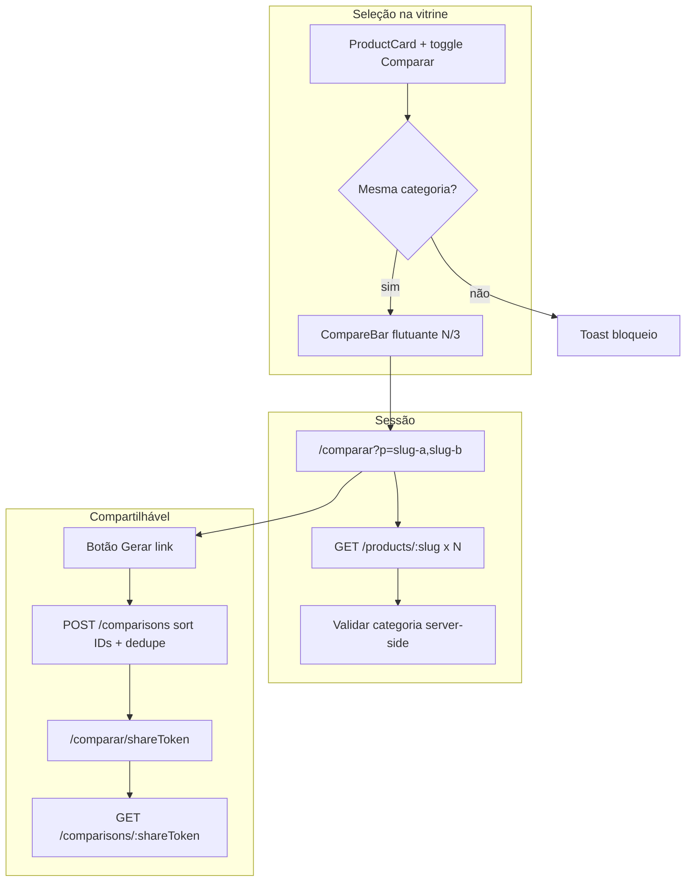
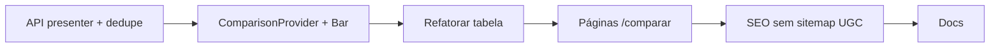

# Comparador Web — Plano MVP (North Star)

## Contexto e gap atual

| Camada | Status |
|--------|--------|
| Domínio + DB (`product_comparisons`, `comparison_products`) | Pronto |
| API `POST /comparisons`, `GET /comparisons/:shareToken` | Rotas existem em [`apps/api/src/adapters/http/routes/index.ts`](apps/api/src/adapters/http/routes/index.ts) |
| Tabela comparativa em artigos | [`ComparisonTable.tsx`](apps/web/src/components/articles/ComparisonTable.tsx) + shortcode `[[compare:...]]` |
| **Vitrine standalone** | Ausente — prioridade #1 em [`docs/next-steps-mvp.md`](docs/next-steps-mvp.md) |

**Gap crítico na API:** `GetComparisonByToken` retorna entidades de domínio (`Product`, `ProductComparison`) sem presenter. O front precisa do mesmo contrato que artigos usam (`ProductDetailDto` via [`toProductDetailDto`](apps/api/src/adapters/presenters/product.presenter.ts)). Corrigir antes da página web.

**Rota canônica:** `/comparar` (confirmado).



---

## Requisitos North Star (escopo desta entrega)

Do [PRD Core §3.4](.cursor/plans/prd_plataforma_afiliação_de44933f.plan.md) e [regra 07-growth](.cursor/rules/07-growth-seo-content.mdc):

- Selecionar **2 ou 3 produtos** da vitrine (checkbox/botão no card)
- Barra flutuante persistente: **"Comparar (N/3)"**
- Tabela: preço atual, rating, marketplace, specs (`specs` = `specsNormalized`), prós/contras editoriais
- Intro editorial **≥150 palavras** na página indexável (Growth); API valida **≥150 caracteres** — o gerador de template deve mirar palavras, não só o mínimo da API
- CTA por coluna: "Ver na Amazon/Shopee" (`rel="noopener sponsored"`)
- CTA global: **"Adicionar todos à lista"** (reutiliza `WishlistProvider.addItem`)
- URL compartilhável com `shareToken` + Open Graph
- Tracking: `origin: comparador` (já no enum) + placement dedicado

**Fora de escopo MVP** (não implementar agora):

- Comparador cross-marketplace mesmo SKU
- Badge "queda 30d" (campo `price_drop_pct_30d` não existe no DTO público)
- Admin CRUD de comparações curadas + comparações `published` no sitemap (fase editorial posterior)
- Batch checkout direto do comparador (wishlist item-a-item é suficiente)
- Comparações geradas por usuário no sitemap automático (risco de spam/duplicação em massa)

---

## Pontos de atenção críticos (mitigações obrigatórias)

### 1. Limitação por categoria na seleção

**Risco:** Seleção livre de 3 produtos de categorias distintas gera tabela sem specs em comum (só preço/rating), quebrando a UX e o valor do comparador.

**Mitigação:**

- `ComparisonProvider.toggleProduct` exige **mesma `categoryId`** (ou `categorySlug`) entre todos os itens da seleção.
- Ao tentar adicionar produto de categoria diferente com lista já contendo ≥1 item: **bloquear** e exibir feedback amigável (toast ou banner inline na `CompareBar`): *"Você só pode comparar produtos da mesma categoria (ex.: Smartphones)."*
- Persistir `categoryId` + `categorySlug` + `categoryLabel` no estado do comparador junto com cada item.
- **Pré-requisito de dados:** `productPublicListItemSchema` ganha `categorySlug` e `categoryLabel` opcionais; [`toProductListItemDto`](apps/api/src/adapters/presenters/product.presenter.ts) passa a incluir categoria quando o produto tiver `categoryId` resolvido (join leve no repositório ou campo já carregado no domínio).
- Produto **sem categoria** só pode ser comparado com outros sem categoria.
- **Validação server-side** (defesa em profundidade):
  - `POST /comparisons`: rejeitar 400 se `productIds` pertencerem a categorias distintas.
  - Página `/comparar?p=`: `notFound()` ou mensagem de erro se slugs resolverem categorias diferentes.

### 2. Sitemap — sem comparações de usuário no MVP

**Risco:** Incluir `/comparar/[shareToken]` gerados por usuários no sitemap dinâmico pode inundar o Google com milhares de combinações (A vs B / B vs A, combos absurdas, intros de template idêntico) → penalização por conteúdo duplicado em escala.

**Mitigação:**

- **Não alterar** [`DrizzleSitemapRepository`](packages/infrastructure/src/persistence/repositories/drizzle-sitemap.repository.ts) neste MVP.
- Comparações persistidas por usuários **não entram no sitemap**.
- Continuam **acessíveis e compartilháveis**; podem ser rastreadas se o robô encontrar link externo ou interno, mas não são promovidas via sitemap.
- Fase posterior: campo `status: draft | published` em `product_comparisons` + CRUD admin → **somente `published`** (intro revisada por operador) no sitemap.
- Documentar exclusão explícita em [`docs/seo-technical-phase1.md`](docs/seo-technical-phase1.md) e [`docs/comparator-web-phase1.md`](docs/comparator-web-phase1.md).

### 3. Hydration mismatch (`localStorage`)

**Risco:** SSR renderiza seleção vazia; no cliente `localStorage` restaura itens → HTML servidor ≠ cliente → hydration error.

**Mitigação:**

- `ComparisonProvider` inicia com `items: []` e `isHydrated: false`.
- Leitura/escrita do `localStorage` **somente** em `useEffect` após mount; ao concluir, `setIsHydrated(true)`.
- Enquanto `!isHydrated`:
  - `ProductCard`: toggle "Comparar" em estado **neutro** (não marcado), sem contar na barra.
  - `CompareBar`: **não renderizar** (ou renderizar vazia sem flash de conteúdo).
- Após hidratação: sincronizar UI com estado real.
- Padrão idêntico ao usado em libs que persistem estado client-only; evitar `typeof window` no render inicial.

### 4. Determinismo na URL compartilhável (dedupe A vs B / B vs A)

**Risco:** Mesma combinação de produtos gera múltiplos `shareToken`, fragmentando SEO e inflando o banco.

**Mitigação:**

- Antes de persistir, **ordenar `productIds` alfabeticamente** (UUID estável).
- Novo método no repositório: `findByProductIdSet(sortedIds: string[])` — busca comparação existente com exatamente esse conjunto (ordem irrelevante na query: join em `comparison_products` + `HAVING count = N`).
- `CreateComparison` use case:
  1. Ordenar IDs.
  2. Validar mesma categoria.
  3. Se comparação existir → retornar `{ shareToken, id }` existente (**200/201 idempotente**, sem duplicar linha).
  4. Senão → criar nova.
- Opcional performance (não obrigatório no MVP): coluna `product_set_hash` (hash dos IDs ordenados) com índice UNIQUE — adiar se a query por join for suficiente no volume inicial.
- Teste API: dois `POST` com `[A,B]` e `[B,A]` retornam o **mesmo** `shareToken`.

---

## Fase 1 — Contrato API (pré-requisito)

### 1.1 Presenter + schema compartilhado

Criar em `packages/shared` (ex.: `comparison-schemas.ts`):

```typescript
comparisonPublicDetailSchema = z.object({
  shareToken: z.string(),
  editorialIntro: z.string(),
  createdAt: z.string(),
  products: z.array(productPublicDetailSchema),
});
```

Criar `toComparisonPublicDto` em [`apps/api/src/adapters/presenters/`](apps/api/src/adapters/presenters/) mapeando produtos com `toProductDetailDto`, preservando ordem de `comparison.productIds`.

Atualizar rotas `GET/POST /comparisons` para retornar o DTO tipado.

Estender `productPublicListItemSchema` com `categorySlug` e `categoryLabel` opcionais (necessário para validação de categoria nos cards).

### 1.2 Deduplicação e validação no `CreateComparison`

Em [`CreateComparison`](packages/application/src/use-cases/comparison/CreateComparison.ts) e [`ProductComparisonRepository`](packages/domain/src/repositories/ProductComparisonRepository.ts):

1. Normalizar `productIds` → sort alfabético.
2. Carregar produtos; validar que todos compartilham o mesmo `categoryId` (400 se divergir).
3. `findByProductIdSet(sortedIds)` → se existir, retornar `shareToken` existente (idempotente).
4. Caso contrário, criar com `shareToken` novo.

Implementar `findByProductIdSet` em [`DrizzleProductComparisonRepository`](packages/infrastructure/src/persistence/repositories/drizzle-content.repository.ts).

### 1.3 Teste API

Adicionar testes em [`apps/api/src/api.test.ts`](apps/api/src/api.test.ts):

- `POST /comparisons` → `GET /comparisons/:shareToken` com shape Zod válido.
- Dois `POST` com mesmos produtos em ordem invertida → **mesmo** `shareToken`.
- `POST` com produtos de categorias distintas → **400**.

---

## Fase 2 — Estado de seleção na vitrine

### 2.1 `ComparisonProvider`

Novo contexto em [`apps/web/src/components/comparison/`](apps/web/src/components/comparison/), espelhando padrão do [`WishlistProvider`](apps/web/src/components/wishlist/WishlistProvider.tsx):

- Estado: até 3 itens com `productId`, `slug`, `title`, `imageUrl`, **`categoryId`**, **`categorySlug`**, **`categoryLabel`**
- `categorySlug` da seleção ativa exposto no contexto (para label na barra: *"Comparando: Smartphones"*)
- Persistência: `localStorage` (sem cookie/consent — só IDs locais, não PII)
- **Hidratação segura:** ver §3 acima — `isHydrated` gate antes de refletir seleção na UI
- API do contexto:
  - `toggleProduct(item)` → valida categoria; retorna `{ ok: true }` ou `{ ok: false, reason: 'category_mismatch' | 'max_reached' }`
  - `removeProduct`, `clear`, `isSelected`, `count`, `canAdd`, `isHydrated`, `activeCategoryLabel`
- Feedback de bloqueio: `CompareToast` leve (estado no provider + banner fixo 3s) — sem dependência nova; evitar `window.alert` exceto fallback
- Registrar em [`apps/web/src/app/providers.tsx`](apps/web/src/app/providers.tsx)

### 2.2 Toggle no `ProductCard`

Em [`ProductCard.tsx`](apps/web/src/components/product/ProductCard.tsx):

- Botão/checkbox **"Comparar"** (ícone distinto do coração wishlist), `stopPropagation` no clique
- Desabilitar quando já há 3 selecionados e o produto não está na lista
- Desabilitar (com feedback via provider) quando produto é de **categoria diferente** da seleção ativa
- Enquanto `!isHydrated`: toggle sempre neutro (não marcado)
- Prop opcional `showCompareToggle` (default `true` em listagens; `false` em embeds editoriais que já têm contexto próprio)
- `toggleProduct` recebe dados do `ProductListItemDto` incluindo `categorySlug` / `categoryLabel`

Pontos de integração (todos usam `ProductCard`):

- [`CategoryProductsGrid`](apps/web/src/components/category/CategoryProductsGrid.tsx)
- [`SearchResultsView`](apps/web/src/components/search/SearchResultsView.tsx)
- Blocos CMS (`ProductCarousel`, `FeaturedProductBlock`, `CuratedCollectionSlide`)
- Opcional fase 1: botão na página de detalhe [`produtos/[slug]/page.tsx`](apps/web/src/app/produtos/[slug]/page.tsx)

### 2.3 `CompareBar` flutuante

Componente fixo no rodapé (acima do safe-area mobile):

- Visível quando `isHydrated && count >= 1`
- Thumbnails + texto **"Comparar (N/3)"** + label da categoria ativa
- CTA primário: navega para `/comparar?p={slugs}` (habilitado só com `N >= 2`)
- Secundário: "Limpar seleção"
- Montar em `providers.tsx` ou layout root (como drawer da wishlist)

---

## Fase 3 — Páginas `/comparar`

### 3.1 Ephemeral — [`apps/web/src/app/comparar/page.tsx`](apps/web/src/app/comparar/page.tsx)

- Ler `searchParams.p` como lista de slugs (2–3), validar e `notFound()` se inválido
- Server-side: buscar produtos em paralelo via `getProduct(slug)` ([`cached-fetchers`](apps/web/src/lib/api/cached-fetchers.ts))
- **Validar mesma categoria** entre produtos resolvidos; se divergir → página de erro amigável ou `notFound()`
- Renderizar intro curta gerada no servidor (parágrafo contextual, não indexável)
- Reutilizar tabela comparativa (fase 4)
- Ações: **"Gerar link compartilhável"** (client) → `POST /comparisons` com intro longa → `router.push(/comparar/{shareToken})`
- SEO: `robots: { index: false, follow: true }` — query params nunca são canônicos ([`seo-technical-phase1`](docs/seo-technical-phase1.md))

### 3.2 Persistida — [`apps/web/src/app/comparar/[shareToken]/page.tsx`](apps/web/src/app/comparar/[shareToken]/page.tsx)

- `GET /comparisons/:shareToken` via novo client [`apps/web/src/lib/api/comparisons.ts`](apps/web/src/lib/api/comparisons.ts)
- Exibir `editorialIntro` como bloco editorial acima da tabela
- `generateMetadata`: título tipo `"Produto A vs Produto B | {brand}"`, description dos primeiros ~160 chars da intro, OG com imagens dos produtos
- JSON-LD `WebPage` + `ItemList` dos produtos (helper em `packages/shared/src/seo`)
- `revalidate: 300` (preços frescos via catálogo local)
- Botão copiar URL + disclaimer curto de afiliado abaixo da tabela

### 3.3 Gerador de intro editorial

Função pura em `packages/shared` (ex.: `buildComparisonEditorialIntro`):

- Input: títulos, marketplaces, scores editoriais, categorias se disponíveis
- Output: texto em pt-BR com **≥150 palavras** (Growth) e **≥150 caracteres** (API)
- Usado no client ao persistir e como fallback na página ephemeral

---

## Fase 4 — Refatorar `ComparisonTable`

Extrair núcleo reutilizável sem quebrar artigos:

| Arquivo | Responsabilidade |
|---------|------------------|
| `comparison-table-core.tsx` | `collectSpecKeys`, badges, layout mobile/desktop |
| `ComparisonTable.tsx` | Wrapper artigo (`articleId`, `ClickPlacement.ARTICLE_COMPARISON`) |
| `StandaloneComparisonTable.tsx` | Wrapper standalone (`ClickPlacement.COMPARISON_PAGE`, sem `articleId`) |

Mudanças na tabela standalone vs artigo:

- Nova linha **Marketplace** com [`MarketplaceBadge`](apps/web/src/components/product/MarketplaceBadge.tsx)
- `placement`: adicionar `COMPARISON_PAGE: 'comparison.page'` em [`packages/shared/src/analytics/placements.ts`](packages/shared/src/analytics/placements.ts)
- Footer global: botão **"Adicionar todos à lista"** (itera `addItem`, respeita consent cookies)
- Manter `clickOrigin="comparador"` em todos os CTAs

---

## Fase 5 — SEO e indexação

- Ephemeral `?p=`: **noindex, follow** — query params nunca são canônicos ([`seo-technical-phase1`](docs/seo-technical-phase1.md))
- Persistida `/comparar/[shareToken]`: **index, follow** por padrão (descoberta via link compartilhado); canonical limpo sem query; OG + JSON-LD
- **Sitemap: não incluir** comparações de usuário neste MVP (ver §2 acima). Nenhuma alteração em [`DrizzleSitemapRepository`](packages/infrastructure/src/persistence/repositories/drizzle-sitemap.repository.ts).
- Documentar em [`docs/seo-technical-phase1.md`](docs/seo-technical-phase1.md): `/comparar/*` gerado por usuário fica **fora do sitemap** até fase editorial com `status: published`

---

## Fase 6 — Documentação

Criar [`docs/comparator-web-phase1.md`](docs/comparator-web-phase1.md) com:

- Escopo entregue vs fora
- Fluxo usuário (diagrama)
- Rotas web + contrato API
- Arquivos-chave
- Como testar localmente (`curl`, navegação manual)
- Próximos passos: admin de comparações curadas (`status: published` → sitemap), badge 30d, interlinking artigo → comparador técnico

Atualizar índice em [`docs/README.md`](docs/README.md) e marcar item em [`docs/next-steps-mvp.md`](docs/next-steps-mvp.md).

---

## Ordem de implementação sugerida



---

## Como validar (test plan)

1. Selecionar 2 produtos **da mesma categoria** → barra aparece com label da categoria → "Comparar agora" abre tabela com specs relevantes
2. Com 1 produto selecionado, tentar adicionar produto de **outra categoria** → bloqueado + toast amigável
3. Tentar 4º produto da mesma categoria → toggle desabilitado
4. Refresh da página → sem hydration mismatch; seleção reaparece após mount
5. Preço stale → `PriceDisplay` oculta valor numérico; sem badge de urgência
6. CTA "Ver na Amazon" → nova aba, `origin=comparador`, `placement=comparison.page`
7. "Adicionar todos à lista" → itens no drawer wishlist
8. "Gerar link" → URL `/comparar/{uuid}` abre mesma comparação após refresh
9. Dois usuários comparam A+B e B+A → **mesmo** `shareToken` (dedupe API)
10. `POST /comparisons` com categorias mistas → 400
11. `GET /comparisons/:token` retorna DTO compatível com Zod web
12. Página persistida tem OG tags; **não** aparece no sitemap
13. Página `?p=` tem `noindex`
14. `pnpm lint` + build nos pacotes alterados (`shared`, `api`, `web`)

---

## Arquivos principais a criar/alterar

**Novos:**
- `packages/shared/src/comparison/comparison-schemas.ts`
- `packages/shared/src/comparison/build-editorial-intro.ts`
- `apps/api/src/adapters/presenters/comparison.presenter.ts`
- `apps/web/src/components/comparison/ComparisonProvider.tsx`
- `apps/web/src/components/comparison/CompareBar.tsx`
- `apps/web/src/components/comparison/CompareToast.tsx`
- `apps/web/src/components/comparison/StandaloneComparisonTable.tsx`
- `apps/web/src/lib/api/comparisons.ts`
- `apps/web/src/app/comparar/page.tsx`
- `apps/web/src/app/comparar/[shareToken]/page.tsx`
- `docs/comparator-web-phase1.md`

**Alterar:**
- [`apps/api/src/adapters/http/routes/index.ts`](apps/api/src/adapters/http/routes/index.ts)
- [`packages/application/src/use-cases/comparison/CreateComparison.ts`](packages/application/src/use-cases/comparison/CreateComparison.ts)
- [`packages/domain/src/repositories/ProductComparisonRepository.ts`](packages/domain/src/repositories/ProductComparisonRepository.ts)
- [`packages/infrastructure/src/persistence/repositories/drizzle-content.repository.ts`](packages/infrastructure/src/persistence/repositories/drizzle-content.repository.ts) (`findByProductIdSet`)
- [`packages/shared/src/admin/product-schemas.ts`](packages/shared/src/admin/product-schemas.ts) (`categorySlug` no list item)
- [`apps/api/src/adapters/presenters/product.presenter.ts`](apps/api/src/adapters/presenters/product.presenter.ts)
- [`apps/web/src/components/product/ProductCard.tsx`](apps/web/src/components/product/ProductCard.tsx)
- [`apps/web/src/components/articles/ComparisonTable.tsx`](apps/web/src/components/articles/ComparisonTable.tsx)
- [`apps/web/src/app/providers.tsx`](apps/web/src/app/providers.tsx)
- [`packages/shared/src/analytics/placements.ts`](packages/shared/src/analytics/placements.ts)
- [`docs/seo-technical-phase1.md`](docs/seo-technical-phase1.md) (exclusão sitemap UGC)
