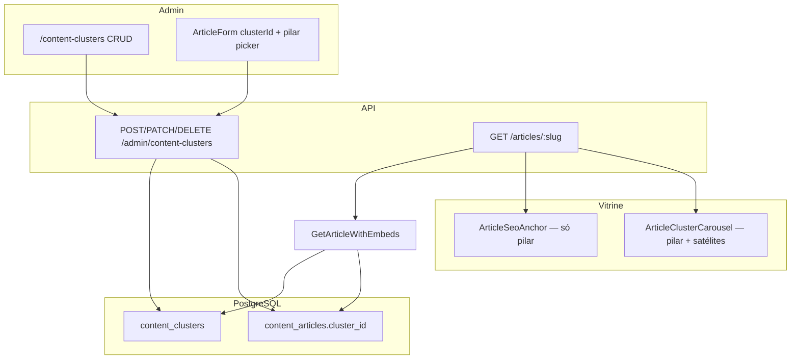

# Content Clusters — Hub & Spoke

## Contexto e objetivo

Hoje [`GetArticleWithEmbeds`](packages/application/src/use-cases/content/GetArticleWithEmbeds.ts) retorna artigo + autor + categoria + `relatedArticles` (mesma categoria). A vitrine em [`apps/web/src/app/artigos/[slug]/page.tsx`](apps/web/src/app/artigos/[slug]/page.tsx) renderiza hero, corpo, rodapé e [`ArticleRelatedGrid`](apps/web/src/components/articles/ArticleRelatedGrid.tsx) — **sem malha Hub & Spoke estruturada**.

A entrega cria `content_clusters`, associa artigos via `cluster_id`, expõe dados na API pública e renderiza:

1. **SEO Anchor** — índice navegável no topo do **artigo pilar** (hub), listando satélites em ordem de leitura.
2. **Cluster Carousel** — carrossel (desktop) / grid (mobile) no final do pilar **e** de cada satélite, com cross-linking do cluster inteiro.

Ordem dos satélites: **`publishedAt ASC`** (mais antigo primeiro).



---

## 1. Schema e migration

### Arquivo novo

[`packages/infrastructure/src/persistence/drizzle/schema/content-clusters.ts`](packages/infrastructure/src/persistence/drizzle/schema/content-clusters.ts):

- Tabela `content_clusters` conforme spec do usuário, **ajustando convenção do monorepo**:
  - `updatedAt` (camelCase no Drizzle, coluna `updated_at` com `{ withTimezone: true }`)
  - `createdAt` idem
  - `pilarArticleId` → FK `content_articles.id` `ON DELETE SET NULL`
  - índice em `slug` (unique já cobre)
  - índice em `pilar_article_id` para lookup

### Alteração em artigos

Em [`packages/infrastructure/src/persistence/drizzle/schema/index.ts`](packages/infrastructure/src/persistence/drizzle/schema/index.ts), adicionar em `contentArticles`:

```typescript
clusterId: uuid('cluster_id').references(() => contentClusters.id, { onDelete: 'set null' });
```

- índice `content_articles_cluster_id_idx`.

Exportar `contentClusters` de `index.ts` (padrão [`article-categories.ts`](packages/infrastructure/src/persistence/drizzle/schema/article-categories.ts)).

### Migration

`packages/infrastructure/src/persistence/drizzle/migrations/0014_content_clusters.sql`:

1. `CREATE TABLE content_clusters (...)`
2. `ALTER TABLE content_articles ADD COLUMN cluster_id uuid REFERENCES content_clusters(id) ON DELETE SET NULL`
3. Índices

---

## 2. Domain (`packages/domain`)

### Entidade

Criar [`packages/domain/src/entities/ContentCluster.ts`](packages/domain/src/entities/ContentCluster.ts):

- Campos: `id`, `name`, `slug`, `description`, `pilarArticleId`, `createdAt`, `updatedAt`
- `ContentCluster.create()` com validações: name 1–120, slug kebab-case, description opcional
- Método `withUpdates()` imutável

### ContentArticle

Estender [`ContentArticle`](packages/domain/src/entities/ContentArticle.ts) com `clusterId: string | null` em constructor, `create()` e props.

### Port

Criar [`packages/domain/src/repositories/ContentClusterRepository.ts`](packages/domain/src/repositories/ContentClusterRepository.ts):

| Método                              | Uso                                          |
| ----------------------------------- | -------------------------------------------- |
| `findById(id)`                      | Admin detail                                 |
| `findBySlug(slug)`                  | Lookup futuro                                |
| `findByArticleClusterId(clusterId)` | Resolver cluster de um artigo                |
| `listAdminSummaries()`              | Listagem admin                               |
| `listPublishedMembers(clusterId)`   | Spokes + pilar publicados, `publishedAt ASC` |
| `save(cluster)` / `delete(id)`      | CRUD                                         |
| `slugExists(slug, excludeId?)`      | Unicidade                                    |

Estender [`ContentRepository`](packages/domain/src/repositories/ContentRepository.ts) com `clearClusterFromArticles(clusterId)` ou método equivalente para invalidação em massa (opcional — pode ficar no Drizzle repo do cluster).

Exportar tudo em [`packages/domain/src/index.ts`](packages/domain/src/index.ts).

---

## 3. Infrastructure

### Repositório

[`packages/infrastructure/src/persistence/repositories/drizzle-content-cluster.repository.ts`](packages/infrastructure/src/persistence/repositories/drizzle-content-cluster.repository.ts):

- `listPublishedMembers`: join `content_articles` onde `cluster_id = ?` AND `status = published`, order `published_at ASC NULLS LAST`
- Retorno tipado `ClusterMemberSummary { id, slug, title, excerpt, coverImageUrl, publishedAt, isPilar }`

### Mappers

Atualizar [`mapArticle` / `mapArticleToRow`](packages/infrastructure/src/persistence/mappers/product.mapper.ts) para incluir `clusterId`.

### Seed (opcional mas recomendado)

Em [`seed.ts`](packages/infrastructure/src/persistence/drizzle/seed.ts): cluster demo "Home Office" ligando artigo pilar seed existente + 2–3 satélites, se slugs existirem.

### DI

Registrar `DrizzleContentClusterRepository` e use cases em [`apps/api/src/container`](apps/api/src/container) (seguir padrão `ArticleCategory` / `AutoLink`).

---

## 4. Application — use cases

### Admin clusters (`packages/application/src/use-cases/content-cluster/`)

| Use case                   | Regras                                                                                         |
| -------------------------- | ---------------------------------------------------------------------------------------------- |
| `CreateContentCluster`     | Slug único; se `pilarArticleId` informado → validar artigo existe + setar `clusterId` no pilar |
| `UpdateContentCluster`     | Sync pilar: artigo antigo perde `clusterId` se trocado; novo pilar recebe `clusterId`          |
| `DeleteContentCluster`     | `DELETE` cluster; FK `SET NULL` limpa artigos                                                  |
| `ListContentClustersAdmin` | `{ id, name, slug, pilarTitle?, memberCount, updatedAt }`                                      |
| `GetContentClusterAdmin`   | Cluster + lista de membros (draft + published para admin)                                      |

**Invariantes de negócio:**

- Um artigo pertence a no máximo 1 cluster (`cluster_id` único por artigo — enforced por coluna).
- O pilar deve ter `clusterId` igual ao cluster ao qual pertence (sync no use case de cluster).
- Atribuir `clusterId` no artigo **não** torna o artigo pilar automaticamente — pilar só via `pilarArticleId` no cluster.

### Artigos admin

Atualizar [`CreateArticle`](packages/application/src/use-cases/admin-article/CreateArticle.ts) e [`UpdateArticle`](packages/application/src/use-cases/admin-article/UpdateArticle.ts):

- Aceitar `clusterId` opcional no body.
- Se artigo é pilar de algum cluster, impedir remoção de `clusterId` sem trocar pilar antes (erro 409 claro).
- Invalidar cache `vitrine:article:slug:*` do artigo alterado **e** de todos os membros do cluster afetado.

### Público — estender `GetArticleWithEmbeds`

Alterar [`GetArticleWithEmbeds.ts`](packages/application/src/use-cases/content/GetArticleWithEmbeds.ts):

```typescript
type ArticleClusterPublic = {
  name: string;
  slug: string;
  description: string | null;
  role: 'pilar' | 'spoke';
  pilarArticle: { slug: string; title: string };
  members: ArticleRelatedSummary[]; // publicados, pilar primeiro, demais publishedAt ASC
};
```

Lógica:

1. Se `article.clusterId` null → `cluster: null`.
2. Carregar cluster + membros publicados.
3. `role = article.id === cluster.pilarArticleId ? 'pilar' : 'spoke'`.
4. `members`: pilar primeiro (se publicado), satélites restantes por `publishedAt ASC`, excluindo duplicata.
5. Manter `relatedArticles` existente (categoria) — **não substituir**; carousel de cluster é complementar.

Cache: continuar chave `vitrine:article:slug:${slug}` — objeto cacheado passa a incluir `cluster`.

Helper de invalidação: `invalidateClusterArticleCaches(clusterId)` busca slugs dos membros e faz `cache.del` em lote.

---

## 5. Shared schemas (`packages/shared`)

Criar [`packages/shared/src/admin/content-cluster-schemas.ts`](packages/shared/src/admin/content-cluster-schemas.ts):

- Admin: summary, detail, create/update body, list response
- Público: `articleClusterPublicSchema`, `articleClusterMemberSchema`

Estender [`article-schemas.ts`](packages/shared/src/admin/article-schemas.ts):

- `clusterId` em `adminArticleDetailSchema`, `createArticleBodySchema`, `updateArticleBodySchema`
- `cluster: articleClusterPublicSchema.nullable()` em `articlePublicDetailSchema`

Exportar em [`packages/shared/src/admin/index.ts`](packages/shared/src/admin/index.ts) (se barrel existir).

---

## 6. API REST

### Admin — [`apps/api/src/adapters/http/routes/admin-content-cluster-routes.ts`](apps/api/src/adapters/http/routes/admin-content-cluster-routes.ts)

| Método | Rota                          | Body / Response                           |
| ------ | ----------------------------- | ----------------------------------------- |
| GET    | `/admin/content-clusters`     | `{ items: ContentClusterAdminSummary[] }` |
| POST   | `/admin/content-clusters`     | Create → `{ id }`                         |
| GET    | `/admin/content-clusters/:id` | Detail + members                          |
| PATCH  | `/admin/content-clusters/:id` | Update → `204`                            |
| DELETE | `/admin/content-clusters/:id` | `204`                                     |

Registrar em [`admin-routes.ts`](apps/api/src/adapters/http/routes/admin-routes.ts).

Estender rotas de artigo admin para persistir `clusterId`.

### Público

Sem rota nova — enriquecer resposta existente `GET /articles/:slug` via [`toArticlePublicDetailDto`](apps/api/src/adapters/presenters/article.presenter.ts).

---

## 7. Vitrine (`apps/web`)

### Componentes novos

[`ArticleSeoAnchor.tsx`](apps/web/src/components/articles/ArticleSeoAnchor.tsx):

- Renderiza **somente** quando `article.cluster?.role === 'pilar'` e há ≥1 satélite.
- `<nav aria-label="Índice do guia">` com lista ordenada (estilo TOC: borda esquerda, links para `/artigos/{slug}`).
- Título: "Neste guia" + nome do cluster.
- Posição: **entre** [`ArticleHero`](apps/web/src/components/articles/ArticleBody.tsx) e [`ArticleBody`](apps/web/src/components/articles/ArticleBody.tsx) em [`page.tsx`](apps/web/src/app/artigos/[slug]/page.tsx).

[`ArticleClusterCarousel.tsx`](apps/web/src/components/articles/ArticleClusterCarousel.tsx):

- Client component com **Embla** (já em [`ProductCarousel`](apps/web/src/components/product/ProductCarousel.tsx)).
- Props: `cluster`, `currentSlug`.
- Desktop: carrossel horizontal com [`ArticleCard`](apps/web/src/components/articles/ArticleCard.tsx) (`showExcerpt`).
- Mobile: grid 1 coluna (sem carrossel) — alinhado a UX mobile-first.
- Destaque visual no card do artigo atual (`aria-current="page"`, ring/border).
- Título: "Explore o guia: {cluster.name}"; link muted para pilar quando viewer é satélite.
- Posição: **antes** de `ArticleRelatedGrid` (cluster = malha intencional; related = categoria).

### JSON-LD (SEO)

Em `page.tsx`, quando `role === 'pilar'` e há membros, adicionar `ItemList` schema com URLs dos satélites (complementa `Article` existente).

### Page wiring

```tsx
<ArticleHero article={article} />
{article.cluster ? <ArticleSeoAnchor cluster={article.cluster} currentSlug={slug} /> : null}
<ArticleBody ... />
<ArticlePostFooter ... />
{article.cluster ? <ArticleClusterCarousel cluster={article.cluster} currentSlug={slug} /> : null}
<ArticleRelatedGrid ... />
```

---

## 8. Admin UI (`apps/admin`)

Seguir padrão [`article-categories`](apps/admin/src/components/article-categories/) + regra [`11-admin-floating-panels.mdc`](.cursor/rules/11-admin-floating-panels.mdc).

### Rota `/content-clusters`

- [`page.tsx`](<apps/admin/src/app/(dashboard)/content-clusters/page.tsx>) com `ContentClusterListManager`
- Componentes: `ContentClusterListView`, `ContentClusterFormSheet`
- Campos: name, slug (auto-slugify), description, **pilar** via `ArticleIdPicker` (artigos publicados)
- Listagem: nome, slug, título do pilar, contagem de membros, updatedAt

### BFF Next.js

- [`apps/admin/src/app/api/admin/content-clusters/route.ts`](apps/admin/src/app/api/admin/content-clusters/route.ts)
- [`apps/admin/src/app/api/admin/content-clusters/[id]/route.ts`](apps/admin/src/app/api/admin/content-clusters/[id]/route.ts)
- Client: `content-clusters-client.ts` + server helper `content-clusters.ts`

### Navegação

- Item "Clusters" em [`apps/admin/src/lib/navigation.ts`](apps/admin/src/lib/navigation.ts) (ícone `Network` ou `GitBranch`)
- Atalho em [`ArticleListManager`](apps/admin/src/components/articles/ArticleListManager.tsx) ao lado de "Categorias"

### ArticleForm

Estender [`ArticleForm.tsx`](apps/admin/src/components/articles/ArticleForm.tsx):

- `Select` opcional "Cluster de conteúdo" (carregar lista admin)
- Passar `clusters` nas pages `novo` e `[id]` (server fetch, como categorias)
- Hint: "Satélites pertencem a um cluster; o artigo pilar é definido na tela Clusters."

---

## 9. Documentação

Criar [`docs/content-clusters-hub-spoke.md`](docs/content-clusters-hub-spoke.md) com:

- O quê / por quê (link PRD Growth §2.5 interlinking)
- Diagrama de fluxo
- Schema, API admin + campo público em `GET /articles/:slug`
- Arquivos-chave
- Como testar (seed + smoke admin + vitrine)
- Próximos passos: página hub `/clusters/[slug]`, ordem manual, agrupamento por tipo

Atualizar:

- [`docs/README.md`](docs/README.md) — índice
- [`docs/database-schema.md`](docs/database-schema.md) — tabelas novas
- [`docs/api-rest.md`](docs/api-rest.md) — rotas admin
- [`docs/articles-public-rendering.md`](docs/articles-public-rendering.md) — SEO Anchor + carousel
- [`docs/llm-context-03-implemented-features.md`](docs/llm-context-03-implemented-features.md) — menção breve

---

## 10. Verificação

```bash
# migration + seed
npm run db:migrate -w @ecommerce-amazon/infrastructure
npm run db:seed -w @ecommerce-amazon/infrastructure

# build/lint pacotes tocados
npm run lint --workspace=@ecommerce-amazon/domain
npm run lint --workspace=@ecommerce-amazon/application
npm run lint --workspace=@ecommerce-amazon/infrastructure
npm run lint --workspace=@ecommerce-amazon/api
npm run lint --workspace=@ecommerce-amazon/admin
npm run lint --workspace=@ecommerce-amazon/web
npm run build --workspace=@ecommerce-amazon/web
npm run build --workspace=@ecommerce-amazon/admin
```

**Smoke manual:**

1. Admin → criar cluster "Especial Cadeira Ergonômica" com pilar = guia seed.
2. Editar 2–3 artigos → atribuir mesmo `clusterId`.
3. Vitrine → abrir pilar: SEO Anchor visível com satélites em ordem cronológica.
4. Abrir satélite: sem SEO Anchor; carousel mostra pilar + irmãos; card atual destacado.
5. Despublicar satélite → some do anchor/carousel; pilar permanece.
6. PATCH cluster trocando pilar → anchor segue novo pilar; caches atualizados.

---

## Ordem de implementação

1. Migration + schema Drizzle + entity/mapper `clusterId`
2. Repository + use cases admin clusters
3. Estender use cases de artigo + `GetArticleWithEmbeds`
4. Schemas shared + rotas API + presenter
5. Componentes vitrine + JSON-LD
6. Admin UI (CRUD + ArticleForm)
7. Seed + docs + lint/build

## Riscos e decisões

- **FK circular** (`clusters.pilar → articles`, `articles.cluster → clusters`): resolvida com colunas nullable + sync no use case; migration única OK.
- **Cache stale em cluster**: invalidação em cascata nos use cases de cluster e artigo — não depender só de TTL.
- **Pilar draft**: SEO Anchor e carousel só incluem membros `published`; pilar draft → cluster público degradado gracefully (`cluster: null` ou members vazios).
- **`ArticleRelatedGrid` mantido**: cluster carousel é malha editorial intencional; related por categoria permanece para recirculação lateral.
