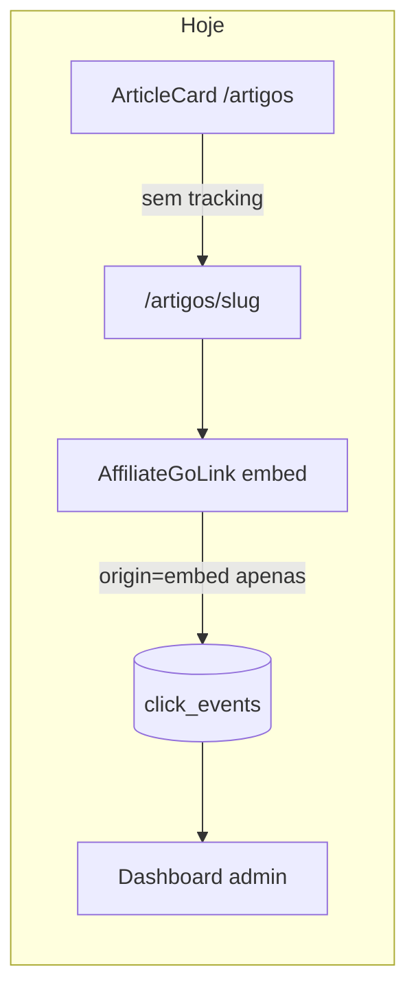
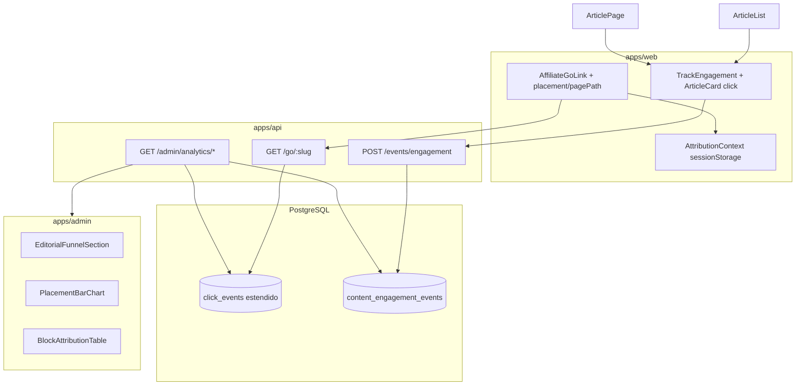

# Evolução do Dashboard — Atribuição de Cliques e Funil Editorial

## Diagnóstico do estado atual

O tracking first-party já grava cliques de afiliado em `click_events` via `GET /go/:slug`, mas a atribuição é **superficial** e há **buracos de instrumentação** que explicam métricas zeradas ou mal classificadas:

| Problema                                                         | Impacto                                                                                                                                                 |
| ---------------------------------------------------------------- | ------------------------------------------------------------------------------------------------------------------------------------------------------- |
| Dashboard só agrega por `origin` (8 valores fixos)               | Impossível distinguir home vs categoria vs bloco CMS vs embed vs comparador dentro do artigo                                                            |
| `block_id` é gravado mas **nunca agregado** no admin             | Blocos CMS invisíveis no painel                                                                                                                         |
| Cliques em cards de artigo (`ArticleCard`) são navegação interna | **Não entram** em nenhuma métrica first-party hoje                                                                                                      |
| Funil listagem → artigo → embed não existe                       | Não dá para medir conversão editorial                                                                                                                   |
| `WishlistDrawer` abre `/go` sem `origin`                         | Vai para `redirect_go` e é **excluído** do dashboard                                                                                                    |
| `ComparisonTable` usa `origin=embed` em vez de `comparador`      | Comparador dentro do artigo misturado com embed simples                                                                                                 |
| `BentoHubMixGrid` só linka para `/produtos/[slug]`               | Clique afiliado só na página de detalhe, sem `blockId`                                                                                                  |
| CTA primário do embed ("Ver análise e ofertas") é link interno   | Usuário pode clicar nele achando que vai ao marketplace — **não gera clique de afiliado** (comportamento intencional, mas confunde na validação manual) |



## Arquitetura alvo

Duas camadas complementares (first-party PG), preparadas para cruzar com GA4 na Fase 2:



---

## 1. Schema — estender `click_events` + nova tabela de engajamento

**Migration** em [`packages/infrastructure/src/persistence/drizzle/migrations/`](packages/infrastructure/src/persistence/drizzle/migrations/):

### 1.1 Colunas novas em `click_events`

| Coluna          | Tipo                              | Uso                                                                               |
| --------------- | --------------------------------- | --------------------------------------------------------------------------------- |
| `placement`     | `text`                            | Componente concreto (ex.: `article.embed`, `cms.product_grid`, `wishlist.drawer`) |
| `page_path`     | `text`                            | Rota onde o clique ocorreu (ex.: `/artigos/guia-x`)                               |
| `referrer_path` | `text`                            | Entrada anterior na sessão (ex.: `/artigos` após clicar card na listagem)         |
| `collection_id` | `uuid` FK → `curated_collections` | Coleções curadas (página + bloco CMS)                                             |

Índices: `(placement, occurred_at)`, `(page_path, occurred_at)`, `(collection_id, occurred_at)`.

Atualizar [`packages/infrastructure/src/persistence/drizzle/schema/index.ts`](packages/infrastructure/src/persistence/drizzle/schema/index.ts) e [`docs/database-schema.md`](docs/database-schema.md).

### 1.2 Nova tabela `content_engagement_events`

| Coluna          | Tipo               | Uso                                                         |
| --------------- | ------------------ | ----------------------------------------------------------- |
| `event_type`    | `text`             | `article_card_click` \| `article_page_view`                 |
| `article_id`    | `uuid` FK          | Artigo alvo                                                 |
| `page_path`     | `text`             | Onde o evento ocorreu                                       |
| `placement`     | `text`             | Ex.: `article_listing`, `article_related`, `cms.bento_hero` |
| `block_id`      | `uuid` FK opcional | Bloco CMS de origem                                         |
| `referrer_path` | `text`             | De onde veio                                                |
| `session_id`    | `text`             | Sessão anônima                                              |
| `occurred_at`   | `timestamptz`      | Timestamp                                                   |

Índices por `event_type + occurred_at`, `article_id + occurred_at`.

---

## 2. Vocabulário compartilhado de atribuição

Criar em [`packages/shared/src/analytics/`](packages/shared/src/analytics/) (export via [`packages/shared/src/index.ts`](packages/shared/src/index.ts)):

- **`ClickPlacement`** — constantes tipadas para componentes (não substituem `ClickOrigin` do PRD):

```typescript
// Exemplos
'article.embed' | 'article.comparison' | 'article.related';
'cms.product_grid' |
  'cms.featured_product' |
  'cms.bento_offer' |
  'cms.bento_article' |
  'cms.curated_collection';
'product.detail_cta' |
  'product.similar' |
  'category.listing' |
  'collection.page' |
  'wishlist.drawer';
```

- **`EngagementEventType`** — `article_card_click`, `article_page_view`
- Schemas Zod para POST `/events/engagement` e novas respostas admin

Manter `ClickOrigin` existente ([`packages/domain/src/enums/index.ts`](packages/domain/src/enums/index.ts)) para buckets MVP (`listagem`, `detalhe`, `embed`, `comparador`, `cupons`, `coleção`, `similar`). `placement` é a dimensão fina; `origin` continua estável para GA4 híbrido futuro.

---

## 3. Backend — write path

### 3.1 Estender `/go` e `RecordClickEvent`

Arquivos: [`apps/api/src/adapters/dtos/request/schemas.ts`](apps/api/src/adapters/dtos/request/schemas.ts), [`apps/api/src/adapters/http/routes/index.ts`](apps/api/src/adapters/http/routes/index.ts), [`packages/application/src/use-cases/events/RecordClickEvent.ts`](packages/application/src/use-cases/events/RecordClickEvent.ts), [`packages/infrastructure/src/persistence/repositories/drizzle-content.repository.ts`](packages/infrastructure/src/persistence/repositories/drizzle-content.repository.ts).

Novos query params opcionais em `GoQuerySchema`:

- `placement`, `pagePath`, `referrerPath`, `collectionId` (uuid)

Validar `placement` contra allowlist Zod (rejeitar valores arbitrários).

### 3.2 Novo endpoint público de engajamento

`POST /events/engagement` — fire-and-forget, 204, rate-limit leve (mesmo padrão de `/events/click`).

Use case `RecordEngagementEvent` + port `EngagementEventRepository`.

---

## 4. Backend — read path (admin analytics)

Estender [`packages/domain/src/repositories/AnalyticsRepository.ts`](packages/domain/src/repositories/AnalyticsRepository.ts) + [`drizzle-analytics.repository.ts`](packages/infrastructure/src/persistence/repositories/drizzle-analytics.repository.ts):

| Nova rota admin                               | Retorno                                                                                                 |
| --------------------------------------------- | ------------------------------------------------------------------------------------------------------- |
| `GET /admin/analytics/clicks/by-placement`    | `{ placement, count, sharePercent }[]`                                                                  |
| `GET /admin/analytics/clicks/by-block`        | `{ blockId, blockType, pageSlug, count }[]` — JOIN `page_blocks` + `pages`                              |
| `GET /admin/analytics/clicks/by-page`         | `{ pagePath, count }[]` top 20                                                                          |
| `GET /admin/analytics/clicks/trend-by-origin` | `{ date, origin, count }[]` — dados para gráfico empilhado                                              |
| `GET /admin/analytics/engagement/funnel`      | `{ articleCardClicks, articlePageViews, embedAffiliateClicks, conversionRate }` + top artigos por etapa |

Registrar em [`admin-analytics-routes.ts`](apps/api/src/adapters/http/routes/admin-analytics-routes.ts). Schemas em [`packages/shared/src/admin/analytics-schemas.ts`](packages/shared/src/admin/analytics-schemas.ts).

---

## 5. Web — instrumentação completa

### 5.1 Contexto de atribuição (funil editorial)

Novo módulo [`apps/web/src/lib/attribution/context.ts`](apps/web/src/lib/attribution/context.ts):

- Grava em `sessionStorage` (TTL ~30 min): `entryPath`, `entryPlacement`, `blockId?`
- `ArticleCard` chama `setAttribution({ entryPath: '/artigos', entryPlacement: 'article_listing' })` no click
- Links CMS de artigo (`BentoHubMixGrid` hero) setam `cms.bento_article` + `blockId`
- `AffiliateGoLink` lê contexto e envia `referrerPath` + `pagePath` (via `usePathname()`)

### 5.2 Estender primitivos

[`apps/web/src/lib/go-url.ts`](apps/web/src/lib/go-url.ts) + [`AffiliateGoLink.tsx`](apps/web/src/components/product/AffiliateGoLink.tsx):

- Props: `placement`, `pagePath?`, `referrerPath?`, `collectionId?`
- Propagação automática de attribution context quando props omitidas

Novo [`apps/web/src/lib/api/engagement.ts`](apps/web/src/lib/api/engagement.ts) + [`TrackEngagement.tsx`](apps/web/src/components/analytics/TrackEngagement.tsx) (client island, fire-and-forget no mount/click).

### 5.3 Passagem de `placement` por superfície

| Superfície                                                                                                                                                          | `origin`         | `placement`                           | Outros                                                             |
| ------------------------------------------------------------------------------------------------------------------------------------------------------------------- | ---------------- | ------------------------------------- | ------------------------------------------------------------------ |
| [`ProductGridBlock`](apps/web/src/components/blocks/ProductGridBlock.tsx) / [`DynamicProductGridBlock`](apps/web/src/components/blocks/DynamicProductGridBlock.tsx) | `listagem`       | `cms.product_grid`                    | `blockId`                                                          |
| [`FeaturedProductBlock`](apps/web/src/components/blocks/FeaturedProductBlock.tsx)                                                                                   | `listagem`       | `cms.featured_product`                | `blockId`                                                          |
| [`CuratedCollectionSlide`](apps/web/src/components/blocks/CuratedCollectionSlide.tsx)                                                                               | `coleção`        | `cms.curated_collection`              | `blockId`, `collectionId`, `utmDefaults`                           |
| [`BentoHubMixGrid`](apps/web/src/components/blocks/BentoHubMixGrid.tsx) offer slot                                                                                  | `listagem`       | `cms.bento_offer`                     | `blockId` + **CTA afiliado direto** (como `CollectionProductCard`) |
| [`ArticleProductEmbed`](apps/web/src/components/articles/ArticleProductEmbed.tsx)                                                                                   | `embed`          | `article.embed`                       | `articleId`                                                        |
| [`ComparisonTable`](apps/web/src/components/articles/ComparisonTable.tsx)                                                                                           | **`comparador`** | `article.comparison`                  | `articleId`, `sessionId`                                           |
| [`ArticleRelatedGrid`](apps/web/src/components/articles/ArticleRelatedGrid.tsx)                                                                                     | —                | `article.related`                     | engajamento only (card click)                                      |
| [`ArticleCard`](apps/web/src/components/articles/ArticleCard.tsx)                                                                                                   | —                | `article_listing` / `article_related` | engajamento + setAttribution                                       |
| [`artigos/[slug]/page.tsx`](apps/web/src/app/artigos/[slug]/page.tsx)                                                                                               | —                | —                                     | `<TrackEngagement eventType="article_page_view" />`                |
| [`produtos/[slug]/page.tsx`](apps/web/src/app/produtos/[slug]/page.tsx)                                                                                             | `detalhe`        | `product.detail_cta`                  | `sessionId`                                                        |
| [`WishlistDrawer`](apps/web/src/components/wishlist/WishlistDrawer.tsx)                                                                                             | `listagem`       | `wishlist.drawer`                     | `sessionId`                                                        |
| [`colecoes/[slug]/page.tsx`](apps/web/src/app/colecoes/[slug]/page.tsx)                                                                                             | `coleção`        | `collection.page`                     | `collectionId`, `utmDefaults`                                      |

### 5.4 Correções pontuais incluídas

- `ComparisonTable`: trocar `embed` → `comparador`; propagar `sessionId`
- `WishlistDrawer`: passar `origin` + `placement` (sair de `redirect_go`)
- `CuratedCollectionSlide`: propagar `collection.utmDefaults` e `collectionId`
- `BentoHubMixGrid`: CTA afiliado no slot de oferta (evitar perda de `blockId` via detalhe)

---

## 6. Admin — evolução do dashboard

Arquivo principal: [`apps/admin/src/app/(dashboard)/page.tsx`](<apps/admin/src/app/(dashboard)/page.tsx>)

### 6.1 Nova seção "Funil editorial"

Componente `EditorialFunnelSection.tsx`:

- KPIs: cliques em cards → views de artigo → cliques afiliado embed
- Taxa de conversão view→clique e card→clique
- Mini-tabela top artigos por etapa

### 6.2 Nova seção "Atribuição detalhada"

| Componente                    | Dados                                           |
| ----------------------------- | ----------------------------------------------- |
| `PlacementBarChart.tsx`       | `/clicks/by-placement`                          |
| `BlockAttributionTable.tsx`   | `/clicks/by-block` — tipo do bloco + página CMS |
| `PagePathTable.tsx`           | `/clicks/by-page`                               |
| `OriginTrendStackedChart.tsx` | `/clicks/trend-by-origin`                       |

### 6.3 Melhorias nos existentes

- [`OriginBarChart.tsx`](apps/admin/src/components/analytics/OriginBarChart.tsx): exibir `sharePercent` no tooltip
- [`ConvertingArticlesTable.tsx`](apps/admin/src/components/analytics/ConvertingArticlesTable.tsx): coluna `placement` breakdown (embed vs comparador)
- Client [`analytics.ts`](apps/admin/src/lib/api/analytics.ts): novas funções + incluir em `loadDashboardAnalytics`

Layout proposto (grid analítico, abaixo dos KPIs atuais):

```
Row 1: KPIs existentes (cliques, stale, OOS, top artigo)
Row 2: Funil editorial (full width)
Row 3: Tendência cliques/dia | Tendência por origin (stacked)
Row 4: Por placement | Por bloco CMS
Row 5: Por origin (existente) | Por marketplace (existente)
Row 6: Top produtos | Top artigos conversores (existente)
Row 7: GA4 tráfego (existente — preparado para Fase 2)
```

Labels pt-BR em [`apps/admin/src/lib/analytics/labels.ts`](apps/admin/src/lib/analytics/labels.ts).

---

## 7. Testes

- Unit: allowlist de `placement` em shared + parsing `GoQuerySchema`
- Unit: queries de agregação em `drizzle-analytics.repository` (mock ou test DB)
- Integration: `POST /events/engagement` + `GET /go` com novos params persistem colunas
- Manual: fluxo listagem `/artigos` → artigo → embed → verificar funil no painel

---

## 8. Documentação

Criar [`docs/admin-dashboard-attribution-phase2.md`](docs/admin-dashboard-attribution-phase2.md):

- Modelo de dados, vocabulário `placement`, funil editorial
- Endpoints novos, como testar localmente
- Relação com plano GA4 web (eventos `affiliate_click` usarão mesmos `origin` + `placement` como params GA4)

Atualizar [`docs/README.md`](docs/README.md) e [`docs/api-rest.md`](docs/api-rest.md) (rotas públicas + admin).

---

## Fora de escopo (nesta entrega)

- Integração GA4 web (`analytics_integration_ga4` plan) — vem depois, mas params já alinhados
- Rollup `click_daily_aggregates` — YAGNI até volume justificar
- `product_page_view` first-party — GA4 cobrirá; funil foca em artigos
- Banner cookies / Consent Mode

## Ordem de implementação recomendada

1. Schema + shared vocabulary + write path (`/go` + `/events/engagement`)
2. Instrumentação web (attribution context + placement em todas as superfícies)
3. Read path admin (novos endpoints + queries)
4. Dashboard UI (funil + atribuição detalhada)
5. Testes + documentação
