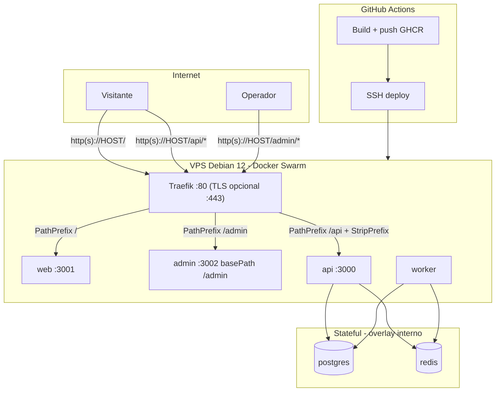

# Plano: Docker Swarm + GitHub Actions (MVP produção)

## Contexto atual

O repositório hoje só tem infra local em [`docker-compose.yml`](docker-compose.yml) (Postgres + Redis). **Não existem** Dockerfiles, stack Swarm nem workflows CI/CD. Os apps rodam nativamente via `npm run dev:*`; Next.js já usa `output: 'standalone'` em [`apps/web/next.config.ts`](apps/web/next.config.ts) e [`apps/admin/next.config.ts`](apps/admin/next.config.ts); a API expõe `GET /health` e `GET /health/ready` na raiz do Fastify (sem prefixo interno).

## Decisão de roteamento: paths (IP agora, domínio depois)

**Fase 1 — IP público (HTTP :80, sem TLS):**

| Caminho público | Serviço | Exemplo |
|-----------------|---------|---------|
| `/` | `web` (vitrine) | `http://185.x.x.x/` |
| `/api/*` | `api` (StripPrefix no Traefik) | `http://185.x.x.x/api/health/ready` |
| `/admin/*` | `admin` (`basePath: '/admin'`) | `http://185.x.x.x/admin/login` |

**Fase 2 — domínio (HTTPS, zero mudança de paths):**

| Caminho público | Exemplo |
|-----------------|---------|
| `/` | `https://seudominio.com/` |
| `/api/*` | `https://seudominio.com/api/products` |
| `/admin/*` | `https://seudominio.com/admin/login` |

A migração IP → domínio exige **apenas** atualizar secrets (`PUBLIC_BASE_URL`, `TLS_ENABLED`, `ACME_EMAIL`) e **rebuild** das imagens `web`/`admin` (URLs `NEXT_PUBLIC_*` são baked no build). Nenhuma alteração de paths, labels Traefik ou código de roteamento.

> Let's Encrypt **não emite certificados para IPs** — TLS fica desligado até existir domínio válido apontando para a VPS.

## Arquitetura alvo



**URLs públicas (derivadas de um único secret `PUBLIC_BASE_URL`):**

| Variável | Fase IP | Fase domínio |
|----------|---------|--------------|
| `PUBLIC_BASE_URL` | `http://185.x.x.x` | `https://seudominio.com` |
| `NEXT_PUBLIC_API_URL` | `{PUBLIC_BASE_URL}/api` | idem |
| `NEXT_PUBLIC_SITE_URL` / `WEB_PUBLIC_URL` | `{PUBLIC_BASE_URL}` | idem |
| `STORAGE_PUBLIC_BASE_URL` | `{PUBLIC_BASE_URL}/api/uploads` | idem |
| `CORS_ORIGINS` | `{PUBLIC_BASE_URL}` | idem (+ `www` se usar) |

**URLs internas (rede overlay, inalteradas entre fases):**

- `API_INTERNAL_URL=http://api:3000` — SSR/rewrites sem prefixo `/api` (Traefik faz StripPrefix na borda)
- `DATABASE_URL=postgresql://...@postgres:5432/...`
- `REDIS_URL=redis://redis:6379`

---

## 0. Ajustes de código (path routing)

### 0.1 Admin — `basePath: '/admin'`

Em [`apps/admin/next.config.ts`](apps/admin/next.config.ts):

```ts
const adminBasePath = process.env['ADMIN_BASE_PATH'] ?? '/admin';

const nextConfig: NextConfig = {
  basePath: adminBasePath,
  output: 'standalone',
  // ...
};
```

- Links internos do admin (`/login`, `/produtos`) continuam relativos à raiz do app; Next resolve automaticamente com `basePath`.
- Build arg / env `ADMIN_BASE_PATH=/admin` no Dockerfile e CI.
- **Dev local:** manter `ADMIN_BASE_PATH` vazio ou não definido em dev (default `/admin` só em produção via env do stack) — documentar que dev local continua em `http://localhost:3002` sem prefixo, ou alinhar dev com `/admin` via env.

### 0.2 API — sem prefixo interno

A API continua servindo rotas na raiz (`/health`, `/products`, `/uploads/`). O Traefik aplica middleware **StripPrefix `/api`** antes de encaminhar — evita alterar controllers/use cases.

- Healthcheck do container: `GET http://localhost:3000/health/ready` (interno, sem `/api`)
- Smoke test público: `curl http://HOST/api/health/ready`

### 0.3 Web — rewrite `/go/:slug`

[`apps/web/next.config.ts`](apps/web/next.config.ts) já usa `API_INTERNAL_URL` para rewrite server-side → `http://api:3000/go/:slug` (sem `/api`). Links no browser usam `NEXT_PUBLIC_API_URL` = `{PUBLIC_BASE_URL}/api`.

### 0.4 CORS

`CORS_ORIGINS` = origem sem path (`http://185.x.x.x` ou `https://seudominio.com`). O browser envia `Origin` sem sufixo `/admin` ou `/api`.

---

## 1. Artefatos Docker (novos)

### 1.1 `.dockerignore` (raiz)

Excluir `node_modules`, `.git`, `.next`, `dist`, `coverage`, `.env`, `uploads/` — reduz contexto de build e evita vazar secrets.

### 1.2 Dockerfiles multi-stage em `docker/`

Padrão monorepo: estágio `deps` (`npm ci` com workspaces) → `build` (`npm run build`) → `runtime` mínimo.

| Arquivo | Base runtime | Notas |
|---------|--------------|-------|
| [`docker/Dockerfile.api`](docker/Dockerfile.api) | `node:20-alpine` | `HEALTHCHECK` em `/health/ready` (porta interna 3000) |
| [`docker/Dockerfile.worker`](docker/Dockerfile.worker) | `node:20-alpine` | Sem porta HTTP; healthcheck via processo Node |
| [`docker/Dockerfile.migrate`](docker/Dockerfile.migrate) | `node:20-alpine` | Migrations + `CMD npm run db:migrate` |
| [`docker/Dockerfile.web`](docker/Dockerfile.web) | `node:20-alpine` | Build args: `NEXT_PUBLIC_API_URL`, `NEXT_PUBLIC_SITE_URL`, `WEB_PUBLIC_URL`, `API_INTERNAL_URL`, `SITE_NAME`, `STORAGE_PUBLIC_BASE_URL` |
| [`docker/Dockerfile.admin`](docker/Dockerfile.admin) | `node:20-alpine` | Build args acima + `ADMIN_BASE_PATH=/admin` |

Comentários em cada Dockerfile explicando build args e cache de layers.

**Storage MVP (1 réplica API):** `STORAGE_DRIVER=filesystem` + volume `uploads_data` em `/app/uploads`; URL pública `{PUBLIC_BASE_URL}/api/uploads`.

### 1.3 Stack Swarm — [`deploy/docker-stack.yml`](deploy/docker-stack.yml)

| Serviço | Réplicas MVP | Memória limit | Publicado |
|---------|--------------|---------------|-----------|
| `traefik` | 1 | 128M | 80 (+ 443 se `TLS_ENABLED=true`) |
| `postgres` | 1 | 768M | **não** |
| `redis` | 1 | 192M | **não** |
| `api` | 1 | 384M | via Traefik `/api` |
| `worker` | 1 | 384M | interno |
| `web` | 1 | 384M | via Traefik `/` |
| `admin` | 1 | 384M | via Traefik `/admin` |

**Labels Traefik (comentadas no YAML):**

```yaml
# Prioridade maior = avaliado primeiro (api e admin antes do catch-all /)

# API — PathPrefix /api + StripPrefix
# traefik.http.routers.vitrine-api.rule=PathPrefix(`/api`)
# traefik.http.routers.vitrine-api.priority=30
# traefik.http.middlewares.vitrine-api-strip.stripprefix.prefixes=/api
# traefik.http.routers.vitrine-api.middlewares=vitrine-api-strip

# Admin — PathPrefix /admin (sem strip; Next basePath cuida do resto)
# traefik.http.routers.vitrine-admin.rule=PathPrefix(`/admin`)
# traefik.http.routers.vitrine-admin.priority=20

# Web — catch-all /
# traefik.http.routers.vitrine-web.rule=PathPrefix(`/`)
# traefik.http.routers.vitrine-web.priority=10
```

Quando `TLS_ENABLED=true`, adicionar via `envsubst`:
- `traefik.http.routers.*.tls=true`
- `traefik.http.routers.*.tls.certresolver=letsencrypt`
- Router `web` entrypoint com redirect HTTP → HTTPS

### 1.4 Traefik — [`deploy/traefik/`](deploy/traefik/)

Dois arquivos estáticos selecionados pelo `deploy.sh` conforme `TLS_ENABLED`:

**[`traefik.http.yml`](deploy/traefik/traefik.http.yml)** — fase IP (padrão MVP):
```yaml
# Apenas entrypoint :80 — sem ACME, sem redirect HTTPS
entryPoints:
  web:
    address: ":80"
providers:
  docker:
    swarmMode: true
    exposedByDefault: false
```

**[`traefik.https.yml`](deploy/traefik/traefik.https.yml)** — fase domínio:
```yaml
# :80 redirect → :443 + Let's Encrypt HTTP challenge
entryPoints:
  web:
    address: ":80"
    http:
      redirections:
        entryPoint:
          to: websecure
          scheme: https
  websecure:
    address: ":443"
certificatesResolvers:
  letsencrypt:
    acme:
      email: "${ACME_EMAIL}"
      storage: /letsencrypt/acme.json
      httpChallenge:
        entryPoint: web
```

Comentários em cada arquivo explicando por que LE não funciona com IP e como alternar.

---

## 2. Scripts de operação — `deploy/scripts/`

| Script | Função |
|--------|--------|
| [`bootstrap-vps.sh`](deploy/scripts/bootstrap-vps.sh) | Docker CE, `swarm init`, `/opt/vitrine`, user `deploy`, UFW **22 + 80** (443 só após TLS) |
| [`render-env.sh`](deploy/scripts/render-env.sh) | Monta `/opt/vitrine/.env`; deriva URLs a partir de `PUBLIC_BASE_URL` |
| [`deploy.sh`](deploy/scripts/deploy.sh) | Seleciona `traefik.http.yml` ou `traefik.https.yml` → `envsubst` stack → `docker stack deploy` → smoke tests |
| [`migrate.sh`](deploy/scripts/migrate.sh) | One-shot migrate via rede overlay |
| [`seed.sh`](deploy/scripts/seed.sh) | Seed opcional (`SEED_FORCE=true`) |

Ordem: **pull → migrate → stack deploy → healthcheck**.

---

## 3. GitHub Actions — [`.github/workflows/deploy-production.yml`](.github/workflows/deploy-production.yml)

**Triggers:** `push` em `main`; `workflow_dispatch` com `run_seed` (boolean).

### Job `quality`
Lint, format, test unit + integration (Postgres/Redis service containers).

### Job `build_and_push`
- Matrix: `api`, `worker`, `web`, `admin`, `migrate` → GHCR
- Build args `web`/`admin` calculados no workflow:
  ```yaml
  # Exemplo — secrets montam PUBLIC_BASE_URL antes do build
  NEXT_PUBLIC_API_URL: ${{ secrets.PUBLIC_BASE_URL }}/api
  NEXT_PUBLIC_SITE_URL: ${{ secrets.PUBLIC_BASE_URL }}
  ADMIN_BASE_PATH: /admin
  ```

### Job `deploy_production` (`environment: production`)
1. SSH → VPS
2. `render-env.sh` (injeta secrets)
3. Pull images
4. `migrate.sh`
5. Seed condicional
6. `deploy.sh` com `IMAGE_TAG`
7. **Smoke tests HTTP** (fase IP):
   - `curl -fsS "${PUBLIC_BASE_URL}/api/health/ready"`
   - `curl -fsS -o /dev/null -w "%{http_code}" "${PUBLIC_BASE_URL}/"`
   - `curl -fsS -o /dev/null -w "%{http_code}" "${PUBLIC_BASE_URL}/admin/login"`

Quando `TLS_ENABLED=true`, os mesmos curls usam `https://` via `PUBLIC_BASE_URL` já com scheme correto.

---

## 4. Secrets do GitHub (environment `production`)

### Infra / deploy
- `VPS_SSH_HOST` — IP ou domínio para SSH
- `VPS_SSH_USER`, `VPS_SSH_PRIVATE_KEY`
- `TLS_ENABLED` — `false` (fase IP) → `true` (fase domínio)
- `ACME_EMAIL` — obrigatório só quando `TLS_ENABLED=true`
- `GHCR_PULL_TOKEN` (opcional PAT read-only para pull no VPS)

### URL pública (único ponto de verdade)
- `PUBLIC_BASE_URL` — `http://185.x.x.x` (fase IP) ou `https://seudominio.com` (fase domínio)

> Não usar secrets separados por subdomínio. Todos os `NEXT_PUBLIC_*` e `CORS_ORIGINS` são derivados em `render-env.sh`.

### Banco / cache / segurança / app
- `POSTGRES_USER`, `POSTGRES_PASSWORD`, `POSTGRES_DB`
- `JWT_SECRET`, `PASSWORD_PEPPER`, `ENCRYPTION_KEY`, `REVALIDATE_SECRET`
- `SITE_NAME`, `COMPANY_LEGAL_NAME`, `CONTACT_EMAIL`, `SITE_TAGLINE`
- `AMAZON_AFFILIATE_TAG`, `SHOPEE_AFFILIATE_ID`
- `EMAIL_FROM`, `RESEND_API_KEY`
- `ADMIN_SEED_EMAIL`, `ADMIN_SEED_PASSWORD`
- `GA4_PROPERTY_ID`, `GA4_SERVICE_ACCOUNT_JSON` (opcional)

---

## 5. Bootstrap e migração IP → domínio

### 5.1 Primeiro deploy (IP)

1. Apontar browser para IP da VPS (sem DNS obrigatório)
2. Executar `bootstrap-vps.sh` no VPS
3. Configurar secrets: `PUBLIC_BASE_URL=http://<IP>`, `TLS_ENABLED=false`
4. `workflow_dispatch` com `run_seed: true`
5. Validar: `http://<IP>/`, `http://<IP>/admin/login`

### 5.2 Migrar para domínio + HTTPS (zero fricção de paths)

1. DNS: registro `A` de `seudominio.com` → IP da VPS
2. Atualizar secrets no GitHub:
   - `PUBLIC_BASE_URL=https://seudominio.com`
   - `TLS_ENABLED=true`
   - `ACME_EMAIL=ops@seudominio.com`
3. Abrir UFW porta 443 (`ufw allow 443`)
4. Push ou `workflow_dispatch` → CI rebuilda `web`/`admin` com novas URLs baked
5. Traefik passa a servir `traefik.https.yml` + emite certificado LE
6. Validar: `https://seudominio.com/admin/login`, `https://seudominio.com/api/health/ready`

**O que NÃO muda:** paths `/`, `/api`, `/admin`; labels Traefik PathPrefix; StripPrefix; `ADMIN_BASE_PATH`; código da API.

---

## 6. Produção e escala

| Aspecto | MVP (1 VPS, IP/HTTP) | Domínio + escala |
|---------|----------------------|------------------|
| TLS | Desligado (`TLS_ENABLED=false`) | LE via Traefik |
| Roteamento | Path-based (mesmo em ambas fases) | Idêntico |
| API/Web/Admin | 1 réplica | `docker service scale` |
| Postgres/Redis | No VPS | Managed externo |
| Uploads | Volume local | S3/GCS para réplicas >1 |
| Backup | `pg_dump` cron | Off-site |

---

## 7. Documentação — [`docs/deployment-swarm.md`](docs/deployment-swarm.md)

- Diagrama de paths e fases IP/domínio
- Tabela de secrets e derivação de URLs
- Runbook migração IP → domínio (checklist de 6 passos acima)
- Troubleshooting: ACME falhou, 404 em `/admin`, CORS, OOM 4 GB
- Atualizar [`docs/README.md`](docs/README.md) e [`.env.example`](.env.example) com `PUBLIC_BASE_URL`, `TLS_ENABLED`, `ADMIN_BASE_PATH`

---

## 8. Ordem de implementação

1. Ajuste `apps/admin/next.config.ts` (`ADMIN_BASE_PATH`) + validar dev
2. `.dockerignore` + Dockerfiles
3. `deploy/traefik/` (http + https) + `docker-stack.yml` com PathPrefix labels
4. `deploy/scripts/*`
5. Workflows CI + deploy-production
6. `docs/deployment-swarm.md`
7. Deploy IP com `run_seed: true`

---

## Riscos e mitigações

- **HTTP em IP (fase 1):** aceitável para validação MVP; documentar que JWT/cookies trafegam sem criptografia até TLS
- **Next `basePath` em dev:** usar env opcional para não quebrar `localhost:3002` no dia a dia
- **Prioridade Traefik:** `/api` e `/admin` com priority > `/` para evitar catch-all engolir rotas
- **Rebuild obrigatório na migração de domínio:** `NEXT_PUBLIC_*` são build-time; workflow deve rebuildar sempre que `PUBLIC_BASE_URL` mudar
- **OOM (4 GB):** limits no stack; reduzir telemetry buffer se necessário
