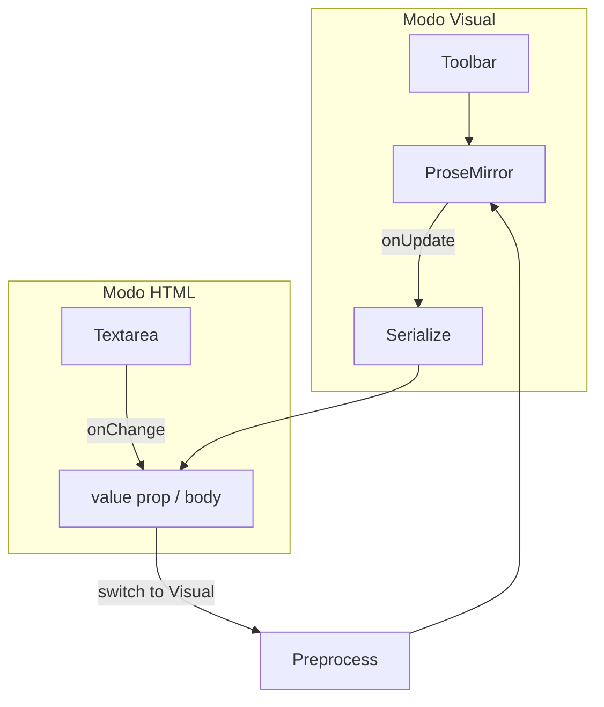

# Plano: Toolbar e Modo HTML no Editor de Artigos

## Contexto atual

O editor vive em [`apps/admin/src/components/articles/ArticleEditor.tsx`](apps/admin/src/components/articles/ArticleEditor.tsx):

- TipTap com `StarterKit`, `Link`, `Placeholder`, `ProductEmbedExtension`
- Botão "Inserir produto" **fora** da área de edição
- Sem toolbar de formatação nem modo HTML
- Persistência via [`serializeArticleBody`](apps/admin/src/components/articles/extensions/ProductEmbedExtension.ts) (converte `div[data-product-embed]` → `[[product:slug]]`)

`StarterKit` já expõe os comandos necessários (`bold`, `italic`, `strike`, `heading`, `bulletList`, `orderedList`) — **nenhuma dependência TipTap nova**.



---

## 1. Configuração TipTap (StarterKit)

Em `ArticleEditor.tsx`, configurar `StarterKit` para alinhar ao contrato editorial:

```typescript
StarterKit.configure({
  heading: { levels: [2, 3] }, // só H2/H3 no toolbar (SEO)
  // manter bulletList, orderedList, bold, italic, strike (default)
})
```

Manter `Link`, `Placeholder`, `ProductEmbedExtension` inalterados.

---

## 2. Novo componente: `ArticleEditorToolbar`

**Arquivo:** [`apps/admin/src/components/articles/ArticleEditorToolbar.tsx`](apps/admin/src/components/articles/ArticleEditorToolbar.tsx)

Props: `editor: Editor | null`, `onInsertProduct: () => void`, `disabled?: boolean` (true no modo HTML).

| Botão | Ícone (lucide-react) | Comando TipTap | Estado ativo |
|-------|---------------------|----------------|--------------|
| H2 | `Heading2` | `toggleHeading({ level: 2 })` | `editor.isActive('heading', { level: 2 })` |
| H3 | `Heading3` | `toggleHeading({ level: 3 })` | `editor.isActive('heading', { level: 3 })` |
| Negrito | `Bold` | `toggleBold()` | `editor.isActive('bold')` |
| Itálico | `Italic` | `toggleItalic()` | `editor.isActive('italic')` |
| Riscado | `Strikethrough` | `toggleStrike()` | `editor.isActive('strike')` |
| Lista marcada | `List` | `toggleBulletList()` | `editor.isActive('bulletList')` |
| Lista numerada | `ListOrdered` | `toggleOrderedList()` | `editor.isActive('orderedList')` |
| Inserir produto | `Package` | callback `onInsertProduct` | — |

**Estilo dos botões (Tailwind):**

- Base: `h-8 w-8 rounded-md text-neutral-500 hover:bg-neutral-100 hover:text-neutral-800`
- Ativo: `bg-gray-100 text-gray-900` (conforme spec)
- Toolbar: `flex flex-wrap items-center gap-0.5 border-b border-neutral-200 bg-neutral-50 px-2 py-1.5 rounded-t-lg`
- Separador visual entre grupos (títulos | estilos | listas | produto): `w-px h-5 bg-neutral-200 mx-1`

**Reatividade do estado ativo:** hook local `useEditorToolbarState(editor)` que subscreve `editor.on('selectionUpdate')` e `editor.on('transaction')` para forçar re-render (padrão TipTap sem `useEditorState` no projeto).

---

## 3. Abas Visual / Código HTML

**Arquivo:** [`apps/admin/src/components/articles/ArticleEditorModeTabs.tsx`](apps/admin/src/components/articles/ArticleEditorModeTabs.tsx) (ou inline no header do bloco).

Layout do bloco de conteúdo (uma única caixa com borda):

```
┌─────────────────────────────────────────────────────────┐
│ [H2][H3] | [B][I][S] | [•][1.] | [Produto]  Visual|HTML│
├─────────────────────────────────────────────────────────┤
│  EditorContent (visual)  OU  textarea (html)            │
└─────────────────────────────────────────────────────────┘
```

- Abas no **canto superior direito** do header (`ml-auto`), estilo segmentado: aba ativa `bg-white shadow-sm`, inativa `text-neutral-500`
- Labels: **Visual** e **Código HTML**

---

## 4. Sincronização bidirecional

Estado em `ArticleEditor.tsx`:

```typescript
type EditorMode = 'visual' | 'html';
const [mode, setMode] = useState<EditorMode>('visual');
const [htmlDraft, setHtmlDraft] = useState(value);
```

### Visual → HTML

Ao clicar "Código HTML":

1. Se `editor` existir: `htmlDraft = serializeArticleBody(editor.getHTML())`
2. Senão: `htmlDraft = value`
3. `setMode('html')`

### HTML → Visual

Ao clicar "Visual":

1. `onChange(htmlDraft)` (garante parent atualizado)
2. `editor.commands.setContent(preprocessBodyForEditor(htmlDraft), { emitUpdate: false })`
3. `setMode('visual')`

### Durante edição

| Modo | Fluxo |
|------|--------|
| Visual | `onUpdate` → `onChange(serializeArticleBody(getHTML()))` + `/produto` (como hoje) |
| HTML | `textarea onChange` → `setHtmlDraft` + `onChange(next)` imediato |

### Prop `value` externa (ex.: colar JSON da LLM)

- **Visual:** manter `useEffect` existente que compara `value` com HTML serializado e chama `setContent`
- **HTML:** quando `mode === 'html'` e `value !== htmlDraft`, sincronizar `setHtmlDraft(value)`

### Modo HTML — textarea

Classes conforme spec:

```tsx
className="min-h-[320px] w-full resize-y rounded-b-lg border-0 bg-gray-50 px-3 py-3 font-mono text-sm leading-relaxed text-neutral-800 whitespace-pre-wrap focus:outline-none focus:ring-2 focus:ring-[var(--admin-focus-ring)]"
```

- Toolbar **desabilitada** (`disabled`, `opacity-50`, `pointer-events-none`) no modo HTML
- Comando `/produto` **somente** no modo Visual (`detectSlashProductCommand` guard)

---

## 5. Refatoração de `ArticleEditor.tsx`

Responsabilidades finais:

| Peça | Função |
|------|--------|
| `ArticleEditor.tsx` | Orquestra mode, editor TipTap, sync, modal produto |
| `ArticleEditorToolbar.tsx` | Botões de formatação + produto |
| `ArticleEditorModeTabs.tsx` | Toggle Visual/HTML |
| `ProductEmbedExtension.ts` | Sem mudança de contrato |

Remover o bloco solto com `<Button>Inserir produto</Button>` abaixo do editor — integrar na toolbar.

`ArticleForm.tsx` **não precisa mudar** (continua `<ArticleEditor value={body} onChange={setBody} />`); hint/LLM helper permanecem na seção Conteúdo.

---

## 6. Ajustes CSS (opcional, mínimo)

Em [`apps/admin/src/app/globals.css`](apps/admin/src/app/globals.css) ou classes no componente:

- Estilos ProseMirror para `h2`/`h3` dentro do editor (`[&_.ProseMirror_h2]:text-lg font-semibold`) para feedback visual ao formatar
- Manter `prose prose-sm` no `EditorContent`

---

## 7. Testes e documentação

- **Testes:** não obrigatórios (UI pura); opcional smoke manual no checklist
- **Doc:** atualizar seção "Editor" em [`docs/admin-articles-phase1.md`](docs/admin-articles-phase1.md) mencionando toolbar, abas e edição HTML com shortcodes

---

## Checklist de validação manual

1. Selecionar texto → botão Bold fica `bg-gray-100`
2. Cursor em `<h2>` → H2 ativo
3. Inserir produto via toolbar no modo Visual → shortcode no HTML ao alternar aba
4. Editar `[[product:slug]]` no modo HTML → voltar Visual mostra chip de embed
5. Colar HTML da LLM no modo HTML → salvar artigo → vitrine renderiza corretamente
6. `npm run build -w @ecommerce-amazon/admin` limpo

## Fora de escopo

- Syntax highlighting do HTML (CodeMirror/Monaco)
- Undo/redo na toolbar
- Link picker na toolbar (Link extension existe mas não foi pedida)
