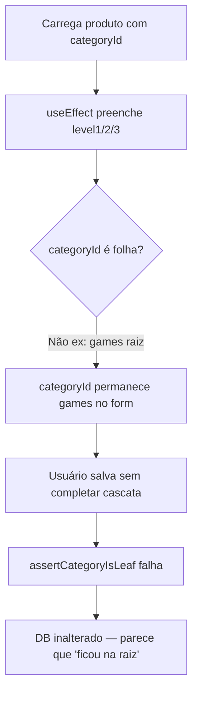

# Correção: categorias no admin e header da vitrine

## Diagnóstico

### A regra de folha é intencional

Documentado em [docs/categories-hierarchy.md](docs/categories-hierarchy.md) e no PRD ([`.cursor/plans/categorias_hierárquicas_seo_1cdf7b5f.plan.md`](.cursor/plans/categorias_hierárquicas_seo_1cdf7b5f.plan.md)):

- **Produtos** devem ter `category_id` apontando para uma **folha** (sem filhos) — validação em [`assertCategoryIsLeaf`](packages/application/src/use-cases/category/category.helpers.ts).
- **Páginas de categoria** (`/categorias/{slug}`) funcionam em **qualquer nó** (raiz, intermediário ou folha) e listam a **subárvore** via `getDescendantIds` em [`ListProducts.ts`](packages/application/src/use-cases/product/ListProducts.ts).

Ou seja: o erro `Product must be assigned to a leaf category` **não é bug da regra** — indica que o `categoryId` enviado no save ainda aponta para um nó com filhos.

### Por que o admin “não persiste” a subcategoria

Fluxo atual em [`CategoryCascadeSelect.tsx`](apps/admin/src/components/categories/CategoryCascadeSelect.tsx):



Causas concretas:

1. **Dados legados** — migration [`0008_categories_hierarchy.sql`](packages/infrastructure/src/persistence/drizzle/migrations/0008_categories_hierarchy.sql) e seed ([`seed.ts`](packages/infrastructure/src/persistence/drizzle/seed.ts) linhas ~207, 234, 708) atribuem produtos a raízes (`games`, `home-office`). Depois que subcategorias são criadas, esses IDs deixam de ser folha.
2. **Hidratação incompleta** — o `useEffect` só preenche os selects cascata; **não limpa** `categoryId` inválido quando o produto está numa raiz/intermediário.
3. **Sem validação client-side** — o formulário só descobre o problema no PATCH, com mensagem em inglês.
4. **Descompasso de profundidade** — `MAX_CATEGORY_DEPTH = 4` ([`Category.ts`](packages/domain/src/entities/Category.ts)), mas o picker tem só **3 selects**; folhas no 4º nível seriam inalcançáveis.

### Header da vitrine — comportamento atual vs desejado

Em [`CategoryCatalogFlyout.tsx`](apps/web/src/components/layout/CategoryCatalogFlyout.tsx):

- Coluna esquerda: raízes são `<button>` (hover/focus → troca painel direito).
- Coluna direita: filhos/netos são `<Link>`.
- Existe link **"Ver tudo em {raiz}"** para a página da raiz.

Isso difere das **pills da Home** ([`CategoryPillsRow.tsx`](apps/web/src/components/blocks/CategoryPillsRow.tsx)), onde raízes são clicáveis. Você escolheu: **manter hover + tornar raízes também clicáveis**.

---

## Plano de implementação

### 1. Helper compartilhado para resolver folha da cascata

Criar em `packages/shared/src/category/` (ex.: `resolve-cascade-category-id.ts`):

- `resolveLeafCategoryId(levels, options)` — retorna o ID do nível mais profundo selecionado **somente se** `isLeaf === true`.
- `buildCascadePath(categoryId, options)` — extrai `[level1, level2, level3, level4]` a partir de um `categoryId` (substitui `resolvePath` local).
- Testes unitários (Vitest) cobrindo: folha em cada profundidade, intermediário incompleto, `categoryId` legado em raiz.

Reutilizar `CategoryFlatOption` de [`categories-utils.ts`](apps/admin/src/lib/api/categories-utils.ts).

### 2. Corrigir `CategoryCascadeSelect`

Arquivo: [`apps/admin/src/components/categories/CategoryCascadeSelect.tsx`](apps/admin/src/components/categories/CategoryCascadeSelect.tsx)

| Mudança          | Detalhe                                                                                                                                                                |
| ---------------- | ---------------------------------------------------------------------------------------------------------------------------------------------------------------------- |
| 4º select        | Adicionar `categoryCascadeLevel4` + select condicional (alinhar com `MAX_CATEGORY_DEPTH`)                                                                              |
| Hidratação       | Ao carregar `categoryId`, preencher todos os níveis; se o ID **não for folha**, limpar `categoryId` e exibir aviso inline (“Selecione a subcategoria mais específica”) |
| Handlers         | Unificar lógica: ao mudar qualquer nível, recalcular `categoryId` via helper (evita estado stale)                                                                      |
| `handleLevel3/4` | Validar `isLeaf` antes de setar (hoje level3 seta sem checar)                                                                                                          |

Atualizar [`product-form-values.ts`](apps/admin/src/lib/product-form-values.ts) com `categoryCascadeLevel4`.

### 3. Sincronizar categoria no submit do produto

Arquivo: [`ProductForm.tsx`](apps/admin/src/components/products/ProductForm.tsx)

Antes de `createProductBodySchema.parse`:

1. Obter `categoryOptions` (extrair hook ou passar via contexto leve).
2. Derivar `categoryId` final com `resolveLeafCategoryId`.
3. Se cascata iniciada mas sem folha resolvida → `adminToast.error('Selecione a subcategoria folha mais específica.')` e abortar.
4. `form.setValue('categoryId', resolvedId)` e então parse/submit.

Isso impede envio do `categoryId` legado da raiz quando o usuário já selecionou subcategorias nos selects.

### 4. Mensagens em pt-BR

- Validação client-side: mensagens claras no admin.
- Mapear erro da API em [`ProductForm.tsx`](apps/admin/src/components/products/ProductForm.tsx) ou [`bff-error-status`](apps/admin/src/lib/api/bff-error-status.ts): `Product must be assigned to a leaf category` → “O produto precisa estar em uma subcategoria folha (sem filhos).”

### 5. Header — raízes clicáveis mantendo hover

Arquivo: [`CategoryCatalogFlyout.tsx`](apps/web/src/components/layout/CategoryCatalogFlyout.tsx)

- Transformar item da coluna esquerda em estrutura **link + hover**: `<Link href={/categorias/${root.slug}}>` com `onMouseEnter`/`onFocus` preservados para trocar painel direito.
- Garantir que clique navega e fecha o flyout (`setOpen(false)`).
- Espelhar padrão no mobile [`CategoryCatalogDrawer.tsx`](apps/web/src/components/layout/CategoryCatalogDrawer.tsx): no accordion, o trigger da raiz pode ser linkável ou ter link explícito ao lado (já existe “Ver tudo em…” — manter e revisar affordance).

CSS: ajuste mínimo em [`apps/web/src/app/globals.css`](apps/web/src/app/globals.css) se o estado `--active` conflitar com estilo de link.

### 6. Dados de seed (correção preventiva)

Em [`seed.ts`](packages/infrastructure/src/persistence/drizzle/seed.ts): mover produtos de exemplo de `SEED_CATEGORY_GAMES_ID` (raiz) para `SEED_CATEGORY_TECLADOS_ID` (folha), evitando estado inválido em ambientes novos.

Não criar migration de backfill automático nesta entrega (risco em produção); documentar comando SQL opcional para operadores com produtos legados.

### 7. Documentação

Atualizar [docs/categories-hierarchy.md](docs/categories-hierarchy.md):

- Esclarecer diferença **produto = folha** vs **navegação = qualquer nó**.
- Header: raízes clicáveis + hover.
- Admin: cascata de 4 níveis e validação client-side.

---

## Arquivos principais

| Arquivo                                                          | Ação                              |
| ---------------------------------------------------------------- | --------------------------------- |
| `packages/shared/src/category/resolve-cascade-category-id.ts`    | Novo + testes                     |
| `apps/admin/src/components/categories/CategoryCascadeSelect.tsx` | Corrigir sync/hidratação/4 níveis |
| `apps/admin/src/components/products/ProductForm.tsx`             | Resolver folha no submit          |
| `apps/admin/src/lib/product-form-values.ts`                      | `level4`                          |
| `apps/web/src/components/layout/CategoryCatalogFlyout.tsx`       | Raízes clicáveis                  |
| `packages/infrastructure/src/persistence/drizzle/seed.ts`        | Produtos em folha                 |
| `docs/categories-hierarchy.md`                                   | Atualizar                         |

## Como testar

1. Admin → produto com categoria `games` (raiz) → abrir edição → deve mostrar aviso e exigir seleção até folha (ex.: Games → Periféricos → Teclados Mecânicos).
2. Salvar com folha selecionada → PATCH 200; reabrir formulário com cascata correta.
3. Tentar salvar com intermediário incompleto → erro client-side em pt-BR (sem round-trip).
4. Header desktop → hover em raiz troca painel; clique na raiz navega para `/categorias/{slug}`.
5. `npm run test -w @ecommerce-amazon/shared` para novos helpers.

```bash
npm run lint
npm run test -w @ecommerce-amazon/shared
```
