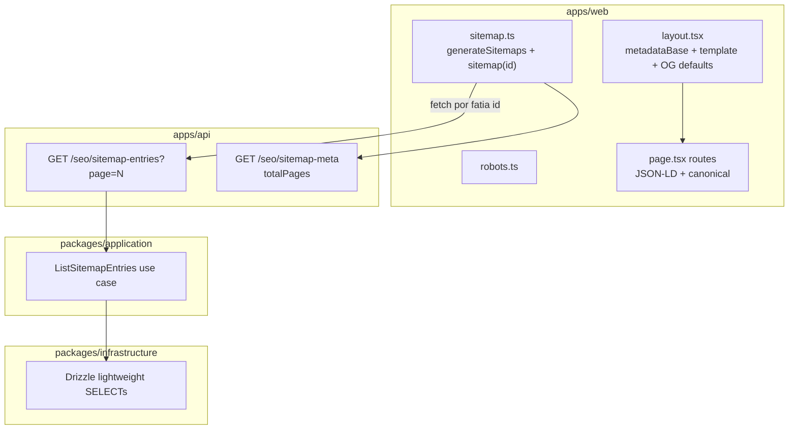

# Auditoria e Otimização SEO Técnico — Plano de Implementação

## Diagnóstico (estado atual)

A base está **parcialmente implementada**. Rotas indexáveis principais já têm `generateMetadata` com canonical via [`getSiteBaseUrl()`](apps/web/src/lib/site-url.ts). JSON-LD existe em produto, categoria, coleção e artigo. **Lacunas críticas:**

| Área | Status | Gap |
|------|--------|-----|
| Metadados globais | Parcial | Sem `metadataBase`, title template, OG/Twitter global |
| Sitemap / robots | Ausente | Nenhum `sitemap.ts` ou `robots.ts` |
| Canonical | Bom | 404 e entidades não encontradas sem `robots: noindex`; categorias sem defesa contra query params (sort/filter/page) |
| Crawl budget | Ausente | Variações `?sort=`, `?page=`, `?filter_*` podem ser indexadas sem canonical expurgada |
| Sitemap escalável | Ausente | Endpoint monolítico causaria OOM/timeout com 50k+ URLs |
| lastmod produto | N/A | `price_updated_at` no CRON geraria lastmod spammy |
| JSON-LD Home | Ausente | Sem `Organization` / `WebSite` |
| JSON-LD Categoria | Parcial | `CollectionPage` + breadcrumb; falta `ItemList` de produtos |
| JSON-LD Artigo | Parcial | Falta `dateModified`, `publisher`, `url`, `mainEntityOfPage` |
| LCP | Parcial | `ArticleHero` OK; home hero (`BentoHubMix`) sem `priority`; carousel com `priority` em todos os slides |
| CLS | Risco alto | `ProductGridBlock` / `FeaturedProductBlock` client-fetch com skeletons incompletos |
| Links `/go/` | Quase OK | `AffiliateGoLink` já usa `noopener sponsored`; `WishlistDrawer` abre `/go/` sem `sponsored` |

**Decisões confirmadas:** manter `rel="noopener sponsored"`; **não** incluir `/cupons` no sitemap até a página existir.

---

## Arquitetura alvo



O web **não importa** `@ecommerce-amazon/infrastructure` hoje — o sitemap consulta o banco via **novo endpoint API**, não paginação de listagens completas.

---

## 1. Metadados globais e canonical (`global-metadata-refactor`)

### 1.1 Helper compartilhado de metadata

Criar [`packages/shared/src/seo/site-metadata.ts`](packages/shared/src/seo/site-metadata.ts) (exportar em [`packages/shared/src/seo/index.ts`](packages/shared/src/seo/index.ts)):

```typescript
export function buildRootMetadata(brand: BrandConfig): Metadata {
  return {
    metadataBase: new URL(brand.url),
    title: {
      default: formatWebHomeTitle(brand),
      template: `%s | ${brand.name}`,
    },
    description: 'Descubra ofertas selecionadas com histórico de preços e alertas.',
    openGraph: {
      type: 'website',
      locale: 'pt_BR',
      siteName: brand.name,
      url: brand.url,
    },
    twitter: { card: 'summary_large_image' },
    alternates: { canonical: brand.url },
  };
}

export function buildPageCanonical(path: string, brand: BrandConfig): string {
  // Sempre URL limpa — nunca inclui query params
  return `${brand.url}${path.startsWith('/') ? path : `/${path}`}`;
}
```

**Contrato:** `buildPageCanonical` recebe **somente o pathname** (ex: `/categorias/eletronicos`). Query strings de ordenação, filtro ou paginação **nunca** entram no canonical — mitiga duplicação e protege crawl budget.

### 1.2 Root layout

Refatorar [`apps/web/src/app/layout.tsx`](apps/web/src/app/layout.tsx) para usar `buildRootMetadata(getServerBrandConfig())`.

### 1.3 Padronizar títulos filhos

Com `title.template`, páginas filhas devem passar **título curto** (sem sufixo `| Brand`):

| Arquivo | Ajuste |
|---------|--------|
| [`apps/web/src/app/page.tsx`](apps/web/src/app/page.tsx) | `title: layout?.seoTitle ?? brand.tagline` (template adiciona brand) |
| [`apps/web/src/app/categorias/[slug]/page.tsx`](apps/web/src/app/categorias/[slug]/page.tsx) | Usar `category.seoTitle ?? category.label`; ver **§1.6 Crawl budget** |
| [`apps/web/src/app/artigos/page.tsx`](apps/web/src/app/artigos/page.tsx) | `title: 'Artigos'` |
| [`apps/web/src/app/artigos/[slug]/page.tsx`](apps/web/src/app/artigos/[slug]/page.tsx) | Manter título editorial; adicionar OG `url` + `siteName` |
| [`apps/web/src/app/colecoes/[slug]/page.tsx`](apps/web/src/app/colecoes/[slug]/page.tsx) | Remover sufixo hardcoded `| Coleções` |
| [`packages/shared/src/seo/product-meta.ts`](packages/shared/src/seo/product-meta.ts) | Remover sufixo longo `| Análise, Prós...`; confiar no template ou manter sufixo editorial curto sem brand duplicada |

### 1.4 Canonical + noindex em fallbacks

Helper `buildNotFoundMetadata(title: string)` retornando:

```typescript
{ title, robots: { index: false, follow: false } }
```

Aplicar em: [`not-found.tsx`](apps/web/src/app/not-found.tsx), branches `generateMetadata` de produto/categoria/coleção/artigo quando entidade ausente.

### 1.5 Open Graph por rota (herança + override)

- **Produto** ([`produtos/[slug]/page.tsx`](apps/web/src/app/produtos/[slug]/page.tsx)): OG com `type: website`, imagem principal, `url` canônica.
- **Categoria / Coleção**: OG básico (title, description, url).
- **Artigo**: já tem OG parcial — completar `url`, `publishedTime`, `modifiedTime` (quando `updatedAt` disponível).

### 1.6 Crawl budget — query params em categorias (e rotas facetadas)

**Gap identificado:** plataformas de afiliados sofrem indexação infinita de variações (`?sort=price_asc`, `?page=2`, `?filter_brand=...`). Hoje [`categorias/[slug]/page.tsx`](apps/web/src/app/categorias/[slug]/page.tsx) não lê `searchParams`, mas a API já suporta paginação/ordenação — a defesa deve ser implementada **antes** de expor filtros na UI.

**Correções em `generateMetadata`:**

1. Aceitar `searchParams: Promise<{ page?: string; sort?: string; [key: string]: string | undefined }>`.
2. **Canonical sempre limpa:** `alternates.canonical: buildPageCanonical(\`/categorias/${slug}\`, brand)` — expurga categoricamente sort, filter e page.
3. **Paginação não indexável:** quando `Number(searchParams.page) > 1`, injetar `robots: { index: false, follow: true }`. Página 1 (ou ausência de `page`) permanece indexável.
4. **Filtros/ordenação:** mesmo com `page=1`, canonical aponta para URL limpa; opcionalmente `robots: { index: false, follow: true }` quando qualquer param de filtro/sort estiver presente (recomendado — conteúdo duplicado com mesma listagem reordenada).

```typescript
export async function generateMetadata({
  params,
  searchParams,
}: {
  params: Promise<{ slug: string }>;
  searchParams: Promise<Record<string, string | undefined>>;
}): Promise<Metadata> {
  const { slug } = await params;
  const sp = await searchParams;
  const page = Number(sp.page ?? '1');
  const hasFacetParams = Boolean(sp.sort || sp.filter_brand || /* demais filtros */);
  const brand = getServerBrandConfig();

  return {
    title: category.seoTitle ?? category.label,
    description: /* ... */,
    alternates: {
      canonical: buildPageCanonical(`/categorias/${slug}`, brand),
    },
    ...((page > 1 || hasFacetParams) && {
      robots: { index: false, follow: true },
    }),
  };
}
```

**Replicar padrão** em [`artigos/page.tsx`](apps/web/src/app/artigos/page.tsx) (já canonicaliza `/artigos` — adicionar `noindex` quando `page > 1` ou `q`/`categoria` presentes, alinhado ao modelo de listagem facetada).

**Helper compartilhado:** `buildFacetedListingMetadata({ canonicalPath, page, hasFacetParams, ... })` em `site-metadata.ts` para DRY entre categorias e artigos.

---

## 2. Sitemap dinâmico (`dynamic-sitemap-index`)

### 2.1 Use case + repositório (camada application/infrastructure)

Novo use case [`packages/application/src/use-cases/seo/ListSitemapEntries.ts`](packages/application/src/use-cases/seo/ListSitemapEntries.ts):

```typescript
type SitemapEntry = {
  path: string;           // e.g. "/produtos/foo"
  lastModified: Date;
  changeFrequency?: 'daily' | 'weekly' | 'monthly';
  priority?: number;
};
```

Consultas Drizzle leves (somente `slug` + timestamp):

| Entidade | Filtro | Path | lastModified |
|----------|--------|------|--------------|
| Categorias ativas | `deleted_at IS NULL` | `/categorias/{slug}` | `updated_at` |
| Produtos publicados visíveis | `status=published AND visible=true` | `/produtos/{slug}` | **`updated_at` apenas** — ver §2.4 |
| Artigos publicados | `status=published` | `/artigos/{slug}` | `updated_at` |
| Coleções públicas | `is_public=true` | `/colecoes/{slug}` | `updated_at` |

Estáticos hardcoded no use case ou no `sitemap.ts`:

- `/` — priority 1.0, changefreq daily
- `/artigos` — priority 0.8

**Excluir:** `/go/*`, `/cupons` (sem página), rotas admin, query-param URLs.

Wire em [`packages/infrastructure/src/di/api-container.ts`](packages/infrastructure/src/di/api-container.ts) + export em [`packages/application/src/index.ts`](packages/application/src/index.ts).

### 2.2 Endpoint API paginado (escalabilidade)

**Gap identificado:** um único `GET /seo/sitemap-entries` retornando 50k+ slugs causa OOM no Node.js ou timeout no gateway.

**Correção — dois endpoints leves:**

| Endpoint | Propósito | Resposta |
|----------|-----------|----------|
| `GET /seo/sitemap-meta` | Contagem total para fatias | `{ totalEntries, pageSize, totalPages }` |
| `GET /seo/sitemap-entries?page=N&pageSize=50000` | Fatia paginada | `{ page, pageSize, items: [{ path, lastModified }] }` |

Implementar em [`apps/api/src/adapters/http/routes/index.ts`](apps/api/src/adapters/http/routes/index.ts):

- **`pageSize` default:** 50.000 (limite Google por sitemap individual)
- **`page` 1-based**, validado via Zod
- Query Drizzle com `LIMIT/OFFSET` ou cursor por `slug` (preferir `ORDER BY path ASC LIMIT n OFFSET (page-1)*pageSize` para determinismo)
- Entidades mescladas em ordem estável: estáticos → categorias → coleções → artigos → produtos (produtos ocupam a maior fatia)
- Cache HTTP: `Cache-Control: public, s-maxage=3600, stale-while-revalidate=86400`
- Testes em [`apps/api/src/api.test.ts`](apps/api/src/api.test.ts): paginação, pageSize máximo, resposta vazia em page > totalPages

### 2.3 Next.js sitemap com `generateSitemaps`

Criar [`apps/web/src/app/sitemap.ts`](apps/web/src/app/sitemap.ts) usando API nativa de múltiplos sitemaps:

```typescript
import type { MetadataRoute } from 'next';

export async function generateSitemaps() {
  const { totalPages } = await apiFetchParsed('/seo/sitemap-meta', sitemapMetaSchema);
  return Array.from({ length: totalPages }, (_, i) => ({ id: i }));
}

export default async function sitemap({
  id,
}: {
  id: number;
}): Promise<MetadataRoute.Sitemap> {
  const base = getSiteBaseUrl();
  const page = id + 1; // id é 0-based
  const { items } = await apiFetchParsed(
    `/seo/sitemap-entries?page=${page}`,
    sitemapEntriesSchema,
  );
  return items.map(({ path, lastModified }) => ({
    url: `${base}${path}`,
    lastModified: new Date(lastModified),
  }));
}
```

Next.js gera `/sitemap/0.xml`, `/sitemap/1.xml`, … e um índice `/sitemap.xml`. Atualizar [`robots.ts`](apps/web/src/app/robots.ts) para apontar `sitemap: \`${base}/sitemap.xml\`` (índice automático).

`revalidate = 3600` alinhado ao ISR das páginas.

### 2.4 Política de `lastmod` para produtos

**Gap identificado:** `price_updated_at` muda várias vezes/dia via Pipeline B (CRON). Usar `GREATEST(updated_at, price_updated_at)` faz o Google ignorar `lastmod` por sinal spammy — conteúdo estrutural (review, título, specs) permanece idêntico.

**Correção:**

| Entidade | Coluna `lastModified` | Justificativa |
|----------|----------------------|---------------|
| Produto | **`updated_at` apenas** | Reflete mudanças editoriais/estruturais (status, descrição, specs, slug) |
| Categoria | `updated_at` | OK |
| Artigo | `updated_at` | OK |
| Coleção | `updated_at` | OK |

**Explicitamente excluir** `price_updated_at` do sitemap. Variações de preço continuam visíveis na página via catálogo local, mas não disparam re-crawl via sitemap.

**Alternativa documentada (não implementar no MVP):** lastmod híbrido só se variação de preço > 15% — complexidade desnecessária; `updated_at` puro é suficiente.

---

## 3. robots.txt (`robots-txt-enforcement`)

Criar [`apps/web/src/app/robots.ts`](apps/web/src/app/robots.ts):

```typescript
export default function robots(): MetadataRoute.Robots {
  const base = getSiteBaseUrl();
  return {
    rules: {
      userAgent: '*',
      allow: '/',
      disallow: ['/go/', '/api/'],
    },
    sitemap: `${base}/sitemap.xml`,
  };
}
```

**Nota:** `/events/` não existe em `apps/web` (telemetria vai direto à API). Não incluir `Disallow: /events/` no domínio web — evita regra morta. Se no futuro houver proxy de analytics no web, adicionar.

---

## 4. Core Web Vitals (`core-web-vitals-audit`)

### 4.1 LCP — imagens above-the-fold

| Componente | Arquivo | Fix |
|------------|---------|-----|
| Bento hero (provável LCP da home) | [`BentoHubMixGrid.tsx`](apps/web/src/components/blocks/BentoHubMixGrid.tsx) | Prop `priority?: boolean` no `BentoHeroSlot`; `PageRenderer` passa `priority={blockIndex === 0}` para o primeiro bloco visual |
| Hero carousel | [`HeroCarouselBlock.tsx`](apps/web/src/components/blocks/HeroCarouselBlock.tsx) | `priority` **somente** `index === 0`; slides `index > 0`: `loading="lazy"` + **`decoding="async"`**; adicionar `sizes="100vw"` |
| Curated carousel | [`CuratedCollectionSlide.tsx`](apps/web/src/components/blocks/CuratedCollectionSlide.tsx) | Mesmo padrão: slide 0 `priority`; demais `loading="lazy"` + `decoding="async"` |
| Banner CMS | [`BannerBlock.tsx`](apps/web/src/components/blocks/BannerBlock.tsx) | `sizes="100vw"`; `priority` quando primeiro bloco |
| Article hero | [`ArticleBody.tsx`](apps/web/src/components/articles/ArticleBody.tsx) | Já OK — opcional `fetchPriority="high"` |
| Product PDP gallery | [`ProductImageGallery.tsx`](apps/web/src/components/product/ProductImageGallery.tsx) | Já OK |

Propagar `isFirstBlock` de [`PageRenderer.tsx`](apps/web/src/components/cms/PageRenderer.tsx) para blocos com imagem hero.

**`decoding="async"` em carrosséis:** slides ocultos (índices > 0) devem passar `decoding="async"` via [`RemoteImage.tsx`](apps/web/src/components/ui/RemoteImage.tsx) (prop já suportada por `next/image` e `` fallback). Desonera a Main Thread na renderização inicial, concentrando decode no slide LCP (`index === 0`, sem `decoding="async"` — default sync/auto aceitável para LCP).

### 4.2 CLS — reservar espaço estrutural

Prioridade por impacto:

1. **[`ProductCarousel.tsx`](apps/web/src/components/product/ProductCarousel.tsx)** — substituir pulse de imagem por [`ProductCardSkeleton`](apps/web/src/components/loading/ProductCardSkeleton.tsx); adicionar variant `compact` (`aspect-[4/3]`) para alinhar com [`ProductCard`](apps/web/src/components/product/ProductCard.tsx).
2. **[`FeaturedProductBlock.tsx`](apps/web/src/components/blocks/FeaturedProductBlock.tsx)** — unificar `min-h` entre loading/loaded; skeleton estrutural em vez de texto "Carregando…".
3. **[`SiteHeader.tsx`](apps/web/src/components/layout/SiteHeader.tsx)** — reservar slot do badge wishlist (`min-w-5 min-h-5`).
4. **[`ProductRating.tsx`](apps/web/src/components/product/ProductRating.tsx)** — renderizar row com `min-h-[1.125rem]` sempre (placeholder invisível quando sem rating).
5. **[`PriceDisplay.tsx`](apps/web/src/components/product/PriceDisplay.tsx)** — `min-h` no modo compact usado em cards **+ `tabular-nums`** (Tailwind: classe `tabular-nums` ou CSS `font-variant-numeric: tabular-nums`) nos spans de preço e strikethrough. Evita microdeslocamentos quando valores mudam (ex: R$ 11,11 → R$ 88,88) por larguras de dígitos diferentes em fontes proporcionais.
6. **[`CategoryPillsRow.tsx`](apps/web/src/components/blocks/CategoryPillsRow.tsx)** — reservar altura da segunda linha de subcategorias.

**Melhoria arquitetural (fase 2, fora do MVP desta entrega):** migrar `ProductGridBlock` para SSR via `renderedData` como `DynamicProductGridBlock` — elimina fetch client-side na home.

Alinhar aspect ratios em [`HomePageSkeleton`](apps/web/src/components/loading/HomePageSkeleton.tsx) e [`ProductCardSkeleton`](apps/web/src/components/loading/ProductCardSkeleton.tsx) com variant compact.

---

## 5. Higiene de links comerciais

Manter **`rel="noopener sponsored"`** conforme regra do projeto ([`01-business-compliance.mdc`](.cursor/rules/01-business-compliance.mdc)).

| Local | Ação |
|-------|------|
| [`AffiliateGoLink.tsx`](apps/web/src/components/product/AffiliateGoLink.tsx) | Já conforme — auditar grep final |
| [`WishlistDrawer.tsx`](apps/web/src/components/wishlist/WishlistDrawer.tsx) | Trocar `window.open(buildGoUrl(...))` por `<a target="_blank" rel="noopener sponsored">` programático ou componente reutilizado |
| Grep global `/go/` | Garantir zero `<a href="/go/` sem `sponsored` |

Atualizar [`docs/go-redirect-seo.md`](docs/go-redirect-seo.md) com checklist de auditoria de `rel`.

---

## 6. JSON-LD Rich Snippets (`rich-snippets-coverage`)

### 6.1 Builders compartilhados

Novo [`packages/shared/src/seo/site-json-ld.ts`](packages/shared/src/seo/site-json-ld.ts):

- `buildOrganizationJsonLd(brand)` — `name`, `legalName`, `url`, `contactPoint`, `sameAs` (socials)
- `buildWebSiteJsonLd(brand)` — `SearchAction` apontando para `/artigos?q={search_term_string}` (busca existente em [`ArticleListingToolbar`](apps/web/src/components/articles/ArticleListingToolbar.tsx))
- `buildCategoryProductItemListJsonLd({ siteBaseUrl, categoryLabel, products: [{ slug, title }] })`
- `buildArticleJsonLd({ article, brand, siteBaseUrl })` — consolidar lógica inline atual

Testes Vitest espelhando padrão de [`category-json-ld.test.ts`](packages/shared/src/seo/category-json-ld.test.ts).

### 6.2 Injeção por página

| Página | Schema |
|--------|--------|
| [`apps/web/src/app/page.tsx`](apps/web/src/app/page.tsx) | `@graph`: `Organization` + `WebSite` via componente [`SiteJsonLd.tsx`](apps/web/src/components/seo/SiteJsonLd.tsx) |
| [`apps/web/src/app/artigos/[slug]/page.tsx`](apps/web/src/app/artigos/[slug]/page.tsx) | Refatorar para `buildArticleJsonLd`: adicionar `dateModified`, `publisher` (Organization), `mainEntityOfPage`, `url`. Expor `updatedAt` no DTO público |
| [`apps/web/src/app/categorias/[slug]/page.tsx`](apps/web/src/app/categorias/[slug]/page.tsx) | Adicionar `ItemList` com URLs absolutas dos produtos já carregados (`products.slice(0, 10)`) |
| Produto / Coleção | Manter builders existentes; opcional breadcrumb JSON-LD no produto |

**FAQPage:** não há estrutura FAQ no domínio/schema de artigos hoje — **fora de escopo** até existir campo ou tipo editorial dedicado. Documentar como próximo passo.

### 6.3 API — `updatedAt` no artigo público

Estender [`articlePublicDetailSchema`](packages/shared/src/admin/article-schemas.ts) + presenter/use case `GetArticleWithEmbeds` para incluir `updatedAt` (coluna já existe no DB).

---

## 7. Documentação e validação

Criar [`docs/seo-technical-phase1.md`](docs/seo-technical-phase1.md) cobrindo escopo, arquivos-chave, env vars, como testar (`curl /sitemap.xml`, Rich Results Test, PageSpeed).

Atualizar [`docs/README.md`](docs/README.md) e mencionar em [`docs/go-redirect-seo.md`](docs/go-redirect-seo.md).

### Checklist de validação manual

- `GET /sitemap.xml` — índice de sitemaps fatiados; cada `/sitemap/N.xml` ≤ 50k URLs
- `GET /seo/sitemap-meta` + `/seo/sitemap-entries?page=1` — paginação correta sob carga
- Categoria com `?page=2` — view-source: canonical limpa + `robots: noindex, follow`
- `GET /robots.txt` — disallow `/go/`, `/api/`, sitemap URL
- View-source: canonical + OG em home, produto, categoria, artigo
- [Google Rich Results Test](https://search.google.com/test/rich-results) — Product, Article, ItemList
- Lighthouse/PageSpeed — LCP home e artigo; CLS em home com ProductGridBlock

### Comandos

```bash
pnpm --filter @ecommerce-amazon/shared test
pnpm --filter @ecommerce-amazon/api test
pnpm --filter web build
```

---

## Ordem de execução recomendada

1. Shared helpers (`site-metadata.ts` incl. `buildFacetedListingMetadata`, `site-json-ld.ts`, `buildCategoryProductItemListJsonLd`)
2. API `ListSitemapEntries` paginado + `/seo/sitemap-meta` + `/seo/sitemap-entries`
3. `robots.ts` + `sitemap.ts` (`generateSitemaps`) + root metadata refactor + crawl budget categorias/artigos
4. JSON-LD por página + `updatedAt` no artigo
5. Core Web Vitals (LCP priority, CLS skeletons)
6. WishlistDrawer link fix + grep audit
7. Docs + testes

## Fora de escopo desta entrega

- Página `/cupons` e entrada no sitemap
- `FAQPage` JSON-LD (sem dados FAQ no modelo)
- SSR completo de `ProductGridBlock` (melhoria CLS de maior esforço)
- Gate `robots: noindex` global por conta afiliado `pending_manual_validation` (regra Growth — fase futura com env flag)
