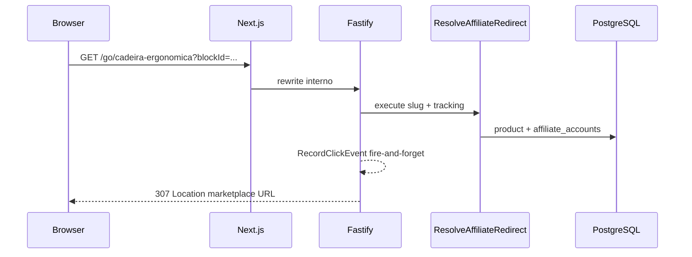

# Plano: `/go` redirect, JSON-LD e interlinkagem

## Estado atual (gaps)

| Item | Status |
|------|--------|
| `GET /go/:slug` | Inexistente |
| CTAs web | Abrem `product.affiliateUrl` direto ([`ProductCard.tsx`](apps/web/src/components/product/ProductCard.tsx), [`FeaturedProductBlock.tsx`](apps/web/src/components/blocks/FeaturedProductBlock.tsx)) |
| `ClickOrigin` | 5 valores; **`redirect_go` ausente** ([`schemas.ts`](apps/api/src/adapters/dtos/request/schemas.ts)) |
| `affiliate_accounts` | Schema + seed; **sem repository runtime** — tags vêm de env via [`DefaultAffiliateLinkBuilder`](packages/infrastructure/src/affiliate/default-affiliate-link.builder.ts) |
| Página produto | **`produtos/[slug]/page.tsx` inexistente** |
| JSON-LD | Zero implementação |
| Interlinkagem | Zero; regra editorial em [`.cursor/rules/07-growth-seo-content.mdc`](.cursor/rules/07-growth-seo-content.mdc) |

**Decisão confirmada:** rota na **API Fastify** + **rewrite** no Next.js para CTAs usarem `/go/:slug` no domínio da vitrine.



---

## 1. Domain — origem de clique e port afiliado

### `ClickOrigin.REDIRECT_GO`

- Adicionar `REDIRECT_GO = 'redirect_go'` em [`packages/domain/src/enums/index.ts`](packages/domain/src/enums/index.ts)
- Atualizar Zod [`RecordClickSchema`](apps/api/src/adapters/dtos/request/schemas.ts) e tipos web em [`events.ts`](apps/web/src/lib/api/events.ts)

### `AffiliateAccountRepository` (port)

Novo port em `packages/domain/src/repositories/AffiliateAccountRepository.ts`:

```typescript
findByMarketplace(marketplace: Marketplace): Promise<AffiliateAccount | null>;
```

Implementação Drizzle lendo [`affiliate_accounts`](packages/infrastructure/src/persistence/drizzle/schema/index.ts). Regra de negócio ([`01-business-compliance.mdc`](.cursor/rules/01-business-compliance.mdc)): se `status === 'pending_manual_validation'`, use case retorna erro (redirect para home).

---

## 2. Application — use cases

### `ResolveAffiliateRedirect` (`packages/application/src/use-cases/affiliate/ResolveAffiliateRedirect.ts`)

**Input:** `{ slug, blockId?, sessionId?, origin?: string }`

**Fluxo:**
1. `productRepository.findBySlug(slug)` — null → `err(EntityNotFoundError)`
2. `affiliateAccountRepository.findByMarketplace(product.marketplace)` — validar `status === 'active'` (ou fallback env tag se conta seed/dev)
3. Construir URL via `AffiliateLinkBuilder.buildWithTracking(...)` (novo método — ver §3)
4. Retornar `Result<{ productId, targetUrl }, EntityNotFoundError | ValidationError>`

### Estender `AffiliateLinkBuilder` ([`gateways/index.ts`](packages/domain/src/gateways/index.ts))

```typescript
buildWithTracking(
  marketplace: Marketplace,
  externalId: string,
  tracking: { blockId?: string; sessionId?: string; origin?: string },
): string;
```

Implementação em [`default-affiliate-link.builder.ts`](packages/infrastructure/src/affiliate/default-affiliate-link.builder.ts):
- Amazon: `tag` + `ascsubtag` composto (`blockId_sessionId_origin`)
- Shopee: `affiliate_id` + query params UTM/sub_id quando aplicável

### Interlinkagem — aplicar em `GetArticleWithEmbeds`

Após carregar artigo, antes de cachear:

```typescript
import { injectInternalLinks } from '@ecommerce-amazon/shared/seo';
import { SEO_KEYWORD_MAP } from '@ecommerce-amazon/shared/seo/keywords';

article.body = injectInternalLinks(article.body, SEO_KEYWORD_MAP);
```

Invalidar cache de artigo ao alterar mapa (documentar TTL 15 min existente).

---

## 3. Shared — LinkParser e dicionário SEO

### [`packages/shared/src/seo/link-parser.ts`](packages/shared/src/seo/link-parser.ts)

Função pura conforme spec:

```typescript
export interface SeoKeywordMap { keyword: string; targetUrl: string; }
export function injectInternalLinks(htmlContent: string, keywords: SeoKeywordMap[]): string;
```

- Regex com lookbehind (Node 20+ OK)
- **Primeira ocorrência** por keyword (case-insensitive)
- Não substituir dentro de tags `<a>` existentes
- Classe CSS: `seo-internal-link`

### [`packages/shared/src/seo/keywords.ts`](packages/shared/src/seo/keywords.ts)

Config estática inicial (YAGNI — sem tabela DB):

```typescript
export const SEO_KEYWORD_MAP: SeoKeywordMap[] = [
  { keyword: 'melhor cadeira gamer', targetUrl: '/categorias/cadeiras-gamer' },
  { keyword: 'cadeira ergonômica', targetUrl: '/produtos/cadeira-ergonomica-home-office' },
  // ...
];
```

### [`packages/shared/src/seo/product-json-ld.ts`](packages/shared/src/seo/product-json-ld.ts)

Builder puro `buildProductJsonLd(product: ProductJsonLdInput)` retornando objeto Schema.org `Product`:
- Incluir `offers` **somente** se `shouldShowPrice === true` (ou `amount !== null && !isStale`)
- `offers.url` = `${siteBaseUrl}/go/${slug}` (nunca URL externa)
- Mapear `availability` → `InStock` / `OutOfStock`

Exportar subpath em [`packages/shared/package.json`](packages/shared/package.json): `"./seo": { ... }`

Testes: `link-parser.test.ts`, `product-json-ld.test.ts`

---

## 4. API — rota `/go/:slug`

Novo handler em [`apps/api/src/adapters/http/routes/index.ts`](apps/api/src/adapters/http/routes/index.ts) (ou `redirects.ts` importado):

```typescript
app.get('/go/:slug', async (request, reply) => {
  const { slug } = GoSlugParamsSchema.parse(request.params);
  const query = GoQuerySchema.parse(request.query); // blockId?, sessionId?
  const sessionId = query.sessionId ?? request.headers['x-session-id'];

  const result = await useCases.resolveAffiliateRedirect.execute({ slug, ...query, sessionId });

  if (!result.ok) {
    return reply.redirect('/', 307); // home relativa — web proxy resolve
  }

  void useCases.recordClickEvent.execute({
    productId: result.value.productId,
    origin: 'redirect_go',
    blockId: query.blockId,
    sessionId,
  }).catch(/* log via logger, não bloqueia redirect */);

  return reply.redirect(result.value.targetUrl, 307);
});
```

Schemas Zod: `GoSlugParamsSchema`, `GoQuerySchema`.

Wire DI em [`api-container.ts`](packages/infrastructure/src/di/api-container.ts).

### Presenter — mascarar URLs públicas

Em [`product.presenter.ts`](apps/api/src/adapters/presenters/product.presenter.ts):
- Adicionar `goUrl: `/go/${product.slug}`` em list/detail DTOs
- **Manter** `affiliateUrl` internamente omitido do JSON público **ou** substituir por `goUrl` apenas (breaking change controlado — atualizar Zod web schemas)

Recomendação: expor só `goUrl`; remover `affiliateUrl` dos DTOs de leitura pública (batch checkout mantém fluxo separado).

---

## 5. Web — rewrite, CTAs e página produto

### Rewrite [`next.config.ts`](apps/web/next.config.ts)

```typescript
async rewrites() {
  const apiUrl = process.env.API_INTERNAL_URL ?? 'http://localhost:3000';
  return [{ source: '/go/:slug', destination: `${apiUrl}/go/:slug` }];
}
```

Documentar env `API_INTERNAL_URL` em [`docs/dev-setup.md`](docs/dev-setup.md).

### Helper [`apps/web/src/lib/go-url.ts`](apps/web/src/lib/go-url.ts)

```typescript
export function buildGoUrl(slug: string, params?: { blockId?: string; sessionId?: string }): string;
```

### Atualizar CTAs (remover `affiliateUrl` + `recordClick` duplicado no clique)

| Componente | Mudança |
|------------|---------|
| [`ProductCard.tsx`](apps/web/src/components/product/ProductCard.tsx) | `window.open(buildGoUrl(slug, { sessionId }))` — telemetria só no servidor |
| [`FeaturedProductBlock.tsx`](apps/web/src/components/blocks/FeaturedProductBlock.tsx) | idem + `blockId` |
| [`WishlistDrawer.tsx`](apps/web/src/components/wishlist/WishlistDrawer.tsx) | idem |
| Blocos CMS com `renderedData` | CTA usa `goUrl` ou `buildGoUrl` |

Atualizar [`schemas.ts`](apps/web/src/lib/api/schemas.ts): `goUrl` substitui `affiliateUrl`.

### Página produto [`apps/web/src/app/produtos/[slug]/page.tsx`](apps/web/src/app/produtos/[slug]/page.tsx)

- SSR: `fetch GET /products/:slug` (server-side, `revalidate: 300`)
- `generateMetadata`: `metaTitle`, `metaDescription`, `canonicalUrl` do DTO
- Componente [`ProductJsonLd.tsx`](apps/web/src/components/seo/ProductJsonLd.tsx): `<script type="application/ld+json">` via `buildProductJsonLd`
- UI mínima: título, imagens, `PriceDisplay`, CTA `buildGoUrl`, disclaimer afiliado ([`06-ux-conversion.mdc`](.cursor/rules/06-ux-conversion.mdc))
- 404 via `notFound()`

Env `NEXT_PUBLIC_SITE_URL` para URLs absolutas no JSON-LD.

---

## 6. Documentação

Criar [`docs/go-redirect-seo.md`](docs/go-redirect-seo.md):
- Fluxo `/go`, telemetria, mascaramento
- JSON-LD e regra stale
- LinkParser e `SEO_KEYWORD_MAP`
- Como testar

Atualizar [`docs/api-rest.md`](docs/api-rest.md) (`GET /go/:slug`, origem `redirect_go`), [`docs/README.md`](docs/README.md).

---

## Fora de escopo (deliberado)

- Tabela DB `seo_keywords` (config file suficiente no MVP)
- Página `/artigos/[slug]` completa (interlinkagem já no use case API)
- Fila BullMQ para cliques (persistência direta via `RecordClickEvent` existente)
- SubIDs avançados cross-session / atribuição multi-touch

---

## Verificação

```bash
npm run build -w @ecommerce-amazon/shared -w @ecommerce-amazon/domain -w @ecommerce-amazon/application -w @ecommerce-amazon/infrastructure -w @ecommerce-amazon/api -w @ecommerce-amazon/web
npx vitest run packages/shared packages/application
curl -I "http://localhost:3001/go/cadeira-ergonomica-home-office"  # 307
curl http://localhost:3000/products/cadeira-ergonomica-home-office | jq .goUrl
```

Manual: abrir `/produtos/cadeira-ergonomica-home-office` → view-source → JSON-LD sem `offers` se stale; artigo seed com keyword linkada após `GET /articles/:slug`.
