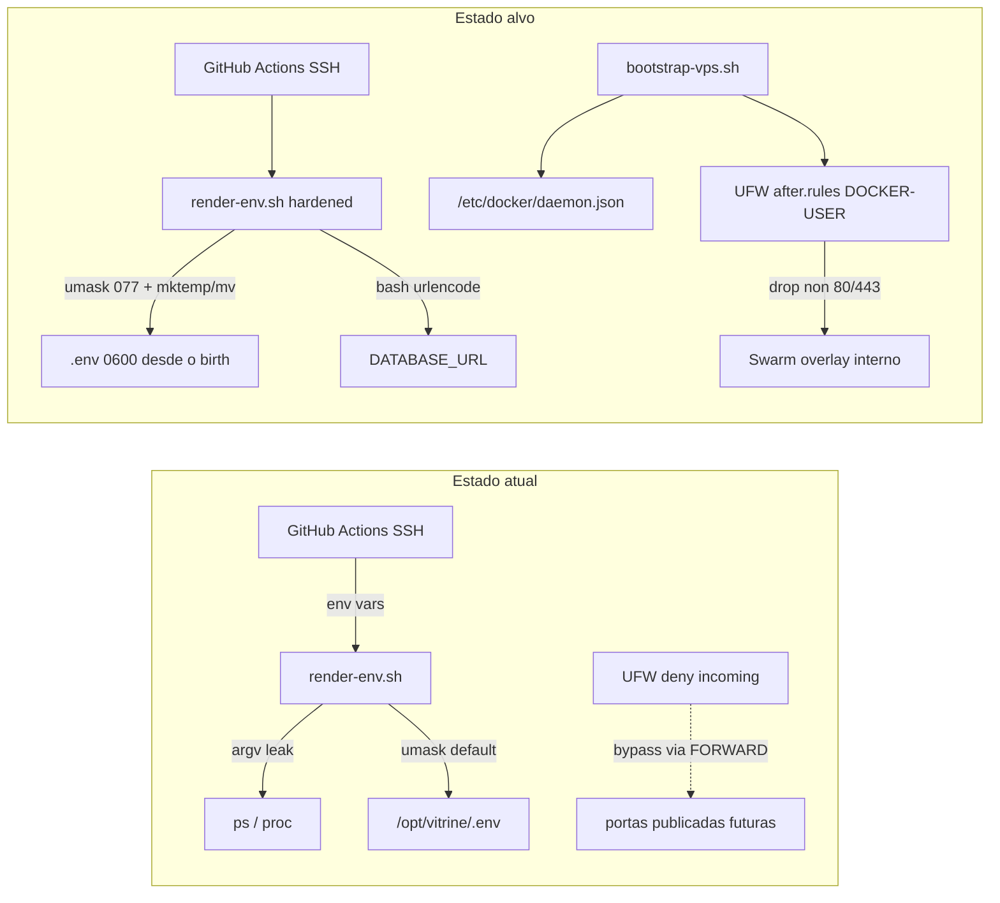

# Plano: Auditoria e Correção de Segurança (CI/CD & DevOps VPS)

## Diagnóstico confirmado no repositório

| Vulnerabilidade                 | Estado atual                                                                                                                        | Risco real hoje                                                                                                                                                                                                                          |
| ------------------------------- | ----------------------------------------------------------------------------------------------------------------------------------- | ---------------------------------------------------------------------------------------------------------------------------------------------------------------------------------------------------------------------------------------- |
| **V1 — argv em `python3 -c`**   | Confirmado em [`deploy/scripts/render-env.sh`](deploy/scripts/render-env.sh) L45–46                                                 | Alto — credenciais visíveis em `ps`/`/proc/*/cmdline` durante deploy                                                                                                                                                                     |
| **V2 — UFW vs Docker iptables** | Confirmado em [`deploy/scripts/bootstrap-vps.sh`](deploy/scripts/bootstrap-vps.sh) L43–51 — UFW básico sem integração `DOCKER-USER` | Médio — mitigado parcialmente porque [`deploy/docker-stack.yml`](deploy/docker-stack.yml) **não publica** Postgres/Redis (somente Traefik `:80`/`:443` em `mode: host`); risco de bypass permanece se alguém adicionar `ports:` no stack |
| **V3 — race no `.env`**         | Confirmado em [`deploy/scripts/render-env.sh`](deploy/scripts/render-env.sh) L77–128 — `cat >` antes de `chmod 600`                 | Médio — janela breve com permissões default do umask                                                                                                                                                                                     |

**Escopo do pedido:** reescrever apenas os dois scripts. O stack já está correto (sem `published` em serviços internos); o hardening de rede será preventivo e documentado.

## Review crítico — status das mitigações

| Item                | Veredicto             | Nota para implementação                                                                                             |
| ------------------- | --------------------- | ------------------------------------------------------------------------------------------------------------------- |
| V1 — urlencode bash | Aprovado com ressalva | Loop char-a-char é O(n) interpretado; para credenciais de 32–64 chars o impacto é desprezível vs ganho de segurança |
| V3 — mktemp + umask | Totalmente aprovado   | Arquivo nasce `0600`; `mv -f` atômico **somente** se temp estiver no mesmo mount que `.env`                         |
| V2 — DOCKER-USER    | Totalmente aprovado   | Abordagem correta sem isolar daemon em loopback                                                                     |
| Ordem bootstrap     | Aprovado              | `daemon.json` + restart **antes** de `docker swarm init`                                                            |

---



---

## A. [`deploy/scripts/render-env.sh`](deploy/scripts/render-env.sh)

### A1. Eliminar vazamento via argv (V1)

Substituir L45–46 por função **`urlencode()` em bash puro** (RFC 3986 — alfanuméricos + `._-~` literais, demais `%XX`):

```bash
urlencode() {
  local raw="$1" i c
  for ((i = 0; i < ${#raw}; i++)); do
    c="${raw:i:1}"
    case "$c" in
      [a-zA-Z0-9.~_-]) printf '%s' "$c" ;;
      *) printf '%%%.2X' "'$c" ;;
    esac
  done
}
POSTGRES_USER_ENC="$(urlencode "${POSTGRES_USER}")"
POSTGRES_PASSWORD_ENC="$(urlencode "${POSTGRES_PASSWORD}")"
```

**Por quê bash e não Python via env:** remove dependência de `python3` no path de deploy, elimina argv leak **e** atende item D (“utilitário nativo de shell”). Fallback Python via `os.environ` só se quisermos redundância — não necessário.

**Ressalva de performance (review):** o laço `for ((i=0; ...))` é interpretado caractere a caractere; aceitável porque `POSTGRES_USER`/`POSTGRES_PASSWORD` são strings curtas (tipicamente 32–64 chars).

### A2. Criação segura do `.env` (V3)

Substituir `cat >"${ENV_FILE}"` + `chmod 600` por escrita atômica com permissões restritas desde o início:

```bash
mkdir -p "${APP_DIR}"
# OBRIGATÓRIO: temp no mesmo filesystem que .env — NUNCA mktemp /tmp/...
tmp_env="$(mktemp "${APP_DIR}/.env.XXXXXX")"
chmod 600 "${tmp_env}"
(
  umask 077
  # heredoc → "${tmp_env}"
)
mv -f "${tmp_env}" "${ENV_FILE}"
chmod 600 "${ENV_FILE}"   # belt-and-suspenders
tmp_env=""                # mv consumiu o path; evita rm duplicado no trap
```

- **`mktemp "${APP_DIR}/.env.XXXXXX"`** — requisito explícito do review: `mv -f` só é atômico dentro do mesmo ponto de montagem; usar `/tmp` quebraria a garantia.
- `chmod 600` imediato + subshell com `umask 077` garante arquivo temporário privado desde o birth.
- Comentário inline documentando race condition mitigada.

### A3. Higiene de segredos e cleanup em falha (item D)

- Declarar lista de variáveis sensíveis no topo do script.
- Variável `tmp_env` inicializada vazia; preenchida só após `mktemp`.
- Registrar **`trap cleanup EXIT`** (não só sucesso) que:
  1. Remove `"${tmp_env}"` se existir e não vazio (`rm -f`) — evita rastro parcial de secrets no disco se o script falhar no meio do heredoc.
  2. Faz `unset` das variáveis sensíveis (POSTGRES*\*, JWT*\*, ENCRYPTION_KEY, RESEND_API_KEY, GA4 JSON, etc.).
- Garantir que `echo "Wrote ${ENV_FILE}"` **nunca** imprima valores.
- Manter `set -euo pipefail` (já presente).

### A4. Validações adicionais

- Verificar que `APP_DIR` é gravável antes de escrever.
- Falhar cedo se `urlencode` receber string vazia onde não permitido (já coberto por `: "${POSTGRES_USER:?}"`).

---

## B. [`deploy/scripts/bootstrap-vps.sh`](deploy/scripts/bootstrap-vps.sh)

### B1. Configurar Docker daemon antes de `swarm init`

Criar [`/etc/docker/daemon.json`](https://docs.docker.com/engine/reference/commandline/dockerd/#daemon-configuration-file) (idempotente — merge ou overwrite controlado):

```json
{
  "log-driver": "json-file",
  "log-opts": { "max-size": "10m", "max-file": "3" },
  "iptables": true,
  "ip-forward": true,
  "userland-proxy": false,
  "live-restore": true
}
```

- Reiniciar e habilitar `docker` **antes** de `docker swarm init`.
- Comentário: `iptables: true` mantém cadeias Docker; o controle fino vem de `DOCKER-USER`, não de desabilitar iptables (desabilitar quebra overlay/Swarm).

### B2. Integração UFW + Docker via `DOCKER-USER` (V2)

**Não** bindar Traefik em `127.0.0.1` — o MVP exige `:80`/`:443` públicos ([`docs/deployment-swarm.md`](docs/deployment-swarm.md)). A correção correta é firewall em **FORWARD/DOCKER-USER**, não loopback.

Passos no bootstrap (função `configure_ufw_docker_integration`) — **ordem obrigatória**:

1. `ufw --force reset` — limpa regras INPUT anteriores (pode restaurar `after.rules` padrão do pacote).
2. Ajustar [`/etc/default/ufw`](https://wiki.ubuntu.com/UncomplicatedFirewall): `DEFAULT_FORWARD_POLICY="ACCEPT"` (necessário para overlay; filtragem via `DOCKER-USER`).
3. Injetar bloco idempotente em [`/etc/ufw/after.rules`](https://help.ubuntu.com/community/UFW) **após o reset** (marcadores `# BEGIN vitrine-docker` / `# END vitrine-docker`) — garante que o reset não apague a customização recém-injetada:

```bash
*filter
:ufw-user-forward - [0:0]
:DOCKER-USER - [0:0]
-A DOCKER-USER -j ufw-user-forward

# Conexões já estabelecidas
-A ufw-user-forward -m conntrack --ctstate RELATED,ESTABLISHED -j RETURN

# Únicos pontos de entrada públicos (Traefik host-mode)
-A ufw-user-forward -p tcp -m tcp --dport 80 -j RETURN
-A ufw-user-forward -p tcp -m tcp --dport 443 -j RETURN

# Bloqueia qualquer outra porta publicada por Docker à internet
-A ufw-user-forward -j DROP

COMMIT
```

4. Regras UFW INPUT: `default deny incoming`, `allow OpenSSH`, `allow 80/tcp` (443 comentado até TLS).
5. `ufw --force enable` + `ufw reload`.

**Detecção de interface:** regras acima são agnósticas de interface (aplicam a tráfego externo que chega via DNAT Docker). Evita hardcode `eth0`/`ens3`.

**Single-node vs multi-node (review):** na VPS única atual, `ufw default deny incoming` + apenas 22/80/443 funciona porque tráfego overlay Swarm usa `lo` internamente. **Se escalar para multi-node**, será necessário abrir no UFW as portas de cluster: `2377/tcp`, `7946/tcp+udp`, `4789/udp` — documentar em `docs/deployment-swarm.md` como próximo passo, não implementar agora.

### B3. Hardening complementar no bootstrap

- **`/opt/vitrine`**: `mkdir -p` + `chmod 750` + `chown deploy:deploy` (diretório pai não world-readable).
- **Remover `python3`** do `apt-get install` — deixa de ser necessário após urlencode bash em `render-env.sh`.
- **Comentário de invariante:** apenas o serviço `traefik` no stack deve ter bloco `ports:`; Postgres/Redis permanecem só na overlay `vitrine_net`.
- Opcional: função `assert_stack_no_internal_ports()` que, se [`deploy/docker-stack.yml`](deploy/docker-stack.yml) existir no host, falha bootstrap se detectar `published:` em serviços `postgres`/`redis` (grep defensivo — não bloqueia bootstrap limpo).

### B4. Ordem de execução revisada

```
apt packages → docker CE → daemon.json → systemctl restart docker
→ deploy user → APP_DIR perms
→ ufw reset → /etc/default/ufw → after.rules (DOCKER-USER) → ufw allow rules → ufw enable
→ docker swarm init
```

---

## C. Documentação (regra `10-documentation.mdc`)

Atualizar [`docs/deployment-swarm.md`](docs/deployment-swarm.md):

- Nova seção **“Segurança operacional (bootstrap + render-env)”** cobrindo:
  - V1/V3 mitigados e como validar (`stat -c '%a' /opt/vitrine/.env` → `600`; ausência de segredos em `ps` durante deploy).
  - Integração UFW/`DOCKER-USER` e por que Traefik permanece público em 80/443.
  - Ordem `ufw reset` → injetar `after.rules` → `ufw enable` (reset não deve preceder a customização final).
  - Single-node: deny incoming + 22/80/443 suficiente; multi-node futuro exige 2377/7946/4789.
  - Invariante: nunca adicionar `ports:` a Postgres/Redis.
  - Re-bootstrap: VPS já provisionada exige aplicar manualmente `daemon.json` + `after.rules` ou reexecutar bootstrap (documentar comando seguro).

Atualizar tabela de arquivos em [`docs/README.md`](docs/README.md) se necessário (menção à seção de segurança).

---

## D. Validação pós-implementação

| Teste                 | Comando / critério                                                                                          |
| --------------------- | ----------------------------------------------------------------------------------------------------------- |
| Permissão `.env`      | `stat -c '%a %n' /opt/vitrine/.env` → `600`                                                                 |
| Sem argv leak         | Durante `render-env.sh`, `pgrep -af python3` não deve aparecer; `tr '\0' ' ' < /proc/$$/cmdline` sem senhas |
| UFW ativo             | `ufw status verbose` — 22, 80 allowed                                                                       |
| DOCKER-USER presente  | `iptables -L DOCKER-USER -n` mostra cadeia `ufw-user-forward`                                               |
| Stack interno fechado | `ss -tlnp \| grep -E ':5432\|:6379'` na VPS **sem** listeners públicos                                      |
| Deploy CI             | Workflow `deploy-production` completa smoke tests                                                           |

---

## Arquivos alterados

| Arquivo                                                              | Mudança                                                                       |
| -------------------------------------------------------------------- | ----------------------------------------------------------------------------- |
| [`deploy/scripts/render-env.sh`](deploy/scripts/render-env.sh)       | Reescrita completa com urlencode bash, mktemp em APP_DIR, trap rm tmp + unset |
| [`deploy/scripts/bootstrap-vps.sh`](deploy/scripts/bootstrap-vps.sh) | daemon.json, UFW after.rules, permissões APP_DIR, remove python3              |
| [`docs/deployment-swarm.md`](docs/deployment-swarm.md)               | Seção segurança operacional                                                   |

**Fora de escopo (já OK ou não solicitado):** alterar [`deploy/docker-stack.yml`](deploy/docker-stack.yml), [`.github/workflows/deploy-production.yml`](.github/workflows/deploy-production.yml), [`deploy/scripts/deploy.sh`](deploy/scripts/deploy.sh).
