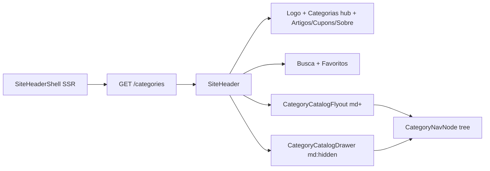

# Header Gold: hub único de categorias

## Problema atual

[`SiteHeader.tsx`](apps/web/src/components/layout/SiteHeader.tsx) renderiza **um link/mega-menu por categoria raiz**:

```36:38:apps/web/src/components/layout/SiteHeader.tsx
{navCategories.map((category) => (
  <CategoryMegaMenu key={category.slug} category={category} />
))}
```

Com 10+ raízes, a barra empurra busca/favoritos e quebra linha. Hoje há também link redundante "Catálogo" e logo centralizado em `md+`, divergindo do padrão Gold pedido.

## Arquitetura alvo (híbrido)



### Barra fixa (nunca cresce com o catálogo)

| Zona     | Elementos fixos                                                            |
| -------- | -------------------------------------------------------------------------- |
| Esquerda | Logo **VITRINE** (`/`) → botão **Categorias** → Artigos \| Cupons \| Sobre |
| Direita  | Ícone busca + ícone favoritos (wishlist)                                   |

Remover da barra: link "Catálogo", `navCategories.map(CategoryMegaMenu)`.

---

## Fase 1 — Novo hub de categorias (desktop flyout)

**Novo arquivo:** [`apps/web/src/components/layout/CategoryCatalogFlyout.tsx`](apps/web/src/components/layout/CategoryCatalogFlyout.tsx)

Comportamento (Opção A):

- Trigger único: botão `Categorias` com ícone `ChevronDown` ou `LayoutGrid` (lucide), visível `hidden md:inline-flex`.
- Painel flutuante 2 colunas (~`min-w-[28rem]`, `max-h-[70vh]`):
  - **Coluna esquerda:** lista scrollável de raízes (`categories[]`); hover/focus destaca item ativo.
  - **Coluna direita:** subcategorias do raiz ativo + netos (3º nível) como links; estado default = primeiro raiz ou último hover.
  - Rodapé da coluna direita: link "Ver tudo em {raiz}" → `/categorias/{slug}`.
- Acessibilidade: `aria-expanded`, `Escape` fecha, click-outside, navegação por teclado básica (Tab + Enter).
- Dados: prop `categories: CategoryNavNode[]` — reutilizar helpers de [`category-tree-nav.ts`](packages/shared/src/category/category-tree-nav.ts) (`getDirectChildren`).

**Substituir:** [`CategoryMegaMenu.tsx`](apps/web/src/components/layout/CategoryMegaMenu.tsx) — deletar após migração (lógica multi-coluna por raiz migra para o flyout unificado).

---

## Fase 2 — Drawer mobile (accordion)

**Refatorar:** [`MobileNavDrawer.tsx`](apps/web/src/components/layout/MobileNavDrawer.tsx) → renomear/conceituar como [`CategoryCatalogDrawer.tsx`](apps/web/src/components/layout/CategoryCatalogDrawer.tsx)

Mudanças:

- Botão hamburger **somente** `md:hidden` (mantém).
- Conteúdo do drawer focado em **catálogo**: accordion por raiz → filhos → opcionalmente netos (1 nível extra, igual ao drawer atual).
- Mover links editoriais (Artigos, Cupons, Sobre) **para a barra principal** no mobile também — o drawer passa a ser só "explorar categorias", não menu geral do site.
- Reutilizar estilos `.mobile-nav-drawer__*` em [`globals.css`](apps/web/src/app/globals.css) ou renomear para `.category-catalog-drawer__*`.

---

## Fase 3 — Reestruturar SiteHeader

**Editar:** [`SiteHeader.tsx`](apps/web/src/components/layout/SiteHeader.tsx)

Layout proposto:

```
flex items-center justify-between
├── div.left (flex items-center gap-4)
│   ├── Link Logo VITRINE
│   ├── CategoryCatalogFlyout (md+)
│   ├── CategoryCatalogDrawer trigger (md:hidden) — ou trigger embutido no drawer
│   └── nav editorial (Artigos | Cupons | Sobre) — visível em todos breakpoints ou hidden sm em mobile se apertado
└── div.right (busca + favoritos)
```

Decisões de layout:

- **Logo à esquerda** (remover `md:absolute md:left-1/2` do centro).
- Links editoriais permanecem na barra em `md+`; em mobile podem ficar na barra com `text-sm` ou colapsar para ícones — manter texto se couber ao lado do hamburger.
- [`SiteHeaderShell.tsx`](apps/web/src/components/layout/SiteHeaderShell.tsx): sem mudança de contrato (`fetchCategoryNavTree()` continua).

---

## Fase 4 — CSS e limpeza

| Ação                               | Arquivo                                                                                                            |
| ---------------------------------- | ------------------------------------------------------------------------------------------------------------------ |
| Adicionar estilos flyout 2 colunas | [`globals.css`](apps/web/src/app/globals.css) — `.category-catalog-flyout__left`, `__right`, `__root-item--active` |
| Remover estilos obsoletos          | `.category-mega-menu__*` (substituídos pelo flyout)                                                                |
| Deletar componente morto           | `CategoryMegaMenu.tsx`                                                                                             |

Manter drawer CSS; ajustar nomes se renomear componente.

---

## Fase 5 — Docs e validação

- Atualizar [`docs/categories-hierarchy.md`](docs/categories-hierarchy.md): seção Header → hub único + flyout/drawer (remover referência a "link por raiz").
- Build: `npm run build -w @ecommerce-amazon/web`
- Checklist manual:
  1. Desktop: barra com 5 itens fixos + ações; hover em **Categorias** abre flyout 2 colunas.
  2. Adicionar categoria raiz fictícia no admin → barra **não** cresce.
  3. Mobile: hamburger abre drawer com accordion; links editoriais acessíveis na barra.
  4. Flyout/drawer linkam para `/categorias/{slug}` em todos os níveis.

---

## Fora de escopo

- Adicionar shadcn `NavigationMenu`/`Sheet` ao `apps/web` (implementação leve com CSS + state, como hoje).
- Busca funcional (ícone continua placeholder).
- Imagens no flyout (só `icon` textual/emoji do schema).

## Arquivos tocados (resumo)

| Arquivo                        | Ação                                              |
| ------------------------------ | ------------------------------------------------- |
| `SiteHeader.tsx`               | Reestruturar layout Gold                          |
| `CategoryCatalogFlyout.tsx`    | **Criar** — flyout 2 colunas desktop              |
| `CategoryCatalogDrawer.tsx`    | **Criar/refatorar** a partir de `MobileNavDrawer` |
| `CategoryMegaMenu.tsx`         | **Remover**                                       |
| `globals.css`                  | Estilos flyout; limpar mega-menu                  |
| `docs/categories-hierarchy.md` | Documentar novo padrão                            |
