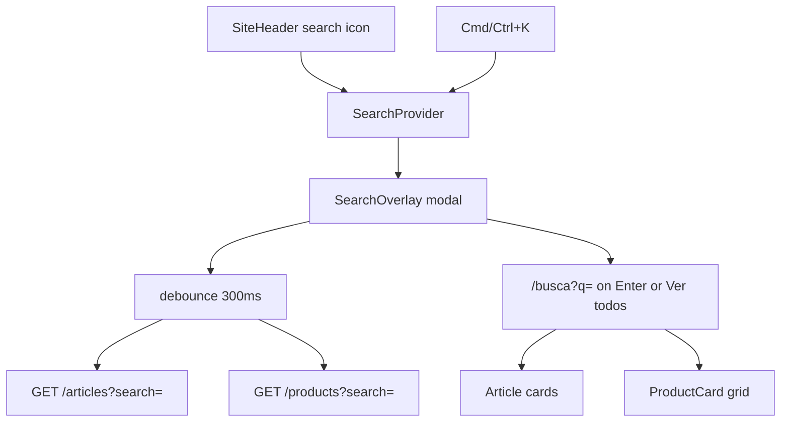

# Botão de busca no header (`apps/web`)

## Contexto atual

O ícone em [`SiteHeader.tsx`](apps/web/src/components/layout/SiteHeader.tsx) é um placeholder sem `onClick`:

```50:56:apps/web/src/components/layout/SiteHeader.tsx
<button
  type="button"
  aria-label="Buscar"
  className="rounded-full p-2 hover:bg-neutral-100"
>
  <Search className="h-5 w-5" />
</button>
```

**O que já existe e pode ser reutilizado:**

| Camada | Situação |
|--------|----------|
| Artigos | `GET /articles?search=` funcional; UI em [`ArticleListingToolbar.tsx`](apps/web/src/components/articles/ArticleListingToolbar.tsx) |
| Produtos (DB) | `drizzle-product.repository.ts` já filtra por `titleClean`, `titleRaw`, `slug` via `ilike` |
| Produtos (API pública) | `search` **não** exposto em `ListProductsQuerySchema` nem em [`ListProducts.ts`](packages/application/src/use-cases/product/ListProducts.ts) |
| SEO | `SearchAction` aponta para `/artigos?q=` — será atualizado para `/busca?q=` |
| Padrões UI | Overlay/drawer custom (sem Radix/cmdk): [`WishlistDrawer`](apps/web/src/components/wishlist/WishlistDrawer.tsx), [`CategoryCatalogDrawer`](apps/web/src/components/layout/CategoryCatalogDrawer.tsx) |

## Decisões (defaults — perguntas não respondidas)

- **Escopo:** overlay unificado (artigos + produtos), não só redirect para `/artigos`
- **Atalho:** `Cmd/Ctrl+K` abre o overlay; `Escape` fecha
- **Resultados completos:** nova rota `/busca?q=termo` (não existe listagem global de produtos hoje)
- **Conformidade:** reutilizar `ProductCard` / `PriceDisplay` na página de resultados (preço stale oculto, sem badges de urgência)

## Arquitetura



## Fase 1 — Backend: expor `search` em produtos (delta mínimo)

O repositório já implementa busca; falta propagar até a rota pública.

1. **[`ListProducts.ts`](packages/application/src/use-cases/product/ListProducts.ts)** — adicionar `search?: string` ao `execute()` e repassar a `findPublished` (espelhar [`ListAdminProducts.ts`](packages/application/src/use-cases/product/ListAdminProducts.ts))
2. **[`schemas.ts`](apps/api/src/adapters/dtos/request/schemas.ts)** — `ListProductsQuerySchema`:
   ```ts
   search: z.string().trim().max(100).optional()
   ```
3. **[`routes/index.ts`](apps/api/src/adapters/http/routes/index.ts)** — mapear `query.search` → `filters.search`; manter `visibleOnly: true` implícito ou explícito na busca pública
4. **Teste** — adicionar/estender teste de integração ou unitário do use case confirmando repasse de `search` (se houver suite existente para `ListProducts`)

## Fase 2 — Web: provider + overlay

### Novos arquivos

| Arquivo | Responsabilidade |
|---------|------------------|
| `apps/web/src/components/search/SearchProvider.tsx` | Contexto `isOpen`, `setOpen`, `initialQuery`; listener global `Cmd/Ctrl+K` |
| `apps/web/src/components/search/SearchOverlay.tsx` | Modal centrado (`z-50`), overlay click + Escape, autofocus no input |
| `apps/web/src/lib/api/search.ts` | `searchArticlesPreview(q)` e `searchProductsPreview(q)` via `apiFetchParsed` + React Query keys |

### Comportamento do overlay

- Input `type="search"` com placeholder **"Buscar produtos e artigos…"**
- Debounce ~300ms (mesmo padrão de [`ArticleListingToolbar`](apps/web/src/components/articles/ArticleListingToolbar.tsx))
- Preview compacto (máx. 5 produtos + 5 artigos):
  - **Produtos:** thumbnail, título (2 linhas), preço via lógica stale existente
  - **Artigos:** título + excerpt curto
- Estados: idle (dica de atalho), loading, empty, error
- **Enter** ou link "Ver todos os resultados" → `router.push('/busca?q=' + encodeURIComponent(q))` e fecha overlay
- Mínimo 2 caracteres antes de buscar (evita queries vazias)

### Integrações

- [`providers.tsx`](apps/web/src/app/providers.tsx) — envolver app com `SearchProvider` (dentro de `QueryClientProvider`, ao lado de `WishlistProvider`)
- [`SiteHeader.tsx`](apps/web/src/components/layout/SiteHeader.tsx) — `onClick={() => setOpen(true)}` + render `<SearchOverlay />`
- CSS leve em [`globals.css`](apps/web/src/app/globals.css) ou classes Tailwind inline (sem nova lib)

## Fase 3 — Página `/busca`

**Novo:** `apps/web/src/app/busca/page.tsx`

- Lê `searchParams.q`
- Sem `q` ou `q` curto: empty state com link para categorias/artigos
- Com `q`: duas seções empilhadas:
  1. **Produtos** — grid reutilizando [`ProductCard`](apps/web/src/components/product/ProductCard.tsx) (`variant="compact"`, `placement="listagem"`)
  2. **Artigos** — cards simplificados (título, excerpt, link `/artigos/[slug]`)
- Paginação opcional fase 1: mostrar primeira página (12 itens) + link "Ver mais artigos" → `/artigos?q=`
- `generateMetadata`: título "Busca: {q}"; `robots: noindex` quando há facet `q` (mesmo padrão de listagens facetadas em [`artigos/page.tsx`](apps/web/src/app/artigos/page.tsx))

## Fase 4 — SEO e docs

- **[`site-json-ld.ts`](packages/shared/src/seo/site-json-ld.ts)** — atualizar `SearchAction` de `/artigos?q=` para `/busca?q=` (+ ajuste em teste existente)
- **Novo doc:** `docs/header-search.md` — fluxo, arquivos, como testar
- **Atualizar:** [`docs/README.md`](docs/README.md) índice

## Fora do escopo desta entrega

- Command palette estilo cmdk / busca por categorias/coleções
- Endpoint federado único `GET /search`
- Paginação completa de produtos na `/busca` (pode ser fase 2)
- Tracking de clique com origem `search` (não está no enum MVP de placements hoje)

## Como testar localmente

1. Subir API + web; clicar ícone de busca → overlay abre com foco no input
2. `Cmd/Ctrl+K` abre/fecha overlay
3. Digitar "monitor" → preview mostra produtos e artigos relevantes
4. Enter → `/busca?q=monitor` com grids completos
5. Produto com preço stale → preço numérico oculto no preview e na grid
6. `curl "localhost:3001/products?search=monitor&visibleOnly=true"` retorna resultados filtrados
