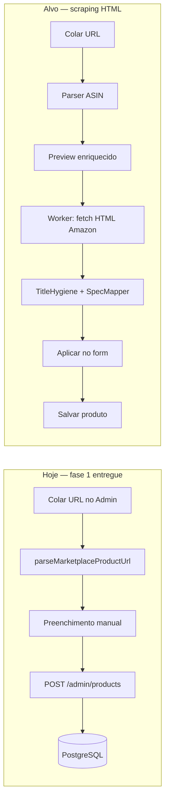
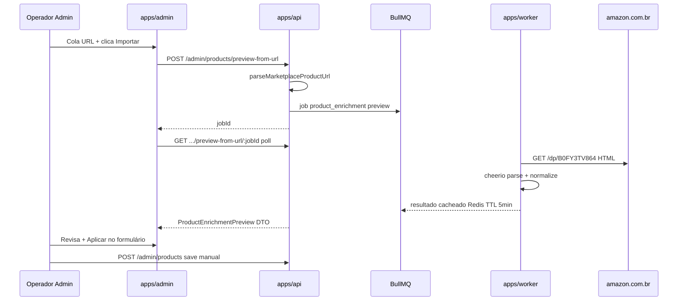

# Plano Link-to-Product — scraping HTML Amazon (Admin + Worker)

## 1. Análise da URL fornecida

URL: `https://www.amazon.com.br/Notebook-Acer-AG15-71P-53R6-Geração-Windows/dp/B0FY3TV864/...`

| Elemento     | Valor                                                                |
| ------------ | -------------------------------------------------------------------- |
| Host         | `amazon.com.br` → marketplace `amazon_br`                            |
| ASIN         | **`B0FY3TV864`** (segmento `/dp/{ASIN}`)                             |
| Slug SEO     | `Notebook-Acer-AG15-71P-53R6-Geração-Windows` (ignorado pelo parser) |
| Query params | `ref`, `pd_rd_*`, `psc` — irrelevantes para identidade               |

**Resultado com o parser atual** ([`parse-product-url.ts`](packages/shared/src/marketplace/parse-product-url.ts)):

```ts
{ marketplace: 'amazon_br', externalId: 'B0FY3TV864' }
```

O padrão `/slug/dp/{ASIN}` já está coberto por teste existente (`B0CJ9NVNW6`). A URL do usuário funciona **sem alteração no parser**.

**O que o parser NÃO entrega:** título, imagens, preço, rating, review count, specs, score editorial. Esses campos exigem fetch externo + parsing HTML (ou PA-API).

---

## 2. Estado atual vs. objetivo



| Campo desejado              | Hoje          | Via scrape HTML                                                              | Observação                                                                       |
| --------------------------- | ------------- | ---------------------------------------------------------------------------- | -------------------------------------------------------------------------------- |
| marketplace + ASIN          | Automático    | Automático                                                                   | Pronto                                                                           |
| title_raw / title_clean     | Manual        | Extraível (`#productTitle`)                                                  | Higienizar com [`TitleHygieneService`](packages/application/src/use-cases/sync/) |
| images[]                    | Manual/upload | Extraível (`#landingImage`, `#altImages`)                                    | 1 capa + galeria; URLs Amazon CDN                                                |
| price                       | Manual        | Parcial (`#corePrice_feature_div`)                                           | Ofertas múltiplas, Buy Box instável                                              |
| rating / review_count       | Manual        | Extraível (`#acrPopover`, `#acrCustomerReviewText`)                          | Parser frágil (texto "4,5 de 5 estrelas")                                        |
| specs_normalized            | Manual        | Parcial (`#productDetails_techSpec_section_*`, `#detailBullets_feature_div`) | Requer mapper para `SpecGroup[]`                                                 |
| editorial_score             | Manual        | **Nunca automático**                                                         | Curadoria editorial — regra de negócio                                           |
| pros/cons, long_description | Manual        | **Nunca automático**                                                         | Anti-duplicação SEO (PRD Growth)                                                 |

---

## 3. Arquitetura segura (respeitando invariantes do projeto)

Regras do monorepo ([`01-business-compliance.mdc`](.cursor/rules/01-business-compliance.mdc), [`04-worker-queues.mdc`](.cursor/rules/04-worker-queues.mdc)):

- Visitante **nunca** dispara scrape/API externa.
- Scrape **somente** em `apps/worker` (já previsto na arquitetura: nova strategy no port [`MarketplaceFetcher`](packages/domain/src/gateways/index.ts)).
- Admin apenas **dispara** preview e **aplica** dados no formulário — operador revisa antes de salvar.



**Por que fila + poll (não fetch síncrono na API):** mantém a regra “só worker chama externo” sem abrir exceção na API pública.

---

## 4. Implementação faseada

### Fase A — Parser + UX mínima (já pronta)

- [`ProductLinkSection.tsx`](apps/admin/src/components/products/ProductLinkSection.tsx): detecta parceiro + ASIN.
- Backend revalida em [`resolveProductLink`](packages/application/src/use-cases/product/product-form.helpers.ts).

**Complexidade: Baixa (0 dev)** — concluída.

---

### Fase B — Scraper MVP no worker (campos essenciais)

**Escopo:** título, 1–6 imagens, preço BRL, availability heurística, rating, review_count.

**Novos artefatos:**

| Camada         | Arquivo / mudança                                                                                            |
| -------------- | ------------------------------------------------------------------------------------------------------------ |
| Domain         | Estender `MarketplaceFetchResult` ou criar `ProductEnrichmentPreview` com `specsRaw?: Record<string,string>` |
| Infrastructure | `packages/infrastructure/src/marketplace/amazon/amazon-html-scraper.client.ts` — fetch + cheerio             |
| Infrastructure | `AmazonHtmlScraperStrategy` implementando `MarketplaceFetcher` (fallback quando PA-API indisponível)         |
| Infrastructure | Seletores versionados + testes com HTML fixture congelado (Vitest)                                           |
| Application    | `PreviewProductFromUrl` use case                                                                             |
| API            | `POST /admin/products/preview-from-url`, `GET .../:jobId`                                                    |
| Worker         | Processor `product_enrichment` (concurrency 1–2, rate limit agressivo)                                       |
| Admin          | Botão **Importar dados da página** + painel preview + **Aplicar** (não sobrescreve campos dirty)             |

**Fetch HTTP mínimo seguro:**

- URL canônica: `https://www.amazon.com.br/dp/{ASIN}` (strip tracking params).
- Headers realistas (User-Agent desktop, Accept-Language `pt-BR`).
- Timeout 15s, 3 retries exponenciais.
- Token bucket Redis: máx. **6 req/min** por IP/worker (evitar ban).
- **Sem** scrape em massa na fase B — só on-demand operador.

**Complexidade: Média-Alta — ~1,5–2 semanas**

---

### Fase C — Specs → `specs_normalized`

Mapear tabelas Amazon para [`SpecGroup[]`](packages/shared/src/product/spec-groups.ts):

- `#productDetails_techSpec_section_1` → bloco "Detalhes técnicos"
- `#detailBullets_feature_div` → bloco "Sobre este item"
- Aplicar `normalizeSpecsGroups` existente; sugerir template por categoria (`spec-templates.ts`)

**Complexidade: Alta — +1–1,5 semanas** (selectors variam por categoria Amazon; notebooks ≠ livros).

---

### Fase D — Resiliência anti-bot (se cheerio falhar)

Amazon frequentemente devolve CAPTCHA/503 para bots. Evolução:

1. Detectar CAPTCHA (`api-services-support@amazon.com`, `Robot Check`).
2. Fallback **Playwright headless** no worker (Docker com Chromium).
3. Opcional: proxy residencial rotativo (custo + compliance).

**Complexidade: Muito Alta — +2–3 semanas + custo infra contínuo**

---

### Fase E — Sync recorrente (pipelines A/B)

Reutilizar a mesma strategy em [`SyncCatalogBatch`](packages/application/src/use-cases/sync/SyncCatalogBatch.ts) e [`UpdatePricesBatch`](packages/application/src/use-cases/sync/UpdatePricesBatch.ts):

- Enfileirar `catalog_sync` ao criar produto (hoje explicitamente fora de escopo).
- SLA 24h de preço continua via [`PriceComplianceService`](packages/domain/).

**Complexidade: Média-Alta — +1 semana** (schedulers já parcialmente wired).

---

## 5. Nível de complexidade — resumo

| Entrega                                         | Esforço dev        | Risco técnico           | Risco negócio           |
| ----------------------------------------------- | ------------------ | ----------------------- | ----------------------- |
| Parser URL (ASIN)                               | **Baixo** ✅ feito | Baixo                   | Baixo                   |
| Preview scrape MVP (título, img, preço, rating) | **Médio-Alto**     | Alto (bloqueio bot)     | Médio (ToS Amazon)      |
| Specs normalizadas                              | **Alto**           | Alto (HTML heterogêneo) | Baixo                   |
| Playwright + proxy                              | **Muito alto**     | Muito alto              | Médio                   |
| Sync automático 24h                             | **Médio-Alto**     | Alto                    | Alto se scrape instável |

**Estimativa total para o escopo pedido (imagens, preços, specs, título, ratings — sem score editorial):**

> **4–6 semanas** (1 dev) para MVP operável no Admin com cheerio + fixtures de teste  
> **+2–4 semanas** se Playwright/proxy forem necessários em produção  
> **Manutenção contínua** (~0,5–1 dia/mês) — Amazon altera DOM sem aviso

Comparativo:

| Abordagem                   | Complexidade | Confiabilidade  | Alinhamento PRD                            |
| --------------------------- | ------------ | --------------- | ------------------------------------------ |
| Parser only + manual        | Baixa        | Alta            | Atual fase 1                               |
| **HTML scrape (escolhido)** | **Alta**     | **Baixa–Média** | Worker-only OK; ToS Amazon                 |
| PA-API on-demand            | Média        | Alta            | Recomendado oficialmente; client já existe |

---

## 6. Riscos e mitigações (obrigatório ler)

1. **ToS Amazon Associates** — scraping de páginas pode conflitar com políticas; risco de bloqueio de IP/conta afiliado. Mitigação: rate limit severo, uso só operador, migrar para PA-API quando homologada.
2. **CAPTCHA / 503** — comum em datacenter. Mitigação: Playwright (Fase D) ou fallback manual no form.
3. **Preço stale / compliance 24h** — scrape pontual no create não substitui Pipeline B; preço importado deve marcar `price_updated_at` e respeitar SLA ([`docs/admin-products-phase1.md`](docs/admin-products-phase1.md)).
4. **Score editorial (`editorial_score`)** — permanece manual; scrape não preenche.
5. **SEO anti-duplicação** — specs/título scrapeados entram como `title_raw`; operador edita `title_clean`, pros/cons e review longo.
6. **Feature flag** — `AMAZON_FETCH_MODE=html_scrape|pa_api` para trocar strategy sem rewrite.

---

## 7. Contrato API proposto (preview)

```ts
// POST /admin/products/preview-from-url
{ "affiliateLink": "https://www.amazon.com.br/.../dp/B0FY3TV864?..." }

// Response 202
{ "jobId": "uuid", "parsed": { "marketplace": "amazon_br", "externalId": "B0FY3TV864" } }

// GET /admin/products/preview-from-url/:jobId
{
  "status": "completed",
  "preview": {
    "titleRaw": "...",
    "titleClean": "...",        // pós TitleHygiene
    "priceAmount": 4299.00,
    "priceCurrency": "BRL",
    "availability": "in_stock",
    "rating": 4.6,
    "reviewCount": 128,
    "imageUrls": ["https://m.media-amazon.com/..."],
    "specsNormalized": [ /* SpecGroup[] draft */ ],
    "warnings": ["price_from_buybox", "partial_specs"]
  }
}
```

---

## 8. Testes e validação

1. Fixture HTML real congelada do ASIN `B0FY3TV864` em `packages/infrastructure/src/marketplace/amazon/__fixtures__/`.
2. Vitest: parser de preço BR (`R$ 4.299,00`), rating (`4,6 de 5 estrelas`), contagem reviews.
3. Teste integração worker: job enriquece preview em Redis sem HTTP real (mock fetch).
4. Teste manual Admin: colar URL do usuário → preview → aplicar → salvar → vitrine `/produtos/{slug}`.

---

## 9. Documentação pós-implementação

Criar [`docs/admin-product-link-enrichment.md`](docs/admin-product-link-enrichment.md) e atualizar [`docs/admin-products-phase1.md`](docs/admin-products-phase1.md) + [`docs/worker-pipelines.md`](docs/worker-pipelines.md).

---

## 10. Recomendação estratégica

Mesmo optando por HTML scrape agora, implementar via **`MarketplaceFetcher` strategy** (como previsto em [arquitetura técnica §7](.cursor/plans/arquitetura_tecnica_node.plan.md)) permite **trocar para PA-API** quando credenciais forem homologadas — sem reescrever Admin nem use cases.

Ordem sugerida de execução: **B → C → (avaliar necessidade de D) → E**.
