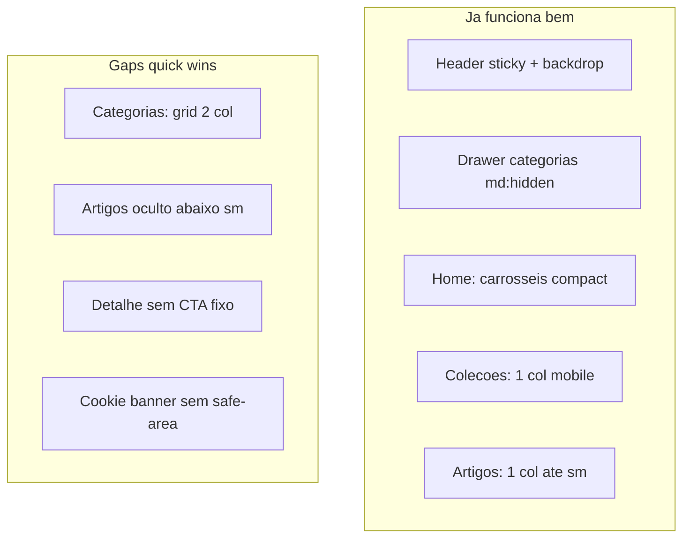

# Otimização mobile — quick wins na vitrine

## Diagnóstico resumido

A vitrine já segue **mobile-first** via Tailwind (`sm` 640px, `md` 768px, `lg` 1024px): header sticky, drawer de categorias, carrosséis com swipe, comparador em artigos com layout dedicado (`ComparisonTable`). Não há hooks `useMediaQuery` — tudo é CSS.

Os maiores problemas em dispositivos 320–430px são **densidade de grid**, **links editoriais inacessíveis** e **CTA de afiliado que some ao rolar** na página de produto.



---

## O que já está bom (não mexer)

| Área | Evidência |
|------|-----------|
| Shell | [`layout.tsx`](apps/web/src/app/layout.tsx) — `flex min-h-screen`, header sticky, main flex-1 |
| Categorias no mobile | [`CategoryCatalogDrawer.tsx`](apps/web/src/components/layout/CategoryCatalogDrawer.tsx) — `md:hidden`, scroll lock, Escape |
| Home CMS | Blocos empilham em 1 col; produtos em carrossel `variant="compact"` ([`ProductGridBlock`](apps/web/src/components/blocks/ProductGridBlock.tsx)) |
| Coleções | [`colecoes/[slug]/page.tsx`](apps/web/src/app/colecoes/[slug]/page.tsx) L137 — `grid-cols-1` no mobile |
| Artigos | [`ArticleListingGrid.tsx`](apps/web/src/components/articles/ArticleListingGrid.tsx) — `grid-cols-1` até `sm` |
| Cards | `truncate` no título, `sizes` responsivos na imagem, CTAs `w-full` ([`ProductCard.tsx`](apps/web/src/components/product/ProductCard.tsx)) |
| Compliance preço stale | `PriceDisplay` retorna `null`; CTA único "Ver preço na {marketplace}" — correto por regra de negócio |

---

## Quick wins priorizados

### 1. Grid de categorias — cards espremidos (ALTA)

**Problema:** [`categorias/[slug]/page.tsx`](apps/web/src/app/categorias/[slug]/page.tsx) L225 usa `grid-cols-2` no mobile com `ProductCard` **default** (2 botões full-width, rating, preço). Em 360px cada coluna fica ~160px — viola a regra UX de "CTA full-width mobile" sem espaço legível ([`06-ux-conversion.mdc`](.cursor/rules/06-ux-conversion.mdc)).

**Correção mínima (escolher uma):**

- **Opção A (recomendada):** `grid-cols-1 sm:grid-cols-2 md:grid-cols-3 lg:grid-cols-4` — 1 coluna em phones estreitos.
- **Opção B:** manter 2 colunas mas passar `variant="compact"` no `ProductCard` + alinhar skeleton em [`ProductGridSkeleton.tsx`](apps/web/src/components/loading/ProductGridSkeleton.tsx).

**Arquivos:** `categorias/[slug]/page.tsx`, opcionalmente `ProductGridSkeleton.tsx` se mudar breakpoint.

**Grids 2-col secundários** (menor impacto, avaliar no mesmo PR se couber):
- [`CuratedCollectionSlide.tsx`](apps/web/src/components/blocks/CuratedCollectionSlide.tsx) L68 — mini-grid dentro do bloco CMS
- [`CategoryBentoGrid.tsx`](apps/web/src/components/blocks/CategoryBentoGrid.tsx) L88 — pills de categoria na home

---

### 2. Navegação editorial no mobile (ALTA)

**Problema:** Em [`SiteHeader.tsx`](apps/web/src/components/layout/SiteHeader.tsx) L40, links "Artigos" e "Sobre" usam `hidden … sm:flex`. Na faixa 320–639px (maioria dos phones) **"Artigos" some** — só restam logo, menu categorias, busca (placeholder) e wishlist. Footer tem "Sobre" mas **não** "Artigos" ([`Footer.tsx`](apps/web/src/components/layout/Footer.tsx)).

**Correção mínima (combinar 2 mudanças pequenas):**

1. Adicionar link **Artigos** no footer (ao lado de Sobre/Contato) — 1 linha em `Footer.tsx`.
2. Incluir seção "Explorar" no fim do [`CategoryCatalogDrawer.tsx`](apps/web/src/components/layout/CategoryCatalogDrawer.tsx) com links para `/artigos` e `/sobre` — padrão já usado em drawers de e-commerce.

Não exige bottom tab bar nem refatorar header.

---

### 3. CTA sticky no detalhe de produto (ALTA)

**Problema:** [`produtos/[slug]/page.tsx`](apps/web/src/app/produtos/[slug]/page.tsx) L104–108 — `ProductDetailAffiliateCta` fica no bloco superior; ao rolar specs/descrição/similares o visitante perde o CTA. A regra UX pede "above the fold: imagem, título, preço, **CTA**" mas em mobile páginas longas precisam de barra fixa.

**Correção mínima:**

- Novo componente client `ProductDetailStickyCta.tsx` (ou estender `ProductDetailAffiliateCta`):
  - `fixed inset-x-0 bottom-0 z-30 md:hidden`
  - Reutilizar `AffiliateGoLink` + label "Ver preço na {marketplace}"
  - `padding-bottom: env(safe-area-inset-bottom)` para não colidir com home indicator iOS
  - `pb-20` ou offset dinâmico no `<main>` quando cookie banner visível (banner em `z-[60]` — CTA fica abaixo do banner, ok)
- Renderizar em `produtos/[slug]/page.tsx` passando `productId`, `slug`, `marketplace`, `price.isStale`

**Comportamento stale:** manter só CTA afiliado (sem preço numérico), alinhado à regra de compliance.

---

### 4. Safe-area em elementos fixos (MÉDIA)

**Problema:** [`CookieConsentProvider.tsx`](apps/web/src/components/legal/CookieConsentProvider.tsx) L66 — `fixed bottom-0` sem `safe-area-inset-bottom`. Drawers usam altura total sem inset lateral em notch.

**Correção mínima em [`globals.css`](apps/web/src/app/globals.css):**

```css
.pb-safe {
  padding-bottom: max(1rem, env(safe-area-inset-bottom));
}
```

Aplicar em:
- Cookie banner (`pb-safe` na div fixa)
- `ProductDetailStickyCta` (novo)
- Opcional: painel do drawer (`.category-catalog-drawer__panel`)

Exportar viewport em `layout.tsx` com `viewportFit: 'cover'` **só se** adicionar safe-area — caso contrário o inset fica zerado (comportamento atual).

---

### 5. Galeria de thumbnails com scroll horizontal (MÉDIA)

**Problema:** [`ProductImageGallery.tsx`](apps/web/src/components/product/ProductImageGallery.tsx) L40 — `flex gap-2` sem `overflow-x-auto`; 5+ imagens estouram a largura.

**Correção:** `overflow-x-auto pb-1` no container + `scrollbar-thin` ou `-mx-4 px-4` para bleed edge-to-edge no mobile.

---

### 6. Breadcrumb no detalhe — overflow (MÉDIA)

**Problema:** [`produtos/[slug]/page.tsx`](apps/web/src/app/produtos/[slug]/page.tsx) L69–84 — breadcrumb inline com título completo do produto pode quebrar layout em 320px.

**Correção:** `overflow-x-auto whitespace-nowrap` no `<nav>` ou `line-clamp-1` no último segmento (título).

---

### 7. Tipografia mínima em cards compactos (BAIXA — se sobrar tempo)

**Problema:** [`ProductCardActions.tsx`](apps/web/src/components/product/ProductCardActions.tsx) L53 — `text-[11px]` no variant compact (< 12px recomendado).

**Correção:** trocar para `text-xs` (12px) — mudança de 1 classe, sem redesign.

---

## Fora do escopo deste pacote (quick wins)

| Item | Motivo |
|------|--------|
| Implementar busca no header | Feature nova, não layout |
| `PriceDisplay` placeholder quando stale | Mudança de copy/compliance — discutir à parte |
| Header skeleton breakpoint `sm` vs `md` | Flash cosmético 640–768px |
| Touch targets 44px em ícones | Refino UX, não bloqueador |
| Comparador `/comparador`, `/cupons` | MVP features, não mobile layout |

---

## Ordem de implementação sugerida

1. Grid categorias (+ skeleton alinhado)
2. Footer "Artigos" + links no drawer
3. `ProductDetailStickyCta` + safe-area utility
4. Galeria thumbnails scroll
5. Breadcrumb overflow
6. `text-xs` em compact CTAs (opcional)

**Estimativa:** 1 PR focado, ~6–8 arquivos, sem novas dependências.

---

## Como validar

- DevTools: iPhone SE (375px), Galaxy S8 (360px), iPhone 14 Pro (com safe-area)
- Fluxos: home → categoria → card legível; detalhe → scroll longo → CTA fixo visível; drawer → Artigos acessível
- Cookie banner + CTA sticky simultâneos — sem sobreposição ilegível
- `pnpm --filter @ecommerce-amazon/web lint` e build

---

## Documentação

Ao concluir: criar [`docs/web-mobile-quick-wins.md`](docs/web-mobile-quick-wins.md) com escopo, arquivos alterados e checklist de validação; referenciar em [`docs/README.md`](docs/README.md).
