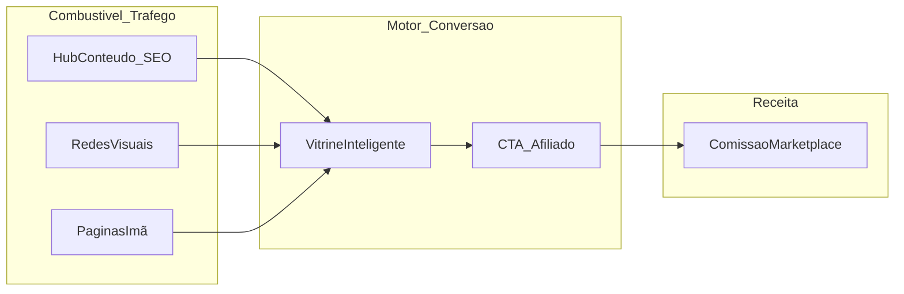
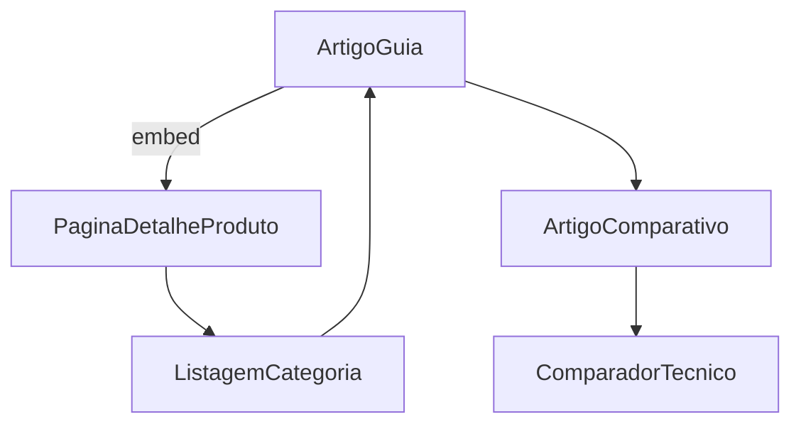
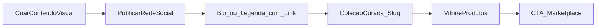

# PRD Growth — Aquisição de Tráfego e Conteúdo

Documento complementar ao [PRD Core — Plataforma de Afiliação](prd_plataforma_afiliação_de44933f.plan.md).

| Documento             | Responsabilidade                                                                          |
| --------------------- | ----------------------------------------------------------------------------------------- |
| **PRD Core**          | O que o sistema faz: dados, APIs, workers, UX de conversão, entidades                     |
| **PRD Growth (este)** | Como trazer pessoas até a vitrine: SEO, conteúdo, social, páginas-ímã, operação editorial |

---

## 1. Problema Estratégico — Por que a vitrine sozinha é um "site fantasma"

Uma listagem de produtos com fotos e preços espelhados da Amazon/Shopee é **conteúdo duplicado** para o Google. O algoritmo prioriza a fonte canônica (marketplaces) e penaliza páginas sem valor editorial diferenciado.

**Consequência de negócio:** zero tráfego orgânico → zero cliques afiliados → plataforma tecnicamente funcional mas comercialmente morta.

**Tese central deste PRD:**

> A **vitrine** é o mecanismo de conversão e monetização. O **conteúdo, as ferramentas e os canais sociais** são o combustível que alimenta a vitrine.

---

## 2. Pilar 1 — Hub de Conteúdo (SEO de Intenção de Compra)

### 2.1 Princípio

Usuários raramente buscam um produto específico em site desconhecido. Buscam **dúvidas, comparações e guias** antes de comprar. O hub captura tráfego **informational** e converte em cliques **transactional** via embeds de produto.

### 2.2 Tipos de Conteúdo (taxonomia editorial)

| Tipo                      | Intenção de busca        | Exemplo (nicho Home Office)                            | Objetivo                       |
| ------------------------- | ------------------------ | ------------------------------------------------------ | ------------------------------ |
| **Guia de compra**        | "como escolher X"        | "Como escolher cadeira ergonômica para dor nas costas" | Confiança + múltiplos embeds   |
| **Comparativo editorial** | "X vs Y"                 | "Cadeira A vs B vs C: qual vale a pena?"               | Link para comparador técnico   |
| **Lista curada**          | "melhores X 2026"        | "7 melhores mesas ajustáveis até R$800"                | Alto CTR em embeds             |
| **Problema → solução**    | "X dói / X não funciona" | "Postura errada no home office: 5 upgrades baratos"    | Empatia + curadoria            |
| **Review profundo**       | "[produto] vale a pena"  | "Análise completa: Cadeira X após 90 dias"             | Página de detalhe interna rica |

### 2.3 Engenharia de Conteúdo (integração com plataforma)

**Fluxo editorial:**

1. Redator cria artigo no CMS interno (`ContentArticle`).
2. Ao citar produto, insere shortcode `[[product:slug]]`.
3. Backend resolve embed em runtime: preço, rating, CTA e badge de queda vêm do **catálogo local** (PRD Core).
4. Visitante lê conteúdo original → clica no card por conveniência → Cenário A ou B do PRD Core.

**Regras anti-duplicação (obrigatórias):**

- Mínimo **800 palavras** por artigo publicável; guias pilares ≥ **1.500 palavras**.
- Mínimo **300 palavras** antes do primeiro embed comercial.
- Proibido copiar descrição de marketplace; specs reescritas ou normalizadas.
- Cada artigo deve conter **≥1 insight exclusivo**: tabela comparativa própria, foto original, experiência de uso, entrevista, ou dado de histórico de preços local.
- Imagens: preferir fotos próprias ou mockups; imagens de API apenas como thumbnail secundário.
- Schema markup: `Article` + `FAQPage` quando houver bloco de perguntas.

### 2.4 Estratégia de Keywords (framework operacional)

**Mapa de intenção em três camadas:**

1. **Topo (informational):** volume alto, conversão baixa — guias, tutoriais ("como montar setup").
2. **Meio (commercial investigation):** comparativos, "melhores X" — principal alvo do hub.
3. **Fundo (transactional):** nome de produto — capturado por detalhe interna enriquecida + histórico de preço (não competir head-on com Amazon).

**Priorização MVP:** 10 artigos camada Meio + 5 camada Topo interlinkados para 20 produtos seed da vitrine.

### 2.5 Interlinking (malha interna)

- Todo artigo linka ≥3 artigos relacionados + ≥1 listagem de categoria.
- Toda detalhe de produto linka ≥1 artigo guia relevante ("Leia nosso guia completo").

### 2.6 Métricas de sucesso (SEO)

- Impressões e CTR no Search Console (por artigo).
- Tempo na página ≥ 2min em guias.
- CTR embed → detalhe ≥ 8%.
- CTR embed/detalhe → marketplace ≥ 3%.
- Páginas indexadas vs publicadas (meta: 100% em 14 dias).

---

## 3. Pilar 2 — Tráfego Visual e Redes Sociais (Atalho Rápido)

### 3.1 Princípio

SEO leva meses. Redes visuais (Pinterest, TikTok, Instagram Reels) podem gerar tráfego na **primeira semana** — especialmente em nichos visuais: decoração, cozinha, moda, setups de tecnologia, pet.

### 3.2 Fluxo operacional

1. **Produção:** foto/vídeo de inspiração ("Ideias de cozinha pequena gastando pouco").
2. **CTA na bio/legenda:** "Todos os links organizados aqui: [seusite.com/c/cozinha-pequena]".
3. **Landing:** `CuratedCollection` — grid ultra-rápido, mobile-first, sem pop-ups.
4. **Conversão:** usuário salva na wishlist ou clica direto no CTA (Cenário B).

### 3.3 Especificação da Coleção Curada (lookbook social)

| Elemento    | Especificação                                                     |
| ----------- | ----------------------------------------------------------------- | ------ | ------------------------------------------------ |
| URL         | `/c/[slug-curto-memoravel]`                                       |
| Título      | Espelha hook do vídeo ("5 itens que transformaram minha cozinha") |
| Hero        | Imagem/vídeo loop do conteúdo original                            |
| Grid        | 4–12 produtos, ordem = ordem de aparição no vídeo                 |
| CTA global  | "Adicionar todos à lista" + "Ver tudo na Amazon/Shopee"           |
| UTM         | `utm_source=pinterest                                             | tiktok | instagram&utm_medium=social&utm_campaign=[slug]` |
| Performance | LCP < 1.5s (crítico para bounce de tráfego frio)                  |

### 3.4 Playbook por canal

| Canal         | Formato                         | Frequência MVP  | KPI principal           |
| ------------- | ------------------------------- | --------------- | ----------------------- |
| **Pinterest** | Pins 2:3, infográficos de lista | 5 pins/semana   | Saves, outbound clicks  |
| **TikTok**    | Vídeo 15–60s, antes/depois      | 3 vídeos/semana | Cliques link bio        |
| **Instagram** | Reels + carrossel produto       | 3 posts/semana  | Link clicks Stories/bio |

**Regra:** cada peça visual = 1 coleção curada dedicada (nunca link genérico para homepage).

### 3.5 Métricas de sucesso (social)

- Cliques UTM → landing → CTR marketplace (funil completo).
- Bounce rate landing < 55%.
- Tempo médio na landing > 45s.
- Wishlist adds por sessão social > 0.3.

---

## 4. Pilar 3 — Funcionalidades como Ímã de Tráfego

Features que geram **conteúdo indexável único**, **recorrência** e **compartilhamento**.

### 4.1 Comparador Lado a Lado

**Por que atrai tráfego:** buscas "A vs B vs C" têm intenção comercial altíssima; tabela limpa com prós/contras editoriais é conteúdo que marketplaces não oferecem bem.

**Especificação Growth (complementa PRD Core §3.4):**

| Dimensão       | Regra                                                                              |
| -------------- | ---------------------------------------------------------------------------------- |
| Entrada        | Checkbox no card, busca, ou link de artigo comparativo                             |
| Limite         | 2–3 produtos                                                                       |
| Conteúdo único | Intro editorial ≥150 palavras + linhas Prós/Contras por produto                    |
| SEO            | URL indexável `/comparar/[slug-gerado]`; title "A vs B vs C: comparativo completo" |
| Social         | Botão "Compartilhar comparação" → Open Graph com tabela preview                    |
| Recirculação   | Bloco "Vencedor por categoria" + link para guia relacionado                        |

**Calendário editorial:** 1 comparativo indexável/semana alinhado a keyword Meio.

### 4.2 Central de Cupons

**Por que atrai tráfego:** "cupom shopee hoje" e variantes têm volume massivo e recorrente; usuário entra por utilidade imediata.

**Especificação Growth (complementa PRD Core §3.5):**

| Dimensão       | Regra                                                       |
| -------------- | ----------------------------------------------------------- |
| URL principal  | `/cupons` (+ `/cupons/shopee`, `/cupons/amazon`)            |
| Conteúdo único | Texto explicativo sobre como usar cupons no nicho + FAQ     |
| Operacional    | Curador humano valida cupons 2x/dia nos primeiros 30 dias   |
| Recirculação   | Após copiar cupom → modal "Veja ofertas do nicho" (4 cards) |
| SEO            | Title dinâmico "Cupons Shopee válidos hoje — [Mês/Ano]"     |
| Retenção       | Email opcional "Avisar novos cupons do nicho" (lead gen)    |

**Alerta de compliance:** cupons expirados danificam confiança; Pipeline D (Core) é pré-requisito de go-live desta página.

### 4.3 Histórico de Preços como SEO (sinergia com Core)

Páginas de produto com gráfico de 90 dias capturam long-tail: "preço histórico [produto]", "vale a pena esperar [produto]". Growth PRD eleva isso a prioridade de indexação:

- Indexar páginas com ≥7 snapshots.
- Meta description mencionando faixa de preço 30d quando disponível.

---

## 5. Calendário de Lançamento (Primeiros 90 Dias)

### Fase 0 — Pré-lançamento (semanas 1–2)

- Definir nicho vertical e taxonomia de categorias.
- Seed 30–50 produtos curados manualmente.
- Publicar 3 guias pilares (rascunho completo, embeds testados).
- Criar 2 coleções curadas para campanha social de lançamento.

### Fase 1 — Lançamento soft (semanas 3–4)

- Go-live com vitrine + hub (5 artigos) + `/cupons` + 1 comparador.
- Iniciar Pinterest + 1 rede secundária (TikTok ou Instagram).
- **Não** indexar em massa até conta afiliado validada (gate PRD Core §4.2).

### Fase 2 — Tração (semanas 5–8)

- Ritmo: 2 artigos/semana + 1 comparativo/semana + 5 pins/semana.
- Ativar alertas de preço e email capture em cupons.
- Revisar Search Console; dobrar produção nos clusters com impressões.

### Fase 3 — Escala (semanas 9–12)

- 30+ artigos indexados; interlinking completo.
- Expandir cupons para sub-nichos (ex: `/cupons/eletrodomesticos`).
- Testar paid boost em pins/posts com melhor CTR orgânico.

---

## 6. Governança Editorial e Anti-Duplicação

### Checklist pré-publicação (obrigatório)

- [ ] Texto ≥800 palavras (ou ≥150 para comparador).
- [ ] Zero parágrafos copiados de marketplace (verificação manual).
- [ ] ≥1 elemento exclusivo (tabela, opinião, histórico de preço, mídia original).
- [ ] Embeds apontam para detalhe interna; CTAs com nome de marketplace explícito.
- [ ] Meta title/description únicos; canonical correto.
- [ ] Links internos ≥3 por artigo.
- [ ] Disclaimer de afiliado visível.

### O que NÃO publicar

- Páginas de produto só com descrição da API.
- Artigos "melhores X" com parágrafos genéricos intercambiáveis entre nichos.
- Comparativos sem linha editorial de prós/contras.
- Cupons não verificados nas últimas 24h.

---

## 7. Métricas Globais de Growth (North Star)

| Métrica                      | Definição                            | Meta MVP (90d)                 |
| ---------------------------- | ------------------------------------ | ------------------------------ |
| **Sessões orgânicas/semana** | Google Search                        | Crescimento 15% WoW após mês 2 |
| **Sessões sociais/semana**   | UTMs Pinterest/TikTok/IG             | ≥500/semana ao final fase 2    |
| **CTR global marketplace**   | cliques CTA / sessões                | ≥ 2.5%                         |
| **Receita por sessão**       | comissão / sessões                   | Baseline + tendência crescente |
| **Ratio conteúdo/vitrine**   | artigos publicados / produtos ativos | ≥ 1:5                          |

---

## 8. Dependências com PRD Core

| Feature Growth      | Entidade / Rota Core                           | Worker                    |
| ------------------- | ---------------------------------------------- | ------------------------- |
| Embeds em artigos   | `ContentArticle`, `ContentProductEmbed`        | Pipeline B (preço fresco) |
| Coleções sociais    | `CuratedCollection`, `GET /collections/:slug`  | Pipeline B                |
| Comparador          | `ProductComparison`, `GET /comparisons/:token` | Pipeline C (specs)        |
| Central de cupons   | `Coupon`, `GET /coupons`                       | **Pipeline D** (novo)     |
| Histórico preço SEO | `PriceSnapshot`                                | Pipeline B                |

---

## 9. Fora de Escopo deste PRD Growth

- Estratégia de paid media detalhada (Google Ads, Meta Ads) — fase posterior.
- Contratação de redatores / influencers (processo RH).
- Localização multi-idioma.
- Newsletter completa (MVP = capture em alertas e cupons).

---

## 10. Critérios de Aceite Growth (MVP)

- [ ] 5+ artigos guia publicados com embeds dinâmicos funcionais.
- [ ] 2+ coleções curadas operacionais com UTMs rastreáveis.
- [ ] 1 comparador indexado ranqueando (impressões > 0 no GSC).
- [ ] Central de cupons live com verificação <24h.
- [ ] Playbook social documentado e executado por 4 semanas consecutivas.
- [ ] Checklist anti-duplicação aplicado em 100% das publicações.
