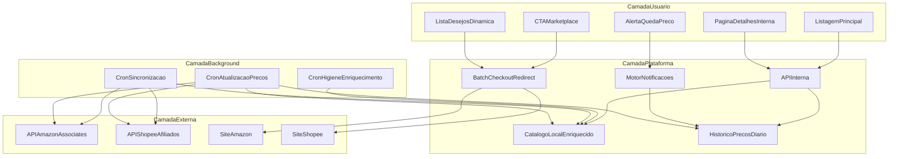
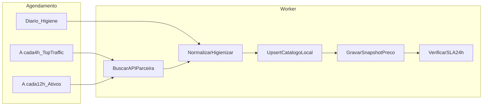
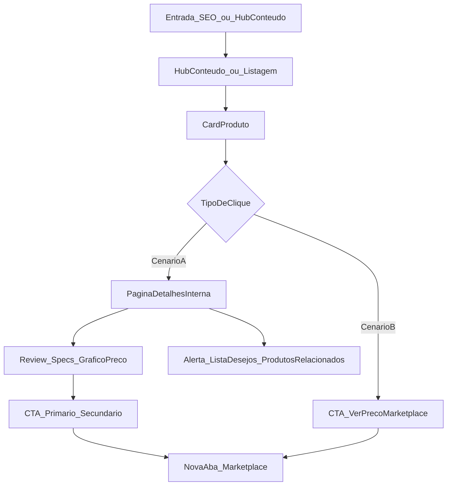
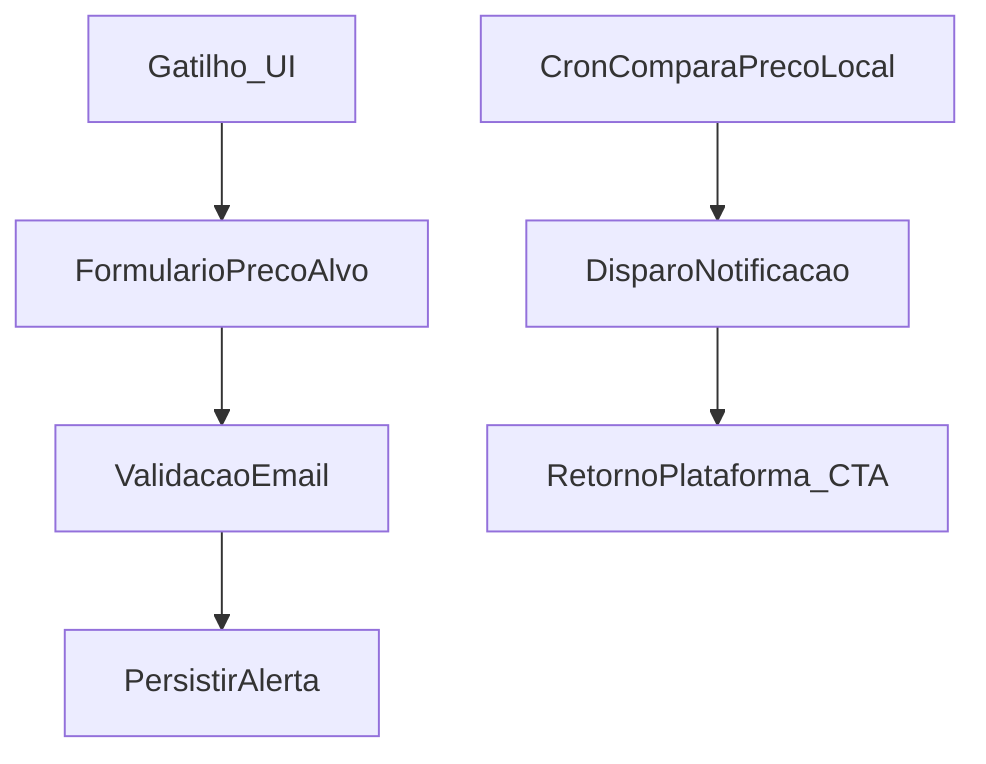

# PRD — Plataforma Proprietária de Afiliação (Vitrine Inteligente + Hub de Conteúdo)

Documento funcional definitivo para orientar modelagem de dados, rotas de API interna e wireframes. Nicho vertical e mercado geográfico permanecem **parametrizáveis**; exemplos usam cenário Brasil (Amazon BR + Shopee BR) por ser o contexto implícito da solicitação.

**Documento complementar:** [PRD Growth — Aquisição de Tráfego e Conteúdo](prd_growth_aquisicao_trafego.plan.md) — estratégia anti-conteúdo-duplicado, calendário editorial, canais sociais e especificações de páginas-ímã (cupons, lookbooks). Este PRD Core define **o que a plataforma deve suportar**; o Growth PRD define **como alimentar a vitrine com tráfego**.

**Documento técnico:** [Arquitetura Técnica Node.js + TypeScript](arquitetura_tecnica_node.plan.md) — Clean Architecture, filas BullMQ, persistência, cache Redis e padrões de projeto para implementação.

---

## Visão Geral do Produto

### Proposta de Valor
Plataforma editorial de curadoria vertical que **possui a experiência de descoberta e comparação** (SEO, conteúdo, retenção) e **monetiza via links de afiliado** apenas no momento de intenção de compra (clique no CTA). O usuário nunca é forçado a sair da plataforma antes de estar informado; a saída para o marketplace é transparente e voluntária.

### Modelo de Negócio
- **Receita:** comissões por venda atribuída (Associates / Programa de Afiliados Shopee).
- **Tráfego:** orgânico (SEO long-tail do nicho), conteúdo (reviews, guias, comparativos), recirculação interna.
- **Diferencial:** dados enriquecidos localmente, histórico de preços, alertas e checkout em lote — funcionalidades que marketplaces não oferecem na vitrine de afiliado.

### Princípios Arquiteturais de Negócio
1. **Soberania de dados de vitrine:** metadados servidos pelo sistema próprio.
2. **APIs parceiras como fonte, não como CDN:** consultas externas apenas no worker, nunca no request do usuário final.
3. **Conformidade > velocidade de feature:** preços com SLA de frescor; links validados; contas de afiliado aprovadas manualmente antes de escala.
4. **Conversão por confiança:** transparência no CTA, urgência honesta (baseada em dados reais locais).



---

## 1. Arquitetura Conceitual de Dados (Data Storage & Background Cron)

### 1.1 Por que persistir metadados localmente (em vez de API em tempo real)

| Dimensão | Consulta em tempo real na API parceira | Persistência local + serviço próprio |
|----------|----------------------------------------|--------------------------------------|
| **Performance UX** | Latência variável (200ms–2s+); timeouts degradam LCP e SEO | Resposta previsível (<100ms) para listagens e detalhes |
| **Rate limits** | Cota diária/horária compartilhada; pico de tráfego = bloqueio | Tráfego de usuários desacoplado da cota de sync |
| **SEO** | Conteúdo dinâmico instável; títulos poluídos da API | Títulos higienizados, slugs estáveis, schema markup consistente |
| **Enriquecimento** | Dados crus do marketplace | Campos editoriais: categorias do nicho, tags, score interno, badges |
| **Histórico de preços** | Impossível sem snapshots | Série temporal diária alimenta gráficos e alertas |
| **Resiliência** | Indisponibilidade da API = site quebrado | Degradação graciosa: produto com badge "preço desatualizado" |
| **Conformidade afiliado** | Exibição de preço exige políticas específicas | Controle centralizado de freshness e disclaimers |

**Regra de ouro:** o request HTTP do visitante **nunca** dispara chamada síncrona à API Amazon/Shopee. Toda leitura vem do repositório local; toda escrita/atualização vem do worker.

### 1.2 Entidades de Dados Conceituais (visão de domínio, não DDL)

**Produto (Product)**
- Identificador interno imutável (UUID/snowflake).
- Identificadores externos: ASIN/SKU marketplace, marketplace de origem (Amazon BR, Shopee BR).
- Metadados de vitrine: título higienizado, título original (auditoria), slug, descrição curta editorial, descrição longa (HTML sanitizado), imagens (URLs cacheadas ou CDN própria), categoria vertical, tags.
- Comercial: preço atual, preço riscado (se houver), moeda, disponibilidade (in_stock / out_of_stock / unknown), última atualização de preço (timestamp).
- Afiliado: deep link gerado, parâmetros de tracking (tag/campaign), validade do link.
- Qualidade: score editorial (0–100), flags (destaque, tendência, queda recente).
- SEO: meta title, meta description, canonical.

**Snapshot de Preço (PriceSnapshot)**
- product_id, valor, moeda, captured_at (granularidade diária; opcional intradiária para produtos hot).
- Fonte: worker_cron | manual_override.

**Alerta de Preço (PriceAlert)**
- email ou identificador anônimo (cookie/device token), product_id, preço_alvo, status (active / triggered / expired), created_at, triggered_at.

**Lista de Desejos / Carrinho de Redirecionamento (WishlistItem)**
- session_id ou user_id, product_id, marketplace, added_at, ordem.

**Job de Sincronização (SyncJobLog)**
- tipo (full_sync | price_refresh | hygiene | link_validation), started_at, finished_at, status, itens_processados, erros.

**Conta de Afiliado (AffiliateAccount)**
- marketplace, tag/id afiliado, status (pending_manual_validation | active | suspended), validated_by, validated_at, notas de compliance.

**Artigo / Guia (ContentArticle)** — suporte ao Hub de Conteúdo
- slug, título, corpo (HTML/Markdown), tipo (guia | review | comparativo | lookbook_social), status (draft | published), published_at.
- seo: meta title, meta description, canonical, schema Article.
- Relacionamentos: produtos embedados (ordem), categorias do nicho, tags de intenção de compra.

**Embed de Produto no Conteúdo (ContentProductEmbed)**
- article_id, product_id, posição no corpo, variante de card (inline | destaque | comparativo).

**Coleção Curada / Lookbook (CuratedCollection)** — landing para tráfego social
- slug, título, descrição, capa, origem_campanha (pinterest | tiktok | instagram | organico), utm_defaults.
- Relacionamentos: lista ordenada de product_id; texto CTA padrão ("Links de todos os produtos do vídeo").

**Cupom (Coupon)**
- marketplace, código, descrição, desconto_percentual ou valor_fixo, valid_from, valid_until, status (active | expired | unverified), source_url, last_verified_at.
- Regra: exibir somente cupons com `last_verified_at` < 24h ou flag manual de operador.

**Comparação Salva (ProductComparison)** — Comparador Lado a Lado
- session_id ou slug compartilhável, até 3 product_id, atributos comparados (specs normalizadas + score editorial), created_at, share_token.

### 1.3 Modelo do Worker / Cron Job

Três pipelines independentes com filas lógicas e priorização:

#### Pipeline A — Sincronização de Catálogo (Full / Incremental)
- **Objetivo:** descobrir novos produtos do nicho, atualizar metadados não-preço.
- **Frequência ideal:**
  - Produtos **ativos na vitrine:** incremental a cada **6 horas**.
  - Produtos **em listas de desejos ou com alerta ativo:** a cada **2 horas**.
  - Produtos **inativos/arquivados:** semanal.
  - Novos candidatos (seed por keyword/categoria): diário.
- **Ações:** upsert de título original, imagens, rating, review count, disponibilidade, categoria marketplace.

#### Pipeline B — Atualização de Preços (Crítico para Compliance)
- **Objetivo:** garantir que preço exibido reflete valor recente do marketplace.
- **Frequência ideal:**
  - Produtos com tráfego nas últimas 24h: a cada **4 horas**.
  - Demais produtos ativos: a cada **12 horas**.
  - **Hard SLA:** nenhum produto ativo pode ter `price_updated_at` > **24 horas** sem nova tentativa de refresh.
- **Regra de negócio — conformidade 24h:**
  - Se refresh falhar após 24h: produto recebe flag `stale_price = true`.
  - UI substitui preço numérico por **"Ver preço atualizado no marketplace"** (CTA ainda funcional).
  - Produto **não** exibe badge de "menor preço" ou urgência baseada em preço até refresh bem-sucedido.
  - Alertas de queda **não disparam** com base em preço stale.
  - Log de compliance registrado para auditoria.

#### Pipeline C — Higiene e Enriquecimento
- **Objetivo:** limpar títulos poluídos, normalizar dados, aplicar regras editoriais.
- **Frequência:** diária (02:00–05:00 horário de menor tráfego).
- **Regras de higienização de título:**
  - Remover sufixos promocionais repetitivos ("Frete GRÁTIS", "OFERTA", "2024 Novo", emojis excessivos).
  - Truncar a 80–120 caracteres na vitrine; preservar original em campo separado.
  - Padronizar capitalização (title case inteligente, preservar siglas do nicho).
  - Detectar duplicatas por similaridade de título + mesmo marketplace_id.
- **Enriquecimento:**
  - Mapear categoria marketplace → taxonomia vertical proprietária.
  - Calcular `price_drop_pct_7d` e `price_drop_pct_30d` para badges.
  - Gerar/atualizar slug se título higienizado mudou significativamente (com redirect 301 do slug antigo).



### 1.4 Estratégia de Degradação e Cache de Imagens
- Imagens: proxy/cache com TTL de 7 dias; re-fetch no sync se URL origem mudou.
- API parceira indisponível: retry exponencial (3 tentativas); produto permanece servido com dados locais + banner de frescor.
- Produto removido do marketplace: status `delisted`; página vira 410 ou redirect para categoria com produtos similares (preservar SEO link equity).

---

## 2. Fluxo do Usuário e Estratégia de Conversão (UI/UX)

### 2.1 Jornada Macro



### 2.2 Cenário A — Navegação via Listagem → Página de Detalhes Interna

**Intenção do usuário:** pesquisa, comparação, consumo de conteúdo. **Objetivo da plataforma:** maximizar tempo na propriedade, construir confiança, capturar sinal de intenção (alerta, wishlist).

**Fluxo passo a passo:**
1. Usuário chega na **Listagem Principal** (categoria vertical, busca, ou landing de guia "Melhores X para Y").
2. Visualiza **cards limpos** (ver seção 2.4).
3. Clica na **área do card exceto o CTA** (imagem, título, badge) → navega para **Página de Detalhes Interna** (mesma aba).
4. Na detalhe consome: galeria, resumo editorial, specs normalizadas, gráfico de histórico de preços, reviews agregados (rating visual), produtos relacionados.
5. CTAs hierarquizados:
   - **Primário:** "Ver preço na Amazon" / "Ver preço na Shopee" (marketplace correto por produto).
   - **Secundário:** "Criar alerta de preço", "Adicionar à lista".
6. Microcópia de transparência abaixo do CTA primário: *"Você será redirecionado para [Marketplace]. Podemos receber comissão sem custo extra para você."*

**Métricas de sucesso:** scroll depth, tempo na página, CTR do CTA na detalhe, cadastro de alerta, add-to-wishlist.

### 2.3 Cenário B — Clique direto no CTA da Listagem

**Intenção do usuário:** compra imediata, já decidiu. **Objetivo da plataforma:** fricção zero na saída, atribuição correta do clique afiliado.

**Fluxo passo a passo:**
1. Usuário identifica produto na listagem.
2. Clica no **botão CTA** do card (área delimitada, não confundir com link da detalhe).
3. Sistema registra evento de clique (produto, origem=listagem, timestamp, session).
4. Abre **nova aba** com deep link afiliado (nunca substituir aba atual — usuário mantém vitrine aberta para retorno).
5. Opcional: toast na aba original — *"Abrimos a [Amazon/Shopee] em nova aba"*.

**Regras UX críticas:**
- CTA sempre mostra **nome explícito do marketplace** (nunca "Comprar agora" genérico).
- Ícone do marketplace ao lado do texto.
- `rel="noopener sponsored"` no link (transparência SEO).
- Preço exibido no card deve ter indicador de frescor: "Atualizado há X horas" ou ícone verde se <4h.

### 2.4 Componentes Críticos de Interface

#### Card de Produto (Listagem)
| Elemento | Especificação |
|----------|---------------|
| Imagem | Ratio 1:1, fundo neutro, lazy load, alt = título higienizado |
| Título | Máx. 2 linhas, sem poluição promocional |
| Preço | Destaque tipográfico; riscado se havia promo; ocultar se stale |
| Rating | Estrelas visuais + contagem ("4,6 · 2.341 avaliações") — dados do sync |
| Badges | "Menor preço em 30 dias", "Queda de 15%", "Escolha do editor" — só com dados válidos |
| CTA | Botão full-width mobile; cor distinta do link do título |
| Urgência | Barra ou chip apenas se `price_drop_pct_7d >= threshold` configurável |

#### Página de Detalhes Interna
- **Above the fold:** imagem + título + preço + CTA primário + disclaimer afiliado.
- **Gráfico de histórico:** 30/90/180 dias (toggle); linha de referência = preço atual.
- **Bloco de confiança:** "Por que recomendamos" (editorial), specs em tabela comparável.
- **Urgência honesta:** "Este produto está X% abaixo da média dos últimos 90 dias" — somente se snapshot confiável.
- **Recirculação:** "Quem viu este também comparou" (3–6 cards).

#### Gatilhos Psicológicos (Gold Standard — sem dark patterns)
- **Escassez real:** estoque baixo somente se API retornar flag confiável; caso contrário, não exibir.
- **Oportunidade:** badge de queda de preço baseado em histórico local (verificável no gráfico).
- **Prova social:** rating + volume de reviews (sincronizados).
- **Autoridade:** selo "Análise completa" linkando seção editorial na mesma página.
- **Reciprocidade:** alerta de preço gratuito em troca de email — valor claro antes do input.

**Proibido:** countdown falso, "X pessoas comprando agora" inventado, preço inflado fictício.

### 2.5 Hub de Conteúdo (integração com plataforma — detalhes editoriais no Growth PRD)
- Artigos publicados renderizam **embeds dinâmicos de produto** (`ContentProductEmbed`): preço, rating e CTA vêm do catálogo local em tempo de request (sem API parceira).
- Shortcode conceitual: `[[product:uuid]]` ou `[[product:slug]]` → card inline padronizado (mesmo componente da vitrine, variante compacta).
- Cada embed linka para **detalhe interna** (Cenário A); CTA do embed abre marketplace (Cenário B).
- Páginas de **Coleção Curada** (`/c/[slug]`) servem tráfego social: grid de produtos + copy "Links organizados" + batch wishlist.
- Regra UX herdada do Growth PRD: mín. 300 palavras editoriais originais antes do primeiro CTA comercial em artigos.

---

## 3. Funcionalidades de Retenção e Engajamento

### 3.1 Histórico de Variação de Preços

**Lógica de negócio:**
1. Pipeline B (cron de preços) grava **1 snapshot por produto por dia** no mínimo (timestamp + valor).
2. Se preço mudar intradia >5% em produto hot (top 10% tráfego), snapshot adicional permitido (máx. 4/dia).
3. Cálculos derivados (materializados no sync ou sob demanda):
   - `avg_price_7d`, `avg_price_30d`, `avg_price_90d`
   - `min_price_30d`, `max_price_30d`
   - `price_drop_pct_vs_avg_90d`
4. **Renderização do gráfico:**
   - Eixo X: datas; Eixo Y: preço na moeda local.
   - Tooltip: data, preço, variação vs dia anterior.
   - Shading verde em períodos de queda sustentada.
5. **Regras de exibição:**
   - Mínimo 7 snapshots para mostrar gráfico; abaixo disso, mensagem "Coletando histórico — volte em alguns dias".
   - Snapshots de dias com falha de sync: interpolar linha tracejada ou gap explícito (nunca inventar preço).

**Valor para retenção:** usuário retorna para ver evolução; página ganha profundidade SEO ("preço histórico de [produto]").

### 3.2 Alerta de Queda de Preço

**Funil de captação:**


**Regras:**
1. **Gatilhos de UI:** botão na detalhe; banner na listagem se produto já teve queda recente ("Avise-me se baixar mais").
2. **Input:** email (obrigatório MVP) + preço alvo sugerido (default = 5% abaixo do preço atual ou média 30d, o que for menor).
3. **Validação:** double opt-in por email; token de confirmação expira em 48h.
4. **Monitoramento:** roda após cada Pipeline B bem-sucedido; compara `preco_atual <= preco_alvo`.
5. **Disparo:**
   - Email: assunto "[Produto] atingiu seu preço alvo"; corpo com preço atual, gráfico estático, CTA primário para marketplace + link para detalhe interna.
   - Limite: 1 email por alerta (one-shot) ou recorrente até expirar (configurável; MVP = one-shot).
6. **Anti-spam:** máx. 10 alertas ativos por email; cooldown 24h entre emails do mesmo produto.
7. **Conformidade:** email só dispara se preço **não** estiver stale.

**KPIs:** taxa de cadastro de alerta, open rate, CTR pós-alerta, conversão atribuída.

### 3.3 Carrinho de Redirecionamento / Lista de Desejos Dinâmica

**Conceito:** substituto local do carrinho marketplace — acumula intenção de compra multi-produto e executa **Batch Checkout Redirect** via APIs de afiliado.

**Lógica:**
1. Usuário adiciona produtos via "Salvar na lista" (ícone coração/carrinho) — persistido por `session_id` (anônimo) ou conta (fase 2).
2. Lista agrupa por marketplace (Amazon separado de Shopee — não misturar checkout).
3. **Limite MVP:** 10 itens por marketplace por sessão.
4. **Batch Checkout Redirect:**
   - Amazon: usar **Add to Cart deep link** ou **Checkout Basket API** (conforme permissões da conta Associates validada) para pré-popular carrinho com múltiplos ASINs + tag afiliado.
   - Shopee: equivalente via link agregado ou API de afiliados (multi-item onde suportado; fallback = abrir N abas com delay de 500ms + modal explicativo).
5. Fluxo UX:
   - Drawer lateral "Sua lista (3)" → revisão → botão "Finalizar na Amazon (3 itens)".
   - Confirmação: "Abriremos a Amazon com seus itens. Compras finalizadas lá."
6. **Sincronização:** itens em lista herdam prioridade **2h** no Pipeline A/B.
7. **Limpeza:** itens `delisted` aparecem cinza com opção remover; auto-remove após 30 dias.

**Valor:** AOV indireto maior (multi-produto), sessões mais longas, diferencial vs comparadores simples.

### 3.4 Comparador Lado a Lado (MVP — Ímã de Tráfego)

**Lógica de negócio:**
1. Usuário seleciona **2 ou 3 produtos** da vitrine (checkbox no card ou botão "Comparar").
2. Barra flutuante persistente: "Comparar (2/3)" → abre página `/comparar?p=a,b,c` ou comparação salva por `share_token`.
3. Tabela comparativa renderiza:
   - Linhas fixas: preço atual, rating, marketplace, badge de queda 30d.
   - Linhas dinâmicas: specs normalizadas do nicho (mapeadas no Pipeline C).
   - Linhas editoriais: "Prós" / "Contras" (campo enriquecido por produto, não copiado da API).
4. **Conteúdo único anti-duplicação:** texto editorial introdutório obrigatório (≥150 palavras) gerado/revisado por operador; página indexável.
5. CTA por coluna: "Ver na Amazon/Shopee"; CTA global: "Adicionar todos à lista".
6. **Compartilhamento:** URL com share_token para recirculação social e SEO long-tail ("Produto A vs B vs C").

**Entidade:** `ProductComparison` (seção 1.2). Specs comparáveis exigem taxonomia de atributos por categoria vertical.

### 3.5 Central de Cupons (MVP — Ímã de Tráfego)

**Lógica de negócio:**
1. Página dedicada `/cupons` agrupa cupons ativos por marketplace (Amazon BR | Shopee BR).
2. Worker adicional — **Pipeline D (Verificação de Cupons):**
   - Frequência: a cada **6 horas** para cupons em destaque; **12 horas** para demais.
   - Fonte: cadastro manual de operador + seed de APIs/feeds onde disponível.
   - Cupom expirado ou inválido → status `expired`; removido da listagem pública.
3. **Regra de exibição:** badge "Verificado hoje" somente se `last_verified_at` < 24h.
4. **Funil de conversão:** usuário entra por SEO ("cupom shopee hoje") → copia cupom → bloco "Ofertas em destaque no nicho" recircula para vitrine (3–6 cards curados).
5. Disclaimer: "Cupons podem expirar sem aviso; confirme no checkout do marketplace."

**Entidade:** `Coupon` (seção 1.2). Não confundir com desconto de produto individual (preço vem do Pipeline B).

---

## 4. Diretrizes de Validação e Governança

### 4.1 Conformidade de APIs Parceiras

| Parceiro | Premissa crítica | Impacto operacional |
|----------|------------------|---------------------|
| **Amazon Associates** | PA-API / Creators API com rate limit atrelado a **vendas qualificadas** (regra histórica: 1 req/s base + tiers por receita) | Worker deve budgetar requests; priorizar produtos com tráfego; arquivar SKUs sem views |
| **Shopee Afiliados** | Limites de API e termos de exibição de preço variam por região | Mesmo modelo de sync local; validar termos BR antes do go-live |
| **Exibição de preço** | Preço deve ser atualizado dentro de janela aceitável (SLA 24h adoptado por este PRD) | Pipeline B + flag stale |
| **Links** | Tag afiliado válida; proibido encurtador que oculte destino | Validação periódica de links (Pipeline D — semanal) |

### 4.2 Validação Manual de Contas de Afiliado (Gate de Escala)

**Antes de escala técnica (indexação agressiva, >500 SKUs, batch checkout):**
1. Conta Associates/Shopee **aprovada manualmente** por operador com checklist:
   - Tag/id correto e ativo.
   - Site URL declarado na rede de afiliados = domínio de produção.
   - Política de privacidade e disclaimer de afiliado publicados.
   - Teste de compra real (ou sandbox) confirmando atribuição.
2. Status `pending_manual_validation` bloqueia:
   - Indexação `index,follow` em massa.
   - Disparo de alertas por email.
   - Batch checkout.
3. Promoção para `active` registra auditoria (quem, quando, evidências).

### 4.3 Rate Limit Budget (Governança Técnica de Negócio)

Fórmula conceitual de orçamento diário de requests:
```
budget_dia = tier_base + (vendas_30d * fator_bonus)
reserva_emergencia = 15% budget_dia
alocacao = catalogo_ativo (60%) + precos_hot (30%) + novos_seeds (10%)
```
- Se budget estourar: pausar Pipeline A de produtos cold (>30d sem view); nunca pausar Pipeline B de produtos com tráfego 7d.

### 4.4 Auditoria e Observabilidade de Negócio
- Dashboard operacional: produtos stale, fila de sync, taxa de erro API, alertas pendentes, CTR por origem (listagem vs detalhe).
- Alertas operacionais: >5% catálogo stale; API error rate >10% em 1h; fila de sync atrasada >6h.

### 4.5 LGPD / Privacidade (Brasil)
- Base legal para alertas: consentimento explícito (opt-in).
- Cookie de sessão para wishlist anônima: banner de cookies; política clara.
- Direito de exclusão: endpoint conceitual "apagar meus alertas e lista" via link no email.

---

## 5. Entregáveis Derivados (Próxima Fase — pós-aprovação deste PRD)

Após validação deste escopo, a fase técnica deverá produzir:

1. **Modelo Entidade-Relacionamento** mapeando entidades da seção 1.2 + tabelas de eventos (cliques, pageviews).
2. **Contrato de API Interna** (rotas REST ou equivalente):
   - `GET /products`, `GET /products/:slug`
   - `GET /products/:id/price-history`
   - `POST /price-alerts`, `DELETE /price-alerts/:token`
   - `GET/POST/DELETE /wishlist`
   - `POST /wishlist/checkout-batch`
   - `GET /articles`, `GET /articles/:slug` (hub de conteúdo)
   - `GET /collections/:slug` (lookbooks sociais)
   - `GET /coupons`, `GET /coupons/:marketplace`
   - `GET/POST /comparisons`, `GET /comparisons/:share_token`
   - `POST /events/click` (telemetria CTA; origem: listagem | detalhe | embed | comparador | cupons)
3. **Wireframes** dos componentes 2.4 (mobile-first).
4. **Cronograma de workers** com tabelas de frequência da seção 1.3.

---

## 6. Fora de Escopo (MVP)

- Contas de usuário completas (login social) — fase 2; MVP usa session + email.
- Comparador **cross-marketplace** (Amazon vs Shopee do mesmo SKU numa única tabela) — fase 2; MVP compara até 3 produtos **dentro da mesma vitrine**, podendo ser marketplaces diferentes com colunas separadas.
- Programa de afiliados de terceiros (sub-afiliados).
- App mobile nativo.
- Pagamento in-platform.
- Automação de postagem em redes sociais (publicação permanece manual; plataforma fornece landing pages e UTMs).

---

## 7. Critérios de Aceite do MVP

- [ ] 100% das páginas de produto ativo servidas do catálogo local (zero API sync no request).
- [ ] 95% dos produtos ativos com preço atualizado <24h.
- [ ] Cenários A e B funcionais com tracking de clique diferenciado.
- [ ] Gráfico de histórico com ≥7 dias de dados em produtos seed.
- [ ] Alerta de preço com double opt-in e disparo comprovado em staging.
- [ ] Wishlist com batch redirect para ≥1 marketplace validado manualmente.
- [ ] Disclaimer de afiliado visível em todas as páginas com CTA comercial.
- [ ] Hub de conteúdo publicando artigos com embed dinâmico de produto (preço local).
- [ ] Comparador funcional com 2–3 produtos e URL compartilhável indexável.
- [ ] Central de cupons com Pipeline D e recirculação para vitrine.
- [ ] Coleções curadas (`/c/[slug]`) operacionais para campanhas sociais.
