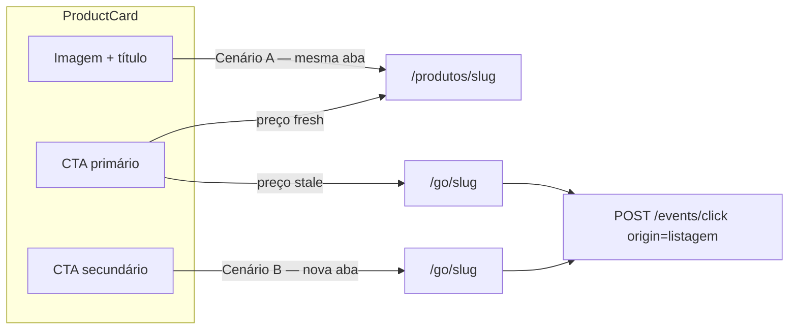

# Product Card CRO — Padrão Gold (Fase 1)

## Diagnóstico alinhado ao código atual

O [`ProductCard.tsx`](apps/web/src/components/product/ProductCard.tsx) hoje tem **um único caminho de conversão**: botão `Ver na {Amazon|Shopee}` → `window.open(buildGoUrl(...))`. Não há link para `/produtos/[slug]`, badges, rating nem `recordClick` — apesar de [`06-ux-conversion.mdc`](.cursor/rules/06-ux-conversion.mdc) e [`docs/cms-home-phase1.md`](docs/cms-home-phase1.md) já especificarem cenários A/B.

```36:64:apps/web/src/components/product/ProductCard.tsx
  return (
    <article className={cn('group flex flex-col rounded-[var(--radius)] bg-white p-3 shadow-sm', className)}>
      {/* imagem + wishlist — sem link interno */}
      ...
        <Button className="mt-auto w-full" size="sm" onClick={handleCta}>
          Ver na {marketplaceLabel(product.marketplace)}
        </Button>
```

**Dados já disponíveis no DTO** (`ProductListItemDto`): `rating`, `reviewCount`, `price.updatedAt`, `price.strikethrough`, `marketplace`.  
**Dados no domínio mas ausentes no DTO**: `editorialScore` (existe em [`Product.ts`](packages/domain/src/entities/Product.ts), usado só para sort).

**Fase 2 (fora deste escopo)**: badges `"Menor preço 30d"` / `"Queda X%"` via `ProductBadgeService` + snapshots — conforme PRD §3.1 e regra de conformidade (badges de preço **somente** com dados válidos e **nunca** quando stale).

---

## Arquitetura de cliques (Cenários A/B)



| Intenção | Área | Destino | Tracking |
|----------|------|---------|----------|
| Pesquisa / confiança | Imagem, título | `/produtos/[slug]` (mesma aba) | futuro pageview |
| Funil editorial | CTA primário (fresh) | `/produtos/[slug]` | — |
| Conversão rápida | CTA secundário (fresh) | `/go/[slug]` nova aba | `recordClick(..., 'listagem')` |
| Preço stale | CTA primário único | `/go/[slug]` nova aba | `recordClick` + `rel="noopener sponsored"` |

**Copy conforme regras de negócio** (nunca "Comprar na…"):
- Primário fresh: **"Ver análise e ofertas"**
- Secundário fresh: **"Ver preço na {Amazon\|Shopee} ↗"** (transparente, com nome do marketplace)
- Stale: **"Ver preço na {Amazon\|Shopee}"** como único botão sólido; link textual opcional "Ver análise" abaixo

---

## Fase 1 — Implementação

### 1. Estender DTO com `editorialScore` (API mínima)

Arquivos:
- [`apps/api/src/adapters/presenters/product.presenter.ts`](apps/api/src/adapters/presenters/product.presenter.ts) — incluir `editorialScore` em `ProductListItemDto` / `ProductDetailDto`
- [`apps/web/src/lib/api/schemas.ts`](apps/web/src/lib/api/schemas.ts) — `editorialScore: z.number().optional()` (ou required com default 0)
- [`packages/shared/src/cms/block-schemas.ts`](packages/shared/src/cms/block-schemas.ts) — `ProductDeliveryItem` se usado em preview CMS

**Derivação de badge editorial no front (Fase 1, sem novo serviço de domínio):**

| Condição | Badge (pt-BR) |
|----------|---------------|
| `editorialScore >= 80` | Escolha editorial |
| `rating >= 4.5 && reviewCount >= 50` | Top avaliado |
| `price.strikethrough` presente e fresh | Melhor oferta *(marketplace list price — não confundir com queda histórica)* |

Regra: **nenhum badge de preço/oferta quando `price.isStale`**.

### 2. Novos/melhorados componentes em `apps/web`

| Componente | Responsabilidade |
|------------|------------------|
| **`ProductEditorialBadges.tsx`** (novo) | Chips absolutos no canto da imagem; max 1 badge prioritário (editorial > rating > strikethrough) |
| **`ProductRating.tsx`** (novo) | Estrelas + `"4,6 · 2.341"` usando `rating`/`reviewCount` do DTO |
| **`PriceDisplay.tsx`** (refator) | `min-h-[48px]` fixo; sublinha de frescor quando fresh: *"Monitorado há X h"* a partir de `price.updatedAt`; stale: pill âmbar **"Consultar preço atualizado"** + ícone `RefreshCw` (substitui texto plano atual) |
| **`ProductCard.tsx`** (refator principal) | Anatomia Gold: `MarketplaceBadge`, imagem clicável (`Link`), rating, preço, dual-CTA ou stale-single-CTA |
| **`AffiliateGoLink.tsx`** (novo, opcional) | Encapsula `buildGoUrl`, `rel="noopener sponsored"`, `recordClick`, `blockId`/`sessionId` — reutilizar em card e featured |

Props adicionais sugeridas para `ProductCard`:

```typescript
type ProductCardProps = {
  product: ProductListItemDto;
  className?: string;
  blockId?: string; // tracking CMS — passar de ProductGridBlock
  variant?: 'default' | 'compact'; // embed futuro
};
```

**CSS**: manter tokens ESTORE existentes (`--radius`, `--primary`, `rounded-[var(--radius)]`, `shadow-sm`) — evitar hardcode `gray-900` do exemplo; usar `bg-[var(--primary)]` como na página de detalhe.

### 3. Integrar tracking e conformidade

- Chamar [`recordClick`](apps/web/src/lib/api/events.ts) **antes** de abrir `/go/` (gap atual — função existe mas não é usada na web)
- Adicionar `rel="noopener sponsored"` em **todos** os links `/go/` (cards hoje usam só `noopener,noreferrer`)
- Passar `blockId={block.id}` em [`ProductGridBlock.tsx`](apps/web/src/components/blocks/ProductGridBlock.tsx) e manter em [`FeaturedProductBlock.tsx`](apps/web/src/components/blocks/FeaturedProductBlock.tsx)

### 4. Alinhar `FeaturedProductBlock`

Mesmo padrão dual-CTA do grid (hero de produto também é ponto de fricção prematura). Reutilizar `ProductCard` ou extrair subcomponente `ProductCardActions` compartilhado para não duplicar lógica stale/fresh.

### 5. Página de detalhe (ajuste leve, opcional na Fase 1)

[`apps/web/src/app/produtos/[slug]/page.tsx`](apps/web/src/app/produtos/[slug]/page.tsx) já usa CTA correto `"Ver preço na {marketplace}"`. Adicionar bloco curto **"Curadoria independente"** (1–2 frases) acima do CTA reforça transparência de afiliado — copy estática, sem backend.

---

## Fase 2 — Backlog (badges históricos)

Quando a Fase 1 estiver validada:

1. **`ProductBadgeService`** em `packages/domain` — calcular `priceDropPct7d`, `isLowestPrice30d` a partir de `PriceSnapshotRepository`; guard `!product.shouldShowPrice` e mínimo de snapshots (PRD: ≥7)
2. **Presenter** — campo `badges: ProductBadgeDto[]` no list/detail DTO
3. **`PriceDisplay`** — sublinha verificável: *"Baixou R$ X em Y dias"* só com snapshot confirmado
4. **Worker** — materializar métricas no Pipeline B (opcional, performance)

---

## Arquivos principais tocados (Fase 1)

| Camada | Arquivos |
|--------|----------|
| API | `product.presenter.ts` |
| Web schemas | `apps/web/src/lib/api/schemas.ts` |
| Componentes | `ProductCard.tsx`, `PriceDisplay.tsx`, novos badges/rating/go-link |
| Blocos CMS | `ProductGridBlock.tsx`, `FeaturedProductBlock.tsx` |
| Docs | `docs/cms-home-phase1.md` — atualizar tabela UX (badges/rating na listagem, dual-CTA) |

---

## Critérios de aceite (Fase 1)

- [ ] Card fresh: imagem/título → detalhe mesma aba; primário → detalhe; secundário → `/go/` nova aba com `sponsored`
- [ ] Card stale: preço numérico oculto; pill "Consultar preço atualizado"; CTA primário = afiliado; **sem** badges de oferta/queda
- [ ] Badge editorial visível quando `editorialScore >= 80` (seed tem produtos com 85/78)
- [ ] Rating renderizado quando `rating`/`reviewCount` presentes
- [ ] `POST /events/click` dispara no CTA afiliado da listagem
- [ ] Layout estável: altura mínima da zona de preço e CTAs não "pulam" entre fresh/stale
- [ ] ESLint/Prettier limpos nos pacotes alterados

---

## Riscos e adaptações vs. spec do usuário

| Sugestão do usuário | Adaptação por conformidade |
|---------------------|----------------------------|
| "Comprar na Amazon" | Proibido — usar "Ver preço na Amazon" |
| "Baixou R$ 40 nas últimas 24h" | Fase 2 — exige snapshots; Fase 1 só frescor ("Monitorado há X h") |
| "Preço oscilando na Amazon" | Evitar tom alarmista — "Consultar preço atualizado" |
| Emojis nos badges (🔥🏆) | Preferir chips textuais consistentes com ESTORE |
| Urgência em cards stale | Proibido por [`01-business-compliance.mdc`](.cursor/rules/01-business-compliance.mdc) |
