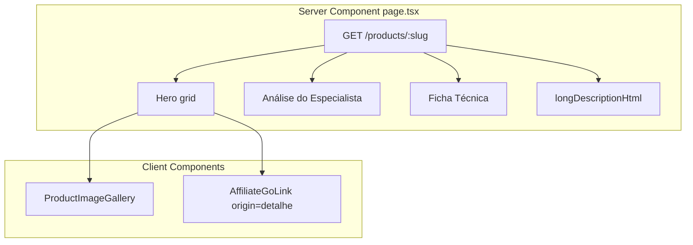

# Evolução da página pública de detalhe de produto

## Contexto

A rota alvo é [`apps/web/src/app/produtos/[slug]/page.tsx`](apps/web/src/app/produtos/[slug]/page.tsx). Hoje ela renderiza:
- Uma única imagem (`object-cover`, sem miniaturas)
- Título + `PriceDisplay` + CTA raw `<a>` (sem tracking de clique)
- `longDescriptionHtml` opcional
- **Não** usa `pros`, `cons`, `specs` nem `rating`, embora já cheguem do backend

```82:114:apps/web/src/app/produtos/[slug]/page.tsx
      <div className="grid gap-8 md:grid-cols-2">
        <div className="relative aspect-square overflow-hidden rounded-[var(--radius)] bg-[var(--muted)]">
          {product.images[0] && (
            <Image ... className="object-cover" />
          )}
        </div>
        <div className="flex flex-col gap-4">
          <MarketplaceBadge ... />
          <h1>...</h1>
          <PriceDisplay ... />
          ...
          <a href={buildGoUrl(product.slug)} ...>Ver preço na ...</a>
        </div>
      </div>
```

**Contrato API já pronto** — [`productPublicDetailSchema`](packages/shared/src/admin/product-schemas.ts) inclui `images`, `specs` (mapeado de `specs_normalized`), `pros`, `cons`, `rating`, `reviewCount`. Presenter em [`product.presenter.ts`](apps/api/src/adapters/presenters/product.presenter.ts) (`specs: product.specsNormalized`). **Nenhuma mudança em API/domain necessária.**



## Escopo incluído vs. fora

| Incluído (pedido) | Fora (fases futuras) |
|---|---|
| Galeria multi-imagem com miniaturas | Gráfico de histórico de preço (`GET /products/:id/price-history` existe, UI não) |
| Rating abaixo do título | Wishlist no hero |
| Seção "Análise do Especialista" (prós/contras full) | Alterar `ProductEditorialProsCons` dos cards (limite 2/1 permanece) |
| Tabela de specs | Novos campos no banco |

## 1. Componentes novos em `apps/web/src/components/product/`

### `ProductImageGallery.tsx` (`'use client'`)

Miniaturas exigem estado local — único trecho client-side obrigatório.

- Props: `{ images: string[]; alt: string }`
- Imagem principal: `aspect-square object-contain bg-white rounded-2xl border border-gray-100 p-4` (conforme spec)
- Se `images.length > 1`: row de thumbs `flex gap-2 mt-4`, botão por thumb com ring/border no selecionado, `aria-pressed`, `aria-label` por índice
- Reutilizar `next/image` com `fill` + `sizes="(max-width:768px) 100vw, 50vw"` como hoje
- Empty state discreto se `images` vazio (placeholder `bg-gray-50`)

### `ProductDetailAnalysis.tsx` (Server Component)

Layout dedicado à página de detalhe — **não** reutilizar [`ProductEditorialProsCons`](apps/web/src/components/product/ProductEditorialProsCons.tsx) (ele trunca a 2 prós / 1 contra para cards).

- Retorna `null` se ambos `pros` e `cons` estiverem vazios após trim
- Wrapper: `mt-16 pt-12 border-t border-gray-100`
- `h2`: "Análise do Especialista"
- Grid: `grid grid-cols-1 md:grid-cols-2 gap-8 mt-6`
  - Coluna prós: `bg-emerald-50/30 p-6 rounded-2xl`, ícones `Check` (`text-emerald-500`) do lucide-react
  - Coluna contras: `bg-rose-50/30 p-6 rounded-2xl`, ícones `X` (`text-rose-500`)
- Subtítulos internos: "Pontos positivos" / "Pontos de atenção" (copy pt-BR)
- Renderizar **lista completa** (sem slice)

### `ProductSpecsTable.tsx` (Server Component)

- Retorna `null` se `Object.keys(specs).length === 0`
- Wrapper: `mt-12` com `h2` "Ficha técnica"
- Tabela semântica `<table>` ou shadcn [`Table`](apps/web/src/components/ui/table.tsx) — preferir HTML simples para evitar import pesado desnecessário
- Linhas: `even:bg-gray-50/50`, bordas `border-gray-100`
- Chave formatada via helper compartilhado (ver item 2)

## 2. Extrair `formatSpecKey` para DRY

Mover lógica de [`ComparisonTable.tsx`](apps/web/src/components/articles/ComparisonTable.tsx) (linhas 32–36) para [`apps/web/src/lib/format-spec-key.ts`](apps/web/src/lib/format-spec-key.ts) e importar nos dois lugares. Templates do admin usam labels legíveis ("Switches"); o helper continua útil para atributos custom com snake_case.

## 3. Refatorar [`page.tsx`](apps/web/src/app/produtos/[slug]/page.tsx)

### Hero (above the fold)

```
grid gap-8 md:grid-cols-2
├── ProductImageGallery
└── flex flex-col justify-center gap-5  (alinhamento vertical)
    ├── MarketplaceBadge
    ├── h1
    ├── ProductRating (rating + reviewCount) — já existe
    ├── PriceDisplay (stale alert com RefreshCw já implementado)
    ├── shortDescription (se existir)
    ├── disclaimer afiliado (manter copy atual, estilo suave)
    └── AffiliateGoLink origin="detalhe" variant="primary"
        (substituir <a> raw — tracking conforme regra UX cenário B)
```

[`PriceDisplay`](apps/web/src/components/product/PriceDisplay.tsx) já renderiza o alerta "Consultar preço atualizado" com ícone `RefreshCw` em `bg-amber-50`. Opcional: passar `className` para padding um pouco maior no contexto de detalhe; sem alterar comportamento stale.

[`ProductRating`](apps/web/src/components/product/ProductRating.tsx) já formata pt-BR e retorna `null` sem rating — encaixar logo abaixo do `h1`.

**Não** usar `ProductCardActions` no hero: em preço fresh ele linka "Ver análise e ofertas" para a mesma URL (comportamento de card, não de detalhe).

### Below the fold (ordem de seções)

1. `<ProductDetailAnalysis pros={...} cons={...} />`
2. `<ProductSpecsTable specs={product.specs} />`
3. `longDescriptionHtml` existente (`prose`, `mt-10` ajustado para `mt-12` se specs presentes)
4. Footer disclaimer comercial (manter)

Manter intactos: breadcrumb, `ProductJsonLd`, `generateMetadata`, `revalidate = 300`.

## 4. Conformidade (invariantes)

- Preço stale: sem valor numérico, sem badges de urgência — [`PriceDisplay`](apps/web/src/components/product/PriceDisplay.tsx) já respeita
- CTA: texto "Ver preço na {marketplace}" via `marketplaceLabel()`
- Links afiliados: `rel="noopener sponsored"`, nova aba — via `AffiliateGoLink`
- Disclaimer visível acima do CTA

## 5. Documentação

Criar [`docs/product-detail-page.md`](docs/product-detail-page.md) com:
- Escopo entregue (galeria, análise, specs)
- Arquivos-chave
- Como testar localmente (`/produtos/{slug}` com produto que tenha pros/cons/specs no admin)
- Próximo passo sugerido: gráfico histórico de preço (referência UX em [`06-ux-conversion.mdc`](.cursor/rules/06-ux-conversion.mdc))

Atualizar índice em [`docs/README.md`](docs/README.md) ou [`docs/llm-context-03-implemented-features.md`](docs/llm-context-03-implemented-features.md).

## 6. Verificação

```bash
pnpm --filter @ecommerce-amazon/web lint
pnpm --filter @ecommerce-amazon/web build
```

Teste manual:
- Produto com 1 imagem vs. múltiplas imagens (troca de thumb)
- Produto com preço stale vs. fresh
- Produto sem pros/cons/specs (seções omitidas, layout não quebra)
- Produto com rating ausente (`ProductRating` oculto)

## Arquivos tocados (resumo)

| Ação | Arquivo |
|---|---|
| Criar | `apps/web/src/components/product/ProductImageGallery.tsx` |
| Criar | `apps/web/src/components/product/ProductDetailAnalysis.tsx` |
| Criar | `apps/web/src/components/product/ProductSpecsTable.tsx` |
| Criar | `apps/web/src/lib/format-spec-key.ts` |
| Editar | `apps/web/src/app/produtos/[slug]/page.tsx` |
| Editar | `apps/web/src/components/articles/ComparisonTable.tsx` (import helper) |
| Criar | `docs/product-detail-page.md` |
| Editar | `docs/README.md` (índice) |
