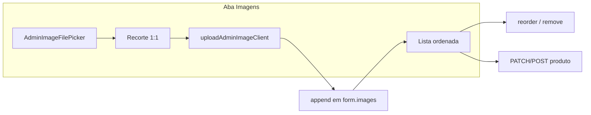

# Aba Imagens no formulário de produto (Admin)

## Contexto

O [`ProductForm.tsx`](apps/admin/src/components/products/ProductForm.tsx) tem 4 abas. Imagens (`images: string[]`) hoje ficam em **Link & Essenciais** via [`ProductEssentialsSection.tsx`](apps/admin/src/components/products/ProductEssentialsSection.tsx) + [`ProductImageList.tsx`](apps/admin/src/components/products/ProductImageList.tsx) — apenas URLs manuais.

Infra de upload já existe (entregue no drawer de coleções):

- [`AdminImageFilePicker.tsx`](apps/admin/src/components/admin/AdminImageFilePicker.tsx)
- [`AdminImageCropDialog.tsx`](apps/admin/src/components/admin/AdminImageCropDialog.tsx)
- [`uploadAdminImageClient`](apps/admin/src/lib/api/admin-media-client.ts) → `POST /api/admin/media/images`

A vitrine usa galeria **quadrada** ([`ProductImageGallery.tsx`](apps/web/src/components/product/ProductImageGallery.tsx) — `aspect-square`). Recorte **1:1**, saída **1000×1000** JPEG.



**Sem mudanças de backend** — URLs gerenciadas entram no array `images` existente; persistência via `CreateProduct` / `UpdateProduct` inalterada.

---

## 1. Nova aba no `ProductForm`

Arquivo: [`apps/admin/src/components/products/ProductForm.tsx`](apps/admin/src/components/products/ProductForm.tsx)

- Inserir tab **`images`** com label **"Imagens"** **após** `specs` e **antes** de `seo`:

```tsx
<TabsTrigger value="specs">Especificações</TabsTrigger>
<TabsTrigger value="images">Imagens</TabsTrigger>
<TabsTrigger value="seo">SEO Avançado</TabsTrigger>
```

- `TabsContent value="images"` → `<ProductImagesSection />`
- Atualizar meta de **"4 abas"** → **"5 abas"**
- Import do novo componente

O header com `ProductThumbnail` continua observando `form.watch('images')` — preview atualiza ao adicionar/remover na nova aba.

---

## 2. Novo componente `ProductImagesSection`

Arquivo: **`apps/admin/src/components/products/ProductImagesSection.tsx`**

Estrutura com `CmsFormSection title="Galeria de imagens"` + `useFormContext<ProductFormValues>()`:

| Bloco           | Comportamento                                                                                                                                                                                    |
| --------------- | ------------------------------------------------------------------------------------------------------------------------------------------------------------------------------------------------ |
| **Upload**      | `AdminImageFilePicker` → botão "Recortar e enviar" → `AdminImageCropDialog` (aspect `1`, `cropShape="rect"`, 1000×1000) → `uploadAdminImageClient` → `form.setValue('images', [...images, url])` |
| **Status**      | Mensagem inline + `useAdminToast` (padrão [`CollectionCoverField.tsx`](apps/admin/src/components/collections/CollectionCoverField.tsx))                                                          |
| **Galeria**     | Lista ordenada com `ProductThumbnail`, badge de ordem (1 = capa), ↑↓, remover                                                                                                                    |
| **URL externa** | Link colapsável "Adicionar por URL" com `Input` + botão adicionar (reutilizar lógica de append de [`ProductImageList.tsx`](apps/admin/src/components/products/ProductImageList.tsx))             |
| **Empty state** | "Nenhuma imagem. Envie arquivos ou cole URLs HTTPS."                                                                                                                                             |

Hints via `FormDescription`: primeira imagem = capa na vitrine e listagens.

**Refatorar** [`ProductImageList.tsx`](apps/admin/src/components/products/ProductImageList.tsx): extrair helpers de reorder/remove/append para uso interno em `ProductImagesSection`, ou evoluir `ProductImageList` para aceitar prop `showUpload?: boolean` — preferência: **consolidar em `ProductImagesSection`** e deixar `ProductImageList` como subcomponente interno só para linhas de URL (evita duplicar reorder/remove).

---

## 3. Remover imagens de Link & Essenciais

Arquivo: [`apps/admin/src/components/products/ProductEssentialsSection.tsx`](apps/admin/src/components/products/ProductEssentialsSection.tsx)

- Remover `FormField` `name="images"` e import de `ProductImageList`
- Aba fica só com título, categoria e nota editorial

---

## 4. Documentação

Atualizar [`docs/admin-products-phase1.md`](docs/admin-products-phase1.md):

- Formulário em **5 abas** (incluir **Imagens** após Especificações)
- Upload gerenciado via `POST /admin/media/images` + URL externa opcional
- Remover nota "Upload de imagem (somente URLs HTTPS)" do fora de escopo / próximos passos

---

## Arquivos principais

| Ação                                         | Arquivo                                                                                           |
| -------------------------------------------- | ------------------------------------------------------------------------------------------------- |
| Editar                                       | [`ProductForm.tsx`](apps/admin/src/components/products/ProductForm.tsx)                           |
| Criar                                        | `ProductImagesSection.tsx`                                                                        |
| Editar                                       | [`ProductEssentialsSection.tsx`](apps/admin/src/components/products/ProductEssentialsSection.tsx) |
| Editar (simplificar ou deprecar uso externo) | [`ProductImageList.tsx`](apps/admin/src/components/products/ProductImageList.tsx)                 |
| Editar                                       | [`docs/admin-products-phase1.md`](docs/admin-products-phase1.md)                                  |

## Fora de escopo

- Endpoint de upload específico por produto
- Cleanup de imagens órfãs no storage ao remover da galeria
- Limite máximo de imagens no schema (não existe hoje)
- Drag-and-drop na galeria

## Como testar

1. Admin → `/produtos/novo` ou editar produto existente
2. Aba **Imagens** aparece após **Especificações**; aba **Link & Essenciais** sem campo de imagens
3. Upload: escolher arquivo → recortar 1:1 → imagem na lista + preview no header
4. Reordenar (↑↓): primeira posição vira capa na listagem
5. Remover imagem da lista; adicionar URL externa via bloco colapsável
6. Salvar produto → conferir galeria em `/produtos/[slug]` na vitrine
