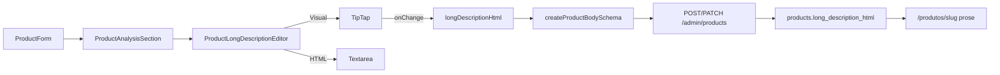

# Editor Rico — análise editorial do produto

## Escopo

Evoluir **apenas** o campo `longDescriptionHtml` (“Análise completa”) em `[ProductAnalysisSection.tsx](apps/admin/src/components/products/ProductAnalysisSection.tsx)`. O campo `shortDescription` permanece **textarea plain text** (cards, snippet curto, auto-geração a partir dos prós).

**Sem migration:** o contrato continua `string` HTML em `products.long_description_html` (`[product-schemas.ts](packages/shared/src/admin/product-schemas.ts)`, `max(50000)`).

**Fora do escopo:** embeds `[[product:slug]]` / comparador (exclusivos de artigos), sanitização HTML server-side (mesmo padrão atual da vitrine com `dangerouslySetInnerHTML`).

---

## Situação atual vs alvo


| Aspecto  | Hoje                                         | Alvo                                               |
| -------- | -------------------------------------------- | -------------------------------------------------- |
| UI       | `<Textarea rows={14} font-mono>`             | TipTap WYSIWYG + aba **Código HTML**               |
| Toolbar  | Nenhuma                                      | H3, negrito/itálico/riscado, listas, tabela, link  |
| Fluxo IA | `ProductLlmPromptHelper` → colar HTML manual | Colar na aba HTML → alternar para Visual e revisar |
| Tabelas  | HTML manual (`<table>`)                      | Extensões TipTap Table (round-trip seguro)         |
| Vitrine  | `prose` + `dangerouslySetInnerHTML`          | Inalterado                                         |


Referência de implementação: `[ArticleEditor.tsx](apps/admin/src/components/articles/ArticleEditor.tsx)` + `[ArticleEditorToolbar.tsx](apps/admin/src/components/articles/ArticleEditorToolbar.tsx)`.

---

## Arquitetura




---

## 1. Extrair primitivos compartilhados do editor

Criar pasta `[apps/admin/src/components/editor/](apps/admin/src/components/editor/)` com peças reutilizáveis (DRY sem acoplar artigo ↔ produto):


| Arquivo                      | Origem                               | Função                                                             |
| ---------------------------- | ------------------------------------ | ------------------------------------------------------------------ |
| `RichTextEditorModeTabs.tsx` | mover de `ArticleEditorModeTabs.tsx` | Tabs Visual / Código HTML                                          |
| `useEditorToolbarState.ts`   | mover de `articles/`                 | Re-render da toolbar em `selectionUpdate`                          |
| `RichTextEditorShell.tsx`    | novo                                 | Shell com borda, barra superior (toolbar + tabs), área de conteúdo |
| `normalize-empty-html.ts`    | novo                                 | Converte `<p></p>`, `<p><br></p>` → `''` antes do `onChange`       |
| `toolbar-primitives.tsx`     | extrair de `ArticleEditorToolbar`    | `ToolbarButton`, `ToolbarSeparator`                                |


Atualizar imports em `[ArticleEditor.tsx](apps/admin/src/components/articles/ArticleEditor.tsx)` e `[ArticleEditorToolbar.tsx](apps/admin/src/components/articles/ArticleEditorToolbar.tsx)` para usar os novos paths (refactor pequeno, sem mudança de comportamento do artigo).

---

## 2. `ProductLongDescriptionEditor`

Novo componente: `[apps/admin/src/components/products/ProductLongDescriptionEditor.tsx](apps/admin/src/components/products/ProductLongDescriptionEditor.tsx)`

Props: `{ value: string; onChange: (html: string) => void; disabled?: boolean }`

### Extensões TipTap (produto)

```typescript
StarterKit.configure({
  heading: { levels: [3] },        // só H3 — alinhado ao prompt LLM
  // desabilitar codeBlock se não usado no review
}),
Link.configure({ openOnClick: false }),
Placeholder.configure({
  placeholder: 'Escreva a análise editorial… Use H3 para seções (Visão geral, Destaques…).',
}),
Table.configure({ resizable: true }),
TableRow, TableHeader, TableCell,
```

### Toolbar dedicada — `[ProductEditorToolbar.tsx](apps/admin/src/components/products/ProductEditorToolbar.tsx)`


| Botão                         | Motivo                                                                                              |
| ----------------------------- | --------------------------------------------------------------------------------------------------- |
| H3                            | Seções obrigatórias do prompt (`[product-llm-prompt.ts](apps/admin/src/lib/product-llm-prompt.ts)`) |
| Bold / Italic / Strike        | Formatação editorial                                                                                |
| Bullet / Ordered list         | Listas permitidas no prompt                                                                         |
| Table                         | Seção “Destaques e especificações” exige `<table>`                                                  |
| Link                          | Links internos/externos úteis no review                                                             |
| **Sem** H2, Produto, Comparar | Específicos de artigos                                                                              |


### Modo dual (igual artigo)

- **Visual → HTML:** `editor.getHTML()` + `normalizeEmptyHtml()`
- **HTML → Visual:** `editor.setContent(html, { emitUpdate: false })`
- Sincronização externa quando `value` muda (carregar produto na edição)
- `immediatelyRender: false` (Next.js SSR)

### Integração no form

Em `[ProductAnalysisSection.tsx](apps/admin/src/components/products/ProductAnalysisSection.tsx)`, substituir o `<Textarea>` de `longDescriptionHtml` por:

```tsx
<ProductLongDescriptionEditor
  value={field.value ?? ''}
  onChange={field.onChange}
/>
```

Manter `ProductLlmPromptHelper` ao lado do label. Atualizar `FormDescription` para mencionar modo Visual + aba HTML para colar saída da IA.

Adicionar contador de caracteres (`value.length / 50000`) abaixo do editor.

---

## 3. Dependências npm

Instalar em `[apps/admin/package.json](apps/admin/package.json)` (versão alinhada ao TipTap 3.26.x já usado):

- `@tiptap/extension-table`
- `@tiptap/extension-table-row`
- `@tiptap/extension-table-cell`
- `@tiptap/extension-table-header`

---

## 4. CSS / polish (“impecável”)

Adicionar em `[apps/admin/src/app/globals.css](apps/admin/src/app/globals.css)` bloco `.admin-rich-editor`:

- Shell: borda, `bg-neutral-50` na toolbar, cantos arredondados (mesmo visual do artigo)
- ProseMirror: `min-h-[280px]`, foco visível, tipografia H3/listas
- **Tabelas no editor:** bordas leves, padding em `th`/`td` (preview fiel à vitrine `prose`)
- Modo HTML: textarea monoespaçada full-width, sem borda interna duplicada

Refatorar classes inline de `ArticleEditor` para usar `.admin-rich-editor` (consistência visual entre artigo e produto).

---

## 5. Normalização e testes

Helper `normalizeEmptyHtml()` em `[apps/admin/src/components/editor/normalize-empty-html.ts](apps/admin/src/components/editor/normalize-empty-html.ts)`:

- Entrada vazia do TipTap não deve persistir `<p></p>` — `resolveOptionalTrimmed` no backend já trata `''`, mas evita lixo no form

Testes Vitest (unit, `apps/admin` ou `packages/shared`):

- `normalizeEmptyHtml` — `''`, `<p></p>`, HTML válido preservado
- Opcional: smoke de serialização de tabela simples (HTML in → out)

---

## 6. Documentação

Atualizar `[docs/admin-products-phase1.md](docs/admin-products-phase1.md)`:

- `longDescriptionHtml` agora usa TipTap (Visual + HTML)
- Fluxo: gerar com ✨ → colar em **Código HTML** → revisar em **Visual** → salvar
- Tags suportadas no review (h3, p, strong, table, ul/li)

Índice em `[docs/README.md](docs/README.md)` se criar doc focada (`docs/admin-product-rich-editor.md`) — preferir seção na doc de produtos existente para manter foco.

---

## Ordem de implementação

1. Extrair `components/editor/`* + refatorar imports do artigo
2. Instalar extensões Table
3. Implementar `ProductLongDescriptionEditor` + toolbar + CSS
4. Integrar em `ProductAnalysisSection` + contador de chars
5. Testes `normalizeEmptyHtml` + build/lint admin
6. Atualizar docs

---

## Checklist de qualidade (aceite)

- [x] Criar/editar produto: editor Visual funciona sem hydration error
- [x] Colar HTML do LLM (com `<table>`) na aba HTML → Visual renderiza tabelas corretamente
- [x] Salvar e reabrir produto: conteúdo idêntico (round-trip)
- [x] Campo vazio salva como `undefined` no backend (sem `<p></p>` residual)
- [x] `ProductLlmPromptHelper` continua acessível ao lado do label
- [x] Artigo continua funcionando após extração dos primitivos compartilhados