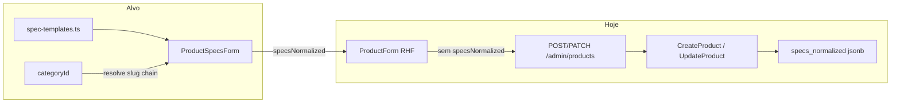

# Especificações dinâmicas por categoria (admin produtos)

## Contexto atual

O formulário de produtos usa **react-hook-form + Zod** em [`ProductForm.tsx`](apps/admin/src/components/products/ProductForm.tsx). A categoria é selecionada via `categoryId` (UUID) em [`CategoryCascadeSelect`](apps/admin/src/components/categories/CategoryCascadeSelect.tsx) dentro da aba **Link & Essenciais**.

`specs_normalized` já existe no domínio/DB como `Record<string, string>` ([`Product.ts`](packages/domain/src/entities/Product.ts), coluna jsonb), chega na vitrine como `specs` ([`product.presenter.ts`](apps/api/src/adapters/presenters/product.presenter.ts)) e alimenta tabelas comparativas ([`ComparisonTable.tsx`](apps/web/src/components/articles/ComparisonTable.tsx)).

**Gap:** o admin nunca lê nem grava esse campo — `CreateProduct` inicializa `{}` e `UpdateProduct` ignora specs.



## 1. Arquivo de templates estático

**Criar** [`packages/shared/src/product/spec-templates.ts`](packages/shared/src/product/spec-templates.ts) e exportar via [`packages/shared/src/product/index.ts`](packages/shared/src/product/index.ts) (ou barrel existente em `shared`).

```typescript
export const CATEGORY_SPEC_TEMPLATES: Readonly<Record<string, readonly string[]>> = {
  'teclados-mecanicos': ['Switches', 'Layout', 'Conexão'],
  perifericos: ['Tipo', 'Conexão', 'Compatibilidade'],
  'cadeiras-ergonomicas': ['Peso Máximo Suportado', 'Material', 'Ajuste de Braço'],
};

export function resolveSpecTemplateForSlugChain(slugChain: string[]): readonly string[] {
  // Busca do slug mais específico (folha) até a raiz
  for (let i = slugChain.length - 1; i >= 0; i -= 1) {
    const template = CATEGORY_SPEC_TEMPLATES[slugChain[i]!];
    if (template) return template;
  }
  return [];
}
```

**Decisões:**

- Chave do dicionário = **slug da categoria** (estável; UUIDs não servem para config estática).
- Valores do template = **labels legíveis** usados também como chaves em `specs_normalized` (exibidos direto no comparador; [`formatSpecKey`](apps/web/src/components/articles/ComparisonTable.tsx) continua compatível).
- MVP: **3 categorias de exemplo** (acima) + estrutura pronta para expandir. Slugs sem template → seção mostra só atributos customizados + empty state discreto.
- Herança: lookup na cadeia **folha → raiz** (ex.: produto em `teclados-mecanicos` usa template da folha; se não houver, tenta `perifericos` → `games`).

**Teste unitário** em `packages/shared/src/product/spec-templates.test.ts` para `resolveSpecTemplateForSlugChain`.

## 2. Helper de resolução categoria → slugs

**Adicionar** em [`apps/admin/src/lib/api/categories-utils.ts`](apps/admin/src/lib/api/categories-utils.ts):

```typescript
export function buildCategorySlugChain(
  categoryId: string | undefined,
  options: CategoryFlatOption[],
): string[] {
  /* sobe parentId até raiz */
}
```

**Extrair hook** `useAdminCategoryOptions()` (fetch `/api/admin/categories` + `flattenAdminCategoriesForPicker`) para reutilizar em [`ProductEssentialsSection`](apps/admin/src/components/products/ProductEssentialsSection.tsx) e no novo componente — evita fetch duplicado e centraliza a lista.

## 3. Componente `ProductSpecsForm.tsx`

**Criar** [`apps/admin/src/components/products/ProductSpecsForm.tsx`](apps/admin/src/components/products/ProductSpecsForm.tsx).

### UI

- Usar **`CmsFormSection`** com título **"Especificações do Produto"** (padrão admin existente; **sem** adicionar Accordion — componente não existe no projeto e o escopo pede Card/Accordion; `CmsFormSection` cumpre o papel de card dedicado).
- Integração RHF via `useFormContext<ProductFormValues>()` + `useWatch('categoryId')` + `useWatch('specsNormalized')`.

### Comportamento

| Evento                         | Ação                                                                              |
| ------------------------------ | --------------------------------------------------------------------------------- |
| `categoryId` muda              | Resolve `slugChain` → `templateKeys = resolveSpecTemplateForSlugChain(slugChain)` |
| Template encontrado            | Renderiza lista vertical: label fixo + `<Input>` por chave                        |
| Edição de produto              | Valores existentes em `specsNormalized` preenchem inputs automaticamente          |
| Chaves salvas fora do template | Aparecem na seção **Atributos customizados**                                      |
| Salvar                         | Envia apenas pares `{ chave: valor }` com ambos não vazios (trim)                 |

**Binding RHF** — campo único no form:

```typescript
specsNormalized: Record<string, string>; // default {}
```

Cada input de template:

```tsx
<Input
  value={specsNormalized[label] ?? ''}
  onChange={(e) =>
    form.setValue(
      'specsNormalized',
      {
        ...specsNormalized,
        [label]: e.target.value,
      },
      { shouldDirty: true },
    )
  }
/>
```

**Atributos customizados (fallback):**

- Botão ghost/outline: `+ Adicionar atributo customizado`
- Cada linha: input **Chave** + input **Valor** + botão remover (padrão similar a [`DynamicStringList`](apps/admin/src/components/products/DynamicStringList.tsx))
- Chaves duplicadas ou vazias: validação inline / ignorar no sanitize antes do submit
- Custom keys = `Object.keys(specsNormalized)` que **não** estão em `templateKeys`

**Mudança de categoria:** não apagar specs existentes; chaves que saem do template migram visualmente para customizados (dados preservados).

**Empty states:**

- Sem categoria: hint "Selecione uma categoria para ver especificações sugeridas"
- Categoria sem template: só customizados + hint opcional

### Colocação no formulário

Inserir `<ProductSpecsForm />` na aba **Análise Editorial** ([`ProductAnalysisSection`](apps/admin/src/components/products/ProductAnalysisSection.tsx) ou logo após ela em [`ProductForm.tsx`](apps/admin/src/components/products/ProductForm.tsx)), pois specs alimentam comparador e conteúdo editorial.

## 4. Contrato API e persistência (obrigatório)

Sem estas mudanças o formulário não persiste dados.

### Schema Zod — [`packages/shared/src/admin/product-schemas.ts`](packages/shared/src/admin/product-schemas.ts)

```typescript
specsNormalized: z
  .record(z.string(), z.string())
  .default({})
  .transform((record) =>
    Object.fromEntries(
      Object.entries(record)
        .map(([k, v]) => [k.trim(), v.trim()] as const)
        .filter(([k, v]) => k.length > 0 && v.length > 0),
    ),
  ),
```

Adicionar também em `adminProductDetailSchema` para leitura no edit.

### Form values — [`apps/admin/src/lib/product-form-values.ts`](apps/admin/src/lib/product-form-values.ts)

- `emptyValues` em `ProductForm`: `specsNormalized: {}`
- `adminProductDetailToFormValues`: mapear `product.specsNormalized ?? {}`

### Use cases

- [`CreateProduct.ts`](packages/application/src/use-cases/product/CreateProduct.ts): `specsNormalized: input.specsNormalized ?? {}` (substituir hardcode `{}`)
- [`UpdateProduct.ts`](packages/application/src/use-cases/product/UpdateProduct.ts): em `applyFormFields`, `product.specsNormalized = input.specsNormalized ?? {}`

### Presenter admin — [`product.presenter.ts`](apps/api/src/adapters/presenters/product.presenter.ts)

Incluir `specsNormalized: product.specsNormalized` em `toAdminProductDetailDto`.

### Testes

Atualizar [`CreateProduct.test.ts`](packages/application/src/use-cases/product/CreateProduct.test.ts) e [`UpdateProduct.test.ts`](packages/application/src/use-cases/product/UpdateProduct.test.ts) com caso de specs persistidas.

## 5. Documentação

Atualizar [`docs/admin-products-phase1.md`](docs/admin-products-phase1.md) com seção **Especificações por categoria** (templates, campo `specsNormalized`, como expandir `spec-templates.ts`).

## Arquivos principais

| Arquivo                                                         | Ação                     |
| --------------------------------------------------------------- | ------------------------ |
| `packages/shared/src/product/spec-templates.ts`                 | Criar                    |
| `apps/admin/src/components/products/ProductSpecsForm.tsx`       | Criar                    |
| `apps/admin/src/hooks/useAdminCategoryOptions.ts`               | Criar (extrair fetch)    |
| `apps/admin/src/lib/api/categories-utils.ts`                    | `buildCategorySlugChain` |
| `packages/shared/src/admin/product-schemas.ts`                  | Campo `specsNormalized`  |
| `apps/admin/src/lib/product-form-values.ts`                     | Hydration                |
| `apps/admin/src/components/products/ProductForm.tsx`            | default + render         |
| `packages/application/.../CreateProduct.ts`, `UpdateProduct.ts` | Persistência             |
| `apps/api/.../product.presenter.ts`                             | DTO admin                |
| `docs/admin-products-phase1.md`                                 | Doc                      |

## Fora de escopo (MVP)

- Worker Pipeline C preenchendo specs automaticamente
- Migração de chaves legadas snake_case do seed (`peso_maximo` → `Peso Máximo Suportado`) — produtos antigos aparecem como customizados até o operador migrar manualmente
- Accordion shadcn (pode ser adicionado depois se desejado)
