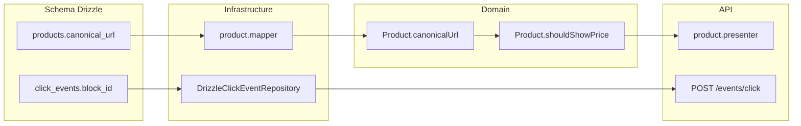

# Plano: SEO estratégico, rastreamento CMS e preço stale no domínio

## Estado atual (já implementado — sem retrabalho)

Grande parte da spec **já existe** no repositório:

| Requisito                                  | Status                                                                                                                         |
| ------------------------------------------ | ------------------------------------------------------------------------------------------------------------------------------ |
| `products.meta_title` / `meta_description` | Existe como `text` nullable em [`schema/index.ts`](packages/infrastructure/src/persistence/drizzle/schema/index.ts) (L111–112) |
| `Product.metaTitle` / `metaDescription`    | Existe em [`Product.ts`](packages/domain/src/entities/Product.ts)                                                              |
| Mapper produto                             | Mapeia meta fields em [`product.mapper.ts`](packages/infrastructure/src/persistence/mappers/product.mapper.ts)                 |
| API presenter                              | Expõe meta no detalhe em [`product.presenter.ts`](apps/api/src/adapters/presenters/product.presenter.ts)                       |
| Preço stale                                | `Price.isStale`, `Product.markPriceStale()`, SLA 24h via `PriceComplianceService`, presenter nulla `amount`                    |

**Não alterar** `meta_title`/`meta_description` de `text` para `varchar(255)` — funcionalmente equivalente, evita migration desnecessária; o projeto não usa `varchar` em nenhum lugar hoje.

## O que falta implementar



---

## 1. Schema Drizzle ([`schema/index.ts`](packages/infrastructure/src/persistence/drizzle/schema/index.ts))

### `products` — adicionar `canonical_url`

Importar `varchar` de `drizzle-orm/pg-core` e incluir após `metaDescription`:

```typescript
canonicalUrl: varchar('canonical_url', { length: 512 }),
```

Nullable, sem default — registros existentes permanecem válidos.

### `click_events` — adicionar `block_id` com FK

`page_blocks` já está definido acima de `click_events` (L71–84), então a referência é válida:

```typescript
blockId: uuid('block_id').references(() => pageBlocks.id, { onDelete: 'set null' }),
```

Opcional: índice `click_events_block_id_idx` em `block_id` para queries analíticas futuras (recomendado, baixo custo).

---

## 2. Domínio — entidade `Product` ([`Product.ts`](packages/domain/src/entities/Product.ts))

### `canonicalUrl?`

- Adicionar em `ProductProps`, propriedade da classe e atribuição no construtor privado (mesmo padrão de `metaTitle`/`metaDescription`).

### `shouldShowPrice` — nova regra de exibição

Adicionar getter explícito no domínio (única fonte de verdade para UI/API):

```typescript
get shouldShowPrice(): boolean {
  return !this.price.isStale;
}
```

**Comportamento:** quando `price.isStale === true` → `shouldShowPrice === false`. Camadas externas devem ocultar valor numérico e strikethrough.

### Testes ([`domain.test.ts`](packages/domain/src/domain.test.ts))

Adicionar casos:

- Produto com preço fresh → `shouldShowPrice === true`
- Após `markPriceStale()` → `shouldShowPrice === false`

---

## 3. Propagação mínima (necessária para os campos não ficarem mortos)

### Produto — mapper ([`product.mapper.ts`](packages/infrastructure/src/persistence/mappers/product.mapper.ts))

- `mapProductRowToDomain`: `canonicalUrl: row.canonicalUrl ?? undefined`
- `mapProductToRow`: `canonicalUrl: product.canonicalUrl`

### Produto — API presenter ([`product.presenter.ts`](apps/api/src/adapters/presenters/product.presenter.ts))

- Incluir `canonicalUrl?` em `ProductDetailDto`
- Refatorar `toProductPriceDto` para delegar ao domínio:

```typescript
amount: product.shouldShowPrice ? product.price.amount : null,
isStale: !product.shouldShowPrice,
```

- Omitir `strikethrough` no DTO quando `!product.shouldShowPrice` (alinha com regra de negócio: sem preço numérico desatualizado)

Mesma lógica em [`GetWishlist.ts`](packages/application/src/use-cases/wishlist/GetWishlist.ts) — trocar `product.price.isStale` por `!product.shouldShowPrice`.

### Click events — port → use case → API → repository

Não criar entidade `ClickEvent` (telemetria write-only, padrão atual). Estender o contrato existente:

| Arquivo                                                                                                                      | Mudança                                                        |
| ---------------------------------------------------------------------------------------------------------------------------- | -------------------------------------------------------------- |
| [`ProductComparisonRepository.ts`](packages/domain/src/repositories/ProductComparisonRepository.ts) (`ClickEventRepository`) | `blockId?: string` no payload de `record()`                    |
| [`RecordClickEvent.ts`](packages/application/src/use-cases/events/RecordClickEvent.ts)                                       | Aceitar e repassar `blockId?`                                  |
| [`schemas.ts`](apps/api/src/adapters/dtos/request/schemas.ts)                                                                | `blockId: z.string().uuid().optional()` em `RecordClickSchema` |
| [`drizzle-content.repository.ts`](packages/infrastructure/src/persistence/repositories/drizzle-content.repository.ts)        | Persistir `blockId` no insert                                  |

Web/CMS: **fora do escopo desta entrega** — blocos passarão `blockId` quando o front for instrumentado; a coluna e a API já aceitarão o campo.

---

## 4. Migration

Após editar o schema:

```bash
npm run db:generate   # raiz do monorepo → drizzle-kit generate
npm run db:migrate    # aplicar localmente
```

Validar que o SQL gerado em `packages/infrastructure/src/persistence/drizzle/migrations/` contém:

- `ALTER TABLE products ADD COLUMN canonical_url varchar(512)` (nullable)
- `ALTER TABLE click_events ADD COLUMN block_id uuid` (nullable)
- `FOREIGN KEY (block_id) REFERENCES page_blocks(id) ON DELETE SET NULL`

Journal esperado: entrada `0002_*` após `0001_cms_pages`.

---

## 5. Seed e documentação

### Seed ([`seed.ts`](packages/infrastructure/src/persistence/drizzle/seed.ts))

Adicionar `canonicalUrl` opcional em pelo menos um produto seed (ex.: URL canônica da vitrine) — apenas se o seed já popula meta SEO.

### Docs ([`docs/database-schema.md`](docs/database-schema.md))

Atualizar tabelas `products` e `click_events`:

- `canonical_url` varchar(512), nullable — sobrescrita manual Admin
- `block_id` uuid FK → `page_blocks.id`, ON DELETE SET NULL — rastreamento analítico CMS

Mencionar `Product.shouldShowPrice` em [`docs/domain-model.md`](docs/domain-model.md) na seção Product/Price (1–2 linhas).

---

## Arquivos tocados (resumo)

| Camada         | Arquivos                                                                   |
| -------------- | -------------------------------------------------------------------------- |
| Schema         | `packages/infrastructure/.../schema/index.ts`                              |
| Domain         | `Product.ts`, `ProductComparisonRepository.ts`, `domain.test.ts`           |
| Application    | `RecordClickEvent.ts`, `GetWishlist.ts`                                    |
| Infrastructure | `product.mapper.ts`, `drizzle-content.repository.ts`, migration SQL gerada |
| API            | `product.presenter.ts`, `schemas.ts`                                       |
| Docs           | `database-schema.md`, `domain-model.md`                                    |

---

## Fora de escopo (deliberado)

- Instrumentação dos blocos CMS no Next.js (`blockId` no clique)
- Admin UI para editar `canonical_url`
- Alterar tipos de `meta_title`/`meta_description` para `varchar(255)`
- Criar entidade de domínio `ClickEvent` (YAGNI — telemetria permanece anônima no port)

## Verificação

```bash
npm run db:generate && npm run db:migrate
npm run test --workspace=@ecommerce-amazon/domain
npm run lint
```

Testar manualmente: `POST /events/click` com `blockId` UUID de bloco seed (`f2111111-...`) persiste coluna; produto stale retorna `amount: null` e `shouldShowPrice` false no domínio.
